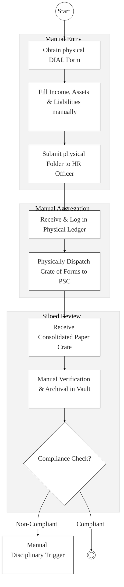

# PUBLIC SERVICE COMMISSION (PSC) – Business Process Architecture (Updated)

## Cover Page
- **Ministry/Body:** Public Service Commission (PSC)
- **Primary Authority:** Ethics and Governance Directorate
- **Document Type:** Business Process Architecture (BPA) Standardised
- **Document Version:** 4.1
- **Date:** 2026-03-25
- **Classification:** Official / Sensitive
- **Strategic Category:** Priority MDA - National Registry (Tier 1)
- **Service Model:** G2E / G2G
- **Reviewer:** Senior Government Enterprise Architect

---

## SECTION 0: SERVICE PRIORITISATION MAPPING
- **Mapped Priority Service:** Declaration of Income, Assets and Liabilities (DIAL) & HR Management
- **Tier Classification:** Tier 1
- **Strategic Category:** Governance / Ethics (Public Service Integrity)
- **Breakout Room Classification:** Room 1 (High Impact & Large Registries)
- **Lead MDA (Standardised Name):** Public Service Commission
- **Related Cross-Cutting Services:**
    - National Ethics Hub (DIAL Registry)
    - Identity Layer (IPRS / Maisha Namba)
    - X-Road (KRA / NTSA / Lands Integration)
    - National EDRMS (HR & Ethics Files)
    - Government Payment Aggregator (GPA)

---

## SECTION 0.1: PRIORITISATION JUSTIFICATION
This service is prioritised because the TO-BE design transformation converts the PSC into an "Intelligent Ethics Hub" for the entire Public Service. By integrating the biennial Declaration of Income, Assets, and Liabilities (DIAL) with national asset registries (KRA, NTSA, Lands) via X-Road, the design enables real-time, automated wealth verification for over 100,000 public officers. This eliminates the massive administrative backlog of manual paper forms, automates compliance triggers, and ensures that integrity vetting is data-driven, tamper-proof, and aligned with Chapter Six of the Constitution.

| Criteria | Evidence from TO-BE Design |
| :--- | :--- |
| **Demand / Volume** | Over 100,000 public officers requiring biennial and event-based (entry/exit) declarations. |
| **National Priority Alignment** | Constitution Articles 233/234; Public Officer Ethics Act; Anti-Corruption Pillar. |
| **Data Reusability** | Verified integrity profiles are consumed by the EACC, DCI, and Banking sector (KYC). |
| **Interoperability** | Real-time "Pre-population" of assets from NTSA, KRA, and Lands via Huduma Bridge. |
| **Revenue / Efficiency Impact** | Eliminates thousands of staff-hours spent on manual data entry and indexing. |
| **Governance / Risk Reduction** | NPKI digital signatures and automated anomaly detection prevent illegal wealth concealment. |
| **Inclusivity** | Uniform digital access for officers in all MDAs and specialized commissions (TSC, JSC). |
| **Readiness** | High; PSC already coordinates DIAL; digital HR systems (GHRIS) provide an integration base. |

> [!NOTE]
> “The TO-BE design transforms the PSC from a manual paper-handler to an 'Intelligent Ethics Hub.' By integrating the Declaration of Assets (DIAL) with KRA (Income), NTSA (Vehicles), and the Lands Registry via X-Road, the design enables real-time, automated verification of public officer wealth. This eliminates the 2-year manual vetting lag, automates compliance tracking for 100,000+ officers, and provides a tamper-proof digital vault for integrity records, directly supporting Chapter 6 of the Constitution.”

---

# SECTION 1: SERVICE DEFINITION (STANDARDISED)

The Public Service Commission (PSC) derives its mandate primarily from **Articles 233 and 234 of the Constitution of Kenya (2010)**. 

In this refactored BPA, the primary service is the **Declaration of Income, Assets and Liabilities (DIAL)** and the broader **Human Resource Integrity Management**. The objective is to move from manual, paper-based "Statutory Declarations" to an **Intelligent Ethics Portal** where known assets are pre-populated and verified against national authoritative registries via the **Huduma Bridge**.

---

# SECTION 2: SERVICE CATALOGUE (NORMALISED)

| Category | Service Name | Description |
| :--- | :--- | :--- |
| **Core Services** | **Biennial Asset Declaration** | Mandatory recurring declaration of wealth by all public officers. |
| | **Entry/Exit Integrity Vetting**| Asset declaration triggered upon joining or leaving the public service. |
| **Extended Services** | **Disciplinary Appeals Mgmt** | Digital handling of HR appeals from County and National governments. |
| | **Ethics Compliance Tracking** | Automated monitoring and reporting of MDA declaration status. |
| **Special Case Services**| **Anomaly Detection Reports** | Automated flagging of unexplained wealth for EACC/DCI referral. |
| | **Public Service Values Audit** | Digital survey and auditing of constitutional values across all MDAs. |

---

# SECTION 3: AS-IS PROCESS FLOWS (MANUAL/PAPER-CENTRIC)

The current process is purely manual, relying on thousands of physical forms, which poses significant challenges in verification, tracking, and compliance monitoring.

### 3.1 AS-IS Visualization


### 3.2 Operational Reality
- **Actors:** Public Officer, MDA HR Officer, PSC Ethics Officer, Records Clerk.
- **Systems:** Physical Ledgers, Paper Folders, Cabinet-based storage.
- **Pain Points:** 2-year lag in manual data verification; officers repeatedly re-enter baseline data; no real-time checks against KRA or Lands; physical documents are vulnerable to loss or unauthorized viewing; identifying defaulters takes months of manual cross-referencing.

---

# SECTION 4: TO-BE PROCESS INTERPRETATION (NEW LAYER)

### 4.1 TO-BE Process (Intelligent Ethics Engine)
```mermaid
%%{init: { 'theme': 'base', 'themeVariables': { 'fontSize': '24px', 'fontFamily': 'Inter, system-ui, sans-serif', 'primaryColor': '#ffffff', 'edgeLabelBackground':'#ffffff', 'tertiaryColor': '#f3f3f3', 'mainBkg': '#ffffff', 'nodeBorder': '#333333' } } }%%
flowchart TD
    Start((Start)) --> T1[Login via Maisha Namba (eCitizen SSO)]
    
    subgraph Trust_Hub["Layer 2: Pre-population & Consent"]
        T1 --> Consent["Consent Manager: Access KRA/NTSA/Lands Data?"]
        Consent --> XRoad["X-Road: Fetch Registered Assets & Income"]
    end

    subgraph Intelligence["Layer 2 & 3: Smart Declaration"]
        XRoad --> T2[Officer Reviews & Updates Pre-populated Form]
        T2 --> T3[Digital NPKI Multi-Signature & Submit]
    end

    subgraph Settlement["Layer 4: Registries & Vault"]
        T3 --> C1[Automated Compliance Log & Receipt]
        C1 --> C2[Smart Rules Engine: Anomaly & Conflict Detection]
        C2 --> C3[Secure Final Archival in Digital Vault]
    end

    C3 --> End((( )))

    classDef start fill:#fff,stroke:#27ae60,stroke-width:2px;
    classDef endNode fill:#fff,stroke:#e74c3c,stroke-width:4px;
    classDef userTask fill:#3498db,stroke:#2980b9,color:#fff,font-size:24px;;
    classDef serviceTask fill:#9b59b6,stroke:#8e44ad,color:#fff,font-size:24px;;
    
    class Start start;
    class End endNode;
    class T1,T2 userTask;
    class Consent,XRoad,T3,C1,C2,C3 serviceTask;
```

### 4.2 Key Capabilities Introduced
*   **Automation:** Pre-population of known assets (Houses, Cars, Salaries) from NTSA, Lands, and KRA via X-Road.
*   **Integration:** Hub-and-spoke integration with the Ethics and Anti-Corruption Commission (EACC) for anomaly reporting.
*   **Real-time Processing:** Automated compliance triggers – system flags non-compliant officers 1 second after the deadline.
*   **Digital Identity Validation:** Official identities and employment history verified via the **Integrated HR (GHRIS) Interface**.
*   **Workflow Orchestration:** Orchestrates the total lifecycle from biennial notification to secure digital archival of the "Ethics Dossier."

### 4.3 Transformation Summary
| Dimension | AS-IS | TO-BE |
| :--- | :--- | :--- |
| **Processing** | Manual / High-friction | Automated / Pre-populated |
| **Verification** | Periodic / Paper-based | Real-time / API-led |
| **Records** | Scattered Physical Files | Centralized Ethics Registry |
| **Tracking** | Manual Ledger Follow-up | Automated Escalation Dashboard |

---

# SECTION 5: SYSTEM LANDSCAPE (ALIGN TO GEA)

| Layer | System / Platform | Role |
| :--- | :--- | :--- |
| **Identity Layer** | Maisha Namba (IPRS) | Identity and bio-login for all public officers. |
| **Interoperability** | KeSEL (X-Road) | Data link to KRA, NTSA, and Lands Registry. |
| **shared Services** | National EDRMS | High-security digital vault for sealed declarations. |
| **Workflow / BPM** | Ethics Workflow Engine | Orchestrates declaration cycles and disciplinary stages. |
| **Payment Layer** | GPA (Finance Aggregator) | Disbursement of funds for participation and research. |
| **Trust Hub** | Consent Manager | Officer control over shared financial data. |

---

# SECTION 6: TRANSFORMATION VALUE (CRITICAL ADDITION)

| Value Type | Explanation |
| :--- | :--- |
| **Efficiency Gain** | 80% reduction in time spent by officers filling out repeated baseline data. |
| **Economic Impact** | Reduces public sector corruption and "Ghost Asset" concealment. |
| **Governance Impact** | Full compliance with Chapter 6; instant identification of potential conflicts of interest. |
| **Citizen Experience** | Increased public trust in the integrity of the Public Service work-force. |
| **Interoperability Value** | Shared data with EACC enables a "Unified Integrity View" of public officers. |

---

# SECTION 7: ALIGNMENT TO WHOLE-OF-GOVERNMENT ARCHITECTURE
- **Shared Platforms:** Uses eCitizen for secure portal access and NPKI for all official signatures.
- **Registry Reuse:** Reuses GHRIS (HR) and IPRS (Identity) data to avoid redundant data capture.
- **Compliance with GEA / GIF:** Standardizing asset-data schemas for integration with national financial monitoring dashboards.

---

# SECTION 8: IMPLEMENTATION READINESS (NEW)
*   **Data Readiness:** High; PSC already manages the DIAL dataset; GHRIS identity data is mature.
*   **Legal Readiness:** High; Public Officer Ethics Act and Chapter 6 provide clear legal mandate.
*   **Institutional Readiness:** High; PSC and all MDAs have existing Ethics & Compliance desks.
*   **Technical Readiness:** High; Huduma Bridge connectivity to KRA and NTSA is already operational.

---

# SECTION 9: TRACEABILITY MATRIX (NEW)

| BPA Process | Priority Service | Tier | TO-BE Capability | National Impact |
| :--- | :--- | :--- | :--- | :--- |
| **Wealth Decl.** | Integrity Mgmt | T1 | X-Road: KRA/NTSA Link | Asset Transparency & Anti-Corruption|
| **Vetting** | Compliance Track | T1 | Smart Rules Engine | Rules-based Public Ethics |
| **Security** | Record Archival | T1 | NPKI Digital Vault | Tamper-proof Ethics Dossiers |
| **Reporting** | Anomaly Detection | T1 | AI Predictive Analytics | Proactive Governance & Oversight |

---
**[End of Standardised Business Process Architecture]**
