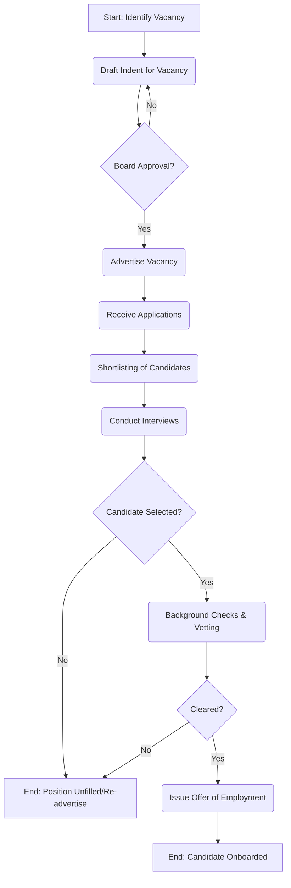

# Public Service Commission - Service Delivery

## MDA Overview
The **Public Service Commission** is constitutionally mandated with human resource management, development, and administration for the public service. It ensures an efficient and effective public service through recruitment, selection, promotion, and disciplinary processes.

## Identified Business Process: Public Service Recruitment and Selection Process

### 1. AS-IS Process Flowchart (BPMN 2.0)

### 2. Process Description

This process outlines how the Public Service Commission identifies, recruits, and onboards talent into the public sector. 

1.  **Identify Vacancy & Draft Indent:** MDAs submit their human resource needs to the Commission. The HR department drafts an indent specifying the role's requirements.
2.  **Board Approval:** The drafted indent must be approved by the PSC Board to ensure budgetary alignment and necessity.
3.  **Advertisement:** Approved vacancies are advertised through public channels (newspapers, PSC portal).
4.  **Application Processing & Shortlisting:** Applications are received and screened against the minimum requirements.
5.  **Interviews:** Shortlisted candidates are interviewed by a panel.
6.  **Vetting & Onboarding:** Selected candidates undergo background checks and vetting by relevant state agencies before being issued an official offer.

### 3. Pain Points & Bottlenecks

- **Manual Application Handling:** Large volumes of applications are often processed manually or semi-manually, leading to delays.
- **Verification Delays:** Background checks and vetting involve multiple external agencies, causing significant bottlenecks.
- **Document Management:** Tracking candidate files throughout the multi-stage interview and vetting process is cumbersome.
- **Communication:** Updating unsuccessful candidates is not always automated or timely.

### 4. Opportunities for Digital Transformation (TO-BE)

- **End-to-End E-Recruitment Portal:** Implementing a fully digital portal for applications, automated shortlisting based on criteria, and interview scheduling.
- **Integration with Foundational Systems:** Integrating the HR system with CRS, KRA, EACC, and DCI for real-time background checks and vetting.
- **Digital Records Management:** Creating a secure electronic registry for all applicant and employee files.

---

## Feedback
We value your input on this blueprint. Please take a moment to provide your feedback using the link below:

[Provide Feedback](https://ee.kobotoolbox.org/x/4Ls7SlCG)
