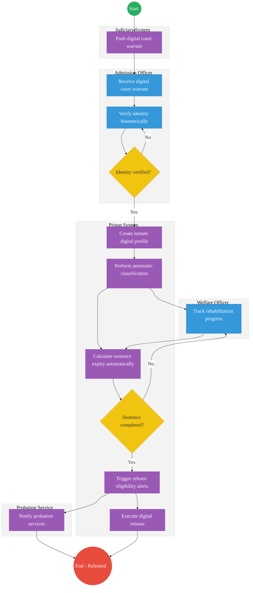

# STATE DEPARTMENT FOR CORRECTIONAL SERVICES – Service Delivery

## Cover Page
- **Ministry/Department/Agency (MDA):** Ministry of Interior and National Administration
- **Department:** State Department for Correctional Services
- **Process Name:** Inmate Case Management and Rehabilitation Tracking
- **Document Version:** 2.1
- **Date:** 2026-03-04
- **Classification:** Official
- **Strategic Category:** Priority MDA
- **Service Model:** G2G
- **Life-Cycle Group:** Cradle to Death (5. Social Protection & Justice)

---

## Executive Summary
The State Department for Correctional Services is responsible for the safe custody and rehabilitation of offenders. Currently, inmate records (10–20 million historical and active files) are predominantly manual and regional, making it difficult to track recidivism or prisoner health and vocational progress across facilities. The transition to the Kenya DSAP Architecture aims to establish a central Inmate Registry integrated with the Judiciary and the national identity ecosystem.

---

## 1. AS-IS Process Flowchart (BPMN 2.0)
*Current State visualization (Inmate Admission & Records based on General Mandate).*

```mermaid
%%{init: { 'theme': 'base', 'themeVariables': { 'fontSize': '24px', 'fontFamily': 'Inter, system-ui, sans-serif', 'primaryColor': '#ffffff', 'edgeLabelBackground':'#ffffff', 'tertiaryColor': '#f3f3f3', 'mainBkg': '#ffffff', 'nodeBorder': '#333333' } } }%%
flowchart TD
    %% Events
    Start((Start))
    EndProcess(("End - Release Executed"))

    subgraph Admission["Admission Phase"]
        direction TB
        IssueWarrant["Court issues committal warrant"]
        Escort["Police escort inmate to facility"]
        VerifyWarrant["Reception verifies court warrant"]
        VerifyID["Identity verification ID/fingerprints"]
        AssignNo["Assign prison number"]
        CreateFile["Create physical case file"]
    end

    subgraph Classification [Classification]
        direction TB
        Classify["Security classification"]
        AssignBlock["Assign housing block/facility"]
    end

    subgraph Custody["Custody Management"]
        direction TB
        DailyTrack["Daily attendance tracking"]
        MedLogs["Medical records logging"]
        BehavLogs["Behavioral/disciplinary records"]
        VocTrack["Vocational training tracking"]
    end

    subgraph Release["Release Preparation"]
        direction TB
        CalcSent["Manual sentence calculation"]
        CalcRem["Remission calculations"]
        EligGateway{"Release eligibility met?"}
        ExecRelease["Execute release/parole/probation"]
    end

    %% Flow connections
    Start --> IssueWarrant
    IssueWarrant --> Escort
    Escort --> VerifyWarrant
    VerifyWarrant --> VerifyID
    VerifyID --> AssignNo
    AssignNo --> CreateFile
    
    CreateFile --> Classify
    Classify --> AssignBlock
    
    AssignBlock --> DailyTrack
    DailyTrack --> MedLogs
    MedLogs --> BehavLogs
    BehavLogs --> VocTrack
    
    VocTrack --> CalcSent
    CalcSent --> CalcRem
    CalcRem --> EligGateway
    
    EligGateway -- "No" --> DailyTrack
    EligGateway -- "Yes" --> ExecRelease
    
    ExecRelease --> EndProcess

    %% Styling
    classDef startEvent fill:#27ae60,stroke:#27ae60,color:#fff,font-size:24px,font-size:24px;;
    classDef endEvent fill:#e74c3c,stroke:#e74c3c,color:#fff,font-size:24px,font-size:24px;;
    classDef userTask fill:#3498db,stroke:#2980b9,color:#fff,font-size:24px,font-size:24px;;
    classDef gateway fill:#f1c40f,stroke:#f39c12,color:#333,font-size:24px,font-size:24px;;
    
    class Start startEvent;
    class EndProcess endEvent;
    class EligGateway gateway;
    class IssueWarrant,Escort,VerifyWarrant,VerifyID,AssignNo,CreateFile,Classify,AssignBlock,DailyTrack,MedLogs,BehavLogs,VocTrack,CalcSent,CalcRem,ExecRelease userTask;
```

---

## Process Overview
### Process Name
End-to-End Inmate Case Management (Admission to Release)

### Service Category
- G2G (Government to Government - Judiciary/Police)

### Scope
- **In Scope:** Verification of committal warrants, inmate profiling, sentence tracking, and rehabilitation monitoring.
- **Out of Scope:** Physical security infrastructure of prisons.

### Triggers
- Court order committing an individual to a correctional facility.

### End States
- **Successful:** Inmate successfully rehabilitated and released according to law.

### Policy Context
- The Prisons Act; The Constitution of Kenya; Sentencing Guidelines.

---

## Detailed Process (AS-IS)

| Step | Role | Action | Tool/System | Notes |
|---|---|---|---|---|
| 1 | Police | Escorts the inmate to the correctional facility. | Transport | |
| 2 | Reception Officer | Verifies the physical committal warrant from the court. | Physical Paper | High risk of errors or forgery. |
| 3 | Records Officer | Conducts manual identity verification (checks physical ID if available, takes ink fingerprints) and assigns a unique prison number. | Manual / Ink | |
| 4 | Records Officer | Creates a physical inmate case folder containing booking details and court orders. | Physical Folder | |
| 5 | Prison Administration | Performs security classification (maximum/medium/minimum) and assigns a housing block. | Manual | |
| 6 | Prison Administration | Manages daily custody, including attendance tracking, facility transfers, and logging disciplinary issues. | Manual Ledgers | |
| 7 | Welfare / Rehabilitation Officer | Tracks rehabilitation, vocational progress, and medical appointments via periodic paper reports. | Manual | |
| 8 | Discharge Unit | Calculates release dates manually, accounting for sentence length, time served, and remission. | Manual/Calculator | High risk of computational errors. |
| 9 | Discharge Unit | Verifies release eligibility and executes physical release, parole, or handover to probation services. | Manual | |

---

## Pain Points & Opportunities
### Pain Points
- **Fragmented Records:** If a prisoner is moved from Nairobi to Shimo La Tewa, their medical and behavioral history often follows weeks later via physical mail.
- **Identity Gaps:** Hard to verify if an individual has previously served time under a different name without central biometrics.
- **Manual Computation:** High risk of errors in calculating sentence expiry dates.

### Opportunities
- **National Inmate Registry:** A central, biometric-linked database accessible to all facilities via **X-Road**.
- **Judiciary Integration:** Real-time digital committal warrants pushed directly from the **Judiciary CMS**.
- **Unified Health/Education:** Linking inmate progress to **MOH (Afya App)** and **KNQA** for vocational certification.

---

## 2. TO-BE Process Flowchart (BPMN 2.0)
*Future State visualization (Kenya DSAP Architecture - Digital Justice Ecosystem).*

## Future State Process (TO-BE)
### Narrative
**TO-BE Process: Intelligent Correctional Management**

The To-Be process shifts from a siloed, paper-based operation to a **digital correctional management platform** fully integrated with the national justice ecosystem.

**Core Systems:**
- **National Inmate Registry:** A unified, biometric-backed database of all offenders.
- **Prison Case Management System (PCMS):** Manages the entire lifecycle of an inmate from admission to release.
- **Sentence Calculation Engine:** Automatically computes remission, time served, and exact release dates based on penal codes.
- **Rehabilitation Tracking System:** Logs vocational training, educational achievements, and behavioural scores.
- **Release Management System:** Orchestrates parole, probation handover, and formal discharge.

**Inter-Agency Integration:**
- **Judiciary Case Management System:** Pushes digital committal warrants directly to the PCMS.
- **National Identity Registry (IPRS / Maisha Namba):** Provides instant biometric identity verification upon admission.
- **Police Systems:** Synchronizes arrest and transfer records.
- **Health Systems (MOH):** Links the inmate to their national Shared Health Record (SHR) for continuity of care.
- **Vocational Certification Systems (KNQA):** Digitally registers skills acquired during incarceration.

### Optimized Steps (Digital)

| Step | Actor | Action | System |
|---|---|---|---|
| 1 | Judiciary System | Pushes a digitally signed committal warrant via X-Road to the correctional facility. | Judiciary CMS / X-Road |
| 2 | Admission Officer | Receives the digital warrant and verifies the inmate's identity biometrically against the national registry. | PCMS / IPRS |
| 3 | Prison System | Creates a comprehensive digital case profile and performs automatic security classification based on the offense and history. | PCMS / Rules Engine |
| 4 | Welfare Officer | Digitally tracks rehabilitation progress, behavioral scores, and vocational training achievements. | Rehabilitation Tracking System |
| 5 | Prison System | Automatically calculates sentence expiry dates in real-time, accounting for earned remission. | Sentence Calculation Engine |
| 6 | Prison System | Triggers automated release eligibility alerts when the sentence completion date approaches. | Notification Gateway |
| 7 | Probation Service | Receives automated notifications to prepare for the inmate's reintegration. | Release Management System |
| 8 | Prison System | Executes the formal digital release, updating the National Inmate Registry. | PCMS |

---

## References
- https://www.correctional.go.ke
- Prisons Act
- Desk Review

---

### Validation Survey
Please provide your feedback here: [https://ee.kobotoolbox.org/x/4Ls7SlCG](https://ee.kobotoolbox.org/x/4Ls7SlCG)

