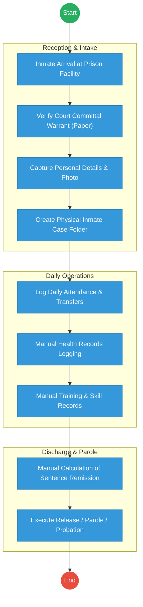
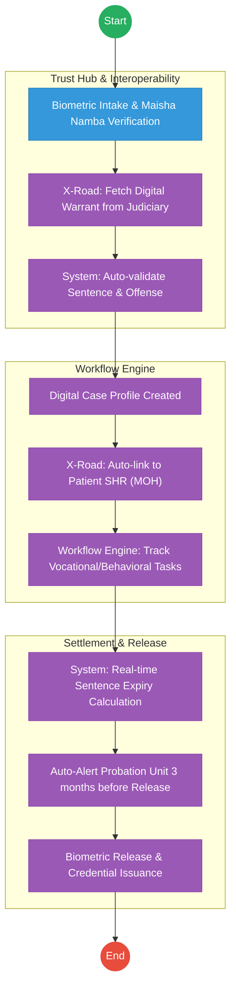

# STATE DEPARTMENT FOR CORRECTIONAL SERVICES – Service Delivery

## Cover Page
- **Ministry/Department/Agency (MDA):** Ministry of Interior and National Administration
- **Department:** State Department for Correctional Services
- **Process Name:** Inmate Case Management and Rehabilitation Tracking
- **Document Version:** 2.1
- **Date:** 2026-02-24
- **Classification:** Official

---

## Executive Summary
The State Department for Correctional Services is responsible for the safe custody and rehabilitation of offenders. Currently, inmate records (10–20 million historical and active files) are predominantly manual and regional, making it difficult to track recidivism or prisoner health and vocational progress across facilities. The transition to the Kenya DSAP Architecture aims to establish a central Inmate Registry integrated with the Judiciary and the national identity ecosystem.

---

## 1. AS-IS Process Flowchart (BPMN 2.0)
*Current State visualization (Inmate Admission & Records based on General Mandate).*

---

## Process Overview
### Process Name
End-to-End Inmate Case Management (Admission to Release)

### Service Category
- G2G (Government to Government - Judiciary/Police)

### Scope
- **In Scope:** Verification of committal warrants, inmate profiling, sentence tracking, and rehabilitation monitoring.
- **Out of Scope:** Physical security infrastructure of prisons.

### Triggers
- Court order committing an individual to a correctional facility.

### End States
- **Successful:** Inmate successfully rehabilitated and released according to law.

### Policy Context
- The Prisons Act; The Constitution of Kenya; Sentencing Guidelines.

---

## Detailed Process (AS-IS)
| Step | Role | Action | Tool/System | Notes |
|---|---|---|---|---|
| 1 | Reception Officer | Verifies the physical committal warrant from the court. | Physical Paper | High risk of errors. |
| 2 | Records Officer | Fills in inmate "booking" details in a physical register. | Manual Ledger | |
| 3 | Prison Admin | Assigns a prison number and creates a physical folder for all subsequent records. | Manual | |
| 4 | Welfare Officer | Tracks rehabilitation and vocational progress via periodic paper reports. | Manual | |
| 5 | Discharge Unit | Calculates release dates manually, accounting for remission and time served. | Manual/Calculator | |

---

## Pain Points & Opportunities
### Pain Points
- **Fragmented Records:** If a prisoner is moved from Nairobi to Shimo La Tewa, their medical and behavioral history often follows weeks later via physical mail.
- **Identity Gaps:** Hard to verify if an individual has previously served time under a different name without central biometrics.
- **Manual Computation:** High risk of errors in calculating sentence expiry dates.

### Opportunities
- **National Inmate Registry:** A central, biometric-linked database accessible to all facilities via **X-Road**.
- **Judiciary Integration:** Real-time digital committal warrants pushed directly from the **Judiciary CMS**.
- **Unified Health/Education:** Linking inmate progress to **MOH (Afya App)** and **KNQA** for vocational certification.

---

## 2. TO-BE Process Flowchart (BPMN 2.0)
*Future State visualization (Kenya DSAP Architecture - Huduma Bridge).*

## Future State Process (TO-BE)
### Narrative
**TO-BE Process: Intelligent Correctional Management**

**Design Principles:**
- **Paperless Justice:** The "Committal Warrant" becomes a digital packet signed by a Judge (NPKI) and pushed to Prisons via the **Huduma Bridge**.
- **Continuity of Care:** Inmates' health and education records are not "Prison records" but national records (MOH/KNQA) that follow them after release, reducing recidivism.
- **Algorithmic Sentence Tracking:** The **Workflow Engine** calculates remission and release dates automatically, providing a live countdown for every inmate.

### Optimized Steps (Digital)
| Step | Actor | Action | System |
|---|---|---|---|
| 1 | Admission Officer | Scans the inmate's biometrics. System pulls their legal identity and prior history via X-Road. | eCitizen / Prisons Kit |
| 2 | System | Fetches the digital court order from the Judiciary CMS, verifying the exact sentence and offense. | KeSEL / X-Road |
| 3 | System | Automatically creates a digital profile and pings the MOH to fetch the inmate's medical summary. | Workflow Engine |
| 4 | Welfare Officer | Updates vocational progress using a tablet; certificates earned are pushed to the inmate's **KNQA** account. | Prisons App |
| 5 | System | Triggers an automated notification to the Probation and Aftercare Service when an inmate is within 90 days of release. | Notification Gateway |

---

## References
- The Prisons Act.
- Huduma Bridge DSAP Architecture.