# STATE DEPARTMENT FOR CORRECTIONAL SERVICES – Service Delivery

## Cover Page
- **Ministry/Department/Agency (MDA):** Ministry of Interior and National Administration
- **Department:** State Department for Correctional Services
- **Process Name:** Inmate Case Management and Rehabilitation Tracking
- **Document Version:** 2.1
- **Date:** 2026-03-04
- **Classification:** Official
- **Strategic Category:** Priority MDA
- **Service Model:** G2G
- **Life-Cycle Group:** Cradle to Death (5. Social Protection & Justice)

## Service Mandate
The State Department for Correctional Services' mandate is derived from Executive Order No. 1 of 2018 (Revised) and includes:
* **Containment and Safe Custody:** Ensuring the secure and humane containment of inmates.
* **Rehabilitation and Reintegration:** Supervision, reformation, and reintegration of offenders back into society.
* **Administration of Justice:** Facilitating the justice system and providing information to courts and penal institutions.
* **Treatment of Young Offenders:** Managing correctional institutions and Youth Corrective Training Centers.
* **Child Welfare:** Providing facilities for children aged four and below who accompany their mothers in prison.
* **Non-Custodial Services:** Managing probation and aftercare services for offenders serving community-based sentences.
The Department oversees two primary services: Kenya Prisons Service (KPS) and Probation and Aftercare Service (PAS).

---

## Executive Summary
The State Department for Correctional Services is responsible for the safe custody and rehabilitation of offenders. Currently, inmate records (10–20 million historical and active files) are predominantly manual and regional, making it difficult to track recidivism or prisoner health and vocational progress across facilities. The transition to the Kenya DSAP Architecture aims to establish a central Inmate Registry integrated with the Judiciary and the national identity ecosystem.

---

## 1. AS-IS Process Flowchart (BPMN 2.0)
*Current State visualization (Inmate Admission & Records based on General Mandate).*

```mermaid
%%{init: { 'theme': 'base', 'themeVariables': { 'fontSize': '24px', 'fontFamily': 'Inter, system-ui, sans-serif', 'primaryColor': '#ffffff', 'edgeLabelBackground':'#ffffff', 'tertiaryColor': '#f3f3f3', 'mainBkg': '#ffffff', 'nodeBorder': '#333333' } } }%%
flowchart TD
    %% Events
    Start((Start))
    EndProcess(("End - Release Executed"))

    subgraph Admission["Admission Phase"]
        direction TB
        IssueWarrant["Court issues committal warrant"]
        Escort["Police escort inmate to facility"]
        VerifyWarrant["Reception verifies court warrant"]
        VerifyID["Identity verification ID/fingerprints"]
        AssignNo["Assign prison number"]
        CreateFile["Create physical case file"]
    end

    subgraph Classification [Classification]
        direction TB
        Classify["Security classification"]
        AssignBlock["Assign housing block/facility"]
    end

    subgraph Custody["Custody Management"]
        direction TB
        DailyTrack["Daily attendance tracking"]
        MedLogs["Medical records logging"]
        BehavLogs["Behavioral/disciplinary records"]
        VocTrack["Vocational training tracking"]
    end

    subgraph Release["Release Preparation"]
        direction TB
        CalcSent["Manual sentence calculation"]
        CalcRem["Remission calculations"]
        EligGateway{"Release eligibility met?"}
        ExecRelease["Execute release/parole/probation"]
    end

    %% Flow connections
    Start --> IssueWarrant
    IssueWarrant --> Escort
    Escort --> VerifyWarrant
    VerifyWarrant --> VerifyID
    VerifyID --> AssignNo
    AssignNo --> CreateFile
    
    CreateFile --> Classify
    Classify --> AssignBlock
    
    AssignBlock --> DailyTrack
    DailyTrack --> MedLogs
    MedLogs --> BehavLogs
    BehavLogs --> VocTrack
    
    VocTrack --> CalcSent
    CalcSent --> CalcRem
    CalcRem --> EligGateway
    
    EligGateway -- "No" --> DailyTrack
    EligGateway -- "Yes" --> ExecRelease
    
    ExecRelease --> EndProcess

    %% Styling
    classDef startEvent fill:#27ae60,stroke:#27ae60,color:#fff,font-size:24px,font-size:24px;;
    classDef endEvent fill:#e74c3c,stroke:#e74c3c,color:#fff,font-size:24px,font-size:24px;;
    classDef userTask fill:#3498db,stroke:#2980b9,color:#fff,font-size:24px,font-size:24px;;
    classDef gateway fill:#f1c40f,stroke:#f39c12,color:#333,font-size:24px,font-size:24px;;
    
    class Start startEvent;
    class EndProcess endEvent;
    class EligGateway gateway;
    class IssueWarrant,Escort,VerifyWarrant,VerifyID,AssignNo,CreateFile,Classify,AssignBlock,DailyTrack,MedLogs,BehavLogs,VocTrack,CalcSent,CalcRem,ExecRelease userTask;
```

---

## Process Overview
### Process Name
End-to-End Inmate Case Management (Admission to Release)

### Service Category
- G2G (Government to Government - Judiciary/Police)

### Scope
- **In Scope:** Verification of committal warrants, inmate profiling, sentence tracking, and rehabilitation monitoring.
- **Out of Scope:** Physical security infrastructure of prisons.

### Triggers
- Court order committing an individual to a correctional facility.

### End States
- **Successful:** Inmate successfully rehabilitated and released according to law.

### Policy Context
- The Prisons Act; The Constitution of Kenya; Sentencing Guidelines.

---

## Detailed Process (AS-IS)

| Step | Role | Action | Tool/System | Notes |
| :--- | :--- | :--- | :--- | :--- |
| 1 | Police | Escorts the inmate to the correctional facility. | Transport |  |
| 2 | Reception Officer | Verifies the physical committal warrant from the court. | Physical Paper | High risk of errors or forgery. |
| 3 | Records Officer | Conducts manual identity verification (checks physical ID if available, takes ink fingerprints) and assigns a unique prison number. | Manual / Ink |  |
| 4 | Records Officer | Creates a physical inmate case folder containing booking details and court orders. | Physical Folder |  |
| 5 | Prison Administration | Performs security classification (maximum/medium/minimum) and assigns a housing block. | Manual |  |
| 6 | Prison Administration | Manages daily custody, including attendance tracking, facility transfers, and logging disciplinary issues. | Manual Ledgers |  |
| 7 | Welfare / Rehabilitation Officer | Tracks rehabilitation, vocational progress, and medical appointments via periodic paper reports. | Manual |  |
| 8 | Discharge Unit | Calculates release dates manually, accounting for sentence length, time served, and remission. | Manual/Calculator | High risk of computational errors. |
| 9 | Discharge Unit | Verifies release eligibility and executes physical release, parole, or handover to probation services. | Manual |  |

---

## Pain Points & Opportunities
### Pain Points
- **Fragmented Records:** If a prisoner is moved from Nairobi to Shimo La Tewa, their medical and behavioral history often follows weeks later via physical mail.
- **Identity Gaps:** Hard to verify if an individual has previously served time under a different name without central biometrics.
- **Manual Computation:** High risk of errors in calculating sentence expiry dates.

### Opportunities
- **National Inmate Registry:** A central, biometric-linked database accessible to all facilities via **X-Road**.
- **Judiciary Integration:** Real-time digital committal warrants pushed directly from the **Judiciary CMS**.
- **Unified Health/Education:** Linking inmate progress to **MOH (Afya App)** and **KNQA** for vocational certification.

---

# PART 1: TO-BE EXECUTIVE SUMMARY (HUMAN-CENTRIC JUSTICE)

The TO-BE process for the State Department for Correctional Services is designed as a **digitally-supported justice ecosystem** where human authority is paramount. Every critical legal, custodial, and release decision is anchored on a **National Inmate Registry (Source of Truth)** but remains under the final authorization of designated officers. Technology is deployed strictly for **data capture, alerting, and computational support**, ensuring that the system assists—but never replaces—the professional judgment of Correctional and Judicial officers. This model ensures full compliance with the Prisons Act, preserving a clear audit trail of human accountability for every inmate's journey through the justice system.

---

# PART 2: ARCHITECTURE ALIGNMENT (KENYA HUDUMA BRIDGE)

The Inmate Case Management Service is engineered to operate across the four layers of the **Kenya DSAP Architecture**:

### Layer 1: Access Channels
- **Officer Workbench (PCMS):** The primary interface for Prison Records Officers, Welfare Officers, and In-Charge authorizing officers.
- **Police / Judiciary Workbenches:** Interfacing points for the intake of committal warrants and police escort data.
- **Shared Mobile App:** For field-based probation monitoring and reintegration tracking.

### Layer 2: Core Platform
- **Workflow Engine (BPMN 2.0):** Orchestrates the custodial journey (Admission → Classification → Sentence Tracking → Release) with mandatory human-in-the-loop checkpoints.
- **Trust Hub:**
  - **Consent Manager:** Consulted before sharing inmate health or behavioral data with other MDAs (e.g., MOH or Probation) via X-Road.
  - **Identity Federation:** Biometric de-duplication and identity certainty via **Maisha Namba (IPRS)**.
  - **NPKI:** Digitally signing **Release Warrants**, **Committal Validations**, and **Sentence Calculations** to ensure non-repudiation and human accountability.
- **Shared Services:**
  - **Intelligent Document Processing (IDP):** Digitizing historical penal records and physical court warrants into the National EDRMS.
  - **Document Generator:** Issuing verifiable **Gate Passes** and **Discharge Certificates** with secure QR codes.
  - **Notifications:** Automated alerts for release eligibility and parole milestones.

### Layer 3: Interoperability (Huduma Bridge)
- **KeSEL (X-Road):** Secure data exchange between KPS, the **Judiciary (Committal Warrants)**, and **NPS (Arrest/Escort data)**.
- **Central Service Catalogue:** Providing discoverable APIs for "Sentencing Verification" and "Custodial Status" queries.

### Layer 4: Authoritative Registries & Payments
- **Registries:**
  - **National Inmate Registry:** The sector-specific authoritative source for custodial and rehabilitation data.
  - **National EDRMS:** The legal digital archive for sensitive penal records and signed legal warrants.
  - **IPRS / Maisha Namba:** The foundational person registry for biometric identity.
- **Payments:** **Government Payment Aggregator (GPA)** for processing inmate canteen funds, fine payments (C2G), and statutory rehabilitation fund transfers.

---

# PART 3: REFINED TO-BE PROCESS (HUMAN-IN-THE-LOOP MODEL)

| Step | Human Actor (Primary Authority) | Action (System-Assisted) | Tool / System (Support) | DPI Component | Notes |
| :--- | :--- | :--- | :--- | :--- | :--- |
| **1** | Judicial Officer | **Warrant Issuance:** Digital signing and pushing of court warrants. | Judiciary CMS | X-Road | Digital warrant acts as the authoritative input for officer review. |
| **2** | Reception Officer | **Admission & ID Verification:** Reception of inmate and biometric confirmation. | PCMS | Maisha Namba / IPRS | Officer verifies identity before initializing the Registry record. |
| **3** | Prison Administrator | **Security Classification:** Determining appropriate facility placement. | PCMS / Rules Engine | Decision Support | System proposes classification based on history; **Administrator makes the final decision**. |
| **4** | Discharge Unit Officer | **Sentence Validation:** Certification of expiry dates and remission. | PCMS / Calculation Engine | Legal Logic | System calculates dates; **Officer must review and sign off** on the statutory accuracy. |
| **5** | Welfare Officer | **Rehabilitation Oversight:** Monitoring behavior and skill acquisition. | PCMS / Rehab Tracker | Data Management | Officer logs physical progress; system provides longitudinal tracking support. |
| **6** | System (Automated) | **Eligibility Alerting:** Sending proactive alerts for upcoming milestones. | PCMS | Automated Alerts | **Alerting only.** Does not trigger any status change or release on its own. |
| **7** | Authorized Officer-In-Charge | **Release Authorization:** Final legal audit and execution of discharge. | PCMS / Workflow | Audit Trail | **Mandatory human authorization** following dual-validation of release warrants. |
| **8** | Probation Officer | **Reintegration Handover:** Accepting supervision of the released offender. | Probation System | Data Exchange | Direct handover of the rehabilitation history to ensure continuity of supervision. |

---

# PART 4: BPMN DIAGRAM (CONTROLLED JUSTICE WORKFLOW)

```mermaid
%%{init: { 'theme': 'base', 'themeVariables': { 'fontSize': '20px', 'fontFamily': 'Inter, system-ui, sans-serif', 'primaryColor': '#ffffff', 'edgeLabelBackground':'#ffffff', 'tertiaryColor': '#f3f3f3', 'mainBkg': '#ffffff', 'nodeBorder': '#333333' } } }%%
flowchart TD
    %% Events
    Start((Start))
    EndProcess(("End - Handover/Release"))

    subgraph Admission_Stage["1. Admission & ID (Officer Led)"]
        direction TB
        DigWarrant["Receive Digital Warrant (X-Road)"]
        BioVerify["Officer Biometric Verification (IPRS)"]
        InitRecord["Initialize Registry Profile"]
    end

    subgraph Custody_Control["2. Classification & Custody (Human Authority)"]
        direction TB
        SystemClassify["System Classification Suggestion"]
        AdminApprove{Admin Approval?}
        LogDaily["Manual Logging of Daily Metrics"]
    end

    subgraph Sentence_Validation["3. Sentence & Rehab (Audit Layer)"]
        direction TB
        CalcSent["System Sentence Calculation"]
        OfficerValidate{Officer Validation?}
        ProgressLogs["Manual Rehabilitation Logs"]
    end

    subgraph Release_Authorization["4. Authorized Release (Dual Control)"]
        direction TB
        Alert["Eligibility Alert (PCMS)"]
        FinalAudit["Final Legal Audit (In-Charge)"]
        AuthRelease{Authorize Release?}
        GatePass["Issuance of Digital Gate Pass"]
    end

    %% Flow connections
    Start --> DigWarrant
    DigWarrant --> BioVerify
    BioVerify --> InitRecord
    InitRecord --> SystemClassify
    SystemClassify --> AdminApprove
    AdminApprove -- "Approved" --> LogDaily
    AdminApprove -- "Revision Required" --> SystemClassify
    
    LogDaily --> CalcSent
    CalcSent --> OfficerValidate
    OfficerValidate -- "Certified Correct" --> ProgressLogs
    OfficerValidate -- "Error Correction" --> CalcSent
    
    ProgressLogs --> Alert
    Alert --> FinalAudit
    FinalAudit --> AuthRelease
    AuthRelease -- "Authorized" --> GatePass
    AuthRelease -- "Hold/Incomplete" --> ProgressLogs
    
    GatePass --> EndProcess

    %% Styling
    classDef startEvent fill:#27ae60,stroke:#27ae60,color:#fff,font-size:20px;;
    classDef endEvent fill:#e74c3c,stroke:#e74c3c,color:#fff,font-size:20px;;
    classDef humanTask fill:#3498db,stroke:#2980b9,color:#fff,font-size:20px;;
    classDef sysSupport fill:#9b59b6,stroke:#8e44ad,color:#fff,font-size:20px;;
    classDef gateway fill:#f1c40f,stroke:#f39c12,color:#333,font-size:20px;;
    
    class Start startEvent;
    class EndProcess endEvent;
    class AdminApprove,OfficerValidate,AuthRelease gateway;
    class DigWarrant,InitRecord,SystemClassify,CalcSent,Alert,GatePass sysSupport;
    class BioVerify,LogDaily,ProgressLogs,FinalAudit humanTask;
```

---

# PART 5: HYBRID IMPLEMENTATION & CONTROLS

- **System Role Redefinition:** The National Inmate Registry is positioned as a **support tool**. In the event of system downtime, facilities revert to manual registers (manual fallback), with a requirement for retrospective updates within the shift.
- **Dual Validation for Release:** Every discharge requires at least two independent digital "keys" (Authorized Discharge Unit Officer + Facility In-Charge) to prevent accidental or wrongful release.
- **Audit Traceability:** The system maintains a permanent, tamper-proof record of **which human officer** authorized each classification, sentence validation, and release step.
- **Decision-Support Logs:** Any variance between the system's "suggested" classification or sentence and the officer's final decision must be documented within the system's exception logs.

---

# PART 6: RISKS & CONTROLS

- **Over-Reliance on Technology:** Mitigated by mandated physical verification of warrants and mandatory officer sign-off for all calculations.
- **Incorrect System Output:** Addressed through the "Calculated vs. Certified" workflow where calculations are flagged as uncertified until an officer validates them against the physical Penal Record.
- **System Failure:** Operations continue via paper-based contingency sets; the system is designed to allow "Back-Dating" of logged events following recovery to ensure record continuity.

---

## References
- Prisons Act (Cap 90)
- Kenya Digital Justice Program Roadmap
- Data Protection Act 2019
- Sentencing Guidelines (Judiciary)

---

### Validation Survey
Please provide your feedback here: [https://ee.kobotoolbox.org/x/4Ls7SlCG](https://ee.kobotoolbox.org/x/4Ls7SlCG)

