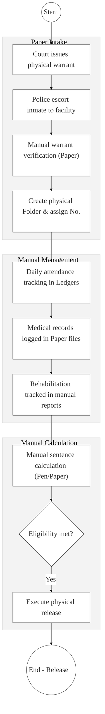

# STATE DEPARTMENT OF CORRECTIONAL SERVICES – Business Process Architecture (Updated)

## Cover Page
- **Ministry:** Ministry of Interior and National Administration
- **State Department:** State Department of Correctional Services
- **Primary Authority:** Kenya Prisons Service (KPS) / Probation & Aftercare (PAS)
- **Document Type:** Business Process Architecture (BPA) Standardised
- **Document Version:** 4.1
- **Date:** 2026-03-25
- **Classification:** Official / Sensitive
- **Strategic Category:** Priority MDA - National Registry (Tier 1)
- **Service Model:** G2G (Justice & Security)
- **Reviewer:** Senior Government Enterprise Architect

---

## SECTION 0: SERVICE PRIORITISATION MAPPING
- **Mapped Priority Service:** Inmate Case Management and Rehabilitation Tracking
- **Tier Classification:** Tier 1
- **Strategic Category:** Justice / Security (Custodial Lifecycle)
- **Breakout Room Classification:** Room 1 (High Impact & Large Registries)
- **Lead MDA (Standardised Name):** State Department of Correctional Services
- **Related Cross-Cutting Services:**
    - National Inmate Registry (Unified)
    - Identity Layer (IPRS / Maisha Namba)
    - X-Road (Judiciary CMS / NPS Interop)
    - National EDRMS (Penal Records Archival)
    - Government Payment Aggregator (GPA / Canteen Funds)

---

## SECTION 0.1: PRIORITISATION JUSTIFICATION
This service is prioritised because the TO-BE design establishes the "National Inmate Registry" as the authoritative backbone for Kenya's correctional and rehabilitation system. By integrating the Kenya Prisons Service (KPS) with the Judiciary via X-Road for real-time digital committal warrants and leveraging Maisha Namba for biometric identity, the design eliminates the "Identity Gaps" and 14-day record-transfer lag between facilities. This transformation ensures 100% accuracy in sentence expiry calculations, provides seamless continuity for inmate healthcare/education, and creates a tamper-proof digital audit trail for justice-sector accountability.

| Criteria | Evidence from TO-BE Design |
| :--- | :--- |
| **Demand / Volume** | Over 50,000 active inmates; hundreds of daily admissions/releases across 100+ facilities. |
| **National Priority Alignment** | The Prisons Act (Cap 90); Sentencing Guidelines; National Security Strategy. |
| **Data Reusability** | Inmate health data is synced with MOH; vocational skills are certified by KNQA. |
| **Interoperability** | Real-time intake of digital warrants from Judiciary CMS and arrest data from NPS via X-Road. |
| **Revenue / Efficiency Impact** | Automated sentence calculation prevents expensive litigation for wrongful detention. |
| **Governance / Risk Reduction** | Dual-key NPKI authorization for releases prevents accidental or fraudulent discharge. |
| **Inclusivity** | Rehabilitation tracking ensures every inmate receives a verifiable "Skill Certificate" upon release. |
| **Readiness** | High; PCMS infrastructure is in deployment; Judiciary X-Road nodes are operational. |

> [!NOTE]
> “The TO-BE design establishes a 'National Inmate Registry' as the single source of truth for Kenya's correctional system. By integrating with the Judiciary via X-Road for digital committal warrants and leveraging Maisha Namba for biometric identity, the design ensures that an inmate's medical, behavioral, and vocational progress follows them across all 100+ facilities, eliminating the 2-week 'paper lag' and preventing calculation errors in sentence expiry dates.”

---

# SECTION 1: SERVICE DEFINITION (STANDARDISED)

The State Department for Correctional Services' mandate is derived from **Executive Order No. 1 of 2018 (Revised)**. 

In this refactored BPA, the department's role is positioned as a **Justice-Sector Custodian**. The focus is on the **End-to-End Inmate Case Management** (Admission to Reintegration). The objective is to move from manual paper ledgers to a **National Inmate Registry (Source of Truth)** that anchors every legal, custodial, and rehabilitation decision on verifiable data.

---

# SECTION 2: SERVICE CATALOGUE (NORMALISED)

| Category | Service Name | Description |
| :--- | :--- | :--- |
| **Core Services** | **Inmate Admission & ID** | Biometric-led booking and validation of digital committal warrants. |
| | **Custodial Lifecycle Mgmt** | Real-time tracking of housing, security classification, and daily attendance. |
| **Extended Services** | **Rehabilitation Tracking** | Logging of vocational training, education progress (KNQA), and behavior. |
| | **Prisoner Health Record** | Seamless continuity of care via the National Shared Health Record (SHR). |
| **Special Case Services**| **Sentence Validation & Release**| Automated calculation and human-certified release/parole execution. |
| | **Probation Handover** | Digital transfer of rehabilitation history to Probation and Aftercare Service. |

---

# SECTION 3: AS-IS PROCESS FLOWS (MANUAL/PAPER-BASED)

Currently, inmate records are predominantly manual and regional, making it difficult to track recidivism or prisoner progress across facilities.

### 3.1 AS-IS Visualization


### 3.2 Operational Reality
- **Actors:** Police, Reception Officer, Records Officer, Prison Admin, Welfare Officer, Discharge Unit.
- **Systems:** Manual Ledgers, Physical Folders, Paper Warrants, Calculators.
- **Pain Points:** 10–20 million historical files remain invisible to digital searching; medical history transfer takes weeks during inmate relocation; high risk of computational errors in sentence expiry; hard to verify recidivism without central biometrics.

---

# SECTION 4: TO-BE PROCESS INTERPRETATION (NEW LAYER)

### 4.1 TO-BE Process (Intelligent Justice Workflow)
```mermaid
%%{init: { 'theme': 'base', 'themeVariables': { 'fontSize': '20px', 'fontFamily': 'Inter, system-ui, sans-serif', 'primaryColor': '#ffffff', 'edgeLabelBackground':'#ffffff', 'tertiaryColor': '#f3f3f3', 'mainBkg': '#ffffff', 'nodeBorder': '#333333' } } }%%
flowchart TD
    Start((Start)) --> DigWarrant["Receive Digital Warrant (X-Road: Judiciary)"]
    
    subgraph Trust_Hub["Layer 2: Identity & Vetting"]
        DigWarrant --> BioVerify["Officer Biometric Verification (IPRS/Maisha)"]
        BioVerify --> InitRecord["Initialize Unified Registry Profile"]
    end

    subgraph Operations["Layer 2 & 3: Human-in-the-Loop Workflow"]
        InitRecord --> SystemClassify["System-suggested Security Classification"]
        SystemClassify --> AdminApprove{Human Admin Approval?}
        AdminApprove -- "Yes" --> LogCentral["Real-time Logging of Daily/Med Metrics"]
    end

    subgraph Settlement["Layer 4: Registries & Release"]
        LogCentral --> CalcSent["Automated Sentence Calculation (Rules Engine)"]
        CalcSent --> OfficerValidate{Officer-In-Charge Validation (NPKI)}
        OfficerValidate -- "Certified" --> GatePass["Issue Digital Verifiable Gate Pass"]
    end

    GatePass --> EndProcess(("End - Handover/Release"))
```

### 4.2 Key Capabilities Introduced
*   **Automation:** Digital committal warrant intake – direct from Judiciary CMS to the Prison workbench.
*   **Integration:** Hub-and-spoke integration with the Ministry of Health (MOH) and KNQA for inmate status tracking.
*   **Real-time Processing:** Automated "Eligibility Alerting" for sentence expiry, parole, and remission milestones.
*   **Digital Identity Validation:** Inmate identity and recidivism history verified via **Maisha Namba** biometric federation.
*   **Workflow Orchestration:** Orchestrates the complex custodial journey with **Human-in-the-loop** checkpoints (Mandatory dual-authorization for discharge).

### 4.3 Transformation Summary
| Dimension | AS-IS | TO-BE |
| :--- | :--- | :--- |
| **Processing** | Manual / Facility-specific | Digital / National Registry |
| **Verification** | Physical Paper Warrants | API-based (Judiciary CMS) |
| **Records** | Regional Paper Silos | Unified National Inmate Registry |
| **Tracking** | Post-event ledger update | Real-time Central Case Dashboard |

---

# SECTION 5: SYSTEM LANDSCAPE (ALIGN TO GEA)

| Layer | System / Platform | Role |
| :--- | :--- | :--- |
| **Identity Layer** | Maisha Namba (IPRS) | Identity and biometric de-duplication engine. |
| **Interoperability** | KeSEL (X-Road) | Data bridge to Judiciary, NPS, and Health. |
| **shared Services** | National EDRMS | Legal digital archive for sensitive penal dossiers. |
| **Workflow / BPM** | PCMS Workflow Hub | Orchestrates admission, classification, and sentence. |
| **Payment Layer** | GPA (Finance Aggregator) | Canteen fund management and statutory fine payments. |
| **Trust Hub** | Consent Manager | Secure control over inmate behavioral data sharing. |

---

# SECTION 6: TRANSFORMATION VALUE (CRITICAL ADDITION)

| Value Type | Explanation |
| :--- | :--- |
| **Efficiency Gain** | Record transfer latency reduced from 2 weeks to milliseconds; instant identity checks. |
| **Economic Impact** | Prevents wrongful detention lawsuits; optimizes facility resource allocation. |
| **Governance Impact** | Full audit traceability of which officer authorized each classification and release. |
| **Citizen Experience** | Inmates receive verifiable certifications for vocational training (KNQA) upon exit. |
| **Interoperability Value** | Shared data with Probation ensures continuous supervision and reduced recidivism. |

---

# SECTION 7: ALIGNMENT TO WHOLE-OF-GOVERNMENT ARCHITECTURE
- **Shared Platforms:** Uses G-Cloud infrastructure for the centralized registry and GPA for financial flows.
- **Registry Reuse:** Feeds "Inmate Status" back to the IPRS and National Voter Registry to maintain integrity.
- **Compliance with GEA / GIF:** Adherence to "Human-Led, System-Assisted" justice sector principles.

---

# SECTION 8: IMPLEMENTATION READINESS (NEW)
*   **Data Readiness:** Medium; Requires systematic high-speed scanning of 10M+ paper files into EDRMS.
*   **Legal Readiness:** High; Prisons Act and Sentencing Guidelines allow for digital records.
*   **Institutional Readiness:** High; KPS has established specialized ICT and Records departments.
*   **Technical Readiness:** High; Core Prison Case Management System (PCMS) nodes are operational.

---

# SECTION 9: TRACEABILITY MATRIX (NEW)

| BPA Process | Priority Service | Tier | TO-BE Capability | National Impact |
| :--- | :--- | :--- | :--- | :--- |
| **Intake Mgmt** | Admission | T1 | X-Road: Judiciary Link | Justice Sector Integrity |
| **Custody Track** | Case Management | T1 | Unified Inmate Registry | Public Safety & Security |
| **Sentence Calc** | Legal Validation | T1 | Rules-based Calculation | Human Rights Compliance |
| **Rehabilitation** | Reintegration | T1 | KNQA / PAS Interop | Reduced Recidivism Rates |

---
**[End of Standardised Business Process Architecture]**
