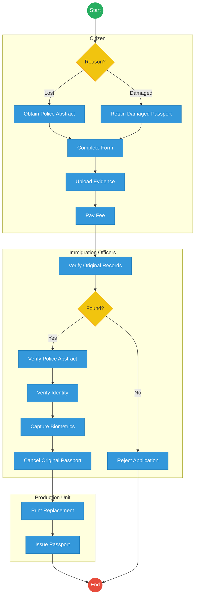
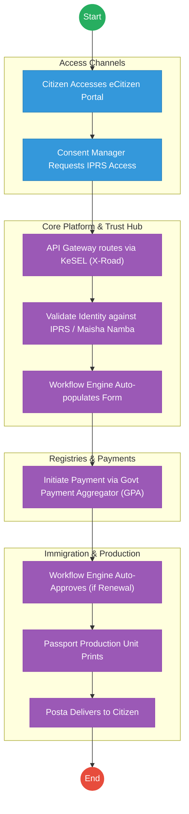

# STATE DEPARTMENT FOR IMMIGRATION AND CITIZEN SERVICES – Passport Application

## Cover Page
- **Ministry/Department/Agency (MDA):** STATE DEPARTMENT FOR IMMIGRATION AND CITIZEN SERVICES
- **Process Name:** Passport Application & Issuance
- **Document Version:** 1.3
- **Date:** 2026-02-19
- **Classification:** Official

---

## Executive Summary
The Directorate of Immigration Services (DIS) is responsible for the issuance of travel documents (passports, visas) to Kenyan citizens and foreign nationals. The passport application process has been digitized via eCitizen but faces significant bottlenecks in biometric capture, processing, and printing.

---

## 1. AS-IS PROCESS: Passport Application and Issuance

### BUSINESS PROCESS OVERVIEW
**Process Name:** Passport Application and Issuance
**Trigger:** Citizen applies for a new passport, renewal, replacement, or change of details

### ACTORS
| Actor                     | Role                     |
|---------------------------|--------------------------|
| Citizen (Applicant)       | Applies for passport     |
| eCitizen System           | Captures application     |
| Immigration Officer       | Verifies and approves    |
| Biometrics Officer        | Captures fingerprints/photo |
| Passport Production Unit  | Prints passport          |

### AS-IS Process Flowchart (BPMN 2.0)
*Current State visualization (End-to-End Passport Services based on Deep Dive).*

### Process Overview
### Process Name
Passport Application (New / Renewal / Replacement)

### Service Category
- G2C (Government to Citizen)

### Scope
- **In Scope:** Ordinary (A, B, C series), Diplomatic, and Service Passports.
- **Out of Scope:** Visa processing (evisa.go.ke).

### Triggers
- Need for international travel.
- Expiry of current passport.
- New application, renewal, replacement, or change of details.

### End States
- **Successful:** Issuance of e-Passport.

### Policy Context
- Kenya Citizenship and Immigration Act, 2011; ICAO Doc 9303.

### Stakeholders
| Stakeholder          | Role                     | Responsibilities                                                               |
|----------------------|--------------------------|--------------------------------------------------------------------------------|
| Citizen (Applicant)  | Applicant                | Completes online form, pays fee, attends appointment. |
| Immigration Officer  | Enroller                 | Captures biometrics and verifies original documents. |
| Production Staff | Processor | Operates printing machines, quality assurance. |
| Courier Service | Logistics | Delivers passports to regional offices (Mombasa, Kisumu, etc.). |

### Detailed Process (AS-IS)
| Step | Actor                     | Action                                                                                                                                           | Tool / System      | Notes                                                                    |
|------|---------------------------|--------------------------------------------------------------------------------------------------------------------------------------------------|--------------------|--------------------------------------------------------------------------|
| 1    | Citizen (Applicant)       | **Creates / Logs into eCitizen Account:** Logs in using National ID Number and Password.                                                         | eCitizen Portal    |                                                                          |
| 2    | Citizen (Applicant)       | **Select Passport Application Service:** Navigates to Immigration Services → Passport Application. Selects First Time Application, Renewal, or Replacement. | eCitizen Portal    |                                                                          |
| 3    | Citizen (Applicant)       | **Fill Passport Application Form (Form 19):** Inputs Personal Details (Full Name, National ID Number, Date of Birth, Place of Birth, Gender, Occupation) and Parent Details (Father Name, Father ID Number, Mother Name, Mother ID Number, Guardian Name, Guardian ID Number, Phone Number). | eCitizen Portal    |                                                                          |
| 4    | Citizen (Applicant)       | **Upload Supporting Documents:** Uploads National ID Copy, Birth Certificate Copy, Passport Photo, Recommender ID Copy (Mandatory). Optional: Old passport (for renewal). | eCitizen Portal    |                                                                          |
| 5    | eCitizen System           | **Submit Application:** System generates Passport Application Reference Number (e.g., PPT/ECITIZEN/2026/123456).                                   | eCitizen System    |                                                                          |
| 6    | Citizen (Applicant)       | **Pay Passport Fees:** Pays via Mobile Money, Card, or Bank.                                                                                     | eCitizen / Payment Gateway |                                                                          |
| 7    | Citizen (Applicant)       | **Book Biometrics Appointment:** Selects Immigration Office (e.g., Nairobi, Mombasa, Kisumu) and books date.                                       | eCitizen Portal    |                                                                          |
| 8    | Biometrics Officer        | **Biometric Capture:** Citizen visits Immigration Office, biometrics captured (Fingerprints, Photo, Signature).                                    | Biometric Kit      |                                                                          |
| 9    | Immigration Officer       | **Identity Verification:** Verification done against National ID via population register (IPRS lookup).                                          | IPRS System        |                                                                          |
| 10   | Senior Immigration Officer| **Application Approval:** Application is Approved or Rejected.                                                                                   | Internal System    |                                                                          |
| 11   | Passport Production Unit  | **Passport Production:** Passport is printed, containing Passport Number (e.g., A1234567).                                                          | Production System  |                                                                          |
| 12   | Citizen (Applicant)       | **Passport Collection:** Citizen collects passport at the Immigration Office.                                                                    | Collection Desk    |                                                                          |

---

## Pain Points & Opportunities
### Pain Points
- **Booklet Shortage:** Frequent delays due to lack of blank passport booklets.
- **Machine Breakdown:** Few printing machines (mainly in Nairobi), causing national backlog.
- **Appointment Delays:** Slots booked out for months; forced to travel to other towns.
- **Corruption:** "Brokers" promising faster processing or appointment slots.
- **Communication:** Lack of transparency on application status ("Stuck at Printing").

### Opportunities
- **Decentralized Printing:** Install printers in key regional offices (Mombasa, Kisumu).
- **Mobile Enrollment:** Portable biometric kits for diaspora or remote areas.
- **Auto-Approval:** Integrate with IPRS/NRB to auto-approve renewal applications (no new biometrics needed if data hasn't changed).
- **Home Delivery:** Partner with Postal Corporation for secure delivery to home/office.

---

## 2. TO-BE PROCESS: Passport Application and Issuance (Optimized)

### TO-BE Process Flowchart (BPMN 2.0)
*Future State visualization (Kenya DSAP Architecture - Huduma Bridge).*

### Future State Process (TO-BE)
### Narrative
The process is **Shared-Service Driven** and **Logistics-Integrated**.
1.  **Biometric Reuse:** The system pulls existing fingerprints from the **NRB (Maisha Namba)** database via **X-Road**. Why capture them again?
2.  **No Appointments:** For renewals and standard applications, physical presence is removed.
3.  **AI Photo Check:** The **eCitizen App** uses AI to ensure the selfie meets ICAO standards before submission.
4.  **Home Delivery:** Passports are delivered securely via **Posta (National Courier)**, tracking the parcel via the App.
5.  **Digital Travel Credential (DTC):** A virtual passport is issued immediately to the phone for use at e-Gates.

### Optimized Steps (Digital)
| Step | Actor | Action | System |
|---|---|---|---|
| 1 | Citizen | Requests passport on eCitizen App. Takes ICAO-compliant selfie. | eCitizen App / AI |
| 2 | WoG Platform | Fetches fingerprints from NRB and validates identity. | X-Road / IPRS |
| 3 | Immigration | Auto-approves application. | Workflow Engine |
| 4 | Factory | Prints booklet. | Production System |
| 5 | Posta | Delivers passport to citizen's doorstep. | Logistics Tracking |

---

## 3. Standard Data Inputs
*Required fields for the WoG Digital Service.*

### A. Passport Application (Renewal/New)
| Field Name | Type | Source | Validation |
|---|---|---|---|
| Citizen ID (Maisha) | String | System Fetch (NRB) | Read-only |
| Passport Type | Enum | User Input | 32/50/66 Pages |
| Current Photo | Image | User Capture (App) | AI ICAO Check |
| Delivery Address | Geo-Loc | User Input | Verified via Google Maps |
| Recommender ID | String | User Input | Optional (if NRB verified) |
| Reason for Travel | Enum | User Input | Tourism / Business / Medical |
| Emergency Contact | String | User Input | Validated vs IPRS |

---

## References
- Kenya Citizenship and Immigration Act.
