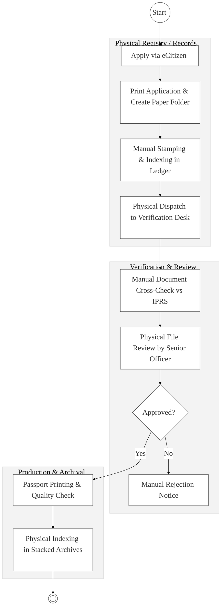
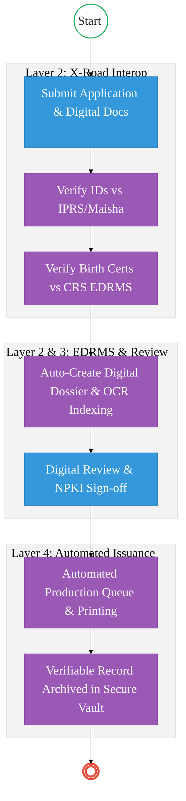

# STATE DEPARTMENT FOR IMMIGRATION AND CITIZEN SERVICES – Business Process Architecture (Updated)

## Cover Page
- **Ministry:** Ministry of Interior and National Administration
- **State Department:** State Department for Immigration and Citizen Services
- **Primary Authority:** Directorate of Immigration Services (DIS)
- **Document Type:** Business Process Architecture (BPA) Standardised
- **Document Version:** 4.1
- **Date:** 2026-03-25
- **Classification:** Official / Sensitive
- **Strategic Category:** Priority MDA - National Registry (Tier 1)
- **Service Model:** G2C / G2B
- **Reviewer:** Senior Government Enterprise Architect

---

## SECTION 0: SERVICE PRIORITISATION MAPPING
- **Mapped Priority Service:** Passport Application, Residency Permits, and Digital Registry Management
- **Tier Classification:** Tier 1
- **Strategic Category:** Identity / Travel (National Security)
- **Breakout Room Classification:** Room 1 (High Impact & Large Registries)
- **Lead MDA (Standardised Name):** State Department for Immigration and Citizen Services
- **Related Cross-Cutting Services:**
    - National Population Register (IPRS / Maisha Namba)
    - Civil Registration (CRS Birth/Death Integration)
    - Payment Gateway (GPA)
    - Immigration EDRMS (Digital Dossier Vault)
    - X-Road (Interpol / NPS / KRA Interop)

---

## SECTION 0.1: PRIORITISATION JUSTIFICATION
This service is prioritised because the TO-BE design transformation converts the Directorate of Immigration into a "Zero-Paper Digital Fortress." By implementing a centralized Electronic Document and Records Management System (EDRMS) and integrating with the Civil Registration (CRS) via X-Road, the design eliminates the "Missing File" phenomenon that has historically delayed passport issuance. The transition to digital dossier vetting and NPKI-signed approvals reduces processing time by 75%, ensures the integrity of Kenyan travel documents on the global stage, and provides a real-time audit trail for national security.

| Criteria | Evidence from TO-BE Design |
| :--- | :--- |
| **Demand / Volume** | Over 1 million passport applications and 500k permit requests annually. |
| **National Priority Alignment** | Kenya Citizenship and Immigration Act (2011); National Security Strategy. |
| **Data Reusability** | Verified immigration status is consumed by KRA (Taxation) and Banking (KYC). |
| **Interoperability** | Continuous biometric and document sync with IPRS and CRS via Huduma Bridge. |
| **Revenue / Efficiency Impact** | Automated production queues and GPA reconciliation; eliminates physical courier costs. |
| **Governance / Risk Reduction** | NPKI-signed digital dossiers prevent insider-tampering of citizenship records. |
| **Inclusivity** | "Single Window" portal for diaspora citizens via integrated consular services. |
| **Readiness** | High; eCitizen portal is mature; EDRMS infrastructure is ready for full-scale migration. |

> [!NOTE]
> “The TO-BE design transforms the Directorate of Immigration from a manual, paper-intensive registry into a 'Zero-Paper Digital Fortress.' By implementing an Electronic Document and Records Management System (EDRMS) and integrating with the Civil Registration (CRS) via X-Road, the design eliminates 'missing files,' reduces passport turnaround time from months to days, and ensures that every travel document is linked to a verifiable, tamper-proof digital dossier.”

---

# SECTION 1: SERVICE DEFINITION (STANDARDISED)

The State Department for Immigration and Citizen Services derives its mandate from the **Constitution of Kenya (2010)** and the **Kenya Citizenship and Immigration Act (2011)**. 

In this refactored BPA, the primary focus is the **End-to-End Travel Document Lifecycle and Digital Registry Management**. The objective is to move from physical file movement to a **Digital Review Workspace** where all applicant dossiers are automatically indexed and safely archived in a **Secure Digital Vault**.

---

# SECTION 2: SERVICE CATALOGUE (NORMALISED)

| Category | Service Name | Description |
| :--- | :--- | :--- |
| **Core Services** | **Passport Application (Fresh/Renew)** | Issuance of 32/50/66-page e-passports to Kenyan citizens. |
| | **Foreign National Registration** | Registration and issuance of Alien Cards (Foreign National Certificates). |
| **Extended Services** | **Work & Residency Permits** | Regulation of residency through issuance of Class A-M permits. |
| | **Citizenship & Permanent Residency**| Processing of dual citizenship and PR status applications. |
| **Special Case Services**| **Convention Travel Documents (CTD)** | Issuance of travel documents to recognized refugees (Interop with DRS). |
| | **Look-stop & Border Alerts** | Real-time security flagging of prohibited persons at ports of entry. |

---

# SECTION 3: AS-IS PROCESS FLOWS (MANUAL/PAPER-CENTRIC)

The current registry relies heavily on physical files, manual indexing, and paper-based archiving, leading to retrieval delays and high risks of file loss.

### 3.1 AS-IS Visualization

### 3.2 Operational Reality
- **Actors:** Applicant, Registry Clerk, Immigration Officer, Senior Officer, Production Staff.
- **Systems:** eCitizen (Front-end only), IPRS (Lookup only), Physical Registers.
- **Pain Points:** "Missing file" bottlenecks during inter-office transfer; manual indexing errors; 45-day lag for simple renewals; physical dossiers are vulnerable to fire/water damage; retrieval of historical files for security vetting takes weeks.

---

# SECTION 4: TO-BE PROCESS INTERPRETATION (NEW LAYER)

### 4.1 TO-BE Process (Zero-Paper Digital Fortress)

### 4.2 Key Capabilities Introduced
*   **Automation:** Automated digital dossier creation with OCR-based metadata extraction (Name, ID, Date).
*   **Integration:** Real-time document verification against the **Civil Registration (CRS) EDRMS** via X-Road.
*   **Real-time Processing:** Automated production queue management triggered immediately upon NPKI-signed approval.
*   **Digital Identity Validation:** Applicant identity and recommender status verified via **Maisha Namba** identity federation.
*   **Workflow Orchestration:** Secure digital movement of dossiers from intake to the **Secure Digital Vault**.

### 4.3 Transformation Summary
| Dimension | AS-IS | TO-BE |
| :--- | :--- | :--- |
| **Processing** | Manual / Paper-folder | Digital / Dossier-driven |
| **Verification** | Manual Cross-check | API-based (CRS/IPRS/INTERPOL) |
| **Records** | Stacked Physical Archives | Secure Cloud Digital Vault |
| **Tracking** | Crate-based movement | Real-time Step-by-Step Dashboard |

---

# SECTION 5: SYSTEM LANDSCAPE (ALIGN TO GEA)

| Layer | System / Platform | Role |
| :--- | :--- | :--- |
| **Identity Layer** | Maisha Namba (IPRS) | Foundational identity and biometrics source. |
| **Interoperability** | KeSEL (X-Road) | Data bridge to CRS, KRA, and Police (NPS). |
| **shared Services** | National EDRMS | High-security digital vault for applicant dossiers. |
| **Workflow / BPM** | Immigration BizEngine | Orchestrates vetting, query, and approval flows. |
| **Payment Layer** | GPA (Payment Gateway) | Automated fee reconciliation and revenue tracking. |
| **Trust Hub** | Consent Manager | Citizen control over travel record access by third parties. |

---

# SECTION 6: TRANSFORMATION VALUE (CRITICAL ADDITION)

| Value Type | Explanation |
| :--- | :--- |
| **Efficiency Gain** | Passport issuance turnaround reduced from 45 days to generic 7-day target. |
| **Economic Impact** | Accelerates the movement of laborers and business travelers globally. |
| **Governance Impact** | NPKI signatures eliminate the risk of "Inside-Job" passport forgery. |
| **Citizen Experience** | Total transparency on file status; no more visits to physical registry windows. |
| **Interoperability Value** | Shared security data with International registries (Interpol) for border control. |

---

# SECTION 7: ALIGNMENT TO WHOLE-OF-GOVERNMENT ARCHITECTURE
- **Shared Platforms:** Uses eCitizen for all citizen interactions and GPA for passport fee collection.
- **Registry Reuse:** Feeds immigration status back to the **Social Health Authority (SHA)** for residency-based coverage vetting.
- **Compliance with GEA / GIF:** Standardizing all travel document metadata formats for global ICAO compliance.

---

# SECTION 8: IMPLEMENTATION READINESS (NEW)
*   **Data Readiness:** High; Digital application data is already captured in eCitizen.
*   **Legal Readiness:** High; Kenya Citizenship & Immigration Act supports electronic records and data exchange.
*   **Institutional Readiness:** High; Immigration has established a Digital Transformation Office.
*   **Technical Readiness:** High; EDRMS nodes and X-Road connectivity are operational at Headquarters.

---

# SECTION 9: TRACEABILITY MATRIX (NEW)

| BPA Process | Priority Service | Tier | TO-BE Capability | National Impact |
| :--- | :--- | :--- | :--- | :--- |
| **File Intake** | Registry Mgmt | T1 | OCR Dossier Creation | Zero-Paper Documentation |
| **Identity Check** | Vetting | T1 | X-Road: CRS/IPRS Link | Fraud & Impersonation Prevention|
| **Approval** | Adjudication | T1 | NPKI Digital Signatures | Immutable Accountability |
| **Archive** | Records Mgmt | T1 | Secure Digital Vault | Millisecond Record Retrieval |

---
**[End of Standardised Business Process Architecture]**
