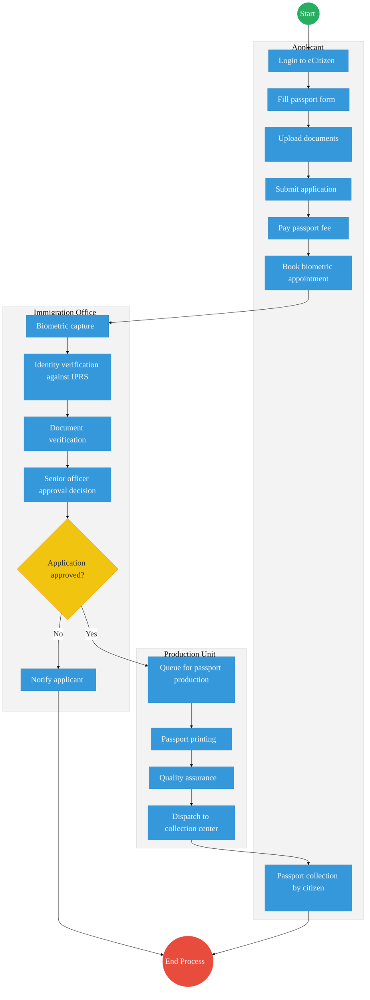
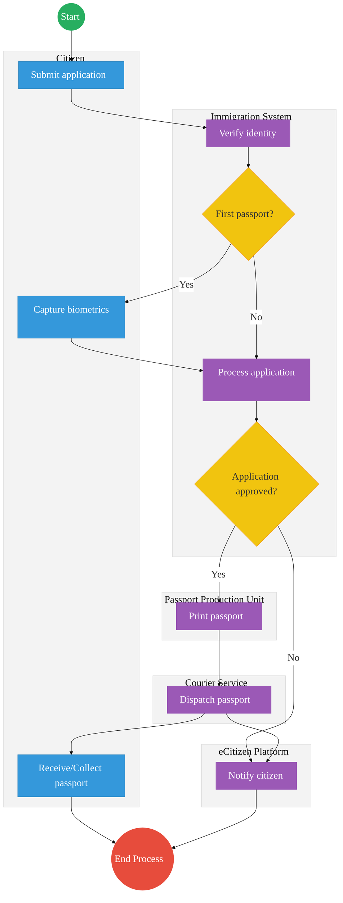

# STATE DEPARTMENT FOR IMMIGRATION AND CITIZEN SERVICES – Passport Application

## Cover Page
- **Ministry/Department/Agency (MDA):** STATE DEPARTMENT FOR IMMIGRATION AND CITIZEN SERVICES
- **Process Name:** Passport Application & Issuance
- **Document Version:** 1.4
- **Date:** 2026-03-04
- **Classification:** Official
- **Strategic Category:** Priority MDA
- **Service Model:** G2C
- **Life-Cycle Group:** Cradle to Death (3. Identity & Travel)

---

## Executive Summary
The Directorate of Immigration Services (DIS) is responsible for the issuance of travel documents (passports, visas) to Kenyan citizens and foreign nationals. The passport application process has been digitized via eCitizen but faces significant bottlenecks in biometric capture, processing, and printing.

---

## 1. AS-IS PROCESS: Passport Application and Issuance

### BUSINESS PROCESS OVERVIEW
**Process Name:** Passport Application and Issuance
**Trigger:** Citizen applies for a new passport, renewal, replacement, or change of details

### ACTORS
| Actor                     | Role                     |
|---------------------------|--------------------------|
| Citizen (Applicant)       | Applies for passport     |
| eCitizen System           | Captures application     |
| Immigration Officer       | Verifies and approves    |
| Biometrics Officer        | Captures fingerprints/photo |
| Passport Production Unit  | Prints passport          |

### AS-IS Process Flowchart (BPMN 2.0)
*Current State visualization (End-to-End Passport Services based on Deep Dive).*

### Process Overview
### Process Name
Passport Application (New / Renewal / Replacement)

### Service Category
- G2C (Government to Citizen)

### Scope
- **In Scope:** Ordinary (A, B, C series), Diplomatic, and Service Passports.
- **Out of Scope:** Visa processing (evisa.go.ke).

### Triggers
- Need for international travel.
- Expiry of current passport.
- New application, renewal, replacement, or change of details.

### End States
- **Successful:** Issuance of e-Passport.

### Policy Context
- Kenya Citizenship and Immigration Act, 2011; ICAO Doc 9303.

### Stakeholders
| Stakeholder         | Role      | Responsibilities                                                |
| ------------------- | --------- | --------------------------------------------------------------- |
| Citizen (Applicant) | Applicant | Completes online form, pays fee, attends appointment.           |
| Immigration Officer | Enroller  | Captures biometrics and verifies original documents.            |
| Production Staff    | Processor | Operates printing machines, quality assurance.                  |
| Courier Service     | Logistics | Delivers passports to regional offices (Mombasa, Kisumu, etc.). |

### Detailed Process (AS-IS)
| Step | Actor                     | Action                                                                                                                                           | Tool / System      | Notes                                                                    |
|------|---------------------------|--------------------------------------------------------------------------------------------------------------------------------------------------|--------------------|--------------------------------------------------------------------------|
| 1    | Citizen (Applicant)       | **Logs into eCitizen:** Creates account or logs in using National ID Number and Password.                                                         | eCitizen Portal    |                                                                          |
| 2    | Citizen (Applicant)       | **Fill Passport Form:** Selects application type (First Time, Renewal, Replacement) and inputs personal/parent details.                           | eCitizen Portal    |                                                                          |
| 3    | Citizen (Applicant)       | **Upload Documents:** Uploads National ID, Birth Certificate, Passport Photo, Recommender ID, and old passport (if applicable).                  | eCitizen Portal    |                                                                          |
| 4    | Citizen (Applicant)       | **Submit Application:** Submits the digital form and generates reference number.                                                                 | eCitizen System    |                                                                          |
| 5    | Citizen (Applicant)       | **Pay Passport Fee:** Pays via Mobile Money, Card, or Bank.                                                                                      | Payment Gateway    |                                                                          |
| 6    | Citizen (Applicant)       | **Book Biometric Appointment:** Selects an Immigration Office and books available date.                                                          | eCitizen Portal    |                                                                          |
| 7    | Biometrics Officer        | **Biometric Capture:** Applicant visits Immigration Office for fingerprints, photo, and signature capture.                                       | Biometric Kit      |                                                                          |
| 8    | Immigration Officer       | **Identity & Document Verification:** Verifies identity against IPRS and checks physical documents.                                              | IPRS / Manual      |                                                                          |
| 9    | Senior Immigration Officer| **Senior Officer Approval Decision:** Reviews the verified file and decides to approve or reject.                                                | Internal System    | Rejections trigger a notification to the applicant.                      |
| 10   | Passport Production Unit  | **Queue & Print:** Approved applications enter the production queue. Passport printing takes place.                                              | Production System  |                                                                          |
| 11   | Passport Production Unit  | **Quality Assurance:** Printed passports undergo QA to ensure ICAO compliance and accurate chip encoding.                                        | Quality Station    |                                                                          |
| 12   | Courier / Dispatch        | **Dispatch:** Passport is dispatched to the designated collection center.                                                                        | Logistics          |                                                                          |
| 13   | Citizen (Applicant)       | **Passport Collection:** Citizen collects the printed passport in person.                                                                        | Collection Desk    |                                                                          |

---

## Pain Points & Opportunities
### Pain Points
- **Booklet Shortage:** Frequent delays due to lack of blank passport booklets.
- **Machine Breakdown:** Few printing machines (mainly in Nairobi), causing national backlog.
- **Appointment Delays:** Slots booked out for months; forced to travel to other towns.
- **Corruption:** "Brokers" promising faster processing or appointment slots.
- **Communication:** Lack of transparency on application status ("Stuck at Printing").

### Opportunities
- **Decentralized Printing:** Install printers in key regional offices (Mombasa, Kisumu).
- **Mobile Enrollment:** Portable biometric kits for diaspora or remote areas.
- **Auto-Approval:** Integrate with IPRS/NRB to auto-approve renewal applications (no new biometrics needed if data hasn't changed).
- **Home Delivery:** Partner with Postal Corporation for secure delivery to home/office.

---

## 2. TO-BE PROCESS: Passport Application and Issuance (Optimized)

### TO-BE Process Flowchart (BPMN 2.0)
*Future State visualization (Kenya DSAP Architecture - Whole-of-Government).*

### Future State Process (TO-BE)
### Narrative
The proposed process leverages a **Whole-of-Government digital platform** to deliver a seamless, transparent, and scalable service.

1. **Identity Verification:** The system instantly queries the National Population Register (IPRS / Maisha Namba) using X-Road, verifying applicant identity at the moment of submission.
2. **Application Processing:** Citizen data is auto-populated to reduce errors, and supporting documents are verified digitally through integration with civil registries.
3. **Decision Logic:** 
   - **Renewal:** Existing biometrics are reused directly from the NRB/Maisha Namba repository, eliminating the need for physical appointments.
   - **First Application:** Physical biometric capture is strictly reserved for first-time applicants or exceptional cases requiring updates.
4. **Production:** Approved applications are sent to an automated production queue and printed across decentralized printing centers, eliminating the Nairobi bottleneck.
5. **Delivery:** The printed passport is dispatched via a secure courier service directly to the citizen's address, or sent to a designated collection center based on user preference.
6. **Notifications:** Real-time SMS and eCitizen status updates proactively notify the citizen at every milestone (e.g., application received, printing, dispatched, ready).

### Optimized Steps (Digital)
| Step | Actor | Action | System |
|---|---|---|---|
| 1 | Citizen | Submits application online. Chooses delivery method. | eCitizen App |
| 2 | Immigration System | Verifies identity via National Population Register. | IPRS / Maisha Namba API |
| 3 | Immigration System | Determines if biometric capture is needed (First Passport) or reuses existing biometrics (Renewal). | Workflow Engine |
| 4 | Citizen | Captures biometrics (only if required). | Biometric Kit |
| 5 | Immigration System | Processes application with digital document verification. | Rules Engine |
| 6 | Passport Production Unit | Prints passport via automated queue in decentralized centers. | Production System |
| 7 | Courier Service | Dispatches passport directly to the citizen or a local center. | Logistics Tracking |
| 8 | eCitizen Platform | Sends SMS/Portal notifications at every major stage. | Notification Gateway |

---

## 3. Standard Data Inputs
*Required fields for the WoG Digital Service.*

### A. Passport Application (Renewal/New)
| Field Name | Type | Source | Validation |
|---|---|---|---|
| Citizen ID (Maisha) | String | System Fetch (NRB) | Read-only |
| Passport Type | Enum | User Input | 32/50/66 Pages |
| Current Photo | Image | User Capture (App) | AI ICAO Check |
| Delivery Address | Geo-Loc | User Input | Verified via Google Maps |
| Recommender ID | String | User Input | Optional (if NRB verified) |
| Reason for Travel | Enum | User Input | Tourism / Business / Medical |
| Emergency Contact | String | User Input | Validated vs IPRS |

---

## References
- https://www.immigration.go.ke
- Kenya Citizenship and Immigration Act
- Desk Review