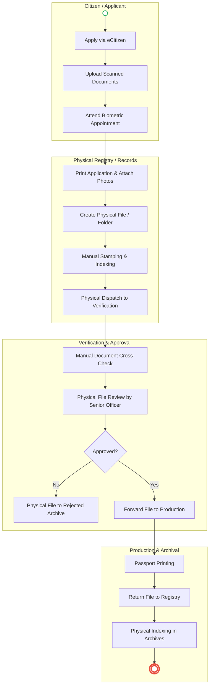

# STATE DEPARTMENT FOR IMMIGRATION AND CITIZEN SERVICES – Passport Application

## Cover Page
- **Ministry/Department/Agency (MDA):** State Department for Immigration and Citizen Services
- **Department:** Directorate of Immigration Services (DIS) - Registry & Issuance
- **Process Name:** Passport Application, Registry Management & Issuance
- **Document Version:** 1.5
- **Date:** 2026-03-18
- **Classification:** Official
- **Strategic Category:** Priority MDA
- **Service Model:** G2C
- **Life-Cycle Group:** Cradle to Death (3. Identity & Travel)
- **Facilitator:** Nelson
- **Assistant:** Newton

## Service Mandate
The State Department for Immigration and Citizen Services, under the Ministry of Interior and National Administration, derives its mandate from the Constitution of Kenya (2010) and the Kenya Citizenship and Immigration Act (2011). Its core responsibilities include:
1. **Border Management:** Control and regulation of entry and exit of all persons at airports, seaports, and land border posts.
2. **Travel Documents:** Issuance and replacement of Kenyan passports and other travel documents.
3. **Residency & Permits:** Regulation of residency through the issuance and renewal of work permits, residence permits, and various passes (student, special, dependant).
4. **Citizenship:** Processing and granting of Kenyan citizenship and permanent residence to qualifying foreigners.
5. **Foreign National Management:** Registration of all non-citizens resident in Kenya and issuance of Alien Cards (Foreign National Certificates).
6. **Electronic Travel Authorisation (eTA):** Management of the mandatory digital authorization for visitors entering Kenya.
7. **Consular Services:** Provision of immigration services to Kenyan nationals and foreigners at Kenya’s missions abroad.
8. **Enforcement:** Identification and removal of prohibited immigrants and enforcement of immigration laws.

---

## Executive Summary
The Directorate of Immigration Services (DIS) is mandated to issue secure travel documents to Kenyan citizens. A critical component of this mandate is the management of the **Immigration Registry**, which holds the foundational documents for every passport holder. Currently, the registry relies heavily on physical files, manual indexing, and paper-based archiving, leading to retrieval delays and security risks. This proposed transformation centers on the implementation of an **Electronic Document and Records Management System (EDRMS)**. By digitizing the registry at the point of entry, all applicant dossiers—including birth certificates, IDs, and recommender forms—are automatically indexed, securely stored, and instantly retrievable, ensuring a seamless and verifiable issuance process.

---

### 1.1 AS-IS Process Flow (BPMN 2.0)


---

## Process Overview
### Process Name
Passport Application and Digital Registry Management

### Service Category
- G2C (Government to Citizen)

### Scope
- **In Scope:** Digital dossier creation; automated indexing of supporting documents; electronic review and approval; secure digital archival of issued records.
- **Out of Scope:** Visa processing; Citizenship adjudications.

### Triggers
- **Event-based:** New passport application or renewal submitted via the eCitizen portal.

### End States
- **Successful:** Digital dossier archived in the EDRMS; Verifiable e-Passport issued to the citizen.
- **Exception:** Rejection based on fraudulent documents; file flagged in the EDRMS audit trail.

---

## Detailed Process (AS-IS)

| Step | Role | Action | Tool/System | Notes |
|---|---|---|---|---|
| 1 | Applicant | Submits application and uploads documents online. | eCitizen | First point of digital entry. |
| 2 | Registry Clerk | Prints the application form and physical photos to create a paper folder. | Physical Printer | Causes immediate duplication and waste. |
| 3 | Records Officer | Manually indexes the file and places it in a physical "Pending" crate. | Physical Ledger | Hard to track the location of the file in real-time. |
| 4 | Immigration Officer | Receives physical files in batches and cross-checks with IPRS screens. | Manual / IPRS | Slow and prone to misplacing documents. |
| 5 | Senior Officer | Reviews the physical file and signs off on the approval/rejection. | Pen & Paper | Lack of a secure digital audit trail for approvals. |
| 6 | Archival Clerk | Receives processed files and manually indexes them in the central registry. | Physical Registry | Retrieval of historical files takes days or weeks. |

---

## Pain Points & Opportunities
### Pain Points
- **Physical File Bottlenecks:** The reliance on moving physical folders between offices causes significant delays and "missing files."
- **Manual Indexing Errors:** Physical ledgers are prone to human error, making file retrieval difficult and inconsistent.
- **Registry Security:** Sensitive physical documents are vulnerable to unauthorized access, loss, or damage (fire/water).
- **Retrieval Latency:** Accessing an applicant's historical file for renewal or investigation is extremely slow due to manual archival methods.

### Opportunities
- **EDRMS Registry:** A centralized digital repository where all documents are uploaded, OCR-processed, and automatically indexed.
- **Digital Dossier Tracking:** Real-time visibility of an application's status and the officer currently reviewing the digital file.
- **Automated Verification:** Integration via Huduma Bridge to instantly verify uploaded certificates against the Civil Registration (CRS) EDRMS.
- **Secure Vault Archival:** Lifetime storage of digitized records with cryptographic signatures (NPKI) to ensure non-repudiation and immediate retrieval.

---

### 1.2 TO-BE Process (BPMN 2.0 - EDRMS Centered)
```mermaid
flowchart TD
    subgraph Applicant["Citizen (via Portal)"]
        Start(( )) --> T1[Submit Application & Digital Docs]
    end

    subgraph Bridge["Huduma Bridge / X-Road"]
        T1 --> T2[Verify IDs vs IPRS/Maisha]
        T2 --> T3[Verify Birth Certs vs CRS EDRMS]
    end

    subgraph DigitalRegistry["Immigration EDRMS"]
        T3 --> T4[Auto-Create Digital Dossier]
        T4 --> T5[OCR Metadata Extraction & Auto-Indexing]
        T5 --> T6[Assign Secure File Tracking ID]
    end

    subgraph Review["Digital Review Workspace"]
        T6 --> R1[Officer Review via Digital Dashboard]
        R1 --> R2[Senior Officer Digital Sign-off (NPKI)]
    end

    subgraph Issuance["Production & Secure Vault"]
        R2 --> P1[Automated Production Queue]
        P1 --> P2[Mint Verifiable Record]
        P2 --> P3[Auto-Archive in Secure Digital Vault]
        P3 --> End((( )))
    end

    style Start fill:#fff,stroke:#27ae60,stroke-width:2px
    style End fill:#fff,stroke:#e74c3c,stroke-width:4px
```

## Future State Process (TO-BE)
### Narrative
**TO-BE Process: Zero-Paper & EDRMS-Centered Registry**

**Design Principles:**
- **Digital Dossier at Entry:** From the moment of submission, the **EDRMS** creates a unique digital dossier for the applicant. There is no printing of forms. Supporting documents (ID, Birth Certificate) are fetched directly from foundational registries via **Huduma Bridge** or verified digitally if uploaded.
- **Automated Indexing & OCR:** The EDRMS uses **Optical Character Recognition (OCR)** to extract metadata from documents, automatically indexing them by name, ID number, and application type. This ensures that every document is searchable and linked to the correct identity.
- **Secure Workflow & Archival:** The file moves through a **Digital Review Workspace**. Approvals are secured using **NPKI Digital Signatures**, creating a tamper-proof audit trail. Once the passport is issued, the entire dossier is moved to a **Secure Digital Vault** for lifetime storage, ensuring that records are never lost and can be retrieved in milliseconds for future renewals or security checks.

### Optimized Steps (Digital)

| Step | Actor | Action | System |
|---|---|---|---|
| 1 | Citizen | Submits application and uploads digital supporting evidence. | eCitizen / Passport Portal |
| 2 | System | Verifies authenticity of documents against foundational registries. | Huduma Bridge / CRS / IPRS |
| 3 | **EDRMS** | **Dossier Creation:** Automatically indexes and stores all verified digital files. | **Immigration EDRMS** |
| 4 | Officer | Reviews the digital dossier and biometrics via a unified dashboard. | Digital Review Workspace |
| 5 | Senior Officer | Applies a digital signature to approve the issuance. | NPKI Signing Service |
| 6 | **EDRMS** | **Secure Archival:** Moves the finalized record to a high-security digital vault. | **Digital Vault / Archive** |

---

## References
- Kenya Citizenship and Immigration Act
- Records Disposal Act
- Data Protection Act 2019
- Public Service Act

---

### Validation Survey
Please provide your feedback here: [https://ee.kobotoolbox.org/x/4Ls7SlCG](https://ee.kobotoolbox.org/x/4Ls7SlCG)
