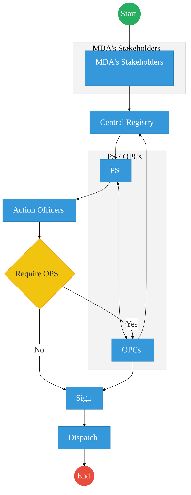

# State Department for Parliamentary Affairs — Service Delivery
 
## Cover Page
- **Ministry/Department/Agency (MDA):** State Department for Parliamentary Affairs
- **Process Name:** Parliamentary Correspondence and Petition Management
- **Document Version:** 2.0
- **Date:** 2026-03-18
- **Classification:** Official
- **Strategic Category:** Priority MDA
- **Service Model:** G2C / G2G
- **Life-Cycle Group:** Cradle to Death (5. Civic Participation & Governance)
 
---

## Service Mandate
The State Department for Parliamentary Affairs is mandated to coordinate the identification, prioritization, and enactment of policy and legislative initiatives within the Executive branch. It acts as a bridge between the Executive and Parliament, facilitating the interaction for effective government business, ensuring public participation in the legislative process, and monitoring the progress of government-sponsored bills and policies in the legislature.

---

## Executive Summary
The State Department for Parliamentary Affairs is mandated to coordinate the National Government's legislative agenda, facilitate seamless interaction between the Executive and Parliament, and strengthen policy coordination across Ministries, Departments, and Agencies (MDAs). It ensures effective government business and enhances accountability.
 
The current process for handling MDA stakeholder correspondence, petitions, and parliamentary queries is entirely paper-driven. Submissions are received at a Central Registry, manually routed to the Principal Secretary (PS) who coordinates with OPCs, assigned to Action Officers for response drafting, and dispatched after physical sign-off. This results in slow turnaround times, poor correspondence tracking, loss of institutional memory, and no visibility for stakeholders on the status of their submissions.
 
The transition to the Kenya DSAP Architecture aims to replace this process with a fully digital Parliamentary Correspondence Management System — integrating with IPRS, BRS, KRA iTax, and the Government Payment Gateway via the Service Bus — to automate intake, routing, compliance validation, and dispatch of all parliamentary correspondence.
 
---
 
## 1. AS-IS Process Flowchart (BPMN 2.0)
*Current State — Parliamentary Correspondence and Petition Management (based on Deep Dive)*
 

 
---
 
## Process Overview
### Process Name
Parliamentary Correspondence, Petition, and Committee Query Management
 
### Service Category
- G2C (Government to Citizen) — MDA stakeholders submitting petitions and correspondence
- G2G (Government to Government) — Inter-agency and parliamentary committee communications
 
### Scope
- **In Scope:** Receipt and logging of stakeholder correspondence and petitions; routing to PS and Action Officers; OPCs review and guidance; sign-off and dispatch of official responses.
- **Out of Scope:** Legislative drafting; parliamentary debate and voting processes (handled by Parliament of Kenya).
 
### Triggers
- An MDA stakeholder (citizen, organisation, parliamentary committee, or other MDA) submitting correspondence, a petition, or a query requiring a ministerial or PS response.
 
### End States
- **Successful:** Policy Guidelines / Circulars, Official Response Letters, Cabinet Resolutions, or Public Service Reports issued and dispatched to the originating stakeholder.
- **Unsuccessful:** Correspondence returned to Action Officers for revision and resubmission.
 
### Policy Context
- The Constitution of Kenya (2010)
- Public Service Commission Act
- National Assembly Standing Orders
- Senate Standing Orders
- Access to Information Act (2016)
- Kenya Data Protection Act (2019)
- Kenya DSAP Architecture — Huduma Bridge Technical Specification
 
---
 
## Stakeholders
 
| Category | Service Name | Target Population |
| :--- | :--- | :--- |
| MDA Stakeholders | Initiator | Submits inquiries, complaints, petitions, or policy proposals to the department via email or physical office. |
| Central Registry | Process Actor | Receives, tags, manually logs, and routes all incoming correspondence. Maintains the physical correspondence register. |
| Principal Secretary (PS) | Decision Maker | Reviews correspondence, coordinates with OPCs for context, assigns instructions to Action Officers, and signs off final responses. |
| OPCs | Advisory / Escalation Actor | Provides guidance, policy precedents, and approvals on complex or sensitive correspondence. Feeds back to registry and PS as required. |
| Action Officers | Process Actor | Drafts responses and action memos based on PS instructions. Assesses whether OPS sign-off is required. |
 
---
 
## Detailed Process (AS-IS)
 
| Step | Role | Action | Tool/System | Notes |
| :--- | :--- | :--- | :--- | :--- |
| 1 | MDA Stakeholders | Submits inquiry, complaint, petition, or policy proposal via email or physical office visit. | Manual / Email / Post | No standardised submission channel. Submissions arrive via multiple informal routes with no acknowledgement issued. |
| 2 | Central Registry | Receives, tags, and manually logs the correspondence. Assigns a reference number and routes docket to the PS. | Physical Registry / Manual | No digital tracking. Dockets frequently misplaced. No SLA on routing turnaround. Registry update depends on OPCs feedback. |
| 3 | Principal Secretary (PS) | Reviews correspondence. Coordinates with OPCs for guidance or precedent. Assigns Action Officers with handwritten instructions on the hard copy. | Manual / Email | Instructions given verbally or via handwritten annotations. No audit trail of who handled what and when. |
| 4 | OPCs | Provides guidance and precedents to PS. Logs updates back to the Central Registry. For escalated items, reviews and approves before returning approved draft to PS. | Manual / Email | OPCs involvement is ad hoc with no structured handoff or tracking. Feedback to registry is manual and inconsistently done. |
| 5 | Action Officers | Prepares draft response or action memo based on PS instructions. | MS Word / Manual | No version control. Multiple drafts circulated by email causing confusion and rework. |
| 6 | Action Officers / PS | Assesses whether OPS sign-off is required based on informal criteria. | Manual Judgement | Criteria for OPS involvement are informal and inconsistently applied across different officers. |
| 7 | OPCs | If OPS sign-off required: reviews, approves, and returns approved draft to PS. Also logs the update back to Central Registry. | Manual / Email | Escalation loop adds 3–10 days with no visibility or tracking. |
| 8 | PS | Signs the final response physically. | Physical Signature | No digital or e-signature capability. Bottleneck when PS is travelling or unavailable. |
| 9 | Central Registry | Dispatches the signed response to the originating stakeholder via post or courier. | Physical Dispatch / Post | Dispatch records not linked to the original submission entry. No delivery confirmation mechanism. |
 
---
 
## Pain Points & Opportunities
### Pain Points
- **Slow Movement of Physical Files:** Paper-based correspondence moves through multiple desks sequentially, creating bottlenecks at every handoff point — particularly at the PS sign-off stage.
- **Loss of Institutional Memory:** Manual registries and physical dockets mean correspondence history is lost when staff rotate or dockets are misplaced. There is no searchable institutional record.
- **Difficulty Tracking Correspondence Status:** Neither officers nor stakeholders can determine the current position of a submission in the workflow without physically chasing the docket across departments.
- **Siloed Operations:** The PS, OPCs, Action Officers, and Registry operate with no shared digital workspace, making coordination dependent on physical proximity, phone calls, and email chains.
- **Arbitrary OPS Escalation Criteria:** The decision to involve OPCs for sign-off has no formally codified trigger, leading to inconsistent application and avoidable delays.
- **No Stakeholder Visibility:** Stakeholders receive no acknowledgement on submission and have no mechanism to check the status of their correspondence, generating repeated follow-up calls.
 
### Opportunities
- **Integration with IPRS/BRS via Service Bus:** Auto-verify stakeholder identity and organisation details at submission, eliminating manual re-entry and enabling pre-population of correspondence records.
- **Adoption of Government Payment Gateway:** Where fees apply to formal petitions or regulatory queries, integrate GPA for cashless, auto-receipted payment.
- **Implementation of Automated Rules Engine:** Codify OPS escalation criteria in a workflow rules engine — auto-route standard responses while flagging complex or sensitive correspondence for human review.
- **Digital Verifiable Credentials:** Issue digitally signed, QR-coded official response letters and policy guidelines that can be independently verified by recipients.
- **Stakeholder Status Portal:** Provide a self-service correspondence tracking portal via eCitizen using the submission reference number.
 
---
 
## 2. TO-BE Process Flowchart (BPMN 2.0)
*Future State — Kenya DSAP Architecture (Huduma Bridge)*

```mermaid
%%{init: { 'theme': 'base', 'themeVariables': { 'fontSize': '24px', 'fontFamily': 'Inter, system-ui, sans-serif', 'primaryColor': '#ffffff', 'edgeLabelBackground':'#ffffff', 'tertiaryColor': '#f3f3f3', 'mainBkg': '#ffffff', 'nodeBorder': '#333333' } } }%%
flowchart TD
    Start((Start))
    EndApprove(("End - Official Response\nDispatched and Recorded"))
 
    subgraph Stakeholder ["MDA's Stakeholders"]
        direction LR
        SubmitPortal["Login via SSO on eCitizen\nSelect Service and Submit\nCorrespondence / Petition"]
        TrackStatus["Track Correspondence Status\nvia Self-Service Portal\nUsing Reference Number"]
    end
 
    subgraph ServiceBus ["Government Service Bus"]
        direction LR
        AutoVerifyIPRS["Auto-verify Identity\nvia IPRS"]
        AutoVerifyBRS["Auto-verify Organisation\nvia BRS"]
        AutoVerifyKRA["Auto-validate Tax\nCompliance via KRA iTax"]
    end
 
    subgraph DPCMS ["Digital Central Registry (DPCMS)"]
        direction TB
        AutoReceive["Auto-receive, Classify\nand Assign Reference Number"]
        AutoAcknowledge["Auto-acknowledge Stakeholder\n(SMS / Email — Instant)"]
        AutoRoute["Auto-route to PS Queue\nBased on Subject Classification\nand SLA Countdown Triggered"]
    end
 
    subgraph PSWorkflow ["PS and OPCs Digital Workflow"]
        direction LR
        PSReview["PS Reviews Correspondence\nDigitally with Full History\nand Prior Precedents Visible"]
        OPCsConsult["OPCs Consulted\nvia Digital Workflow\n(Timestamped and Logged)"]
        PSReview <--> OPCsConsult
    end
 
    subgraph Officers ["Action Officers"]
        direction TB
        AssignOfficer["PS Assigns to Action Officer\nwith Digital Instructions"]
        PrepareResponse["Draft Response on\nCollaborative Document Platform\n(PS Instructions + Precedents Visible)"]
        RulesEngine{"Rules Engine:\nOPS Escalation\nRequired?"}
    end
 
    subgraph OPSWorkflow ["OPS Escalation — Exception-Based"]
        direction TB
        OPSEscalate["Auto-route to OPS\nDigital Approval Queue"]
        OPSApprove["OPS Reviews and\nApproves Digitally\n(Timestamped)"]
    end
 
    subgraph Finalisation ["Finalisation and Dispatch"]
        direction TB
        ESignature["PS Applies Digital\ne-Signature via\nGov e-Signature Framework"]
        AutoDispatch["Auto-dispatch via\nGovernment Messaging Gateway\n(Email / SMS / Registered Post)"]
        DigitalCredential["Issue Verifiable Digital\nResponse Letter\n(QR-coded and Signed)"]
        UpdateRegistry["DPCMS Record Closed\nand Archived — Stakeholder\nStatus Updated to Dispatched"]
    end
 
    Start --> SubmitPortal
    SubmitPortal --> AutoVerifyIPRS
    AutoVerifyIPRS --> AutoVerifyBRS
    AutoVerifyBRS --> AutoVerifyKRA
    AutoVerifyKRA --> AutoReceive
    AutoReceive --> AutoAcknowledge
    AutoAcknowledge --> AutoRoute
    AutoRoute --> PSReview
 
    PSReview --> AssignOfficer
    AssignOfficer --> PrepareResponse
    PrepareResponse --> RulesEngine
 
    RulesEngine -- "No — Standard\nResponse" --> ESignature
    RulesEngine -- "Yes — Complex\nor Sensitive" --> OPSEscalate
    OPSEscalate --> OPSApprove
    OPSApprove --> ESignature
 
    ESignature --> AutoDispatch
    AutoDispatch --> DigitalCredential
    DigitalCredential --> UpdateRegistry
    UpdateRegistry --> TrackStatus
    TrackStatus --> EndApprove
 
    classDef startEvent fill:#27ae60,stroke:#27ae60,color:#fff,font-size:24px;
    classDef endEvent fill:#e74c3c,stroke:#e74c3c,color:#fff,font-size:24px;
    classDef userTask fill:#3498db,stroke:#2980b9,color:#fff,font-size:24px;
    classDef serviceTask fill:#9b59b6,stroke:#8e44ad,color:#fff,font-size:24px;
    classDef gateway fill:#f1c40f,stroke:#f39c12,color:#333,font-size:24px;
 
    class Start startEvent;
    class EndApprove endEvent;
    class RulesEngine gateway;
    class AutoVerifyIPRS,AutoVerifyBRS,AutoVerifyKRA,AutoReceive,AutoAcknowledge,AutoRoute,AutoDispatch,DigitalCredential,UpdateRegistry serviceTask;
    class SubmitPortal,TrackStatus,PSReview,OPCsConsult,AssignOfficer,PrepareResponse,OPSEscalate,OPSApprove,ESignature userTask;
```
 

 
## Future State Process (TO-BE)
### Narrative
**TO-BE Process: Digital Parliamentary Correspondence Management via Huduma Bridge**
 
**Design Principles:**
- **Single Submission Channel:** All stakeholder correspondence enters through eCitizen via Single Sign-On (SSO), providing a unified, auditable intake point with instant auto-acknowledgement and reference number generation.
- **Once-Only Principle:** Stakeholder identity (IPRS), organisation details (BRS), and tax compliance status (KRA iTax) are fetched automatically via the Government Service Bus — stakeholders do not re-submit information already held by government.
- **Automated Rules Engine:** OPS escalation criteria are formally codified in the workflow rules engine, ensuring consistent application. Standard low-complexity responses are auto-routed to PS sign-off; complex or sensitive correspondence is flagged for OPS review.
- **Exception-Based Human Review:** Manual officer review is reserved for complex or sensitive correspondence only. Standard response workflows are fully digital from intake to dispatch.
- **Digital Verifiable Credentials:** Official response letters and policy guidelines are issued as QR-coded, digitally signed verifiable documents that recipients can independently authenticate.
- **Stakeholder Transparency:** A self-service status tracking portal gives stakeholders real-time visibility into their submission at every stage without requiring follow-up calls.
 
### Optimized Steps (Digital)
 
| Step | Actor | Action | Tool / System |
| :--- | :--- | :--- | :--- |
| 1 | MDA Stakeholder | Logs in via Single Sign-On (SSO) on eCitizen and selects the service type — inquiry, complaint, petition, or policy proposal. Identity auto-verified and submission reference number generated. | eCitizen Portal / SSO / IPRS |
| 2 | Government Service Bus | Auto-verifies stakeholder identity via IPRS, organisation details via BRS, and tax compliance via KRA iTax. Correspondence record auto-populated with verified data. | Government Service Bus / IPRS / BRS / KRA iTax |
| 3 | DPCMS | Auto-classifies the submission by subject matter, assigns to the correct PS queue, triggers SLA countdown, and sends SMS/email acknowledgement to the stakeholder instantly. | Digital Parliamentary Correspondence Management System (DPCMS) |
| 4 | Principal Secretary | Reviews the digital submission with full prior correspondence history and OPCs precedents visible in one view. Consults OPCs via the digital workflow — all interaction timestamped and logged. | DPCMS / PS Workflow Module |
| 5 | OPCs | Reviews and provides digital guidance to PS. All OPCs input logged in the correspondence audit trail and auto-updated in DPCMS registry. | DPCMS / OPCs Coordination Module |
| 6 | Action Officers | Prepares draft response on the collaborative document platform with PS instructions, precedents, and stakeholder history all visible. Submits for Rules Engine assessment. | Government Document Platform / DPCMS |
| 7 | Rules Engine | Evaluates OPS escalation rules automatically. Standard responses routed directly to PS e-signature queue. Complex or sensitive cases auto-routed to OPS digital approval queue. SLA timer updated at each transition. | DPCMS Rules Engine / Workflow Engine |
| 8 | OPS (if required) | Reviews and digitally approves escalated correspondence. Approval timestamped and auto-routed back to PS sign-off queue. | DPCMS / OPS Approval Module |
| 9 | Principal Secretary | Applies digital e-signature to the final response via the Government e-Signature Framework. | Government e-Signature Framework |
| 10 | System | Auto-dispatches the digitally signed response via the Government Messaging Gateway (email, SMS, or registered post). Generates a QR-coded Verifiable Digital Response Letter. DPCMS record closed and stakeholder status portal updated to "Dispatched." | Government Messaging Gateway / Output Generator / DPCMS |
 
---
 
## References
- https://www.interior.go.ke
- The Constitution of Kenya (2010)
- Public Service Commission Act
- National Assembly Standing Orders
- Senate Standing Orders
- Access to Information Act (2016)
- Kenya Data Protection Act (2019)
- Kenya DSAP Architecture — Huduma Bridge Technical Specification
- KeSEL Integration Framework — ICT Authority Kenya
- Desk Review — Parliamentary Affairs Deep Dive, March 2026
 
---
 
### Validation Survey
Please provide your feedback here: [https://ee.kobotoolbox.org/x/4Ls7SlCG](https://ee.kobotoolbox.org/x/4Ls7SlCG)
