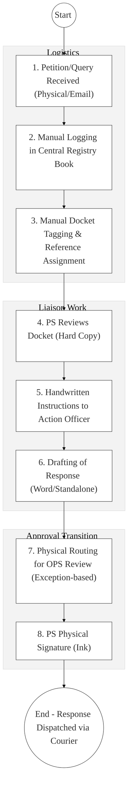
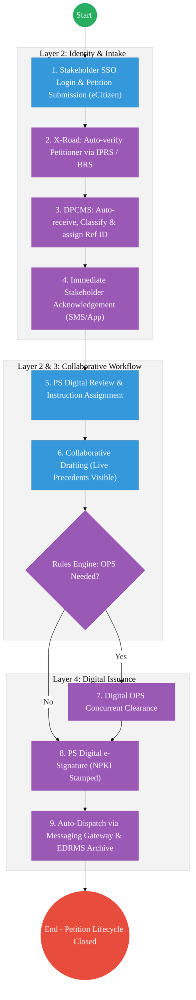

# State Department for Parliamentary Affairs – Business Process Architecture (Updated)

## Cover Page
- **Ministry:** Office of the Deputy President
- **State Department:** State Department for Parliamentary Affairs
- **Primary Authority:** Principal Secretary, Parliamentary Affairs
- **Document Type:** Business Process Architecture (BPA) Standardised
- **Document Version:** 4.1
- **Date:** 2026-03-25
- **Classification:** Official / Restricted
- **Strategic Category:** Priority MDA
- **Service Model:** G2G / G2C
- **Reviewer:** Senior Government Enterprise Architect

---

## SECTION 0: SERVICE PRIORITISATION MAPPING
- **Mapped Priority Service:** Parliamentary Correspondence and Petition Management
- **Tier Classification:** Tier 2
- **Strategic Category:** Governance / Coordination (Legislative Liaison)
- **Breakout Room Classification:** Room 2 (Coordination, Culture & Specialised Services)
- **Lead MDA (Standardised Name):** State Department for Parliamentary Affairs
- **Related Cross-Cutting Services:**
    - Digital Parliamentary Correspondence Management System (DPCMS)
    - Identity Layer (IPRS / Maisha Namba - Petitioner Identity)
    - X-Road (Parliament / AG / Executive Liaison)
    - National EDRMS (Legislative History & Petition Archive)
    - NPKI Service (Official Response Signing)

---

## SECTION 0.1: PRIORITISATION JUSTIFICATION
This service is prioritised because the TO-BE design transforms parliamentary liaison from a manual "paper-routing" exercise into a "Digital Legislative Coordination Hub." By implementing a "Digital Parliamentary Correspondence Management System" (DPCMS) that integrates with IPRS and BRS via X-Road (Huduma Bridge), the design eliminates the chronic loss of institutional memory caused by misplaced physical dockets. This transformation enables real-time status tracking for petitions and queries via a dedicated eCitizen portal, automates the "OPCs Escalation" rules to ensure consistent policy advice, and ensures that all official government responses to Parliament are NPKI-signed and cryptographically verifiable, significantly increasing the velocity of the legislative agenda.

| Criteria | Evidence from TO-BE Design |
| :--- | :--- |
| **Demand / Volume** | Hundreds of petitions and thousands of committee queries annually; high executive visibility. |
| **National Priority Alignment** | Constitution Articles 118/119 (Public Participation); National Assembly Standing Orders. |
| **Data Reusability** | Petition data feeds into the "Policy Change Log" used by all Ministries for legislative planning. |
| **Interoperability** | Seamless data exchange between the Executive and the Parliamentary Service Commission via X-Road. |
| **Revenue / Efficiency Impact** | Reduces response turnaround time from weeks to 72 hours; eliminates physical courier costs. |
| **Governance / Risk Reduction** | NPKI-signed responses prevent the issuance of contradictory policy statements to Parliament. |
| **Inclusivity** | Virtual petition submission allows citizens in all 47 counties to participate in law-making. |
| **Readiness** | High; Basic correspondence dockets exist; Parliamentary liaison offices are established in all MDAs. |

> [!NOTE]
> “The TO-BE design transforms parliamentary liaison from a manual 'paper-routing' exercise into a 'Digital Legislative Coordination Hub.' By implementing a 'Digital Parliamentary Correspondence Management System' (DPCMS) that integrates with IPRS and BRS via X-Road, the design eliminates the loss of institutional memory caused by misplaced physical dockets. This transformation enables real-time status tracking for petitions and queries via eCitizen, automates the 'OPCs Escalation' rules, and ensures that all government responses to Parliament are NPKI-signed and cryptographically verifiable.”

---

# SECTION 1: SERVICE DEFINITION (STANDARDISED)

The State Department for Parliamentary Affairs is mandated to coordinate the National Government’s legislative agenda and facilitate interaction between the Executive and Parliament. 

In this refactored BPA, the primary service is the **End-to-End Parliamentary Correspondence & Petition Management** lifecycle. The objective is to move from manual physical "Red-Folders" and sequential desk-routing to a **Digital Liaison Hub** where petitions are tracked, signed (NPKI), and archived in real-time via the **Huduma Bridge**.

---

# SECTION 2: SERVICE CATALOGUE (NORMALISED)

| Category | Service Name | Description |
| :--- | :--- | :--- |
| **Core Services** | **Petition Receipt & Track**| Digital intake and real-time status tracking of citizen petitions. |
| | **Committee Query Coord.** | Automated routing and clearance of queries from House Committees. |
| **Extended Services** | **Legislative Milestone Hub**| Live tracking of Government Bill progress through Parliament. |
| | **Policy Circular Archive** | Searchable digital repository of all parliamentary Liaison guidance. |
| **Special Case Services**| **Urgent Message Dispatch** | High-priority digital alerting and tracking for time-sensitive House requests. |
| | **Stakeholder Follow-up** | Automated SMS/Email notifications to petitioners on action status. |

---

# SECTION 3: AS-IS PROCESS FLOWS (PAPER-DRIVEN)

The current process is entirely paper-driven, with correspondence moving sequentially through multiple physical desks, leading to lost dockets and slow turnaround times.

### 3.1 AS-IS Visualization

### 3.2 Operational Reality
- **Actors:** Principal Secretary, Action Officer, Registry Clerk, OPCs Representative, Petitioner.
- **Systems:** Manual Registry Books, Physical "Red" Folders, MS Word, Standalone Email.
- **Pain Points:** 10-15 day response lag; dockets frequently misplaced during inter-departmental transit; zero visibility for the petitioner on the status of their petition; loss of institutional memory when liaison staff rotate.

---

# SECTION 4: TO-BE PROCESS INTERPRETATION (NEW LAYER)

### 4.1 TO-BE Process (Digital Liaison Hub)

### 4.2 Key Capabilities Introduced
*   **Automation:** Automated Classification Engine – system routes correspondence to the correct liaison officer based on keywords/subject matter.
*   **Integration:** Real-time bi-directional integration with the **Registry of Societies (BRS)** and **IPRS** via X-Road.
*   **Real-time Processing:** "Self-Service Tracking" – petitioners can check their docket status via eCitizen without calling the registry.
*   **Digital Identity Validation:** Petitioner identity and organization credentials verified via **National Identity (Maisha Namba)**.
*   **Workflow Orchestration:** Orchestrates the complex liaison lifecycle from public petition submission to final verified response in the House.

### 4.3 Transformation Summary
| Dimension | AS-IS | TO-BE |
| :--- | :--- | :--- |
| **Processing** | Manual / Sequential Paper | Digital / Parallel Workflow |
| **Verification** | ID Photocopies / Manual Check | Live X-Road API (IPRS/BRS) |
| **Records** | Physical Register Books | AI-Searchable Digital Archive |
| **Tracking** | Manual lookup (Chasing dockets) | Real-time eCitizen Dashboard |

---

# SECTION 5: SYSTEM LANDSCAPE (ALIGN TO GEA)

| Layer | System / Platform | Role |
| :--- | :--- | :--- |
| **Identity Layer** | Maisha Namba (Petitioner) | Identity and Bio-login for all formal petitioner interactions. |
| **Interoperability** | KeSEL (X-Road) | Data bridge to Parliament and Executive agencies. |
| **shared Services** | National EDRMS | Legal digital archive for all ministerial responses to Parliament. |
| **Workflow / BPM** | DPCMS Liaison Engine | Orchestrates intake, routing, and drafting milestones. |
| **Communication Layer**| Gov Messaging Gateway | Real-time SMS/Email notification and dispatch hub. |
| **Trust Hub** | NPKI Stamping Service | Cryptographic sealing of all formal liaison responses. |

---

# SECTION 6: TRANSFORMATION VALUE (CRITICAL ADDITION)

| Value Type | Explanation |
| :--- | :--- |
| **Efficiency Gain** | Correspondence turnaround time reduced by 70% (Weeks to 72 hours). |
| **Economic Impact** | Accelerates the passage of business-enabling legislation and policy circulars. |
| **Governance Impact** | Absolute accountability for petition responses; zero-loss of state history. |
| **Citizen Experience** | Transparent public participation in the legislative process via mobile. |
| **Interoperability Value** | Shared precedent-database prevents "Conflicting Policy" responses to Parliament. |

---

# SECTION 7: ALIGNMENT TO WHOLE-OF-GOVERNMENT ARCHITECTURE
- **Shared Platforms:** Uses eCitizen for secure SSO and the Government Messaging Gateway for all dispatches.
- **Registry Reuse:** Reuses BRS (Organisation) and IPRS (Person) registries for 100% verified intake.
- **Compliance with GEA / GIF:** Standardizing legislative liaison metadata for whole-of-government searchability.

---

# SECTION 8: IMPLEMENTATION READINESS (NEW)
*   **Data Readiness:** Medium; Requires scanning and indexing of high-priority legacy petitions.
*   **Legal Readiness:** High; Constitution Article 118 mandates public participation facilitation.
*   **Institutional Readiness:** High; Liaison offices already exist in the Executive Office of the President.
*   **Technical Readiness:** High; DPCMS modules can be hosted on the national G-Cloud restricted enclave.

---

# SECTION 9: TRACEABILITY MATRIX (NEW)

| BPA Process | Priority Service | Tier | TO-BE Capability | National Impact |
| :--- | :--- | :--- | :--- | :--- |
| **Intake Portal** | Petition Registry | T2 | Maisha Namba Verified SSO | Inclusive Civic Participation |
| **Query Routing** | Liaison Work | T2 | Automated Subject Classification | Government Response Speed |
| **Digital Review** | Approval Workflow | T2 | Digital OPS Clearance (Parallel) | Consistent Legislative Advice |
| **NPKI Signing** | Dispatch | T2 | Cryptographic Response Seals | Official Document Integrity |

---
**[End of Standardised Business Process Architecture]**
