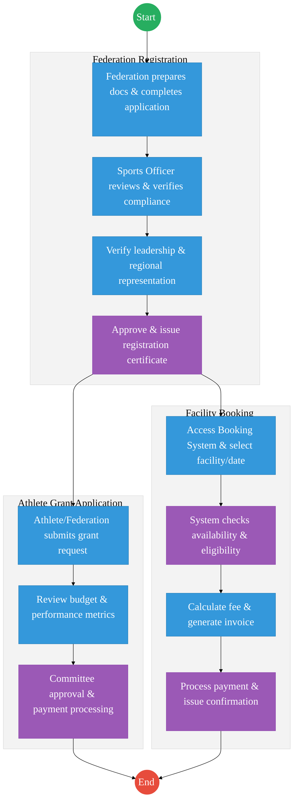
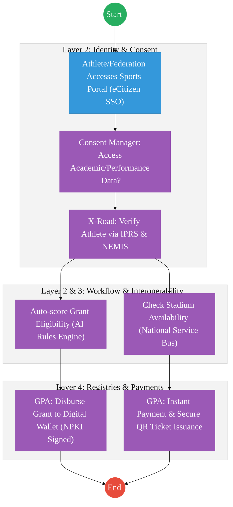

# STATE DEPARTMENT FOR SPORTS – Service Delivery

## Cover Page
- **Ministry/Department/Agency (MDA):** Ministry of Youth Affairs, Creative Economy and Sports
- **Department:** State Department for Sports
- **Process Name:** Federation Registration, Grants & Facility Management
- **Document Version:** 2.1
- **Date:** 2026-02-24
- **Classification:** Official
- **Strategic Category:** Priority MDA
- **Service Model:** G2C
- **Life-Cycle Group:** Cradle to Death (4. Employment & Business)

---

## Service Mandate
The State Department for Sports is responsible for the development, promotion, and management of sports activities and infrastructure across Kenya. Its mandate is derived from the Sports Act No. 25 of 2013 and focuses on nurturing talent and positioning Kenya as a global sporting powerhouse.

**Official Website:** [https://www.moyasa.go.ke](https://www.moyasa.go.ke)

**Key Functions:**
- **Policy Development:** Formulating and reviewing national sports policies and legal frameworks to govern the sports sector.
- **Sports Promotion:** Promoting, coordinating, and implementing grassroots, national, and international sports programs.
- **Infrastructure Development:** Overseeing the development, management, and maintenance of sports facilities (e.g., stadiums) through its agency, Sports Kenya.
- **Talent Identification:** Identifying, nurturing, and developing sporting talent across all levels.
- **International Participation:** Facilitating the participation of Kenyan athletes in regional, continental, and international competitions.
- **Regulation:** Licensing and regulating sports organizations and professional sports persons in liaison with the Sports Registrar.
- **Funding:** Managing and allocating resources for sports development, including coordination with the Sports, Arts and Social Development Fund.

---

## Executive Summary
The State Department for Sports is responsible for the regulation of sports federations, management of athlete grants, and the administration of national sports facilities. The current process is transitioning to digital for facility booking but remains manual for federation oversight and grant management. The transition to the Kenya DSAP Architecture aims to unify these services into a single "Sports Portal" integrated with IPRS for athlete verification and the Government Payment Aggregator for facility fees and grant disbursements.

---

## 1. AS-IS Process Flowchart (BPMN 2.0)
*Current State visualization (End-to-End Sports Services based on Deep Dive).*

---

## Process Overview
### Process Name
Sports Federation Registration, Grant Disbursement, and Facility Booking

### Service Category
- G2C (Athlete) / G2B (Federation)

### Scope
- **In Scope:** New federation registrations, renewals, talent identification grants, and booking of stadiums/complexes.
- **Out of Scope:** Management of private sports clubs.

### Triggers
- A sports body seeking legal recognition or an athlete applying for training support.

### End States
- **Successful:** Federation registered; Grant disbursed to athlete's wallet; Facility booked.

### Policy Context
- The Sports Act 2013; The Constitution of Kenya; Data Protection Act 2019.

---

## Detailed Process (AS-IS)

| Step | Role | Action | Tool/System | Notes |
| :--- | :--- | :--- | :--- | :--- |
| **1** | Federation | **Letter to PS:** Submits a formal request for funding (e.g., for international travel). | Manual / Email | Citizen-led trigger. |
| **2** | Sports Officer | **Confirmation:** Verifies that the federation/athlete meets all statutory SASDF requirements. | Manual / eCitizen | Registration is already on e-Citizen. |
| **3** | Budgeting Committee | **Verification:** Reviews the requested budget against the available annual allocation. | Committee System | Financial gatekeeping. |
| **4** | PS Sports | **Clearance:** Issues the formal approval/clearance for the expenditure. | PS Portal / Manual | Statutory authorization. |
| **5** | Finance / SASDF | **Funding (Payment):** Processes the disbursement via the Government Payment Aggregator. | IFMIS / GPA | Final settlement. |

> [!NOTE]
> **SASDF Integration:** All funding requests must comply with the **Sports, Arts and Social Development Fund (SASDF)** application criteria. While registration is digitized on e-Citizen, the internal "Funding Travelling" track remains a high-touch governance process.

---

## Pain Points & Opportunities
### Pain Points
- **Fragmented Athlete Data:** No central database of all registered athletes, making talent tracking difficult.
- **Grant Transparency:** Manual grant processing leads to delays and lack of visibility for athletes.
- **Double Booking:** Standalone facility systems sometimes conflict with high-level government event schedules.

### Opportunities
- **National Athlete Registry:** Using **Maisha Namba** to track every athlete's career from school (NEMIS) to professional level.
- **Unified Booking Engine:** A central "Stadium App" integrated with the **Government Payment Aggregator** for instant booking and payment.
- **Digital Grant Wallets:** Directly disbursing grants to athletes' digital wallets, bypassing intermediaries.

---

# PART 3: ARCHITECTURE ALIGNMENT (KENYA HUDUMA BRIDGE)

The Integrated Sports and Talent Management Service is engineered to operate across the four layers of the **Kenya DSAP Architecture**:

### Layer 1: Access Channels
- **eCitizen / Sports Portal:** A unified window for athletes, federations, and citizens to apply for grants, register, and book facilities.
- **Stadium Mobile App:** A specialized interface for "Zero-Touch" stadium booking and digital ticketing (QR-based).
- **Officer Workbench:** For Sports Officers and SASDF committees to manage grant evaluations, compliance checks, and facility scheduling.

### Layer 2: Core Platform
- **Workflow Engine (BPMN 2.0):** Orchestrates the athlete lifecycle (Talent ID → Grant Application → Committee Review → Disbursement) and federation registration.
- **Trust Hub:**
  - **Consent Manager:** Mandatory athlete consent before querying academic history or wellness data from NEMIS or MOH via X-Road.
  - **Identity Federation:** Real-time verification of athlete and official identity via **Maisha Namba (IPRS)**.
  - **NPKI:** Digitally signing **Registration Certificates**, **Grant Approvals**, and **Official Clearances** to ensure legal non-repudiation.
- **Shared Services:**
  - **Intelligent Document Processing (IDP):** Digitizing historical federation files and physical grant applications into the National EDRMS.
  - **Document Generator:** Automated creation of verifiable "Digital Gate Passes" and performance transcripts with secure QR codes.
  - **Notifications:** Automated SMS/Email alerts for grant status, facility booking confirmations, and renewal triggers.

### Layer 3: Interoperability (Huduma Bridge)
- **KeSEL (X-Road):** Secure data exchange between the Sports Portal and **NEMIS (Talent History)**, **KNQA (Qualifications)**, and **PSC (Officer data)**.
- **Central Service Catalogue:** Cataloguing sports-related APIs (e.g., Athlete Profiles, Facility Schedules) for national and international synchronization.

### Layer 4: Authoritative Registries & Payments
- **Registries:**
  - **National Athlete Registry:** The sector-specific authoritative registry for tracking talent from school level to professional ranks.
  - **National EDRMS:** The definitive legal digital archive for all signed federation records and historical sports policy documents.
  - **IPRS / Maisha Namba:** Foundational person registry for athlete identification.
| Payments | **Government Payment Aggregator (GPA)** | Processing stadium fees, federation registration charges, and grant disbursements. |

---

## 2. TO-BE Process Flowchart (DPI-Enabled)
*Proposed State visualization leveraging the Kenya Huduma Bridge.*

## Future State Process (TO-BE)
### Narrative
**TO-BE Process: Integrated Sports Management Platform**

**Design Principles:**
- **Talent Lifecycle Tracking:** By integrating with **NEMIS** and **IPRS**, the Ministry can track an athlete's progress from primary school competitions to the Olympics.
- **Zero-Touch Booking:** Facility management is fully automated via the **Huduma Bridge**, with real-time availability sync across all national stadiums.
- **Financial Integrity:** All payments (G2C grants and C2G fees) are routed through the **Government Payment Aggregator**, ensuring auditability.

### Optimized Steps (Digital)

| Step | Actor | Action | Tool / System |
| :--- | :--- | :--- | :--- |
| 1 | Athlete | Logs into the Sports Portal using their Maisha Namba for SSO. | Sports Portal |
| 2 | System | Fetches the athlete's competition history and academic status via X-Road (NEMIS/KNQA). | KeSEL / X-Road |
| 3 | Athlete | Selects a training facility and pays the discounted "Elite Athlete" fee. | GPA |
| 4 | System | Instantly issues a digital "Access Ticket" (QR Code) and notifies the facility manager. | Output Generator |
| 5 | System | Automatically triggers the quarterly grant disbursement based on verified performance logs. | GPA / Workflow Engine |

---

## References
- https://www.sportsheritage.go.ke
- Sports Act 2013
- Desk Review

---

### Validation Survey
Please provide your feedback here: [https://ee.kobotoolbox.org/x/4Ls7SlCG](https://ee.kobotoolbox.org/x/4Ls7SlCG)

