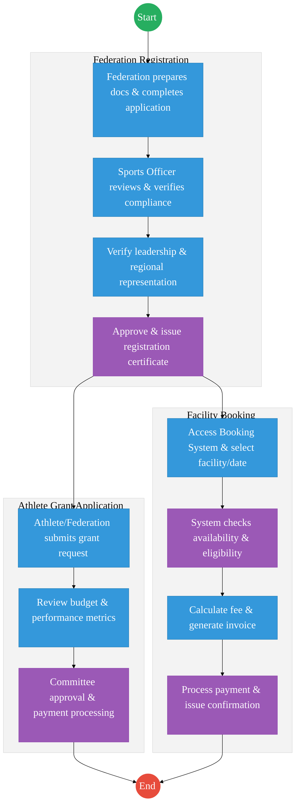
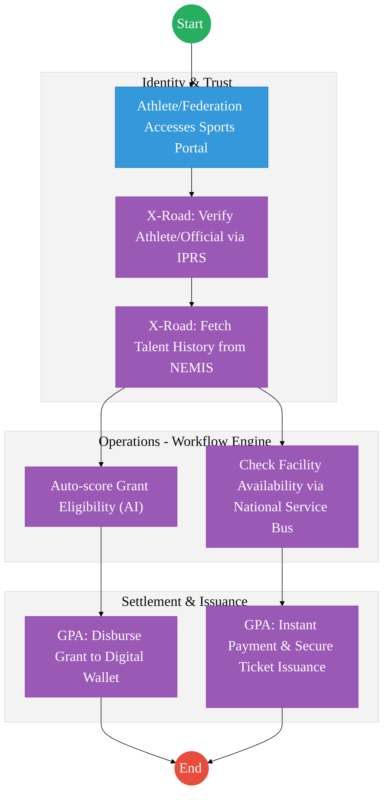

# STATE DEPARTMENT FOR SPORTS – Service Delivery

## Cover Page
- **Ministry/Department/Agency (MDA):** Ministry of Youth Affairs, Creative Economy and Sports
- **Department:** State Department for Sports
- **Process Name:** Federation Registration, Grants & Facility Management
- **Document Version:** 2.1
- **Date:** 2026-02-24
- **Classification:** Official
- **Strategic Category:** Priority MDA
- **Service Model:** G2C
- **Life-Cycle Group:** Cradle to Death (4. Employment & Business)

---

## Executive Summary
The State Department for Sports is responsible for the regulation of sports federations, management of athlete grants, and the administration of national sports facilities. The current process is transitioning to digital for facility booking but remains manual for federation oversight and grant management. The transition to the Kenya DSAP Architecture aims to unify these services into a single "Sports Portal" integrated with IPRS for athlete verification and the Government Payment Aggregator for facility fees and grant disbursements.

---

## 1. AS-IS Process Flowchart (BPMN 2.0)
*Current State visualization (End-to-End Sports Services based on Deep Dive).*

---

## Process Overview
### Process Name
Sports Federation Registration, Grant Disbursement, and Facility Booking

### Service Category
- G2C (Athlete) / G2B (Federation)

### Scope
- **In Scope:** New federation registrations, renewals, talent identification grants, and booking of stadiums/complexes.
- **Out of Scope:** Management of private sports clubs.

### Triggers
- A sports body seeking legal recognition or an athlete applying for training support.

### End States
- **Successful:** Federation registered; Grant disbursed to athlete's wallet; Facility booked.

### Policy Context
- The Sports Act 2013; The Constitution of Kenya; Data Protection Act 2019.

---

## Detailed Process (AS-IS)

| Step | Role | Action | Tool/System | Notes |
|---|---|---|---|---|
| 1 | Federation | Submits application for registration along with constitution and list of officials. | Manual/Portal | |
| 2 | Sports Officer | Verifies the regional representation of the federation as required by the Sports Act. | Manual | |
| 3 | Athlete | Submits a grant application for international competitions or training. | Manual Forms | |
| 4 | Facility Manager | Reviews booking requests and checks for conflicts with national team schedules. | Standalone System | |
| 5 | Finance Officer | Processes facility payments and grant disbursements via bank transfers. | Manual/IFMIS | |

---

## Pain Points & Opportunities
### Pain Points
- **Fragmented Athlete Data:** No central database of all registered athletes, making talent tracking difficult.
- **Grant Transparency:** Manual grant processing leads to delays and lack of visibility for athletes.
- **Double Booking:** Standalone facility systems sometimes conflict with high-level government event schedules.

### Opportunities
- **National Athlete Registry:** Using **Maisha Namba** to track every athlete's career from school (NEMIS) to professional level.
- **Unified Booking Engine:** A central "Stadium App" integrated with the **Government Payment Aggregator** for instant booking and payment.
- **Digital Grant Wallets:** Directly disbursing grants to athletes' digital wallets, bypassing intermediaries.

---

## 2. TO-BE Process Flowchart (BPMN 2.0)
*Future State visualization (Kenya DSAP Architecture - Huduma Bridge).*

## Future State Process (TO-BE)
### Narrative
**TO-BE Process: Integrated Sports Management Platform**

**Design Principles:**
- **Talent Lifecycle Tracking:** By integrating with **NEMIS** and **IPRS**, the Ministry can track an athlete's progress from primary school competitions to the Olympics.
- **Zero-Touch Booking:** Facility management is fully automated via the **Huduma Bridge**, with real-time availability sync across all national stadiums.
- **Financial Integrity:** All payments (G2C grants and C2G fees) are routed through the **Government Payment Aggregator**, ensuring auditability.

### Optimized Steps (Digital)

| Step | Actor | Action | System |
|---|---|---|---|
| 1 | Athlete | Logs into the Sports Portal using their Maisha Namba for SSO. | Sports Portal |
| 2 | System | Fetches the athlete's competition history and academic status via X-Road (NEMIS/KNQA). | KeSEL / X-Road |
| 3 | Athlete | Selects a training facility and pays the discounted "Elite Athlete" fee. | GPA |
| 4 | System | Instantly issues a digital "Access Ticket" (QR Code) and notifies the facility manager. | Output Generator |
| 5 | System | Automatically triggers the quarterly grant disbursement based on verified performance logs. | GPA / Workflow Engine |

---

## References
- https://www.sportsheritage.go.ke
- Sports Act 2013
- Desk Review

<<<<<<< HEAD

---

### Validation Survey
Please provide your feedback here: [https://ee.kobotoolbox.org/x/4Ls7SlCG](https://ee.kobotoolbox.org/x/4Ls7SlCG)

=======
---

## Feedback
We value your input on this blueprint. Please take a moment to provide your feedback using the link below:

[Provide Feedback](https://ee.kobotoolbox.org/x/4Ls7SlCG)
>>>>>>> fa7c468774fe7aa62241faa0890b6d9a0f43c246
