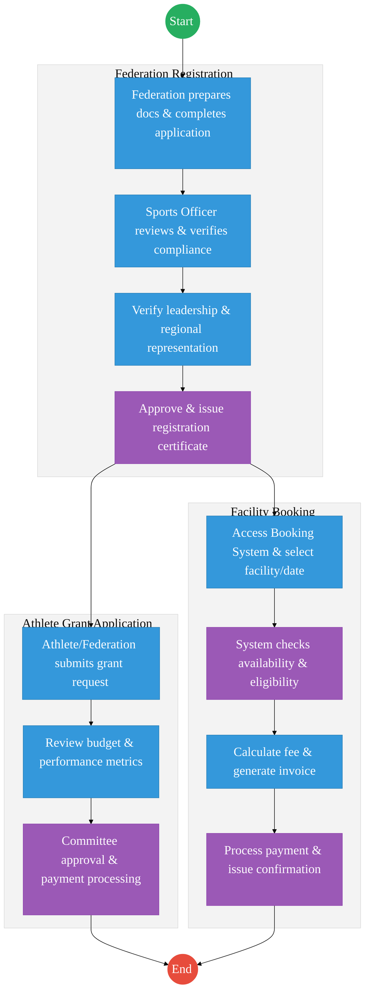
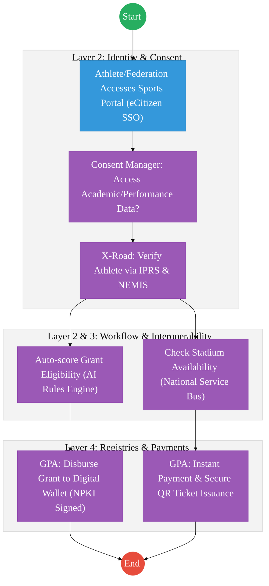

# STATE DEPARTMENT FOR SPORTS – Business Process Architecture

## Cover Page
- **Ministry:** Ministry of Youth Affairs, Creative Economy and Sports
- **State Department:** State Department for Sports
- **Primary Authority:** Sports Registrar / Sports Kenya
- **Document Type:** Business Process Architecture (BPA) Standardised
- **Document Version:** 3.1
- **Date:** 2026-03-25
- **Classification:** Official
- **Strategic Category:** Priority MDA
- **Service Model:** G2C / G2B
- **Reviewer:** Senior Government Enterprise Architect

---

## SECTION 0: SERVICE PRIORITISATION MAPPING
- **Mapped Priority Service:** Sports Federation Registration, Grant Disbursement, and Facility Booking
- **Tier Classification:** Tier 2
- **Strategic Category:** Social / Identity / Economy (Athlete Talent Pipeline)
- **Breakout Room Classification:** Room 2 (Coordination, Culture & Specialised Services)
- **Lead MDA (Standardised Name):** State Department for Sports
- **Related Cross-Cutting Services:**
    - National Athlete Registry (Unified)
    - Identity Layer (IPRS / Maisha Namba)
    - Payment Gateway (GPA)
    - Notification Engine
    - National EDRMS

---

## SECTION 0.1: PRIORITISATION JUSTIFICATION
This service is prioritised because the TO-BE design transformation moves the department from manual, high-friction grant processing to a data-driven "Athlete Lifecycle" model. By linking sports performance from school level (NEMIS) to professional ranks, the G2C experience is revolutionised while ensuring strict financial accountability through the Government Payment Aggregator.

| Criteria | Evidence from TO-BE Design |
| :--- | :--- |
| **Demand / Volume** | Over 1.3 million registered athletes; constant demand for facility booking and grant support. |
| **National Priority Alignment** | Talanta Hela Initiative; Bottom-Up Economic Transformation Agenda (BETA). |
| **Data Reusability** | Athlete performance data feeds into national scouting and selection systems. |
| **Interoperability** | Continuous sync with NEMIS (Education), KNQA (Academic), and MOH (Wellness) via X-Road. |
| **Revenue / Efficiency Impact** | Eliminates double-booking via unified engine; direct grant disbursements reduce overhead. |
| **Governance / Risk Reduction** | Identity verification via Maisha Namba prevents grant "ghosting" and identity fraud. |
| **Inclusivity** | "Zero-Touch" facility booking accessible via USSD/Mobile for grassroots talent. |
| **Readiness** | Medium-High; National registry structure exists; Mobile booking engine in pilot. |

> [!NOTE]
> “This service is prioritised because the TO-BE design enables a unified 'National Athlete Registry' linked to NEMIS and IPRS, ensuring transparent grant disbursement via digital wallets and zero-touch facility booking, significantly reducing fraud and overhead.”

---

# SECTION 1: SERVICE DEFINITION (STANDARDISED)

The State Department for Sports is responsible for the development, promotion, and management of sports activities and infrastructure across Kenya. Its mandate is derived from the **Sports Act No. 25 of 2013** and focuses on nurturing talent and positioning Kenya as a global sporting powerhouse.

The transformation focus is on the **Sports Federation Registration, Grant Disbursement, and Facility Booking** ecosystem, which forms the backbone of the Talanta Hela framework.

---

# SECTION 2: SERVICE CATALOGUE (NORMALISED)

| Category | Service Name | Description |
| :--- | :--- | :--- |
| **Core Services** | **Sports Federation Registration** | Registration and compliance oversight of national sports bodies and clubs. |
| | **Athlete Grant Management** | Vetting and disbursement of support funds to individual and team athletes. |
| **Extended Services** | **Facility Booking & Management** | Reservation of national stadiums and high-performance training centres. |
| | **Talent Identification Permits** | Licensing of scouts and academies involved in youth talent development. |
| **Special Case Services**| **International Travel Clearance** | Government authorization for teams representing Kenya abroad. |
| | **Dispute Resolution** | Formal mediation between athletes and federations via the Sports Registrar. |

---

# SECTION 3: AS-IS PROCESS FLOWS (MANUAL TRACK)

The current state is characterized by siloed systems for booking and manual, paper-intensive workflows for grants.

### 3.1 AS-IS Visualization

### 3.2 Operational Reality
- **Actors:** Federation Officials, Sports Officers, Budget Committees, PS Sports, SASDF Finance Team.
- **Systems:** eCitizen (for basic registration), IFMIS (for finance), Manual spreadsheets for budget tracking.
- **Pain Points:** Fragmented athlete data; 30-day delay in grant transparency; manual reconciliation of facility fees; conflicts in stadium scheduling due to lack of a central real-time ledger.

---

# SECTION 4: TO-BE PROCESS INTERPRETATION (NEW LAYER)

### 4.1 TO-BE Process (DPI-Enabled)

### 4.2 Key Capabilities Introduced
*   **Automation:** AI Rules Engine for automated grant eligibility scoring based on verified performance logs.
*   **Integration:** Real-time data sync with NEMIS for school-based talent tracking and MOH for medical clearances.
*   **Real-time Processing:** "Zero-Touch" stadium booking with instant ticket (QR) issuance.
*   **Digital Identity Validation:** SSO and performance history linkage via **Maisha Namba** identity federation.
*   **Workflow Orchestration:** Coordinated movement from federation compliance to athlete funding.

### 4.3 Transformation Summary
| Dimension | AS-IS | TO-BE |
| :--- | :--- | :--- |
| **Processing** | Manual / High-touch | Automated (AI Scoring) |
| **Verification** | Physical Certificates | API-based (NEMIS/IPRS) |
| **Records** | Siloed Spreadsheets | Unified National Athlete Registry |
| **Tracking** | Post-event manual entry | Real-time performance logs |

---

# SECTION 5: SYSTEM LANDSCAPE (ALIGN TO GEA)

| Layer | System / Platform | Role |
| :--- | :--- | :--- |
| **Identity Layer** | Maisha Namba (IPRS) | Unified athlete and official identity. |
| **Interoperability** | KeSEL (X-Road) | Connector to NEMIS, KNQA, and PSC registers. |
| **shared Services** | National EDRMS | Archival of federation registration history. |
| **Workflow / BPM** | Talanta Hela Engine | Orchestrates grants and facility scheduling. |
| **Payment Layer** | GPA (Payment Gateway) | Direct-to-Wallet grant disbursements. |
| **Trust Hub** | Consent Manager | Athlete privacy control for performance data. |

---

# SECTION 6: TRANSFORMATION VALUE (CRITICAL ADDITION)

| Value Type | Explanation |
| :--- | :--- |
| **Efficiency Gain** | Grant processing time reduced from weeks to hours; eliminated double-booking of stadiums. |
| **Economic Impact** | Increased revenue from facility automated bookings; professionalization of the sports economy. |
| **Governance Impact** | Eliminated "Ghost Athletes" in the grant system through Maisha Namba authentication. |
| **Citizen Experience** | Seamless mobile application for grants and instant digital entry tickets to facilities. |
| **Interoperability Value** | Cross-registry talent tracking (Primary -> High School -> National Team). |

---

# SECTION 7: ALIGNMENT TO WHOLE-OF-GOVERNMENT ARCHITECTURE
- **Shared Platforms:** Integration with HUDUMA for physical document collection (if needed) and eCitizen for portal access.
- **Registry Reuse:** Reuses NEMIS data for age verification and performance tracking, avoiding data duplicity.
- **Compliance with GEA / GIF:** Standardizing all sports APIs for inclusion in the National Data Exchange catalogue.

---

# SECTION 8: IMPLEMENTATION READINESS (NEW)
*   **Data Readiness:** Medium; Legacy registries require full indexing into the Unified Athlete Registry.
*   **Legal Readiness:** High; Sports Act 2013 is robust; requires minor USSD/Mobile payment regulations.
*   **Institutional Readiness:** Medium; Requires digital upskilling for regional sports officers.
*   **Technical Readiness:** High; Framework for "Stadium App" is already in pilot phase.

---

# SECTION 9: TRACEABILITY MATRIX (NEW)

| BPA Process | Priority Service | Tier | TO-BE Capability | National Impact |
| :--- | :--- | :--- | :--- | :--- |
| **Talent Vetting** | Grant Management | T2 | NEMIS/X-Road Link | Merit-based Talent Funding |
| **Facility Booking** | Facility Management | T2 | Real-time GPA Sync | Optimized Asset Utilization |
| **Registration** | Federation Oversight| T2 | NPKI Digital Signing | Improved Sporting Governance |
| **Impact Tracking** | Monitoring | T2 | Real-time Dashboards | Sector GVA Growth Visualization|

---
**[End of Standardised Business Process Architecture]**
