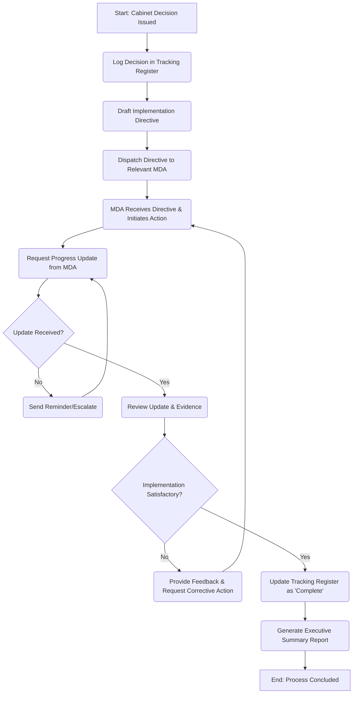

# State Department for Cabinet Affairs - Service Delivery

## MDA Overview
The **State Department for Cabinet Affairs** operates within the Executive Office of the President. It is mandated with supporting the Cabinet Office, managing executive committee business, and crucially tracking the implementation of government decisions and directives across all state ministries and departments.

## Identified Business Process: Cabinet Decision Tracking and Implementation Monitoring

### 1. AS-IS Process Flowchart (BPMN 2.0)

### 2. Process Description

1.  **Logging Decisions:** Following a Cabinet meeting, approved decisions and directives are manually entered into a tracking register.
2.  **Dispatch:** Implementation directives are drafted and officially dispatched (often via hard copy memos or emails) to the responsible Principal Secretaries or Cabinet Secretaries.
3.  **Monitoring:** The State Department routinely requests progress updates from the respective MDAs.
4.  **Review:** Submitted progress reports and evidence are reviewed by officers to verify if the directive has been satisfactorily implemented according to the specified timelines.
5.  **Reporting:** Fully implemented decisions are marked complete, and periodic executive summary reports are generated for the Head of Public Service and the Presidency.

### 3. Pain Points & Bottlenecks

- **Siloed Tracking:** Use of manual registers or standalone spreadsheets makes it difficult to maintain a real-time, unified view of all pending directives.
- **Reporting Delays:** Significant time is lost chasing MDAs for progress updates and collating fragmented reports.
- **Lack of Verification Mechanisms:** Validating the evidence of implementation often requires physical inspections or lengthy correspondence.
- **Knowledge Loss:** Difficult to search historical decisions and their subsequent implementation outcomes due to fragmented physical and digital records.

### 4. Opportunities for Digital Transformation (TO-BE)

- **Centralized Cabinet Decision Tracking System:** Implement a unified dashboard where all directives are logged, assigned, and tracked against milestones in real-time.
- **Automated Alerts and Escalations:** Configure the system to automatically notify MDA focal points of impending deadlines and escalate overdue items to higher authorities.
- **Digital Evidence Repository:** Allow MDAs to securely upload proof of implementation (documents, photos, API links) directly to the platform for instant review.
- **Data Analytics and Dashboards:** Generate automated, real-time visual reports for the Presidency to gauge overall government performance and policy execution.

---

### Validation Survey
Please provide your feedback here: [https://ee.kobotoolbox.org/x/4Ls7SlCG](https://ee.kobotoolbox.org/x/4Ls7SlCG)

