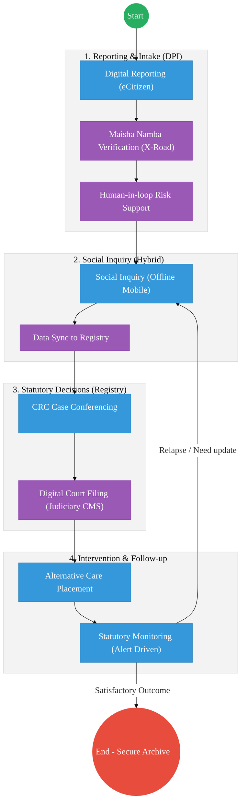

# STATE DEPARTMENT FOR CHILDREN SERVICES – Service Delivery

## Cover Page
- **Ministry/Department/Agency (MDA):** Ministry of Gender, Culture and Children Services
- **Department:** State Department for Children Services
- **Process Name:** Child Protection Case Management
- **Document Version:** 2.1
- **Date:** 2026-03-04
- **Classification:** Official
- **Strategic Category:** Priority MDA
- **Service Model:** G2C
- **Life-Cycle Group:** Cradle to Death (2. Childhood & Education)

---

## Service Mandate
The State Department for Children Services is mandated to safeguard the rights and promote the welfare of all children in Kenya. Drawing its authority from the Constitution of Kenya and the Children Act 2022, the department provides leadership in child protection and the implementation of family and child welfare policies.

**Official Website:** [https://www.childrenservices.go.ke](https://www.childrenservices.go.ke)

**Key Functions:**
- **Child Protection:** Preventing and responding to violence, exploitation, and abuse, including harmful cultural practices and child labor.
- **Social Support Programs:** Administering Cash Transfer for Orphans and Vulnerable Children (CT-OVC), Presidential Secondary School Bursary (PSSB), and Nutrition Improvement through Cash and Health Education (NICHE).
- **Case Management:** Operating the Child Protection Information Management System (CPIMS) to track and manage child welfare cases nationwide.
- **Alternative Care:** Overseeing adoption, foster care, and the regulation of Charitable Children’s Institutions (CCIs).
- **Counter-Trafficking:** Implementing the Counter-Trafficking in Persons Act to protect children from trafficking.

---

## Executive Summary
The State Department for Children Services, under the Ministry of Gender, Culture and Children Services (created 16th April 2025 following the reorganization of the Government structure per Executive Order No. 1 of 2025), is mandated to safeguard the rights and promote the welfare of all children in Kenya. The department operates through eight divisions providing child protection, cash transfer programmes for vulnerable children, educational support, the Child Helpline (116), counter-trafficking efforts, and the Child Protection Information Management System (CPIMS). The current case management process is heavily paper-based, leading to delays in interventions, difficulty in tracking child history across regions, and risks of data loss. The transition to the Kenya DSAP Architecture aims to implement a secure, digital CPIMS integrated with the national identity ecosystem.

---

## 1. AS-IS Process Flowchart (BPMN 2.0)
*Current State visualization representing the Official Hybrid Case Management sequence.*

```mermaid
%%{init: { 'theme': 'base', 'themeVariables': { 'fontSize': '24px', 'fontFamily': 'Inter, system-ui, sans-serif', 'primaryColor': '#ffffff', 'edgeLabelBackground':'#ffffff', 'tertiaryColor': '#f3f3f3', 'mainBkg': '#ffffff', 'nodeBorder': '#333333' } } }%%
flowchart TD
    %% Events
    Start((Start))
    EndProcess(("End - Case Closed"))

    subgraph Intake_Layer["Intake & Registration"]
        direction TB
        Report["1. Case Reporting & Registration"]
        IntakeAss["2. Intake and Risk Assessment"]
        RiskGateway{"Immediate danger?"}
    end

    subgraph Investigation_Layer["Social Inquiry"]
        direction TB
        EmergResc["Emergency Rescue and Placement"]
        Investigate["3. Social Inquiry (Investigation)"]
    end

    subgraph Decision_Layer["Case Conferencing"]
        direction TB
        CRC["4. Case Conferencing (CRC)"]
    end

    subgraph Intervention_Layer["Implementation & Placement"]
        direction TB
        CourtProc["5. Care Plan Implementation + Court Processes"]
        Placement["6. Alternative Care Placement"]
        Monitor["7. Monitoring and Follow-up"]
    end

    subgraph Closure_Layer["Case Closure"]
        direction TB
        CloseProc["8. Case Closure"]
    end

    %% Flow connections
    Start --> Report
    Report --> IntakeAss
    IntakeAss --> RiskGateway
    
    RiskGateway -- "Yes" --> EmergResc
    EmergResc --> Investigate
    RiskGateway -- "No" --> Investigate
    
    Investigate --> CRC
    CRC --> CourtProc
    CourtProc --> Placement
    
    Placement --> Monitor
    Monitor --> CloseProc
    CloseProc --> EndProcess

    %% Styling
    classDef startEvent fill:#27ae60,stroke:#27ae60,color:#fff,font-size:24px;;
    classDef endEvent fill:#e74c3c,stroke:#e74c3c,color:#fff,font-size:24px;;
    classDef userTask fill:#3498db,stroke:#2980b9,color:#fff,font-size:24px;;
    classDef gateway fill:#f1c40f,stroke:#f39c12,color:#333,font-size:24px;;
    
    class Start startEvent;
    class EndProcess endEvent;
    class RiskGateway gateway;
    class Report,IntakeAss,EmergResc,Investigate,CRC,CourtProc,Placement,Monitor,CloseProc userTask;
```

---

## Process Overview
### Process Name
Statutory Child Protection Case Management (Hybrid)

### Service Category
- G2C (Government to Citizen)

### Scope
- **In Scope:** Case reporting, hybrid intake, social inquiries, CRC decision-making, alternative care, and statutory monitoring.
- **Out of Scope:** Non-statutory family mediation, long-term foster care payments.

### Triggers
- A report of a child in need of care and protection received at a sub-county office or via the helpline.

### End States
- **Successful:** Child is safe, care plan completed, and case formally closed in both manual and digital systems.

### Policy Context
- The Children Act 2022; The Constitution of Kenya 2010; Data Protection Act 2019.

---

## Detailed Process (AS-IS) – Official Hybrid Model

The process for Children Services is a **hybrid model** where CPIMS is partially deployed and currently used alongside manual paper-based systems. Field-based activities such as social inquiries and monitoring remain physical, with digital capture occurring after fieldwork where connectivity and device availability allow.

| Step | Role | Action | Tool / System | Notes (Hybrid Nature) |
| :--- | :--- | :--- | :--- | :--- |
| **1** | Children Officer | **Case Reporting & Registration:** Reception of reports from various sources. | Paper Ledger / CPIMS (Intake Module) | Reports are recorded in physical registers at the station and later synced to CPIMS. |
| **2** | Children Officer | **Intake and Risk Assessment:** Screening and initial risk evaluation to prioritize child safety. | Manual Forms / CPIMS | Screening is manual; metadata and risk scores are captured in CPIMS where possible. |
| **3** | Children Officer | **Social Inquiry (Investigation):** Detailed field investigation including home visits and interviews. | Physical Visits / CPIMS (Case Notes) | **Fieldwork is 100% physical.** Investigation summaries are logged into CPIMS case notes. |
| **4** | Case Review Committee (CRC) | **Case Conferencing (CRC):** Decision-making body reviews inquiry findings and approves the Case Plan. | Physical Meetings / CPIMS (Case Planning) | Formal meetings are physical; approved plans are digitized into the CPIMS Case Planning module. |
| **5** | Children Officer / Court | **Care Plan Implementation + Court Processes:** Execution of approved interventions and statutory court filings. | Manual Filings / Judiciary Link / CPIMS | Processing of court orders involves manual filing; status is updated in CPIMS. |
| **6** | Children Officer / Care Institutions | **Alternative Care Placement:** Placement of children in CCIs, foster care, or kinship care. | Care Home Manual Records / CPIMS (Placement) | Placement is a physical event; location and admission data is updated in the CPIMS Placement module. |
| **7** | Children Officer | **Monitoring and Follow-up:** Periodic visits ensure the care plan objectives are being met. | Physical Visits / CPIMS (Follow-up) | Site visits are manual; periodic progress updates are entered into CPIMS Follow-up module. |
| **8** | Children Officer | **Case Closure:** Formal exit from the protection system after objectives are achieved. | Manual Closure Forms / CPIMS (Closure) | Case is physically archived and formally closed in the CPIMS Closure module. |

---

## CPIMS Deployment & Positioning

The **Child Protection Information Management System (CPIMS)** is the primary digital tool for statutory case management. Its current implementation is characterized by:

- **Active CPIMS Modules:**
  - **Intake:** Registration and initial screening data.
  - **Case Notes:** Digital logging of inquiry summaries.
  - **Case Planning:** Digitization of Case Review Committee approvals.
  - **Placement:** Tracking of children in CCIs and Alternative Care.
  - **Follow-up:** Logging of periodic monitoring outcomes.
  - **Closure:** Formal digital case termination.

- **Current Operational Limitations:**
  - **Partial Rollout:** Not all sub-county offices have stable connectivity or sufficient devices.
  - **Parallel Paper Systems:** Manual registers remain the legal source of truth in some jurisdictions due to statutory requirements.
  - **Connectivity Gaps:** Syncing often happens post-facto when officers return from field visits.

---

## Pain Points & Opportunities
### Pain Points
- **Siloed Paper Records:** If a child moves from Nairobi to Mombasa, their protection history is lost because the files are physical.
- **Delayed Response:** Manual routing of emergency cases through physical committees takes too long.
- **Data Security:** Sensitive case files are stored in physical cabinets, posing a risk to the child's privacy.

### Opportunities
- **National CPIMS:** A unified digital platform for tracking every child protection case across Kenya.
- **Biometric Identity (Maisha Namba):** Linking every case to a child's UPI to ensure continuity of care regardless of location.
- **Digital Court Integration:** Direct API link to the Judiciary's Case Management System for filing protection orders.

---

# PART 1: TO-BE EXECUTIVE SUMMARY

The TO-BE process for the State Department for Children Services represents a transition to a **DPI-aligned, hybrid-aware case management ecosystem**. Anchored by an enhanced **National CPIMS**, the system shifts from siloed paper records to a secure, interoperable platform. By integrating with national digital identity (Maisha Namba) and cross-sectoral registries (Judiciary, Health, Education), the system ensures a **continuity of care** for vulnerable children. This transformation prioritizes the "best interest of the child" through smart decision support, while maintaining human oversight and supporting offline field realities in resource-constrained environments.

---

# PART 2: ARCHITECTURE ALIGNMENT (KENYA HUDUMA BRIDGE)

The Statutory Child Protection Service is engineered to operate across the four layers of the **Kenya DSAP Architecture**:

### Layer 1: Access Channels
- **eCitizen / Mobile App:** For citizen-led case reporting and self-referrals.
- **Officer Workbench (CPIMS):** The primary interface for Children Officers to manage intake, investigation, and reporting.
- **Huduma Centers:** Physical intake points for walk-in reporting with document scanning (IDP) capabilities.

### Layer 2: Core Platform
- **Workflow Engine (BPMN 2.0):** Orchestrates the legal journey from "Risk Assessment" to "Case Closure" to ensure statutory timelines are met.
- **Trust Hub:**
  - **Consent Manager:** Consulted before accessing a child's health or academic history from other MDAs via X-Road.
  - **Identity Federation:** Real-time verification of child/guardian identity via **Maisha Namba (IPRS)**.
  - **NPKI:** Cryptographically signing **Commitment Orders** and **Case Reports** to ensure non-repudiation.
- **Shared Services:**
  - **Intelligent Document Processing (IDP):** Digitizing historical case files and physical evidence into the National EDRMS.
  - **Document Generator:** Creating verifiable **Care and Protection Orders** with secure QR codes.
  - **Notifications:** Automated SMS/Email alerts for the Case Review Committee (CRC) and guardians.

### Layer 3: Interoperability (Huduma Bridge)
- **KeSEL (X-Road):** Secure, decentralized data exchange between CPIMS and the **Judiciary (Case Management System)**, **MOH (Health Registries)**, and **MoE (NEMIS)**.
- **Central Service Catalogue:** Cataloguing child welfare APIs for intra-government data sharing.

### Layer 4: Authoritative Registries & Payments
- **Registries:**
  - **National CPIMS:** The sector-specific authoritative registry for child protection cases.
  - **National EDRMS:** The legal digital archive for all signed protection orders and historical case files.
  - **IPRS / Maisha Namba:** The foundational person registry.
- **Payments:** **Government Payment Aggregator (GPA)** for processing CT-OVC (Cash Transfer) disbursements and verified institutional support fees.

---

# PART 3: TO-BE PROCESS (DPI-ENHANCED)

| :--- | :--- | :--- | :--- | :--- | :--- |
| :--- | :--- | :--- | :--- | :--- | :--- |
| **1** | Citizen / Officer | **Case Reporting:** Multi-channel reporting (Web, App, eCitizen). | eCitizen / CPIMS | Public Interface | Initial data capture; supports anonymous reporting. |
| **2** | Children Officer | **Intake and Risk Assessment:** Identity verification and risk triaging. | CPIMS | Maisha Namba / IPRS | Real-time KYC via X-Road; Risk support engine alerts for emergencies. |
| **3** | Children Officer | **Social Inquiry:** Detailed field investigation and social inquiry. | CPIMS Mobile (Offline) | Digital Registry | Offline-first app; logs home visits/interviews; GPS-stamped evidence. |
| **4** | CRC Committee | **Case Conferencing (CRC):** Collaborative review of digitized inquiry findings. | CPIMS Dashboard | Data Exchange | CRC views comprehensive digital file including health/school records via X-Road. |
| **5** | Officer / Court | **Care Plan + Court Processes:** Filing for statutory protection orders. | CPIMS / Judiciary API | Interoperability Layer | Automated filing of "Commitment Orders" directly to the Judiciary CMS. |
| **6** | Officer / Institution | **Alternative Care Placement:** Matching and placement into Foster/Kinship care. | CPIMS Placement | Registry Search | Intelligent matching against a verified registry of Foster Parents/CCIs. |
| **7** | Children Officer | **Monitoring & Follow-up:** Statutory monitoring of the child's well-being. | CPIMS Follow-up | Automated Alerts | System triggers alerts if a monitoring visit is overdue; logs progress. |
| **8** | Children Officer | **Case Closure:** Final intervention review and secure archiving. | CPIMS Closure | Secure Archiving | Digital signing of closure reports; record preserved in secure national archive. |

---

# PART 4: BPMN DIAGRAM (DPI-ALIGNED HYBRID)

---

# PART 5: HYBRID IMPLEMENTATION MODEL

- **Digital (Primary):** Case intake, ID verification, court filing, and central registry management.
- **Hybrid (Transition):** Field investigation and monitoring visits (Offline Mobile → Online Sync).
- **Manual (Fallback):** Deep field locations without connectivity use paper forms with mandatory digitization at the sub-county level within 48 hours.

---

# PART 6: RISKS & CONSTRAINTS

- **Digital Divide:** Ensuring the system remains accessible in remote areas with low connectivity (solved via offline-first architecture).
- **Identity Gaps:** Managing cases for children without birth certificates (addressed via temporary UPI linkage).
- **Inter-Agency Data Sharing:** Legal MoUs required to operationalize X-Road integration with MoH and Judiciary.
- **Change Management:** Significant training required for Children Officers to transition from physical files to the CPIMS tablet interface.

---

## References
- Children Act 2022
- Kenya Digital Social Accountability Program (DSAP) Architecture
- Data Protection Act 2019

---

### Validation Survey
Please provide your feedback here: [https://ee.kobotoolbox.org/x/4Ls7SlCG](https://ee.kobotoolbox.org/x/4Ls7SlCG)
