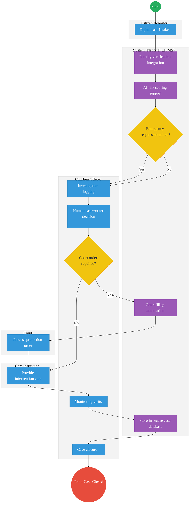

# STATE DEPARTMENT FOR CHILDREN SERVICES – Service Delivery

## Cover Page
- **Ministry/Department/Agency (MDA):** Ministry of Gender, Culture and Children Services
- **Department:** State Department for Children Services
- **Process Name:** Child Protection Case Management
- **Document Version:** 2.1
- **Date:** 2026-03-04
- **Classification:** Official
- **Strategic Category:** Priority MDA
- **Service Model:** G2C
- **Life-Cycle Group:** Cradle to Death (2. Childhood & Education)

---

## Service Mandate
The State Department for Children Services is mandated to safeguard the rights and promote the welfare of all children in Kenya. Drawing its authority from the Constitution of Kenya and the Children Act 2022, the department provides leadership in child protection and the implementation of family and child welfare policies.

**Official Website:** [https://www.childrenservices.go.ke](https://www.childrenservices.go.ke)

**Key Functions:**
- **Child Protection:** Preventing and responding to violence, exploitation, and abuse, including harmful cultural practices and child labor.
- **Social Support Programs:** Administering Cash Transfer for Orphans and Vulnerable Children (CT-OVC), Presidential Secondary School Bursary (PSSB), and Nutrition Improvement through Cash and Health Education (NICHE).
- **Case Management:** Operating the Child Protection Information Management System (CPIMS) to track and manage child welfare cases nationwide.
- **Alternative Care:** Overseeing adoption, foster care, and the regulation of Charitable Children’s Institutions (CCIs).
- **Counter-Trafficking:** Implementing the Counter-Trafficking in Persons Act to protect children from trafficking.

---

## Executive Summary
The State Department for Children Services, under the Ministry of Gender, Culture and Children Services (created 16th April 2025 following the reorganization of the Government structure per Executive Order No. 1 of 2025), is mandated to safeguard the rights and promote the welfare of all children in Kenya. The department operates through eight divisions providing child protection, cash transfer programmes for vulnerable children, educational support, the Child Helpline (116), counter-trafficking efforts, and the Child Protection Information Management System (CPIMS). The current case management process is heavily paper-based, leading to delays in interventions, difficulty in tracking child history across regions, and risks of data loss. The transition to the Kenya DSAP Architecture aims to implement a secure, digital CPIMS integrated with the national identity ecosystem.

---

## 1. AS-IS Process Flowchart (BPMN 2.0)
*Current State visualization (End-to-End Child Protection based on Deep Dive).*

```mermaid
%%{init: { 'theme': 'base', 'themeVariables': { 'fontSize': '24px', 'fontFamily': 'Inter, system-ui, sans-serif', 'primaryColor': '#ffffff', 'edgeLabelBackground':'#ffffff', 'tertiaryColor': '#f3f3f3', 'mainBkg': '#ffffff', 'nodeBorder': '#333333' } } }%%
flowchart TD
    %% Events
    Start((Start))
    EndProcess(("End - Case Closed"))

    subgraph CaseIntake["Intake & Assessment"]
        direction TB
        Report["Case reporting"]
        Reg["Case registration"]
        AssignID["Case ID assignment"]
        IntakeAss["Intake assessment"]
        RiskAss["Risk assessment"]
        RiskGateway{"Immediate danger?"}
    end

    subgraph Investigation["Investigation Phase"]
        direction TB
        Investigate[Investigation]
        EmergRem["Emergency removal/placement"]
    end

    subgraph CasePlanning["Case Planning"]
        direction TB
        RevMeet["Case review meeting"]
        CarePlan["Care plan development"]
        CourtGateway{"Court intervention required?"}
        CourtRef["Refer to Court"]
    end

    subgraph Implementation["Intervention & Monitoring"]
        direction TB
        Intervene["Intervention execution"]
        Monitor["Monitoring visits"]
        MetGateway{"Objectives achieved?"}
    end

    subgraph Closure["Case Closure"]
        direction TB
        CloseProc["Case closure procedures"]
    end

    %% Flow connections
    Start --> Report
    Report --> Reg
    Reg --> AssignID
    AssignID --> IntakeAss
    IntakeAss --> RiskAss
    RiskAss --> RiskGateway
    
    RiskGateway -- "Yes" --> EmergRem
    EmergRem --> Investigate
    RiskGateway -- "No" --> Investigate
    
    Investigate --> RevMeet
    RevMeet --> CarePlan
    CarePlan --> CourtGateway
    
    CourtGateway -- "Yes" --> CourtRef
    CourtRef --> Intervene
    CourtGateway -- "No" --> Intervene
    
    Intervene --> Monitor
    Monitor --> MetGateway
    
    MetGateway -- "No" --> CarePlan
    MetGateway -- "Yes" --> CloseProc
    
    CloseProc --> EndProcess

    %% Styling
    classDef startEvent fill:#27ae60,stroke:#27ae60,color:#fff,font-size:24px,font-size:24px;;
    classDef endEvent fill:#e74c3c,stroke:#e74c3c,color:#fff,font-size:24px,font-size:24px;;
    classDef userTask fill:#3498db,stroke:#2980b9,color:#fff,font-size:24px,font-size:24px;;
    classDef gateway fill:#f1c40f,stroke:#f39c12,color:#333,font-size:24px,font-size:24px;;
    
    class Start startEvent;
    class EndProcess endEvent;
    class RiskGateway,CourtGateway,MetGateway gateway;
    class Report,Reg,AssignID,IntakeAss,RiskAss,Investigate,EmergRem,RevMeet,CarePlan,CourtRef,Intervene,Monitor,CloseProc userTask;
```

---

## Process Overview
### Process Name
End-to-End Child Protection Case Management (Reporting to Closure)

### Service Category
- G2C (Government to Citizen)

### Scope
- **In Scope:** Case intake, emergency interventions, social investigations, care planning, and court referrals.
- **Out of Scope:** Long-term foster care administration (beyond initial placement).

### Triggers
- A report of a child in need of care and protection (abuse, neglect, abandonment).

### End States
- **Successful:** Child's safety ensured; Case successfully closed or transitioned to long-term care.

### Policy Context
- The Children Act 2022; The Constitution of Kenya 2010; Data Protection Act 2019.

---

## Detailed Process (AS-IS)

| Step | Role | Action | Tool/System | Notes |
|---|---|---|---|---|
| 1 | Reporter / Children Officer | A report is made regarding a child at risk. The Children Officer performs manual case registration and assigns a reference ID. | Paper Ledger | |
| 2 | Children Officer | Conducts an intake and initial risk assessment to determine the immediate danger level to the child. | Manual Forms | |
| 3 | Children Officer | Carries out a detailed investigation, including home visits, witness interviews, and evidence gathering. | Physical Visits | |
| 4 | Case Review Committee | Holds case review meetings to assess the investigation findings and develop a formal care plan. | Physical Meetings | |
| 5 | Children Officer / Court | Executes the care plan. If necessary, processes court referrals for formal protection orders. | Manual / Judicial | |
| 6 | Children Officer / Care Institutions | Places the child in an appropriate care institution or with family, executing the planned interventions. | Care Homes | |
| 7 | Children Officer | Conducts periodic monitoring visits to ensure the child's safety and well-being are maintained. | Physical Visits | |
| 8 | Children Officer | Initiates case closure procedures once the care plan objectives have been met and the child is deemed safe. | Manual Forms | |

---

## Pain Points & Opportunities
### Pain Points
- **Siloed Paper Records:** If a child moves from Nairobi to Mombasa, their protection history is lost because the files are physical.
- **Delayed Response:** Manual routing of emergency cases through physical committees takes too long.
- **Data Security:** Sensitive case files are stored in physical cabinets, posing a risk to the child's privacy.

### Opportunities
- **National CPIMS:** A unified digital platform for tracking every child protection case across Kenya.
- **Biometric Identity (Maisha Namba):** Linking every case to a child's UPI to ensure continuity of care regardless of location.
- **Digital Court Integration:** Direct API link to the Judiciary's Case Management System for filing protection orders.

---

## 2. TO-BE Process Flowchart (BPMN 2.0)
*Future State visualization (Kenya DSAP Architecture - Digital CPIMS).*

## Future State Process (TO-BE)
### Narrative
**TO-BE Process: Data-Driven Child Protection**

The To-Be process envisions a fully integrated **National Child Protection Information Management System (CPIMS)** that leverages digital ecosystems to ensure rapid, secure, and coordinated responses to child welfare cases.

**Core Components:**
- **National CPIMS Platform:** The central digital hub replacing physical ledgers, accessible nationwide by authorized officers.
- **Secure Case Databases:** Replaces physical files with encrypted digital records, utilizing role-based access controls and comprehensive audit logs.
- **AI Risk Scoring:** Analyzes intake data to provide a risk score, supporting—but never replacing—the human caseworker's decision-making process.
- **Identity Verification Integration:** Connects with the national identity registry (IPRS/Maisha Namba) to accurately identify children and guardians.
- **Judiciary Integration:** Seamlessly interfaces with the Judiciary Case Management System for rapid, digital filing of protection orders.
- **Health System Integration:** Links to national health registries (e.g., SHA) to verify medical histories and coverage for the child.

### Optimized Steps (Digital)

| Step | Actor | Action | System |
|---|---|---|---|
| 1 | Citizen Reporter | Reports a case via a digital portal or mobile app, initiating the digital case intake process. | CPIMS Portal |
| 2 | System (CPIMS) | Performs automatic identity verification of the child and parents against national identity databases. | CPIMS / X-Road (IPRS) |
| 3 | System (CPIMS) | Runs an AI risk scoring algorithm to highlight potential emergency scenarios for the caseworker. | CPIMS Risk Engine |
| 4 | Children Officer | Uses the risk score to make an informed human decision, conducting and logging the investigation digitally. | CPIMS App |
| 5 | Children Officer / System | If a court order is required, the system automates court filing directly to the judicial platform. | CPIMS / Judiciary API |
| 6 | Care Institution | Receives the digital care plan and provides necessary interventions, updating the system. | CPIMS Portal |
| 7 | Children Officer | Logs continuous monitoring visits into the secure digital case file. | CPIMS App |
| 8 | Children Officer | Finalizes the intervention and executes digital case closure, archiving the record securely. | CPIMS |

---

## References
- https://www.childrenservices.go.ke
- Children Act 2022
- Desk Review

---

### Validation Survey
Please provide your feedback here: [https://ee.kobotoolbox.org/x/4Ls7SlCG](https://ee.kobotoolbox.org/x/4Ls7SlCG)
