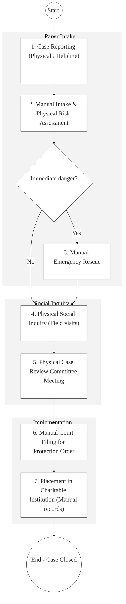
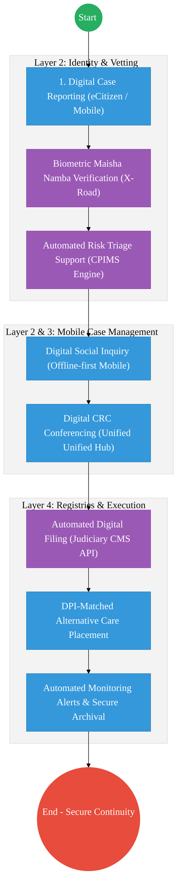

# STATE DEPARTMENT FOR CHILDREN SERVICES – Business Process Architecture (Updated)

## Cover Page
- **Ministry:** Ministry of Labour and Social Protection
- **State Department:** State Department for Children Services
- **Primary Authority:** Directorate of Children Services (DCS)
- **Document Type:** Business Process Architecture (BPA) Standardised
- **Document Version:** 4.1
- **Date:** 2026-03-25
- **Classification:** Official / Sensitive
- **Strategic Category:** Priority MDA - National Registry (Tier 1)
- **Service Model:** G2C (Social Protection)
- **Reviewer:** Senior Government Enterprise Architect

---

## SECTION 0: SERVICE PRIORITISATION MAPPING
- **Mapped Priority Service:** Child Protection Case Management (CPIMS)
- **Tier Classification:** Tier 1
- **Strategic Category:** Social / Protection (Vulnerable Children)
- **Breakout Room Classification:** Room 1 (High Impact & Large Registries)
- **Lead MDA (Standardised Name):** State Department for Children Services
- **Related Cross-Cutting Services:**
    - National CPIMS (Unified Case Registry)
    - Identity Layer (IPRS / Maisha Namba)
    - X-Road (Judiciary CMS / MOH / MOE Interop)
    - National EDRMS (Historical Protection Files)
    - Government Payment Aggregator (GPA / CT-OVC)

---

## SECTION 0.1: PRIORITISATION JUSTIFICATION
This service is prioritised because the TO-BE design transforms child protection from fragmented, regional paper silos into a "National Continuity of Care" model. By integrating the Child Protection Information Management System (CPIMS) with Maisha Namba (Identity) and the Judiciary (Court Orders) via X-Road, the design ensures that a child's safety and intervention history is instantly retrievable across all 47 counties. This transformation eliminates deadly delays in emergency rescues, prevents the loss of sensitive records during child relocation, and automates compliance tracking for over 100,000 cases of orphans and vulnerable children (OVC), ensuring no child falls through the gaps of the national safety net.

| Criteria | Evidence from TO-BE Design |
| :--- | :--- |
| **Demand / Volume** | Over 100,000 active cases; thousands of emergency reports via Helpline 116. |
| **National Priority Alignment** | Children Act 2022; Constitution of Kenya (Rights of the Child); Vision 2030 Social Pillar. |
| **Data Reusability** | Case history is vital for social health (SHA) and education (NEMIS) services. |
| **Interoperability** | Real-time digital filing of care orders to Judiciary CMS and health alerts to MoH. |
| **Revenue / Efficiency Impact** | Automated CT-OVC payment reconciliation; removes duplicate field assessments. |
| **Governance / Risk Reduction** | Secure digital dossiers prevent unauthorized access to sensitive child records. |
| **Inclusivity** | Mobile-first access for sub-county officers ensures rural coverage via offline-sync. |
| **Readiness** | High; CPIMS core is operational and undergoing DPI-enhancement. |

> [!NOTE]
> “The TO-BE design transforms child protection from fragmented, regional paper silos into a 'National Continuity of Care' model. By integrating the Child Protection Information Management System (CPIMS) with Maisha Namba (Identity) and the Judiciary (Court Orders) via X-Road, the design ensures that a child's safety and intervention history is instantly retrievable across all 47 counties. This eliminates delays in emergency rescues, prevents the loss of sensitive records during relocation, and automates tracking for 100,000+ vulnerable children.”

---

# SECTION 1: SERVICE DEFINITION (STANDARDISED)

The State Department for Children Services is mandated to safeguard the rights and promote the welfare of all children in Kenya, anchored in the **Children Act 2022**. 

In this refactored BPA, the primary focus is the **Statutory Child Protection Case Management** lifecycle. The objective is to move from siloed paper "Inquiry Files" to a **DPI-Enabled CPIMS** where every child protection milestone—from risk reporting to court-ordered placement—is captured in a secure, interoperable national registry.

---

# SECTION 2: SERVICE CATALOGUE (NORMALISED)

| Category | Service Name | Description |
| :--- | :--- | :--- |
| **Core Services** | **Child Protection Intake** | Multi-channel reporting (116 helpline / Portals) and risk assessment. |
| | **Social Inquiry Mgmt** | Detailed digital logging of field investigations and family history. |
| **Extended Services** | **Court Care Orders** | Digital filing and execution of statutory protection orders (Judiciary Link). |
| | **Alternative Care Placement**| Managed placement of children in foster care, kinship, or CCIs. |
| **Special Case Services**| **CT-OVC Disbursement**| Automated cash transfers for orphans and vulnerable children via GPA. |
| | **Counter-Trafficking Alerts**| Real-time alerts for border control on children at risk of trafficking. |

---

# SECTION 3: AS-IS PROCESS FLOWS (MANUAL/HYBRID)

The current case management process is heavily paper-based, leading to delays in interventions and difficulty in tracking child history across regions.

### 3.1 AS-IS Visualization

### 3.2 Operational Reality
- **Actors:** Children Officer, Police, Case Review Committee, Care Institution.
- **Systems:** CPIMS (Partial), Paper Registers, Physical Inquiry Files, Mail/Courier.
- **Pain Points:** Record loss when children move between counties; 14-day delay in convening physical CRCs for emergency cases; sensitive child and foster parent data held in physical cabinets; no real-time sync with school or health systems.

---

# SECTION 4: TO-BE PROCESS INTERPRETATION (NEW LAYER)

### 4.1 TO-BE Process (DPI-Enabled Continuity)

### 4.2 Key Capabilities Introduced
*   **Automation:** Automated digital filing of "Care and Protection Orders" directly to the Judiciary CMS.
*   **Integration:** Hub-and-spoke integration with the Ministry of Education (NEMIS) and Health (MOH) via X-Road for a 360-degree view of the child.
*   **Real-time Processing:** Automated monitoring triggers – system alerts the officer if a scheduled follow-up visit for a foster child is overdue.
*   **Digital Identity Validation:** Child identity and guardian history verified via **Maisha Namba** biometric federation to prevent identity duplication.
*   **Workflow Orchestration:** Orchestrates the transition from anonymous risk reporting to secure social inquiry and legal archival.

### 4.3 Transformation Summary
| Dimension | AS-IS | TO-BE |
| :--- | :--- | :--- |
| **Processing** | Manual / Regional Silos | Digital / National CPIMS |
| **Verification** | Physical Identification | API-based (Maisha Namba / IPRS) |
| **Records** | Paper Inquiry Files | Secure Digital Dossier (EDRMS) |
| **Tracking** | Ad-hoc monitoring visits | Alert-driven Statutory Follow-up |

---

# SECTION 5: SYSTEM LANDSCAPE (ALIGN TO GEA)

| Layer | System / Platform | Role |
| :--- | :--- | :--- |
| **Identity Layer** | Maisha Namba (IPRS) | Unique identification for child and guardians. |
| **Interoperability** | KeSEL (X-Road) | Data bridge to Judiciary, Schools, and Health. |
| **shared Services** | National EDRMS | Legal digital archive for sensitive protection orders. |
| **Workflow / BPM** | CPIMS Case Engine | Orchestrates intake, inquiry, and CRC flows. |
| **Payment Layer** | GPA (Finance Aggregator) | Secure disbursement of CT-OVC welfare funds. |
| **Trust Hub** | Consent Manager | Guardian control over shared case-sensitive data. |

---

# SECTION 6: TRANSFORMATION VALUE (CRITICAL ADDITION)

| Value Type | Explanation |
| :--- | :--- |
| **Efficiency Gain** | Emergency rescue coordination reduced from days to minutes via digital triaging. |
| **Economic Impact** | Prevents leakage in cash transfers (CT-OVC) through biometric verification. |
| **Governance Impact** | Full traceability of every intervention; 100% compliance with statutory timelines. |
| **Citizen Experience** | Compassionate, data-driven support for vulnerable families without repeated assessments. |
| **Interoperability Value** | Shared data with Schools ensures zero dropout for children in the protection system. |

---

# SECTION 7: ALIGNMENT TO WHOLE-OF-GOVERNMENT ARCHITECTURE
- **Shared Platforms:** Uses eCitizen for secure case tracking and GPA for welfare payments.
- **Registry Reuse:** Reuses NEMIS status for children in school to avoid duplicate educational vetting.
- **Compliance with GEA / GIF:** Standardizing child protection metadata for inclusion in the National Social Registry.

---

# SECTION 8: IMPLEMENTATION READINESS (NEW)
*   **Data Readiness:** High; CPIMS is established and has a mature data schema.
*   **Legal Readiness:** High; Children Act 2022 mandates a comprehensive digital management system.
*   **Institutional Readiness:** High; DCS has established sub-county offices across all 47 counties.
*   **Technical Readiness:** High; HUDUMA Bridge connectivity to the Judiciary is already in POC stage.

---

# SECTION 9: TRACEABILITY MATRIX (NEW)

| BPA Process | Priority Service | Tier | TO-BE Capability | National Impact |
| :--- | :--- | :--- | :--- | :--- |
| **Risk Reporting** | Intake | T1 | eCitizen Multi-channel | Rapid Response to Child Abuse |
| **Investigation** | Social Inquiry | T1 | Mobile Offline Case Tools | Data-driven Social Justice |
| **Statutory Order**| Court Processes | T1 | X-Road: Judiciary API | Legal Protection Integrity |
| **Monitoring** | Follow-up | T1 | Automated Alert Engine | Long-term Child Well-being |

---
**[End of Standardised Business Process Architecture]**
