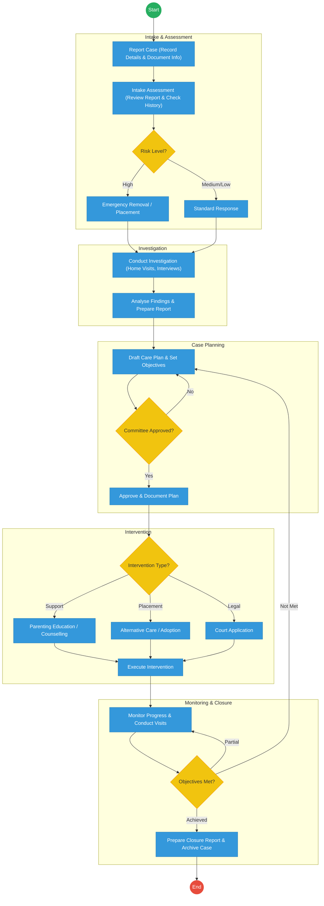
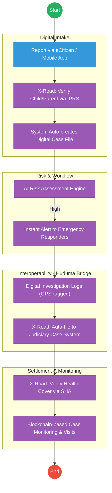

# STATE DEPARTMENT FOR CHILDREN SERVICES – Service Delivery

## Cover Page
- **Ministry/Department/Agency (MDA):** Ministry of Labour and Social Protection
- **Department:** State Department for Children Services
- **Process Name:** Child Protection Case Management
- **Document Version:** 2.1
- **Date:** 2026-02-24
- **Classification:** Official

---

## Executive Summary
The State Department for Children Services is responsible for the protection and well-being of children in Kenya. The current case management process is entirely paper-based, leading to delays in interventions, difficulty in tracking child history across regions, and risks of data loss. The transition to the Kenya DSAP Architecture aims to implement a secure, digital Child Protection Information Management System (CPIMS) integrated with the national identity ecosystem.

---

## 1. AS-IS Process Flowchart (BPMN 2.0)
*Current State visualization (End-to-End Child Protection based on Deep Dive).*

---

## Process Overview
### Process Name
End-to-End Child Protection Case Management (Reporting to Closure)

### Service Category
- G2C (Government to Citizen)

### Scope
- **In Scope:** Case intake, emergency interventions, social investigations, care planning, and court referrals.
- **Out of Scope:** Long-term foster care administration (beyond initial placement).

### Triggers
- A report of a child in need of care and protection (abuse, neglect, abandonment).

### End States
- **Successful:** Child's safety ensured; Case successfully closed or transitioned to long-term care.

### Policy Context
- The Children Act 2022; The Constitution of Kenya 2010; Data Protection Act 2019.

---

## Detailed Process (AS-IS)
| Step | Role | Action | Tool/System | Notes |
|---|---|---|---|---|
| 1 | Children Officer | Records case details from the reporting party and manually assigns a case reference. | Paper Ledger | |
| 2 | Children Officer | Conducts an intake assessment to determine risk level (High/Medium/Low). | Manual | |
| 3 | Children Officer | Conducts site visits, home visits, and interviews with parents and child to gather evidence. | Physical Visits | |
| 4 | Case Committee | Reviews the investigation findings and care plan for approval. | Physical Meeting | |
| 5 | Children Officer | Executes the intervention (e.g., placing child in a Charitable Children's Institution or filing in court). | Manual | |

---

## Pain Points & Opportunities
### Pain Points
- **Siloed Paper Records:** If a child moves from Nairobi to Mombasa, their protection history is lost because the files are physical.
- **Delayed Response:** Manual routing of emergency cases through physical committees takes too long.
- **Data Security:** Sensitive case files are stored in physical cabinets, posing a risk to the child's privacy.

### Opportunities
- **National CPIMS:** A unified digital platform for tracking every child protection case across Kenya.
- **Biometric Identity (Maisha Namba):** Linking every case to a child's UPI to ensure continuity of care regardless of location.
- **Digital Court Integration:** Direct API link to the Judiciary's Case Management System for filing protection orders.

---

## 2. TO-BE Process Flowchart (BPMN 2.0)
*Future State visualization (Kenya DSAP Architecture - Huduma Bridge).*

## Future State Process (TO-BE)
### Narrative
**TO-BE Process: Data-Driven Child Protection**

**Design Principles:**
- **Zero-Latency Reporting:** Citizens can report cases via a dedicated app or eCitizen, which instantly creates a digital file.
- **Unified Identity:** Every child is tracked via their **Maisha Namba**, allowing for a complete longitudinal record of their well-being.
- **Cross-Agency Collaboration:** The **Huduma Bridge** enables real-time data sharing between Children Services, the Judiciary (for court orders), and Health (for medical reports), ensuring a holistic response.

### Optimized Steps (Digital)
| Step | Actor | Action | System |
|---|---|---|---|
| 1 | Citizen | Reports a case via the mobile app, providing GPS coordinates for the location of the incident. | CPIMS App |
| 2 | System | Instantly pings IPRS/NRB via X-Road to identify the child and legal guardians. | KeSEL / X-Road |
| 3 | System | AI-based risk engine analyzes the report and triggers an "Emergency Alert" to the nearest available Children Officer. | Workflow Engine |
| 4 | Children Officer | Conducts a digital investigation, uploading GPS-tagged photos and voice-recorded interviews. | CPIMS App |
| 5 | System | Automatically files the necessary legal petitions in the Judiciary CMS via a secure API. | Huduma Bridge / Judiciary API |

---

## References
- The Children Act 2022.
- Huduma Bridge DSAP Architecture.