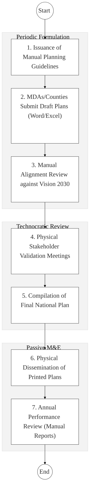
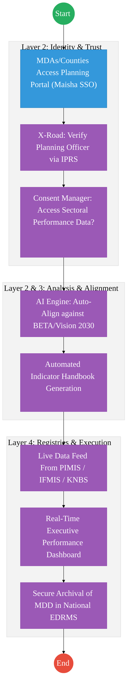

# STATE DEPARTMENT FOR ECONOMIC PLANNING (SDEP) – Business Process Architecture (Updated)

## Cover Page
- **Ministry:** Ministry of National Treasury and Economic Planning
- **State Department:** State Department for Economic Planning (SDEP)
- **Primary Authority:** National Planning Office / Monitoring & Evaluation Directorate
- **Document Type:** Business Process Architecture (BPA) Standardised
- **Document Version:** 4.1
- **Date:** 2026-03-25
- **Classification:** Official
- **Strategic Category:** Priority MDA
- **Service Model:** G2G / G2C
- **Reviewer:** Senior Government Enterprise Architect

---

## SECTION 0: SERVICE PRIORITISATION MAPPING
- **Mapped Priority Service:** National Development Planning and Monitoring & Evaluation (NIMES)
- **Tier Classification:** Tier 2
- **Strategic Category:** Economy / Governance (National Performance Registry)
- **Breakout Room Classification:** Room 3 (Policy, Economy & Foundational Systems)
- **Lead MDA (Standardised Name):** State Department for Economic Planning
- **Related Cross-Cutting Services:**
    - NIMES (National Performance Registry)
    - Identity Layer (IPRS / Maisha Namba)
    - PIMIS (Projects) / IFMIS (Finance) Integration
    - National EDRMS (Policy & Plan Archival)
    - Huduma Box (Public Progress Dashboard)

---

## SECTION 0.1: PRIORITISATION JUSTIFICATION
This service is prioritised because the TO-BE design transforms national planning from a periodic, manual document-creation exercise into a dynamic, "Performance-Driven Lifecycle." By integrating the National Integrated Monitoring and Evaluation System (NIMES) with PIMIS (Projects), IFMIS (Finance), and KNBS (Statistics) via X-Road, the design provides the Cabinet with an automated "Executive Performance Dashboard." This ensures that national priorities (Vision 2030/BETA) are tracked in real-time, significantly improving public resource allocation and accountability.

| Criteria | Evidence from TO-BE Design |
| :--- | :--- |
| **Demand / Volume** | Continuous reporting from all MDAs, 47 Counties, and 100+ Municipalities. |
| **National Priority Alignment** | Constitution of Kenya (Planning & Participation); Vision 2030 (Macro Pillar). |
| **Data Reusability** | National KPIs and planning targets are consumed by Treasury, Parliament, and Investors. |
| **Interoperability** | Deep data pipelines from IFMIS (Budget) and PIMIS (Physical Projects) via X-Road. |
| **Revenue / Efficiency Impact** | Reduces development of "Ghost Projects"; optimizes ROI on national investments. |
| **Governance / Risk Reduction** | Real-time tracking of project milestones prevents funds diversion and delays. |
| **Inclusivity** | "Interactive Feedback" via Huduma Box allows citizens to flag local project statuses. |
| **Readiness** | High; Core NIMES framework exists; PIMIS integration is already underway. |

> [!NOTE]
> “The TO-BE design transforms national planning from a static document-creation exercise to a 'Performance-Driven Lifecycle.' By integrating NIMES with PIMIS (Projects), IFMIS (Finance), and KNBS (Statistics) via X-Road, the design provides the Cabinet with a real-time 'Executive Performance Dashboard,' ensuring every shilling of public investment is tracked against national strategic outcomes.”

---

# SECTION 1: SERVICE DEFINITION (STANDARDISED)

The State Department for Economic Planning (SDEP) is responsible for the formulation and monitoring of national development policies and strategic plans. 

In this refactored BPA, national planning is transformed into a **dynamic, performance-driven lifecycle**. The department is the custodian of the **National Integrated Monitoring and Evaluation System (NIMES)**, which coordinates reporting across National MDAs, County Governments, and the newly integrated Cities & Municipalities layer.

---

# SECTION 2: SERVICE CATALOGUE (NORMALISED)

| Category | Service Name | Description |
| :--- | :--- | :--- |
| **Core Services** | **National Strategic Planning** | Formulation and alignment of MTPs and sectoral plans against Vision 2030. |
| | **Monitoring & Evaluation (M&E)** | Real-time tracking of national KPIs via NIMES and Executive Dashboards. |
| **Extended Services** | **County/City Plan Alignment** | Vetting of CIDPs and Municipal plans to ensure Whole-of-Government cohesion. |
| | **Indicator Handbook Management** | Maintenance of the national repository of KPIs, targets, and methodologies. |
| **Special Case Services**| **Public Performance Reporting** | Dissemination of progress data via Huduma Box and open governance portals. |
| | **Project Status Flagging** | Handling of bottom-up citizen feedback on local project milestones. |

---

# SECTION 3: AS-IS PROCESS FLOWS (MANUAL/PERIODIC)

The current state is characterized by periodic document-creation exercises (MTPs) with limited real-time performance tracking and manual data submission silos.

### 3.1 AS-IS Visualization

### 3.2 Operational Reality
- **Actors:** SDEP Planning Officers, MDAs, County Planning Teams, Stakeholders.
- **Systems:** Manual Word/Excel templates, Paper reports, Email.
- **Pain Points:** 12-month lag in performance data; manual alignment reviews are error-prone; lack of direct link to financial (IFMIS) or project (PIMIS) data; physical dissemination is costly and slow.

---

# SECTION 4: TO-BE PROCESS INTERPRETATION (NEW LAYER)

### 4.1 TO-BE Process (Performance-Driven Journey)

### 4.2 Key Capabilities Introduced
*   **Automation:** AI-assisted alignment check of sector plans against national BETA/Vision 2030 priorities.
*   **Integration:** Direct "API Hydration" of performance dashboards from PIMIS (Physical Progress) and IFMIS (Financial Progress).
*   **Real-time Processing:** Automated generation of the **Indicator Handbook** (KPIs/Targets) upon plan approval.
*   **Digital Identity Validation:** Planning officers and PSs verified via **Maisha Namba** identity federation.
*   **Workflow Orchestration:** Coordinated cycle from guideline issuance to annual progress reporting (APR).

### 4.3 Transformation Summary
| Dimension | AS-IS | TO-BE |
| :--- | :--- | :--- |
| **Processing** | Manual / Periodic | Digital / Continuous |
| **Verification** | Manual Word Reviews | AI Alignment Engine |
| **Records** | Scattered Word/PDFs | Unified NIMES Registry |
| **Tracking** | Post-event manual entry | Real-time PIMIS/IFMIS Sync |

---

# SECTION 5: SYSTEM LANDSCAPE (ALIGN TO GEA)

| Layer | System / Platform | Role |
| :--- | :--- | :--- |
| **Identity Layer** | Maisha Namba (IPRS) | Identity for all Government planning officers. |
| **Interoperability** | KeSEL (X-Road) | Data bridge to PIMIS, IFMIS, and KNBS. |
| **shared Services** | National EDRMS | Legal digital archive for approved strategic plans. |
| **Workflow / BPM** | Planning Engine | Orchestrates the periodic and annual cycles. |
| **Payment Layer** | GPA (Finance Aggregator) | Disbursement of funds for participation and research. |
| **Trust Hub** | Consent Manager | Secure access to cross-sectoral performance data. |

---

# SECTION 6: TRANSFORMATION VALUE (CRITICAL ADDITION)

| Value Type | Explanation |
| :--- | :--- |
| **Efficiency Gain** | Plan alignment review time reduced from months to days via AI engine. |
| **Economic Impact** | Evidence-based budgeting ensures high-impact sectors receive priority funding. |
| **Governance Impact** | Cabinet-level visibility on project delays ensures accountability at the PS level. |
| **Citizen Experience** | Public progress cards via Huduma Box show value for tax-money in real-time. |
| **Interoperability Value** | Unified urban-to-national data pipeline (City -> County -> National). |

---

# SECTION 7: ALIGNMENT TO WHOLE-OF-GOVERNMENT ARCHITECTURE
- **Shared Platforms:** Uses Huduma Box for public dissemination and eCitizen for official reporting access.
- **Registry Reuse:** Feeds NIMES data back into the national budget systems for performance-based financing.
- **Compliance with GEA / GIF:** Standardizing national performance indicators (KPIs) for multi-MDA data reuse.

---

# SECTION 8: IMPLEMENTATION READINESS (NEW)
*   **Data Readiness:** High; Core indicators are captured in NIMES; legacy project data being migrated to PIMIS.
*   **Legal Readiness:** High; Constitution and PFM Act mandate participatory and performance-based planning.
*   **Institutional Readiness:** Medium; Requires mandatory upskilling for executive leadership on dashboard usage.
*   **Technical Readiness:** High; X-Road nodes are operational across The National Treasury and SDEP.

---

# SECTION 9: TRACEABILITY MATRIX (NEW)

| BPA Process | Priority Service | Tier | TO-BE Capability | National Impact |
| :--- | :--- | :--- | :--- | :--- |
| **Plan Formulation** | Strategic Planning | T2 | AI Alignment Engine | Policy Consistency & Cohesion |
| **KPI Tracking** | M&E (NIMES) | T2 | Real-time PIMIS Sync | Project Implementation Speed |
| **Participation** | Stakeholder Review | T2 | Huduma Box Feedback | Public Trust & Transparency |
| **Executive Reporting**| Dashboard Mgmt | T2 | Executive Dashboard | Accurate Resource Allocation |

---
**[End of Standardised Business Process Architecture]**
