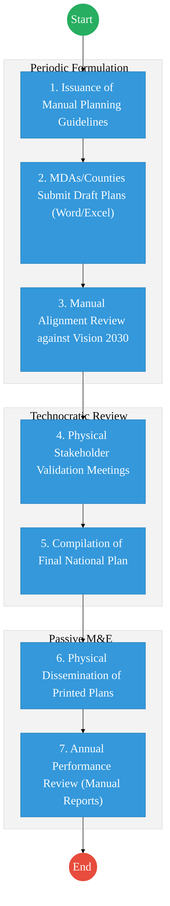
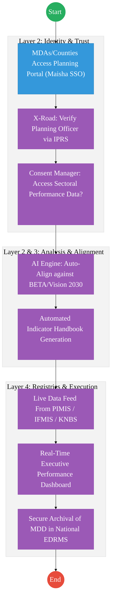

# PART 1: EXECUTIVE SUMMARY

The refined process for the State Department for Economic Planning (SDEP) transforms national planning from a periodic document-creation exercise into a **dynamic, performance-driven lifecycle**. Key improvements include:

- **Institutional Expansion:** Inclusion of **Cities and Municipalities** as distinct reporting and planning actors.
- **Performance Centricity:** Integration of a mandatory **Indicator Handbook** (KPIs, Targets, Methodology) into the plan dissemination phase.
- **DPI Interoperability:** Deep integration with **PIMIS (Projects)**, **IFMIS (Finance)**, and **KNBS (Statistics)** to enable evidence-based planning and real-time Monitoring & Evaluation (M&E).
- **Citizen Accountability:** Utilizing **Huduma Box/eCitizen** for public transparency of strategic outcomes and KPI progress.
- **Operational Realism:** A phased rollout strategy that transitions from current manual/hybrid states to a fully integrated digital planning ecosystem.

---

# PART 2: AS-IS PROCESS (CURRENT REALITY)

The current state of national planning is characterized by periodic document-creation exercises with limited real-time performance tracking.

---

# PART 3: TO-BE PROCESS (DPI-ENABLED)

The TO-BE process transforms planning into a dynamic, performance-driven lifecycle.

---

# PART 4: UPDATED ACTOR MODEL

The planning ecosystem identifies five primary layers of actors:

- **National Planning (SDEP):** Custodian of the planning framework and the **National Integrated Monitoring and Evaluation System (NIMES)**.
- **Line MDAs:** Sectoral planning and execution authorities.
- **County Governments:** Formulation and reporting of County Integrated Development Plans (CIDPs).
- **Cities & Municipalities:** Localized planning entities required to align with County and National frameworks and submit urban-specific performance data.
- **Citizenry:** Active participants in the planning phase and consumers of progress data via open governance portals.

---

# PART 3: REFINED PROCESS FLOW (TO-BE)

| Step | Actor | Action | System / Tool | Output |
| :--- | :--- | :--- | :--- | :--- |
| **1** | SDEP | **Guideline Formulation:** Issuance of strategic focus and data templates. | Planning Portal | Smart Planning Templates |
| **2** | MDAs/Counties/Cities | **Participatory Planning:** Citizen engagement and sector plan drafting. | Digital Participation Hub | Draft Sector/City Plans |
| **3** | SDEP / AI Engine | **Alignment & Verification:** Automated check against Vision 2030 and BETA. | Alignment Engine | Verified Drafts |
| **4** | SDEP / Public | **Validation:** Stakeholder review and final technical sign-off. | Planning Portal | Approved National Plan |
| **5** | SDEP | **Dissemination:** Publication of Plan **WITH Indicator Handbook**. | Huduma Box / GPA | **Indicator Handbook (KPIs/Targets)** |
| **6** | MDAs / Entities | **Monitoring & Data Submission:** Periodic updates on KPI progress. | NIMES / PIMIS | Progress Reports |
| **7** | SDEP | **Performance Reporting:** Aggregation of monitoring data for Cabinet. | Executive Dashboard | Annual Progress Report (APR) |

---

# PART 4: ARCHITECTURE ALIGNMENT (KENYA HUDUMA BRIDGE)

The National Planning and M&E Lifecycle is engineered to operate across the four layers of the **Kenya DSAP Architecture**:

### Layer 1: Access Channels
- **eCitizen / Planning Portal:** The primary window for MDAs, Counties, and Cities to submit plans and M&E data.
- **Executive Dashboard:** A specialized interface for the Cabinet and PSs to monitor national KPI progress in real-time.
- **Huduma Box / Citizen Hub:** For public access to the **Indicator Handbook** and project status updates.

### Layer 2: Core Platform
- **Workflow Engine (BPMN 2.0):** Orchestrates the planning cycle (Guideline Issuance → Submission → Alignment Check → Validation → Dissemination).
- **Trust Hub:**
  - **Consent Manager:** Consulted before aggregating sector-specific data (e.g., from Health or Education registries) for national performance analysis.
  - **Identity Federation:** Verified access via **Maisha Namba (IPRS)** for all planning officers and executives.
  - **NPKI:** Digitally signing **National Development Plans** and **Performance Contracts** to ensure authenticity and legal standing.
- **Shared Services:**
  - **Document Generator:** Automated creation of the **Indicator Handbook** and annual progress reports.
  - **Notifications:** SMS/Email alerts for reporting deadlines and performance milestones.
  - **Intelligent Document Processing (IDP):** Digitizing historical planning documents and physical project reports into the National EDRMS.

### Layer 3: Interoperability (Huduma Bridge)
- **KeSEL (X-Road):** Secure data exchange between the Planning Portal and **PIMIS (Projects)**, **IFMIS (Financials)**, and **KNBS (Statistics)**.
- **Central Service Catalogue:** Cataloguing M&E APIs to promote data-driven governance across all MDAs.

### Layer 4: Authoritative Registries & Payments
- **Registries:**
  - **NIMES (National Integrated M&E System):** The sector-specific authoritative registry for planning and performance data.
  - **National EDRMS:** The definitive legal digital archive for all signed strategic plans and policy documents.
  - **IPRS / Maisha Namba:** Foundational person registry for official accountability.
- **Payments:** **Government Payment Aggregator (GPA)** for managing research fees, public participation stipends, and performance-based incentive transfers.

---

# PART 5: CITIZEN ENGAGEMENT MODEL

- **Open Governance Portal:** Strategic plans, MTPs, and CIDPs are accessible via **eCitizen**.
- **The Huduma Box Integration:** Citizens can retrieve progress cards for MDAs and Counties, showing performance against targets in the **Indicator Handbook**.
- **Interactive Feedback:** Ability for citizens to "Flag" project statuses in their localities, providing a bottom-up feedback loop to SDEP monitoring teams.

---

# PART 6: IMPLEMENTATION MODEL (PHASED ROLLOUT)

- **Phase 1: Hybrid (12 Months):** Digital submission of Word/Excel templates via the portal; Manual validation of indicators; Focused capacity building in ICT directorates.
- **Phase 2: Partial Digitization (24 Months):** Integration with IFMIS (Finance) and PIMIS (Projects); Introduction of the Digital Participation Hub; Adoption by prioritized Cities.
- **Phase 3: Full Integration (36+ Months):** Automated data pipelines from all MDAs, Counties, and Municipalities; AI-driven predictive planning and real-time M&E dashboards for Executive leadership.

---

# PART 7: GOVERNANCE & CAPACITY

- **ICT Directorates:** Re-tasked with data integrity and system uptime; Centralization of data quality standards.
- **Executive Upskilling:** Mandatory data literacy training for PSs and CSs to enable use of the **Executive Approval Dashboards**.
- **Data Integrity Controls:** Automated audit logs and role-based access to ensure the sanctity of national development data.

---

# PART 8: CHANGE LOG

| Area | Before (Incorrect/Old) | After (Corrected) | Rationale |
| :--- | :--- | :--- | :--- |
| **Coverage** | Fragmented planning across layers. | Added Cities and Municipalities to the actor model. | Unified urban-to-national planning alignment. |
| **Performance** | Plan creation without tracking. | Embedded M&E lifecycle and Indicator Handbook. | Transition to outcome-based governance. |
| **Data Scope** | Manual data entry silos. | Integration with PIMIS, IFMIS, and KNBS. | Real-time project and financial oversight. |
| **Citizens** | Passive recipients of info. | Huduma Box integration for KPI tracking. | Increased transparency and public accountability. |
| **Realism** | Assumed full digital readiness. | Introduced 3-Phase hybrid implementation. | Higher adoption rates and lower failure risk. |

---

## References
- Constitution of Kenya (Public Participation)
- Kenya Vision 2030 / BETA Agenda
- Public Finance Management (PFM) Act
- Data Protection Act 2019

---

### Validation Survey
Please provide your feedback here: [https://ee.kobotoolbox.org/x/4Ls7SlCG](https://ee.kobotoolbox.org/x/4Ls7SlCG)
