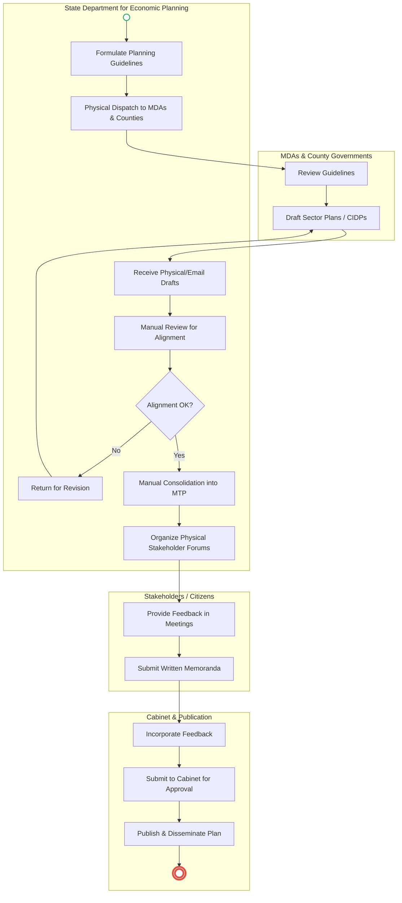
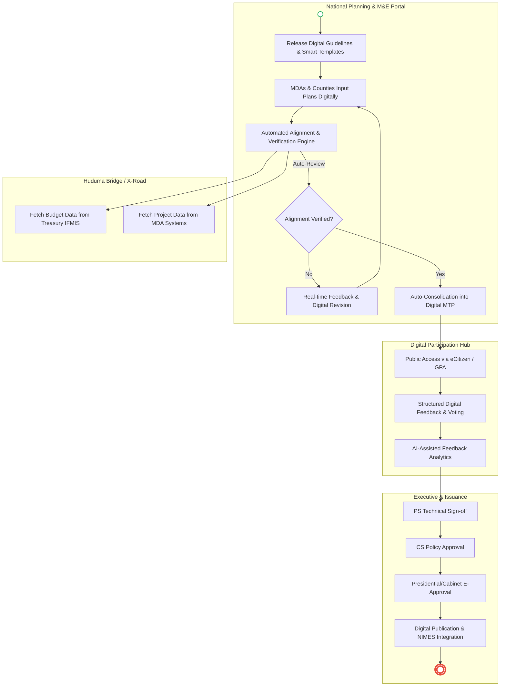

# STATE DEPARTMENT FOR ECONOMIC PLANNING – Service Delivery

## Cover Page
- **Ministry/Department/Agency (MDA):** The National Treasury and Economic Planning
- **Department:** State Department for Economic Planning (SDEP)
- **Process Name:** National Development Planning Coordination
- **Document Version:** 1.2
- **Date:** 2026-03-18
- **Classification:** Official
- **Strategic Category:** Priority MDA
- **Life-Cycle Group:** Policy, Economy & Foundational Systems
- **Breakout Room:** Room 3 (Policy, Economy & Foundational)
- **Facilitator:** Abel
- **Assistant:** Brenda

---

## Executive Summary
The State Department for Economic Planning (SDEP) is the central agency responsible for national development planning and policy coordination in Kenya. It ensures that all government actions, at both national and county levels, are evidence-based and aligned with long-term strategic goals like Kenya Vision 2030 and the Bottom-up Economic Transformation Agenda (BETA). Currently, the National Development Planning process is hindered by manual document submissions, fragmented data in silos, and slow physical validation cycles. The proposed digital transformation aims to establish a **Unified National Planning & M&E Portal**, integrating with MDAs and Counties via the **Huduma Bridge** to automate alignment checks, streamline public participation, and enable real-time tracking of development outcomes.

---

### 1.1 AS-IS Process Flow (BPMN 2.0)

---

## Process Overview
### Process Name
National Development Planning Coordination

### Service Category
- G2G (Government to Government)
- G2C (Government to Citizen)

### Scope
- **In Scope:** Formulation of planning guidelines (Vision 2030, BETA); review and alignment of Sector Plans and CIDPs; consolidation of Medium-Term Plans (MTPs); public participation and stakeholder validation.
- **Out of Scope:** Detailed project-level budgeting (handled by National Treasury); specific sector implementation.

### Triggers
- **Time-based:** Initiation of a new 5-year planning cycle (MTP) or annual review cycle.
- **Policy-based:** Changes in national strategic direction (e.g., transition to BETA).

### End States
- **Successful:** National Development Plan (MTP) approved by Cabinet, published, and disseminated; all sector/county plans aligned.
- **Exception:** Misalignment leads to rejected plans requiring revision.

### Policy Context
- Constitution of Kenya (Public Participation mandates); Kenya Vision 2030; Public Finance Management Act.

---

## Detailed Process (AS-IS)

| Step | Role | Action | Tool/System | Notes |
|---|---|---|---|---|
| 1 | Planning Officer | Develops strategic focus guidelines and planning templates. | Word / PDF | Manual creation of complex guidelines. |
| 2 | SDEP Registry | Dispatches physical copies or emails guidelines to 47 Counties and all MDAs. | Physical Dispatch / Email | Tracking receipt and versions is difficult. |
| 3 | MDA / County | Drafts Sector Plans or CIDPs based on the guidelines. | MS Word / Excel | Lack of a standardized data entry environment. |
| 4 | Review Committee | Manually reviews submitted drafts for alignment with Vision 2030/BETA. | Physical Review | Highly subjective and time-consuming. |
| 5 | Consolidation Team | Manually aggregates hundreds of reports into a single MTP document. | Manual Copy-Paste | High risk of data entry errors and inconsistencies. |
| 6 | SDEP Secretariat | Organizes physical public participation forums across the country. | Physical Meetings | Expensive, slow, and hard to consolidate feedback. |

---

## Pain Points & Opportunities
### Pain Points
- **Siloed Planning:** MDAs and Counties work in isolation, leading to disjointed plans that are difficult to consolidate.
- **Alignment Bottlenecks:** Manual review of CIDPs against national goals is slow, often taking months to identify misalignments.
- **Data Inconsistencies:** Use of different templates and fragmented spreadsheets makes data aggregation for the MTP error-prone.
- **Ineffective Participation:** Physical-only forums limit citizen reach and make it difficult to scientifically analyze stakeholder feedback.

### Opportunities
- **Unified Planning Portal:** A centralized platform for MDAs and Counties to submit plans directly in a structured format.
- **Automated Alignment Engine:** AI-assisted tools to instantly flag plan sections that deviate from national strategic guidelines (BETA/Vision 2030).
- **Integrated MTP Dashboard:** Real-time consolidation of sector data into a live "National Plan" dashboard for executive oversight.
- **Digital Participation Hub:** An online platform for citizens to review plans and submit structured feedback, with automated sentiment analysis.

---

### 1.2 TO-BE Process (BPMN 2.0 - Unified Digital Architecture)

## Future State Process (TO-BE)
### Narrative
**TO-BE Process: Integrated & Evidence-Based National Planning**

**Design Principles:**
- **Smart Planning Guidelines:** Guidelines are no longer just static PDFs. They are issued as **Smart Templates** within the Planning Portal, where data validation rules ensure that any entry made by a County or MDA is checked for consistency and strategic alignment at the point of entry.
- **Multi-Level Digital Approval:** The system incorporates secure electronic approval gates. The **Principal Secretary (PS)** provides technical sign-off on the consolidated data, followed by the **Cabinet Secretary (CS)** who provides policy-level approval via a secure **Executive Dashboard** before the plan is submitted to the Cabinet.
- **Automated Interoperability:** Through the **Huduma Bridge**, the planning portal integrates with **IFMIS** (Treasury) to ensure that development plans are linked to actual budget allocations. It also pulls real-time project implementation data to feed into the **National Integrated Monitoring and Evaluation System (NIMES)**.
- **Inclusive Digital Democracy:** Public participation is transformed through a **Digital Participation Hub**. Citizens can interact with plan summaries on their mobile devices, provide structured feedback, and see how their input is incorporated, with AI helping the SDEP summarize thousands of submissions in hours rather than weeks.

### Optimized Steps (Digital)

| Step | Actor | Action | System |
|---|---|---|---|
| 1 | SDEP Planning | Issues digital guidelines and data-driven templates. | National Planning Portal |
| 2 | MDA / County | Submits sector plans/CIDPs via structured digital forms. | National Planning Portal |
| 3 | Rules Engine | Automatically reviews submissions for alignment with BETA/Vision 2030. | AI-Assisted Alignment Engine |
| 4 | **Principal Secretary (PS)** | **Technical Sign-off:** Reviews consolidated data and budget alignment. | Executive Approval Dashboard |
| 5 | **Cabinet Secretary (CS)** | **Policy Approval:** Digitally signs off on the plan for strategic alignment. | Executive Approval Dashboard |
| 6 | Public | Reviews and provides structured feedback on the draft plan. | Digital Participation Hub |
| 7 | Cabinet | Reviews the final consolidated plan and provides digital approval. | Presidential E-Cabinet System |

---

## References
- Constitution of Kenya (Public Participation)
- Kenya Vision 2030
- Public Finance Management (PFM) Act
- Public Service Act

---

### Validation Survey
Please provide your feedback here: [https://ee.kobotoolbox.org/x/4Ls7SlCG](https://ee.kobotoolbox.org/x/4Ls7SlCG)
