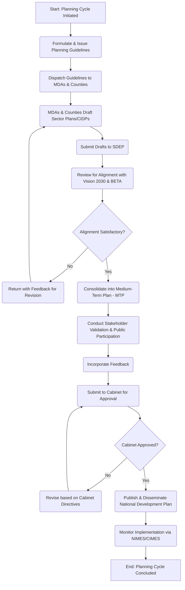

# State Department for Economic Planning - Service Delivery

## MDA Overview
The **State Department for Economic Planning (SDEP)**, under the National Treasury and Economic Planning, serves as the nerve center for the country's development. Its primary mandate is to provide leadership in national development planning and to ensure that government policies are evidence-based and aligned with long-term goals. Key functions include coordinating the preparation and review of national development plans (such as the Kenya Vision 2030 and its successive Medium-Term Plans - MTPs), overseeing the National Integrated Monitoring and Evaluation System (NIMES), and providing technical support to counties in developing their County Integrated Development Plans (CIDPs).

## Identified Business Process: National Development Planning

### 1. AS-IS Process Flowchart (BPMN 2.0)

### 2. Process Description

1.  **Formulation of Guidelines:** The SDEP develops and issues comprehensive planning guidelines to all Ministries, Departments, and Agencies (MDAs), as well as County Governments, outlining the strategic focus (e.g., the Bottom-up Economic Transformation Agenda - BETA).
2.  **Drafting:** MDAs and Counties develop their respective Sector Plans and CIDPs based on the provided guidelines and overarching national goals.
3.  **Review and Consolidation:** The SDEP receives all draft plans and reviews them to ensure alignment with national priorities. Once validated, these are consolidated into the comprehensive Medium-Term Plan (MTP).
4.  **Stakeholder Validation:** Draft national plans are subjected to public participation and stakeholder validation to gather feedback and ensure inclusivity.
5.  **Approval and Publication:** The finalized MTP is submitted to the Cabinet for approval. Upon approval, the document is officially published and disseminated.
6.  **Monitoring and Evaluation:** The implementation of the plan is tracked continuously using the National Integrated Monitoring and Evaluation System (NIMES) and the County Integrated Monitoring and Evaluation System (CIMES).

### 3. Pain Points & Bottlenecks

- **Siloed Planning Efforts:** Reliance on manual document submissions and fragmented spreadsheets from various MDAs and Counties leads to significant delays in consolidation.
- **Data Inconsistencies:** Disconnected systems make it difficult to verify data accuracy and ensure strict alignment between county plans, sector plans, and the national MTP.
- **Manual M&E Tracking:** Tracking the progress of implementation via NIMES/CIMES often involves manual data entry and reporting, leading to a lack of real-time visibility for decision-makers.
- **Inefficient Feedback Loops:** Collecting, collating, and analyzing feedback during public participation and stakeholder validation is labor-intensive and slow.

### 4. Opportunities for Digital Transformation (TO-BE)

- **Centralized National Planning Portal:** Implement a unified digital platform where MDAs and Counties can directly draft, submit, and track the status of their Sector Plans and CIDPs.
- **Automated Alignment Checks:** Utilize system-driven validations to automatically flag misalignments between submitted budgets/plans and the strategic objectives of the MTP/BETA.
- **Integrated M&E System:** Upgrade NIMES/CIMES with API integrations to directly pull project implementation data from MDA execution systems, eliminating manual reporting.
- **Real-Time Executive Dashboards:** Provide live data visualization dashboards for the Presidency and SDEP leadership to monitor the progress of key national projects and economic indicators.
- **Digital Public Participation Platform:** Create a structured online portal to streamline the collection and AI-assisted analysis of citizen and stakeholder feedback during plan validation.

---

## Feedback
We value your input on this blueprint. Please take a moment to provide your feedback using the link below:

[Provide Feedback](https://ee.kobotoolbox.org/x/4Ls7SlCG)
