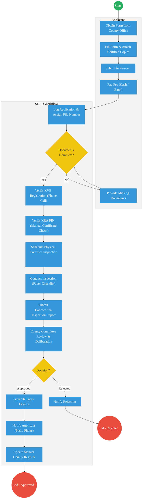

# Ministry of Agriculture and Livestock Development – State Department for Livestock Development

## Cover Page
- **Ministry/Department/Agency (MDA):** Ministry of Agriculture and Livestock Development — State Department for Livestock Development (SDLD)
- **Process Name:** Veterinary Practitioner Licensing & Slaughterhouse Certification
- **Document Version:** 1.0
- **Date:** 2026-03-18
- **Classification:** Official
- **Strategic Category:** Priority MDA
- **Service Model:** G2B / G2C
- **Life-Cycle Group:** Cradle to Death (4. Employment & Business)

---

## Executive Summary
The State Department for Livestock Development (SDLD) regulates veterinary services, slaughterhouse operations, and livestock health across Kenya. The current licensing process for veterinary practitioners and slaughterhouse operators is entirely manual and paper-based, administered at county level with no integration between the Kenya Veterinary Board (KVB), KRA, and national livestock databases. This fragmentation leads to significant processing delays, undetected expired licences, and inconsistent compliance enforcement across counties. The transition to the Kenya DSAP Architecture aims to establish the National Livestock Digital Registry (NLDR) as the single source of truth for all practitioners and facilities, while integrating with KVB, KRA, IPRS, and the Government Payment Aggregator (GPA) to automate credential verification, risk-based licensing, and digital certificate issuance.

---

## 1. AS-IS Process Flowchart (BPMN 2.0)
*Current State visualization (Fragmented Manual Licensing based on Deep Dive).*

---

## Process Overview
### Process Name
End-to-End Veterinary Practitioner Licensing, Slaughterhouse Certification, and Renewal Management

### Service Category
- G2B (Government to Business) — Veterinary practitioners, slaughterhouse operators, veterinary drug outlet owners
- G2C (Government to Citizen) — Individual veterinarians and para-veterinary personnel

### Scope
- **In Scope:** Veterinary practitioner registration and annual licensing; slaughterhouse inspection and certification; licence and certificate renewal; inspection scheduling, reporting, and compliance scoring.
- **Out of Scope:** Meat quality testing in accredited laboratories (KEBS/KMC); live animal import/export permits (separate SDLD stream); veterinary drug registration and pharmacovigilance (Pharmacy and Poisons Board).

### Triggers
- A veterinarian, para-vet, or veterinary drug outlet owner applying for a new licence or annual renewal.
- A slaughterhouse operator applying for an operating certificate or renewal.
- An officer-initiated compliance review or suspension action.

### End States
- **Successful:** Verifiable paper licence or slaughterhouse certificate issued and recorded in the manual county register.
- **Unsuccessful:** Application rejected. Applicant notified by phone or post with no formal appeals pathway.

### Policy Context
- Veterinarians and Veterinary Para-Professionals Act (Cap. 366)
- The Meat Control Act (Cap. 356)
- Agriculture and Food Authority Act
- Kenya Data Protection Act (2019)
- SDLD Standard Operating Procedures for Automation (2025)

---

## Detailed Process (AS-IS)

| Step | Role | Action | Tool/System | Notes |
|---|---|---|---|---|
| 1 | Applicant | Obtains application form from county livestock office. Fills in details manually, attaches certified copies of National ID, KRA PIN, academic certificates, KVB annual practising certificate, and business premises proof. Submits in person and pays the application fee via cash or bank transfer. | Paper / Bank / County Office | Entirely manual. No online channel. Multiple queues at county offices. |
| 2 | Registry Clerk | Receives application, assigns a manual file number, and performs a completeness check against a paper checklist. Contacts applicant by phone if documents are missing. Physical docket filed. | Manual File Registry | High chance of misfiling or docket loss. No SLA tracking. |
| 3 | Vet Officer | Manually verifies KVB registration by calling KVB Nairobi HQ. Checks past disciplinary records from internal paper files. Verifies KRA PIN compliance via printed certificates. Writes a verification memo. | Phone / Manual | Extremely time-consuming. Prone to human error. No integration with KVB or KRA systems. |
| 4 | Vet Inspector | Schedules a physical inspection of the premises. Conducts the visit, fills a paper inspection checklist, takes photographs on a personal phone, and submits a handwritten report. | Manual / Paper Checklist | Major bottleneck. Inspector scarcity causes 4–8 week backlogs. No geo-tagged evidence or standardised compliance scoring. |
| 5 | County Director | Reviews the officer's verification memo and inspection report. Convenes a county committee to deliberate and issues a recommendation to the national licensing unit. | Physical Committee Meeting | Scheduling delays. No audit trail for committee decisions. |
| 6 | AFA Admin / Clerk | Generates a paper licence upon approval. Notifies applicant by post or phone. Updates the manual county register and the national spreadsheet. | Manual Registry / Spreadsheet | Duplicate records between county and national levels. No automated renewal reminders. Expired licences often go undetected. |

---

## Pain Points & Opportunities
### Pain Points
- **Manual KVB Verification:** Officers verify practitioner registration by telephoning KVB headquarters. This introduces a 2–5 day delay per application, is vulnerable to impersonation, and creates no auditable record. Practitioners with revoked registrations can continue operating undetected between manual checks.
- **Inspection Backlogs:** Physical premise inspections rely on a small pool of county inspectors. Scheduling alone takes 2–4 weeks. Paper checklists are unstandardised across counties, resulting in inconsistent compliance scores and low-quality data for national dashboards.
- **Fragmented Registries:** Each county maintains its own spreadsheet or ledger. There is no live, queryable national register of licensed veterinarians, para-vets, or certified slaughterhouses. The public, employers, and enforcement officers cannot verify a licence status in real time.
- **Expired Licences Undetected:** No automated renewal reminder system exists. A significant proportion of practitioners operate on expired licences discovered only during ad-hoc inspections, creating animal health and food safety risks.
- **No KRA Integration:** Tax compliance is verified manually via a printed PIN certificate. KRA's iTax system is not queried, meaning outstanding tax obligations do not block licence issuance in contradiction with government policy.

### Opportunities
- **Automated KVB & KRA Validation:** Integrate with the KVB practitioner database API and KRA iTax via KeSEL to perform instant, auditable credential and tax compliance checks at the point of application — eliminating phone verification entirely.
- **Risk-Based Inspection Automation:** Apply a risk-scoring engine to auto-approve renewals for practitioners with a clean compliance record and no outstanding complaints, reserving physical inspections for new entrants, high-risk premises, and flagged accounts.
- **National Livestock Digital Registry (NLDR):** Establish NLDR as the single source of truth, accessible to county offices, the public via QR verification, and enforcement officers in real time.
- **Integrated Payments via GPA:** Channel all licence fees through the Government Payment Aggregator (GPA), enabling M-Pesa, card, and EFT payments with automatic receipt generation and treasury reconciliation.
- **Automated Renewal Reminders:** Trigger SMS and email renewal notifications 90 and 30 days before licence expiry, with automated enforcement escalation for non-renewal.

---

## 2. TO-BE Process Flowchart (BPMN 2.0)
*Future State visualization (Kenya DSAP Architecture – Huduma Bridge).*

```mermaid
%%{init: { 'theme': 'base', 'themeVariables': { 'fontSize': '24px', 'fontFamily': 'Inter, system-ui, sans-serif', 'primaryColor': '#ffffff', 'edgeLabelBackground':'#ffffff', 'tertiaryColor': '#f3f3f3', 'mainBkg': '#ffffff', 'nodeBorder': '#333333' } } }%%
flowchart TD
    %% Events
    Start((Start))
    EndApprove(("End - Issued"))
    EndReject(("End - Rejected"))

    subgraph Applicant [Applicant]
        direction LR
        Login["Login to eCitizen"]
        SelectSvc["Select Service Type"]
        ConfirmData["Confirm Auto-populated Data"]
        DigitalPay["Digital Payment (GPA)"]
    end

    subgraph IntegrationLayer["System Integration Layer"]
        direction LR
        ValKVB["Validate KVB Registration"]
        ValKRA["Validate KRA iTax"]
        ValBRS["Validate BRS"]
        RiskScreen["Risk Screening (DVS / OIE)"]
    end

    subgraph WorkflowEngine["Workflow Engine"]
        direction TB
        RunRisk["Run Risk Assessment"]
        RiskGateway{"Risk Level?"}
        OfficerReview["Officer Review"]
        ReviewGateway{"Decision?"}
    end

    subgraph InspectionWorkflow["Inspection (Exception-Based)"]
        direction TB
        GeoAssign["Geo-assign Inspector via Mobile App"]
        MobileInsp["Mobile Inspection — GPS + Photo + Checklist"]
        DigReport["Digital Report Upload"]
        InspDecision{"Approved?"}
    end

    subgraph Issuance [Issuance]
        direction TB
        GenLicence["Generate QR-coded Digital Licence"]
        RegisterNLDR["Register in NLDR"]
        NotifyApplicant["Notify Applicant (SMS / Email)"]
        SyncCounty["Sync County Offices + Schedule Renewal Reminder"]
    end

    %% Flow connections
    Start --> Login
    Login --> SelectSvc
    SelectSvc --> ConfirmData
    ConfirmData --> DigitalPay
    DigitalPay --> ValKVB
    ValKVB --> ValKRA
    ValKRA --> ValBRS
    ValBRS --> RiskScreen
    RiskScreen --> RunRisk
    RunRisk --> RiskGateway

    RiskGateway -- "Low" --> GenLicence
    RiskGateway -- "Medium" --> OfficerReview
    RiskGateway -- "High" --> GeoAssign

    OfficerReview --> ReviewGateway
    ReviewGateway -- "Approved" --> GenLicence
    ReviewGateway -- "Needs Inspection" --> GeoAssign
    ReviewGateway -- "Rejected" --> NotifyReject["Notify Rejection"]

    GeoAssign --> MobileInsp
    MobileInsp --> DigReport
    DigReport --> InspDecision
    InspDecision -- "Yes" --> GenLicence
    InspDecision -- "No" --> NotifyReject

    GenLicence --> RegisterNLDR
    RegisterNLDR --> NotifyApplicant
    NotifyApplicant --> SyncCounty
    SyncCounty --> EndApprove

    NotifyReject --> EndReject

    %% Styling
    classDef startEvent fill:#27ae60,stroke:#27ae60,color:#fff,font-size:24px;
    classDef endEvent fill:#e74c3c,stroke:#e74c3c,color:#fff,font-size:24px;
    classDef userTask fill:#3498db,stroke:#2980b9,color:#fff,font-size:24px;
    classDef serviceTask fill:#9b59b6,stroke:#8e44ad,color:#fff,font-size:24px;
    classDef gateway fill:#f1c40f,stroke:#f39c12,color:#333,font-size:24px;

    class Start startEvent;
    class EndApprove,EndReject endEvent;
    class RiskGateway,ReviewGateway,InspDecision gateway;
    class ValKVB,ValKRA,ValBRS,RiskScreen,RunRisk,GenLicence,RegisterNLDR,NotifyApplicant,SyncCounty,NotifyReject serviceTask;
    class Login,SelectSvc,ConfirmData,DigitalPay,OfficerReview,GeoAssign,MobileInsp,DigReport userTask;
```

## Future State Process (TO-BE)
### Narrative
**TO-BE Process: Automated Licensing via Huduma Bridge**

**Design Principles:**
- **Registry-Centric Architecture:** NLDR serves as the authoritative register for all practitioners and facilities, accessible in real time to county offices, enforcement officers, and the public.
- **Once-Only Principle:** KVB, KRA, BRS, and IPRS data is fetched automatically via APIs. Applicants do not upload paper certificates.
- **Automated Compliance Verification:** KeSEL integration eliminates all manual document checks for known entities at the point of application.
- **Risk-Based Decision Automation:** The workflow engine applies risk profiles to auto-approve low-risk renewals — no human touch required for compliant, returning practitioners.
- **Exception-Based Human Review:** Manual officer review and physical inspections are reserved strictly for new entrants, high-risk premises, and flagged applications.
- **Real-Time National Visibility:** NLDR is live-synced across all county offices, with public QR-code licence verification and automated expiry enforcement.

### Optimized Steps (Digital)

| Step | Actor | Action | System |
|---|---|---|---|
| 1 | Applicant | Logs into eCitizen, selects the required service type, confirms auto-populated identity and business data, and completes digital payment via GPA (M-Pesa, card, or EFT). | eCitizen Portal / GPA / IPRS |
| 2 | System Integration Layer | Automatically validates KVB registration number via KVB API; checks tax compliance via KRA iTax; verifies business registration via BRS; cross-references national livestock disease alert database (DVS/OIE). Application form is auto-populated with verified data. | KeSEL / KVB API / KRA iTax / BRS / DVS |
| 3 | Workflow Engine | Runs risk profile assessment. Low-risk applications (renewals with clean record) are auto-approved. Medium-risk are routed to a vet officer for document review. High-risk (disciplinary flag, lapsed KVB registration, disease zone) trigger the physical inspection workflow. | SDLD Workflow Engine |
| 4 | Vet Inspector / Officer | Exception-based only. Inspector receives a geo-assigned task on the mobile app. Conducts field inspection with a standardised digital checklist, GPS location capture, photo evidence upload, and automated compliance scoring. Report submitted digitally and auto-routed for approval. | SDLD Mobile Inspection App / AFA Workbench |
| 5 | System | Generates a QR-coded, digitally signed licence or slaughterhouse certificate. Registers it in the NLDR. Sends SMS and email notification to the applicant. Syncs record with county offices in real time. Schedules automated renewal reminder 90 and 30 days before expiry. | Output Generator / NLDR / County Sync / Notification Engine |

---

## References
- https://kilimo.go.ke
- https://kvb.go.ke
- Veterinarians and Veterinary Para-Professionals Act (Cap. 366)
- The Meat Control Act (Cap. 356)
- Agriculture and Food Authority Act
- SDLD Standard Operating Procedures for Automation (2025)
- Kenya Data Protection Act (2019)
- Desk Review

---

### Validation Survey
Please provide your feedback here: [https://ee.kobotoolbox.org/x/4Ls7SlCG](https://ee.kobotoolbox.org/x/4Ls7SlCG)
