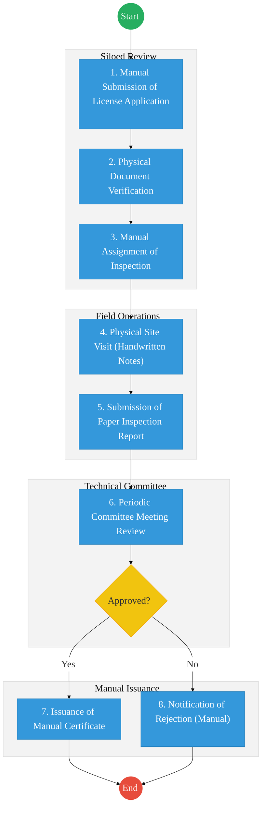
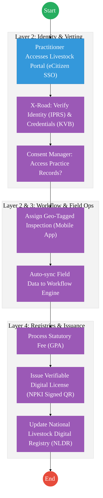

# PART 1: EXECUTIVE SUMMARY

The refined process for the State Department for Livestock Development (SDLD) focuses on the digital transformation of regulatory and quality assurance workflows. Beyond practitioner licensing, this iteration embeds **Milk Quality Analysis** and **Structured Inspection Frameworks** into the national livestock data ecosystem. 

Key improvements include:
- **Renewable License Management:** A full-lifecycle approach for veterinary practitioners and facilities, moving away from "one-off" issuance to continuous compliance monitoring.
- **Evidence-Based Inspections:** Replacement of handwritten reports with structured, geo-tagged digital inspection data.
- **New Quality Assurance Stream:** Modelling of the monthly **Milk Analysis Workflow** (14th–15th monthly cycle) to ensure dairy safety and farmer accountability.
- **Systemic Validation:** Integration of practice location validation and mandatory document uploads via eCitizen to ensure legal and operational traceability.

---

# PART 2: AS-IS PROCESS (CURRENT REALITY)

The current state of livestock licensing and dairy oversight is primarily manual, leading to significant delays and data silos.

---

# PART 3: TO-BE PROCESS (DPI-ENABLED)

The TO-BE process transforms these silos into an integrated digital workflow.

---

# PART 4: ARCHITECTURE ALIGNMENT (KENYA HUDUMA BRIDGE)

The Livestock Regulatory and Quality Assurance Service is engineered to operate across the four layers of the **Kenya DSAP Architecture**:

### Layer 1: Access Channels
- **eCitizen / Livestock Portal:** The primary window for veterinary practitioners and facility owners to apply for and renew licenses.
- **Mobile Inspection App:** A specialized interface for field officers to conduct structured, geo-tagged inspections (offline-first).
- **USSD / SMS Interface:** For farmers to receive milk analysis results and animal health alerts.

### Layer 2: Core Platform
- **Workflow Engine (BPMN 2.0):** Orchestrates the licensing lifecycle (Application → Inspection → Technical Review → Issuance) and the monthly Milk Analysis cycle.
- **Trust Hub:**
  - **Consent Manager:** Consulted before sharing farmer data or animal health records with third-party labs or insurance providers via X-Road.
  - **Identity Federation:** Real-time verification of practitioner identity via **Maisha Namba (IPRS)**.
  - **NPKI:** Digitally signing **Veterinary Licenses**, **Inspection Reports**, and **Lab Analysis Results** to ensure professional accountability.
- **Shared Services:**
  - **Intelligent Document Processing (IDP):** Digitizing practitioner logbooks, facility certifications, and historical paper licenses into the National EDRMS.
  - **Document Generator:** Automated creation of QR-coded permits and milk quality certificates.
  - **Notifications:** Automated SMS/Email alerts for license renewal (90-day cycle) and milk safety triggers.

### Layer 3: Interoperability (Huduma Bridge)
- **KeSEL (X-Road):** Secure data exchange between SDLD and the **Kenya Veterinary Board (KVB)**, **Pharmacy & Poisons Board**, and **MOH (Food Safety)**.
- **Central Service Catalogue:** Cataloguing animal health and quality assurance APIs for national traceability.

### Layer 4: Authoritative Registries & Payments
- **Registries:**
  - **National Livestock Digital Registry (NLDR):** The sector-specific authoritative registry for animal, farm, and practitioner data.
  - **National EDRMS:** The definitive legal digital archive for all signed regulatory permits and food safety certifications.
  - **IPRS / Maisha Namba:** Foundational person registry for licensee identification.
- **Payments:** **Government Payment Aggregator (GPA)** for processing license fees, lab testing charges, and livestock-related revenue.

---

# PART 3: NEW MILK ANALYSIS PROCESS (QUALITY ASSURANCE)

This process tracks milk safety from the farm gate to the laboratory, occurring on a **Monthly Schedule (14th–15th of every month)**.

| Step | Actor | Action | Tool / System |
| :--- | :--- | :--- | :--- |
| **1. Identification** | **Farmer & Farm Registration:** Linking the milk source to a unique farmer ID and farm location. | Maisha Namba, Farm GPS, NLDR ID | County Extension Officer |
| **2. Animal Registry** | **Batch Tracking:** Identifying the specific animal/herd from which the sample is drawn. | Animal ID / RFID Tag | Extension Officer |
| **3. Collection** | **Protocol-Based Sampling:** Collection of milk samples using standardized digital batch codes. | Timestamp, Sample ID, Temp | Lab Assistant |
| **4. Lab Testing** | **Analysis & Results Entry:** Laboratory testing for contaminants, butterfat, and bacterial count. | Lab Results, Rejection Codes | Lab Technician |
| **5. Reporting** | **Automated Feedback:** Sending results to the farmer via SMS/App and updating the national dairy dashboard. | Quality Score, Alert | National Dairy Board |

---

# PART 4: POLICY & REGULATORY ALIGNMENT

The livestock regulatory framework is governed by the following critical instruments:

- **Animal Health Act (Cap. 360):** Governing disease control and animal movement.
- **Veterinarians and Veterinary Para-Professionals Act (Cap. 366):** Professional licensing authority.
- **Meat Control Act (Cap. 356):** Standards for slaughterhouse operations.
- **Pharmacy and Poisons Act (Cap. 244):** Regulation of veterinary medicines and practitioner drug-handling licenses.
- **Dairy Industry Act:** Foundation for the Milk Analysis and Quality Assurance process.

---

# PART 5: CHANGE LOG

| Area | Before (Incorrect/Old) | After (Corrected) | Rationale |
| :--- | :--- | :--- | :--- |
| **Licensing** | Missing document upload stage. | Added "Upload Supporting Documents" after service selection. | Improved completeness and documentation audit trail. |
| **Inspection** | Handwritten/Unstructured reports. | Mandated **Structured Digital Reports** via mobile app. | Standardized compliance scoring and real-time dashboarding. |
| **Lifecycle** | Focused on one-time issuance. | Included **Renewable License Lifecycle** management. | Continuous oversight of practitioner compliance. |
| **QA Scope** | Missing dairy quality workflows. | Modeled the **Monthly Milk Analysis Process**. | Enhanced food safety and dairy sector traceability. |
| **Validation** | Generic application check. | Added **Practice Location (GIS) Validation**. | Verified operational presence and facility standards. |

---

## References
- https://kilimo.go.ke
- Animal Health Act / Pharmacy and Poisons Act
- Kenya Digital Justice Program Roadmap
- Data Protection Act 2019

---

### Validation Survey
Please provide your feedback here: [https://ee.kobotoolbox.org/x/4Ls7SlCG](https://ee.kobotoolbox.org/x/4Ls7SlCG)
