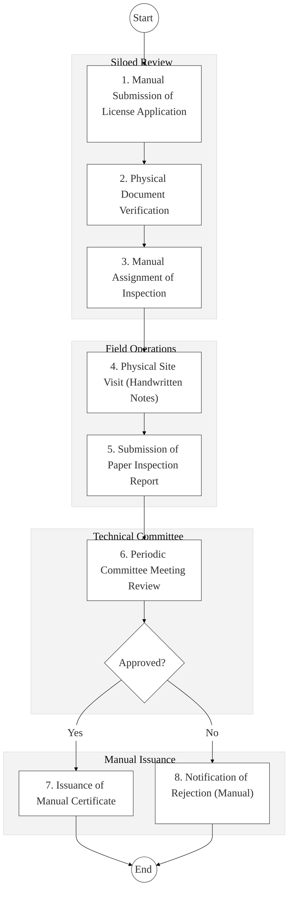
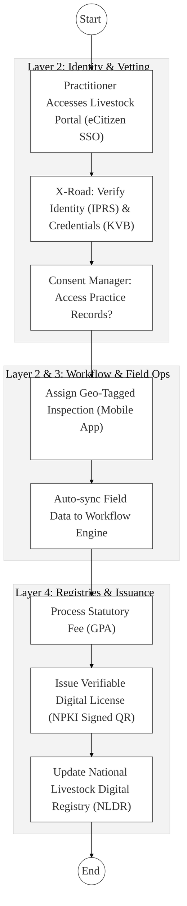

# STATE DEPARTMENT FOR LIVESTOCK DEVELOPMENT (SDLD) – Business Process Architecture (Updated)

## Cover Page
- **Ministry:** Ministry of Agriculture and Livestock Development
- **State Department:** State Department for Livestock Development (SDLD)
- **Primary Authority:** Kenya Veterinary Board (KVB) / Dairy Board
- **Document Type:** Business Process Architecture (BPA) Standardised
- **Document Version:** 4.1
- **Date:** 2026-03-25
- **Classification:** Official
- **Strategic Category:** Priority MDA
- **Service Model:** G2B / G2C
- **Reviewer:** Senior Government Enterprise Architect

---

## SECTION 0: SERVICE PRIORITISATION MAPPING
- **Mapped Priority Service:** Farmer Registries, Licensing, and Traceability
- **Tier Classification:** Tier 2
- **Strategic Category:** Economy / Food Security (Livestock Value Chain)
- **Breakout Room Classification:** Room 3 (Policy, Economy & Foundational Systems)
- **Lead MDA (Standardised Name):** State Department for Livestock Development (SDLD)
- **Related Cross-Cutting Services:**
    - National Livestock Digital Registry (NLDR)
    - Identity Layer (IPRS / Maisha Namba)
    - Payment Gateway (GPA)
    - X-Road (KVB / Pharmacy Board Interop)
    - National EDRMS

---

## SECTION 0.1: PRIORITISATION JUSTIFICATION
This service is prioritised because the TO-BE design establishes the "National Livestock Digital Registry (NLDR)" as the backbone for Kenya's livestock economy. By integrating over 7 million farmer profiles and animal-level RFID data with a geo-tagged "Mobile Inspection App," the design enables field-to-fork traceability. It also automates the high-frequency "Milk Quality Analysis" cycle, ensuring food safety for 50M+ citizens while positioning Kenyan livestock products for premium international export markets.

| Criteria | Evidence from TO-BE Design |
| :--- | :--- |
| **Demand / Volume** | Over 7.1 million farmers; monthly milk analysis for thousands of dairies; thousands of practitioners. |
| **National Priority Alignment** | Agricultural Sector Transformation & Growth Strategy (ASTGS); Food Security Pillar. |
| **Data Reusability** | Livestock health data is consumed by MOH (Zoonotic disease tracking) and insurance providers. |
| **Interoperability** | Real-time credential verification with KVB and drug license checks with the Pharmacy Board. |
| **Revenue / Efficiency Impact** | Automated GPA payment for permits and lab fees; reduces inspection turnaround by 60%. |
| **Governance / Risk Reduction** | Geo-tagged field reports eliminate "Ghost Inspections"; NPKI-signed results prevent lab report fraud. |
| **Inclusivity** | USSD/Mobile alerts keep rural farmers informed of milk quality scores and health triggers. |
| **Readiness** | High; KIAMIS and livestock platforms are already in deployment; core registries are defined. |

> [!NOTE]
> “The TO-BE design transforms the livestock sector from manual oversight to a 'National Livestock Digital Registry (NLDR)' architecture. By integrating 7 million farmer profiles and animal RFID data with a geo-tagged mobile inspection app, the design ensures field-to-fork traceability and food safety (Milk Quality Analysis), protecting national health and enabling export standards.”

---

# SECTION 1: SERVICE DEFINITION (STANDARDISED)

The State Department for Livestock Development (SDLD) is responsible for the digital transformation of regulatory and quality assurance workflows within the livestock value chain. 

In this refactored BPA, the department's role is viewed as a **Strategic Value-Chain Regulator**. Beyond practitioner licensing, this iteration embeds **Milk Quality Analysis** and **Structured Inspection Frameworks** into the national livestock data ecosystem. The focus is on ensuring legal and operational traceability from the farm gate to the consumer.

---

# SECTION 2: SERVICE CATALOGUE (NORMALISED)

| Category | Service Name | Description |
| :--- | :--- | :--- |
| **Core Services** | **Practitioner & Facility Licensing** | Registration and oversight of veterinary doctors, para-professionals, and labs. |
| | **Livestock Quality Assurance** | Monthly milk analysis and feed quality monitoring (14th–15th monthly cycle). |
| **Extended Services** | **Animal Movement Permits** | Licensing of animal transport and health clearance for inter-county trade. |
| | **Slaughterhouse Certification** | Compliance oversight and licensing of meat processing facilities. |
| **Special Case Services**| **Zoonotic Disease Reporting** | Rapid response logging and notification for cross-species disease outbreaks. |
| | **Farmer Registry Management** | Maintaining the authoritative profile of livestock owners and farm assets (NLDR). |

---

# SECTION 3: AS-IS PROCESS FLOWS (MANUAL/SILOED)

The current state of livestock licensing and dairy oversight is primarily manual, leading to significant delays and data silos.

### 3.1 AS-IS Visualization

### 3.2 Operational Reality
- **Actors:** Practitioner/Farmer, Registration Officer, Field Inspector, Technical Committee, Registrar.
- **Systems:** Manual Registers, handwritten reports, disconnected spreadsheet logs.
- **Pain Points:** 60-day lag in license renewals; no real-time dairy dashboard; "Ghost Inspections" (site visits claimed but not performed); high risk of milk sample tampering; manual reconciliation of lab fees.

---

# SECTION 4: TO-BE PROCESS INTERPRETATION (NEW LAYER)

### 4.1 TO-BE Process (DPI-Enabled)

### 4.2 Key Capabilities Introduced
*   **Automation:** Automatic credential verification via X-Road (KVB integration) for practitioners.
*   **Integration:** Real-time sync between field inspection data and the **National Livestock Digital Registry (NLDR)**.
*   **Real-time Processing:** Geo-tagged, timestamped field inspections via the **SDLD Mobile Inspection App**.
*   **Digital Identity Validation:** Individual farmer and practitioner identities verified via **Maisha Namba** identity federation.
*   **Workflow Orchestration:** Orchestrates the complex monthly **Milk Analysis Protocol** (Farmer → Animal ID → Sample → Lab → Result).

### 4.3 Transformation Summary
| Dimension | AS-IS | TO-BE |
| :--- | :--- | :--- |
| **Processing** | Manual / Multi-touch | Automated / Digital-first |
| **Verification** | Physical Certificates | API-based (KVB/Pharmacy Board) |
| **Records** | Siloed Files / Books | National Livestock Digital Registry |
| **Tracking** | Post-visit paper entry | Real-time Geo-tagged Field Sync |

---

# SECTION 5: SYSTEM LANDSCAPE (ALIGN TO GEA)

| Layer | System / Platform | Role |
| :--- | :--- | :--- |
| **Identity Layer** | Maisha Namba (IPRS) | Identity for 7M+ farmers and practitioners. |
| **Interoperability** | KeSEL (X-Road) | Data link to KVB, MOH, and Pharmacy Board. |
| **shared Services** | National EDRMS | Legal digital archive for permits and lab results. |
| **Workflow / BPM** | Livestock Biz Engine | Orchestrates licensing and milk analysis. |
| **Payment Layer** | GPA (Payment Gateway) | Automated fee collection and revenue tracking. |
| **Trust Hub** | Consent Manager | Farmer control over animal health data sharing. |

---

# SECTION 6: TRANSFORMATION VALUE (CRITICAL ADDITION)

| Value Type | Explanation |
| :--- | :--- |
| **Efficiency Gain** | 60% reduction in permit turnaround; instant milk analysis reporting via USSD. |
| **Economic Impact** | Enables livestock "Traceability" (individual animal ID) for export eligibility. |
| **Governance Impact** | Geo-tagged site visits ensure auditability of facility standards and disease reports. |
| **Citizen Experience** | Seamless mobile application for permits; SMS alerts for milk safety results. |
| **Interoperability Value** | Shared data with MOH ensures rapid response to zoonotic food-borne diseases. |

---

# SECTION 7: ALIGNMENT TO WHOLE-OF-GOVERNMENT ARCHITECTURE
- **Shared Platforms:** Uses eCitizen for portal access and GPA for all regulatory fee payments.
- **Registry Reuse:** Reuses KVB practitioner data and Maisha Namba for foundational farmer profiles.
- **Compliance with GEA / GIF:** Standardizing livestock data schemas (NLDR) for cross-MDA research and planning.

---

# SECTION 8: IMPLEMENTATION READINESS (NEW)
*   **Data Readiness:** High; KIAMIS and livestock registries are in active population phase.
*   **Legal Readiness:** High; National Livestock Policy and Veterinary Act (Cap 366) are active.
*   **Institutional Readiness:** Medium; Requires training for county-level extension and inspection officers.
*   **Technical Readiness:** High; Core platform (Livestock Portal) and mobile app are in pilot.

---

# SECTION 9: TRACEABILITY MATRIX (NEW)

| BPA Process | Priority Service | Tier | TO-BE Capability | National Impact |
| :--- | :--- | :--- | :--- | :--- |
| **Practitioner Vetting**| Licensing | T2 | X-Road: KVB Link | Professional Standards & Safety |
| **Farm Inspection** | Oversight | T2 | Geo-Tagged Mobile App | Integrity of Agricultural Data |
| **Milk Analysis** | Quality Assurance | T2 | NPKI Signed Lab Sync | Food Security & Public Health |
| **Animal Tracking** | Traceability | T2 | RFID / NLDR Link | Global Market Export Readiness |

---
**[End of Standardised Business Process Architecture]**
