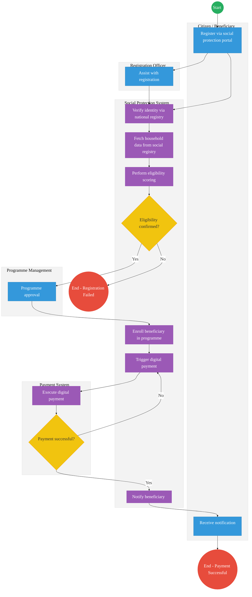

# STATE DEPARTMENT FOR SPECIAL PROGRAMMES – Service Delivery

## Cover Page
- **Ministry/Department/Agency (MDA):** Ministry of Labour and Social Protection
- **Department:** State Department for Special Programmes
- **Process Name:** Social Protection & Beneficiary Management
- **Document Version:** 2.2
- **Date:** 2026-03-04
- **Classification:** Official
- **Strategic Category:** Priority MDA
- **Service Model:** G2C
- **Life-Cycle Group:** Cradle to Death (5. Social Protection & Justice)

---

## Executive Summary
The State Department for Special Programmes is responsible for social protection interventions targeting vulnerable populations. This includes safety net programmes, emergency relief, and beneficiary support. The current process is heavily manual, leading to identification delays and disbursement risks. The transition to the Kenya DSAP Architecture aims to establish a real-time, biometric-linked social registry.

---

## 1. AS-IS Process Flowchart (BPMN 2.0)
*Current State visualization (Manual Special Programmes Delivery).*

```mermaid
%%{init: { 'theme': 'base', 'themeVariables': { 'fontSize': '24px', 'fontFamily': 'Inter, system-ui, sans-serif', 'primaryColor': '#ffffff', 'edgeLabelBackground':'#ffffff', 'tertiaryColor': '#f3f3f3', 'mainBkg': '#ffffff', 'nodeBorder': '#333333' } } }%%
flowchart TD
    %% Events
    Start((Start))
    EndProcess(("End Process"))

    subgraph Identification["Identification Phase"]
        direction TB
        IdVuln["Community leaders identify vulnerable households"]
        Outreach["Outreach and registration drives conducted"]
    end

    subgraph Registration["Registration Phase"]
        direction TB
        CapInfo["Capture household information"]
        VerDocs["Verify supporting documents"]
        CompList["Compile preliminary beneficiary lists"]
    end

    subgraph Validation["Validation Phase"]
        direction TB
        CommVal["Community validation meeting"]
        CrossCheck["Cross-check eligibility"]
        FinList["Finalize beneficiary list"]
    end

    subgraph Approval["Approval Phase"]
        direction TB
        Endorse["Programme management endorses approved beneficiaries"]
    end

    subgraph Delivery["Delivery Phase"]
        direction TB
        FwdList["Forward beneficiary list to payment/logistics unit"]
        Disburse["Disburse cash or in-kind assistance"]
        AckRec["Beneficiary acknowledges receipt"]
    end

    subgraph PostDelivery["Post-Delivery"]
        direction TB
        RecAsst["Record assistance delivered"]
        GrievanceGateway{"Grievance raised?"}
        HandGriev["Handle grievances or appeals"]
    end

    %% Flow connections
    Start --> IdVuln
    IdVuln --> Outreach
    
    Outreach --> CapInfo
    CapInfo --> VerDocs
    VerDocs --> CompList
    
    CompList --> CommVal
    CommVal --> CrossCheck
    CrossCheck --> FinList
    
    FinList --> Endorse
    
    Endorse --> FwdList
    FwdList --> Disburse
    Disburse --> AckRec
    
    AckRec --> RecAsst
    RecAsst --> GrievanceGateway
    
    GrievanceGateway -- "Yes" --> HandGriev
    HandGriev --> EndProcess
    GrievanceGateway -- "No" --> EndProcess

    %% Styling
    classDef startEvent fill:#27ae60,stroke:#27ae60,color:#fff,font-size:24px,font-size:24px;;
    classDef endEvent fill:#e74c3c,stroke:#e74c3c,color:#fff,font-size:24px,font-size:24px;;
    classDef userTask fill:#3498db,stroke:#2980b9,color:#fff,font-size:24px,font-size:24px;;
    classDef gateway fill:#f1c40f,stroke:#f39c12,color:#333,font-size:24px,font-size:24px;;
    
    class Start startEvent;
    class EndProcess endEvent;
    class GrievanceGateway gateway;
    class IdVuln,Outreach,CapInfo,VerDocs,CompList,CommVal,CrossCheck,FinList,Endorse,FwdList,Disburse,AckRec,RecAsst,HandGriev userTask;
```

---

## Process Overview
### Process Name
End-to-End Special Programmes Delivery (Registration to Assistance)

### Service Category
- G2C (Government to Citizen)

### Scope
- **In Scope:** Beneficiary identification, registration, validation, approval, and assistance delivery.
- **Out of Scope:** Long-term policy formulation.

### Triggers
- Citizen seeking inclusion or government identification of vulnerable households.

### End States
- **Successful:** Assistance delivered; Records archived.

---

## Detailed Process (AS-IS)
| Step | Role | Action | Tool/System | Notes |
|---|---|---|---|---|
| 1 | Community Leaders / Chiefs | Identifies vulnerable households within their jurisdiction and conducts outreach drives. | Manual | Prone to inclusion/exclusion errors. |
| 2 | Registration Officers | Captures household information and verifies supporting documents (e.g., ID cards). | Paper Forms / Basic System | |
| 3 | Registration Officers | Compiles preliminary beneficiary lists based on collected data. | Manual Ledgers / Excel | |
| 4 | Community Leaders / Registration Officers | Conducts community validation meetings to review and cross-check the preliminary list. | Public Meetings | |
| 5 | Registration Officers | Cross-checks eligibility criteria manually and finalizes the beneficiary list. | Manual | |
| 6 | Programme Management | Reviews the finalized list and formally endorses the approved beneficiaries for assistance. | Manual Approval | |
| 7 | Programme Management | Forwards the endorsed beneficiary list to the Payment or Logistics Unit. | Physical Dispatch / Email | |
| 8 | Payment / Logistics Unit | Disburses cash payments or distributes in-kind food/supplies to beneficiaries. | Manual Cash/Goods | High risk of leakage. |
| 9 | Beneficiaries | Acknowledges receipt of the assistance via signature or thumbprint. | Paper Receipts | |
| 10 | Registration Officers | Records the assistance delivered and handles any grievances or appeals raised by the community. | Manual Registers | |

---

## 2. TO-BE Process Flowchart (BPMN 2.0)
*Future State visualization (Kenya DSAP Architecture - Digital Social Protection Platform).*

## Future State Process (TO-BE)
### Narrative
**TO-BE Process: Digital Social Protection & Beneficiary Management**

The To-Be process envisions a fully integrated **digital social protection platform** that leverages national registries to automate targeting, enrollment, and disbursement, significantly reducing inclusion errors and payment leakages.

**Core Systems:**
- **National Social Registry:** A centralized database of all households, serving as the single source of truth for vulnerability data.
- **Beneficiary Registry:** Maintains the active list of individuals enrolled in specific social protection programmes.
- **Eligibility Scoring Engine:** Uses AI and data rules to automatically calculate a proxy means test score for each applicant.
- **Programme Management System:** Allows administrators to define criteria, approve budgets, and monitor programme performance.
- **Payment and Disbursement Platform:** Orchestrates the secure transfer of funds to digital wallets or bank accounts.

**Interoperability (via National Service Bus / X-Road):**
- **National Identity Verification:** Real-time identity checks against IPRS / Maisha Namba using biometric data.
- **Household Verification:** Instant retrieval of household composition and economic data from national registries.
- **Digital Payments:** Seamless integration with the Government Payment Aggregator (GPA) for bulk, real-time disbursements.
- **Means Testing:** Integration with other government datasets (e.g., KRA, NTSA, NHIF) to accurately verify income and asset ownership.

### Optimized Steps (Digital)
| Step | Actor | Action | System |
|---|---|---|---|
| 1 | Citizen / Beneficiary | Registers for support via the online social protection portal or with the help of a Registration Officer. | eCitizen / Social Portal |
| 2 | Social Protection System | Instantly verifies the applicant's identity using biometrics against the national identity registry. | IPRS / Maisha Namba |
| 3 | Social Protection System | Fetches comprehensive household and socioeconomic data from the National Social Registry via X-Road. | National Social Registry |
| 4 | Social Protection System | Performs automated eligibility scoring (means testing) based on predefined programme criteria. | Eligibility Scoring Engine |
| 5 | Programme Management | Reviews the system-generated recommendations and provides final digital approval for the beneficiary list. | Programme Management System |
| 6 | Social Protection System | Enrolls the approved beneficiary into the specific programme and updates the Beneficiary Registry. | Beneficiary Registry |
| 7 | Social Protection System / Payment System | Triggers a digital payment instruction to the Government Payment Aggregator for instant disbursement to the beneficiary's mobile wallet. | GPA / Mobile Money API |
| 8 | Social Protection System | Automatically notifies the beneficiary via SMS or the eCitizen app regarding their enrollment status and payment receipt. | Notification Gateway |

---

## References
- https://www.socialprotection.go.ke
- National Social Protection Policy
- Desk Review