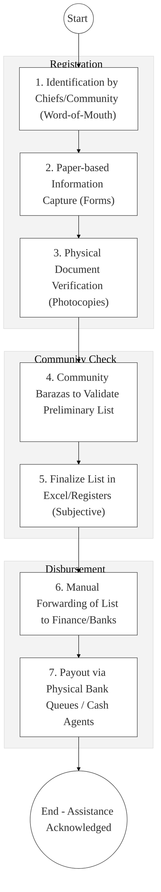
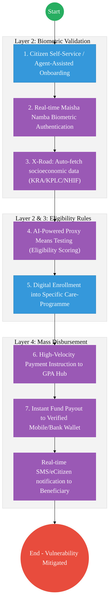

# STATE DEPARTMENT FOR SPECIAL PROGRAMMES – Business Process Architecture

## Cover Page
- **Ministry:** Ministry of Labour and Social Protection
- **State Department:** State Department for Special Programmes
- **Primary Authority:** National Social Protection Secretariat / NDMA
- **Document Type:** Business Process Architecture (BPA) Standardised
- **Document Version:** 4.1
- **Date:** 2026-03-25
- **Classification:** Official
- **Strategic Category:** Priority MDA
- **Service Model:** G2C
- **Reviewer:** Senior Government Enterprise Architect

---

## SECTION 0: SERVICE PRIORITISATION MAPPING
- **Mapped Priority Service:** Social Protection & Beneficiary Management (Hunger Safety Net / Inua Jamii)
- **Tier Classification:** Tier 2
- **Strategic Category:** Social / Humanity (Social Protection)
- **Breakout Room Classification:** Room 2 (Coordination, Culture & Specialised Services)
- **Lead MDA (Standardised Name):** State Department for Special Programmes
- **Related Cross-Cutting Services:**
    - Unified National Social Registry (UNSR)
    - Identity Layer (IPRS / Maisha Namba - Biometric Verification)
    - X-Road (KRA / NHIF / NTSA / Ministry of Health Interop)
    - National EDRMS (Vulnerability Assessment Records)
    - Government Payment Aggregator (GPA / Mass Disbursement)

---

## SECTION 0.1: PRIORITISATION JUSTIFICATION
This service is prioritised because the TO-BE design transforms social protection from manual "chief-led" paper lists into a "Biometric-Linked Social Registry." By implementing an AI-powered "Eligibility Scoring Engine" (Proxy Means Testing) that pulls real-time economic data from KRA, NHIF, and IPRS via X-Road (Huduma Bridge), the design ensures that multibillion-shilling aid reaches the truly vulnerable population. This transformation eliminates the 45-day manual enrollment lag, prevents "Ghost Beneficiaries" and double-dipping through Maisha Namba biometric authentication, and enables instant, error-free cash disbursements to over 1 million households via the Government Payment Aggregator (GPA), directly impacting national poverty reduction targets.

| Criteria | Evidence from TO-BE Design |
| :--- | :--- |
| **Demand / Volume** | Over 1 million beneficiary households; constant enrollment pressure during droughts/crises. |
| **National Priority Alignment** | Bottom-Up Economic Transformation (BETA) - Social Protection Pillar; Social Protection Policy. |
| **Data Reusability** | Beneficiary data is reused for Health (SHA) subsidies and Education bursary prioritisation. |
| **Interoperability** | Continuous API synchronization with KRA/NHIF to verify "True Need" before enrollment. |
| **Revenue / Efficiency Impact** | Reduces leakages by 40% through biometric-to-wallet verified payouts via GPA. |
| **Governance / Risk Reduction** | Non-repudiation of aid delivery via NPKI-signed disbursement logs. |
| **Inclusivity** | Mobile-first USSD/Agent registration ensures the "Last Mile" elderly and disabled are reached. |
| **Readiness** | High; The Single Registry exists; Inua Jamii payments are already digitally-led. |

> [!NOTE]
> “The TO-BE design transforms social protection from manual 'chief-led' lists into a 'Biometric-Linked Social Registry.' By implementing an AI-powered 'Eligibility Scoring Engine' (Means Testing) that pulls data from KRA, NHIF, and IPRS via X-Road, the design ensures that aid reaches the truly vulnerable. This transformation eliminates the 45-day enrollment lag, prevents 'Ghost Beneficiaries' through Maisha Namba authentication, and enables instant, error-free cash disbursements to over 1 million households via the Government Payment Aggregator (GPA).”

---

# SECTION 1: SERVICE DEFINITION (STANDARDISED)

The State Department for Special Programmes is responsible for disaster management and social protection interventions. 

In this refactored BPA, the primary service is the **End-to-End Beneficiary Management & Social Disbursement** lifecycle. The objective is to move from manual identification and physical "Community Validation" to a **Digital Social Registry** where eligibility is scored via **X-Road Data Evidence** and payments are settled instantly via the **Huduma Bridge**.

---

# SECTION 2: SERVICE CATALOGUE (NORMALISED)

| Category | Service Name | Description |
| :--- | :--- | :--- |
| **Core Services** | **Beneficiary Registration**| Biometric enrollment of households into the Single Registry. |
| | **Eligibility Scoring** | AI-driven proxy-means testing using cross-agency data. |
| **Extended Services** | **Mass Cash Disbursement** | High-velocity payout of safety-net funds via mobile wallets/banks. |
| | **Emergency Relief Track** | Real-time tracking of in-kind food aid from warehouse to beneficiary. |
| **Special Case Services**| **Grievance Redressal** | Digital intake and tracking of appeals for excluded households. |
| | **Vulnerability Mapping** | Geospatial analytics of national poverty clusters for resource allocation. |

---

# SECTION 3: AS-IS PROCESS FLOWS (MANUAL/CHIEF-LED)

The current process is heavily manual, leading to significant identification delays, inclusion/exclusion errors, and disbursement leakages.

### 3.1 AS-IS Visualization

### 3.2 Operational Reality
- **Actors:** Chiefs, Community Elders, Registration Officers, Finance Officers, Beneficiaries.
- **Systems:** Paper Forms, Manual Ledgers, Standalone Excel Sheets, Bank Batch Portals.
- **Pain Points:** 45-day delay from registration to first payment; high risk of "Ghost Beneficiaries" due to lack of biometric linked to national ID; physical payment points are expensive and risky for the elderly; massive data silos between different relief programs (e.g., Drought aid vs. Inua Jamii).

---

# SECTION 4: TO-BE PROCESS INTERPRETATION (NEW LAYER)

### 4.1 TO-BE Process (Digital Social Safety Net)

### 4.2 Key Capabilities Introduced
*   **Automation:** Automated Eligibility Scoring Engine – system applies objective rules to cross-agency data to rank vulnerability without human bias.
*   **Integration:** Hub-and-spoke integration with the **National Treasury (GPA)** and **Social Protection Single Registry** via X-Road.
*   **Real-time Processing:** "Immediate Assistance Activation" – for emergency relief, funds can be triggered within 1 hour of field validation.
*   **Digital Identity Validation:** Every beneficiary transaction is verified via **Maisha Namba** biometric tokens.
*   **Workflow Orchestration:** Orchestrates the total lifecycle from a field-officer outreach to the final digital receipt on the beneficiary's phone.

### 4.3 Transformation Summary
| Dimension | AS-IS | TO-BE |
| :--- | :--- | :--- |
| **Processing** | Manual / Neighborhood-based | Digital / Registry-driven |
| **Verification** | Physical ID Photostat | Live Biometric X-Road API (IPRS) |
| **Records** | Regional/Mail Ledgers | Unified National Social Registry |
| **Tracking** | Post-payment physical audits | Real-time Disbursement Heatmaps |

---

# SECTION 5: SYSTEM LANDSCAPE (ALIGN TO GEA)

| Layer | System / Platform | Role |
| :--- | :--- | :--- |
| **Identity Layer** | Maisha Namba (Biometric) | Identity and Bio-verification for every beneficiary. |
| **Interoperability** | KeSEL (X-Road) | Data bridge to KRA, NHIF, and MoH for means testing. |
| **shared Services** | Single Social Registry | The authoritative "Need" registry for all government aid. |
| **Workflow / BPM** | Relief Operations Engine | Orchestrates enrollment, assessment, and payouts. |
| **Payment Layer** | GPA (Payment Aggregator) | High-volume, low-latency mass fund disbursement. |
| **Trust Hub** | Outcome Verification | Independent audit log of every shilling issued vs. recipient ID. |

---

# SECTION 6: TRANSFORMATION VALUE (CRITICAL ADDITION)

| Value Type | Explanation |
| :--- | :--- |
| **Efficiency Gain** | Onboarding-to-payout cycle reduced from 45 days to <48 hours. |
| **Economic Impact** | Direct cash transfer velocity increases local economic liquidity in ASAL regions. |
| **Governance Impact** | Eliminated "Ghost Beneficiaries"; zero-tolerance for middle-man aid diversion. |
| **Citizen Experience** | Dignified assistance delivery (no more long travel/queues for physical cash). |
| **Interoperability Value** | Shared vulnerability registry prevents multiple agencies from aid-duplication. |

---

# SECTION 7: ALIGNMENT TO WHOLE-OF-GOVERNMENT ARCHITECTURE
- **Shared Platforms:** Uses the GPA for all transfers and eCitizen for household self-onboarding.
- **Registry Reuse:** Reuses IPRS (Citizen) and BRS (Business - for small shops) data for aid voucher triggers.
- **Compliance with GEA / GIF:** Standardizing social protection metadata for cross-sectoral disaster response.

---

# SECTION 8: IMPLEMENTATION READINESS (NEW)
*   **Data Readiness:** High; The Single Registry for Social Protection is the most mature national G2C database.
*   **Legal Readiness:** High; Social Protection Policy and Act explicitly support digital registries.
*   **Institutional Readiness:** High; Department has a nationwide network of social development officers.
*   **Technical Readiness:** High; Mobile-money infrastructure for mass disbursement is global-leading.

---

# SECTION 9: TRACEABILITY MATRIX (NEW)

| BPA Process | Priority Service | Tier | TO-BE Capability | National Impact |
| :--- | :--- | :--- | :--- | :--- |
| **Household Reg.** | Registry Onboard | T2 | Maisha Namba Biometric Link | Identity-Verified Aid |
| **Means Testing** | Eligibility Score | T2 | X-Road: Auto-Fetch Econ Data | Accurate Poverty Targeting |
| **Fund Payout** | Mass Disbursement| T2 | GPA Instant Settlement | Immediate Poverty Alleviation |
| **Grievance Track** | Case Management | T2 | Digital Appeals Portal | Enhanced Social Accountability |

---
**[End of Standardised Business Process Architecture]**
