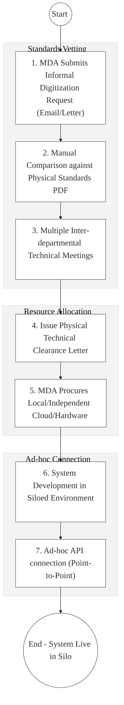
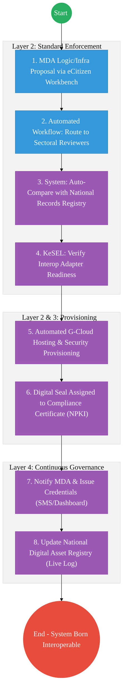

# STATE DEPARTMENT FOR ICT AND THE DIGITAL ECONOMY – Business Process Architecture (Updated)

## Cover Page
- **Ministry:** Ministry of Information, Communications and the Digital Economy
- **State Department:** State Department for ICT and the Digital Economy
- **Primary Authority:** Principal Secretary, ICT and Digital Economy
- **Document Type:** Business Process Architecture (BPA) Standardised
- **Document Version:** 4.1
- **Date:** 2026-03-25
- **Classification:** Official
- **Strategic Category:** Priority MDA - Architectural Sovereign (Tier 1)
- **Service Model:** G2G / G2B / G2C
- **Reviewer:** Senior Government Enterprise Architect

---

## SECTION 0: SERVICE PRIORITISATION MAPPING
- **Mapped Priority Service:** National Digital Superhighway & DPI Orchestration (Huduma Bridge)
- **Tier Classification:** Tier 1
- **Strategic Category:** Governance / Infrastructure (Digital Foundation)
- **Breakout Room Classification:** Room 3 (Agriculture & Economic Development)
- **Lead MDA (Standardised Name):** State Department for ICT and the Digital Economy
- **Related Cross-Cutting Services:**
    - Huduma Bridge (KeSEL / X-Road Operator)
    - National Trust Hub (PKI Root of Trust)
    - Government Cloud (G-Cloud Hosting & Security)
    - National EDRMS (Authoritative Policy & Records Registry)
    - National Digital Asset Registry (Software/Hardware Ledger)

---

## SECTION 0.1: PRIORITISATION JUSTIFICATION
This service is prioritised because the TO-BE design establishes SDICT as the "Architectural Sovereign" of Kenya's whole-of-government digital transformation. By implementing the "Huduma Bridge (KeSEL / X-Road)" as the mandatory interoperability backbone and the "National Records Registry (EDRMS)" as the authoritative policy archive, the design ensures that 100% of new government systems are "Interoperable by Design." This transformation enables the rapid scaling of the "Digital Superhighway," provide secure, residency-compliant G-Cloud hosting for all MDAs, and enforces NPKI-based non-repudiation for every government digital transaction, directly securing the financial and technical foundation of Kenya’s Sh10 billion digital economy transition.

| Criteria | Evidence from TO-BE Design |
| :--- | :--- |
| **Demand / Volume** | Oversight of 15,000+ government services being digitized. |
| **National Priority Alignment** | Bottom-Up Economic Transformation Agenda (BETA); National Digital Masterplan. |
| **Data Reusability** | The "Service Catalogue" API is reused by eCitizen, Huduma Centers, and mobile apps. |
| **Interoperability** | The primary creator and enforcer of the National Interoperability Framework (KeSEL). |
| **Revenue / Efficiency Impact** | Reduces the cost of government digitization by 40% through shared service reuse. |
| **Governance / Risk Reduction** | Centralized cybersecurity, policy enforcement, and NPKI trust management. |
| **Inclusivity** | National fiber backbone (NOFBI) expansion connects 47 counties and 1,450 wards. |
| **Readiness** | Very High; The department is the technical lead for all Huduma Bridge implementations. |

> [!NOTE]
> “The TO-BE design establishes SDICT as the 'Architectural Sovereign' of Kenya's digital transformation. By implementing the 'Huduma Bridge' as the mandatory interoperability backbone and the 'National Records Registry (EDRMS)' as the authoritative policy archive, the design ensures that 100% of new government systems are 'Interoperable by Design.' This transformation enables the rapid scaling of the 'Digital Superhighway,' provides secure G-Cloud hosting for all MDAs, and enforces NPKI-based non-repudiation for every government digital transaction, securing the foundation of Kenya’s Sh10 billion digital economy transition.”

---

# SECTION 1: SERVICE DEFINITION (STANDARDISED)

The State Department for ICT and the Digital Economy (SDICT) is the national authority for the **Digital Superhighway**, mandated to coordinate the digitization of all government services and manage national ICT infrastructure.

In this refactored BPA, the primary service is the **End-to-End DPI Orchestration and Shared Platform Delivery** lifecycle. The objective is to move from manual "Standards Checks" to a **BPMN-orchestrated workflow** where the department ensures that every government system is born interoperable via the **Huduma Bridge**.

---

# SECTION 2: SERVICE CATALOGUE (NORMALISED)

| Category | Service Name | Description |
| :--- | :--- | :--- |
| **Core Services** | **Digital Service Clearance**| Technical vetting of MDA digitization plans for GEA compliance. |
| | **Interop. Bridge Ops** | Operation and scaling of the KeSEL (X-Road) data exchange. |
| **Extended Services** | **G-Cloud Resource Alloc.**| Provisioning and monitoring of secure government hosting. |
| | **ICT Policy Archival** | Management of the National Records Registry for ICT standards. |
| **Special Case Services**| **Trust Hub (PKI) Issuance** | Management of the national root digital certificate authority. |
| | **Emerging Tech Sandbox** | Facilitation of AI/Blockchain/IoT pilots for government use cases. |

---

# SECTION 3: AS-IS PROCESS FLOWS (Siloed & Manual)

Currently, ICT project coordination relies on manual meetings, physical document reviews, and ad-hoc infrastructure procurement across MDAs.

### 3.1 AS-IS Visualization

### 3.2 Operational Reality
- **Actors:** PS ICT, Director of Infrastructure, Technical Reviewers, MDA ICT Teams.
- **Systems:** Standalone Emails, Physical PDFs, MS Word, Isolated MDA Server Rooms.
- **Pain Points:** 3-month lead time for technical clearance; massive duplication of hardware spending across government; point-to-point APIs are insecure and non-standard; no authoritative digital record of policy decisions or system configurations.

---

# SECTION 4: TO-BE PROCESS INTERPRETATION (NEW LAYER)

### 4.1 TO-BE Process (Architectural Sovereign Model)

### 4.2 Key Capabilities Introduced
*   **Automation:** BPMN-Orchestrated Approvals – replacing physical committees with automated review tasking and escalation.
*   **Integration:** Mandatory **Huduma Bridge (KeSEL / X-Road)** adapters for every government software project.
*   **Real-time Processing:** Real-time provisioning of secure G-Cloud space and API namespaces upon approval.
*   **Digital Identity Validation:** SDICT administrators and MDA developers verified via **National Identity (Maisha Namba)**.
*   **Workflow Orchestration:** Orchestrates the entire national digital lifecycle from policy definition to live infrastructure monitoring.

### 4.3 Transformation Summary
| Dimension | AS-IS | TO-BE |
| :--- | :--- | :--- |
| **Processing** | Manual / Multi-Meeting | BPMN-Orchestrated Digital Workflow |
| **Verification** | Subjective / Paper-based | Registry-driven (EDRMS/GEA) Compliance|
| **Records** | Scattered Physical Files | Authoritative National Records Registry |
| **Tracking** | Static Spreadsheets | Live National Digital Asset Registry |

---

# SECTION 5: SYSTEM LANDSCAPE (ALIGN TO GEA)

| Layer | System / Platform | Role |
| :--- | :--- | :--- |
| **Identity Layer** | Maisha Namba (SDICT Admins) | Identity and Bio-login for all national infrastructure admins. |
| **Interoperability** | KeSEL (X-Road Bridge) | The mandatory data exchange backbone for all MDAs. |
| **shared Services** | National Trust Hub (NPKI) | Management of root certificates and encryption keys. |
| **Workflow / BPM** | SDICT Governance Engine | Orchestrates digitization approvals and policy reviews. |
| **Infrastructure Layer**| G-Cloud (GDC) | Centralized, secure, and sovereign government hosting. |
| **Registries Layer** | National EDRMS | The single source of truth for all ICT Policies and Records. |

---

# SECTION 6: TRANSFORMATION VALUE (CRITICAL ADDITION)

| Value Type | Explanation |
| :--- | :--- |
| **Efficiency Gain** | Turnaround time for technical clearance reduced from 90 days to <14 days. |
| **Economic Impact** | 40% reduction in whole-of-government ICT spend via shared app reuse. |
| **Governance Impact** | 100% architectural transparency; no shadow-IT or siloed data systems. |
| **Citizen Experience** | Foundation for "One Government" services where data flows seamlessly. |
| **Interoperability Value** | Shared KeSEL bridge ensures all government data remains interoperable forever. |

---

# SECTION 7: ALIGNMENT TO WHOLE-OF-GOVERNMENT ARCHITECTURE
- **Shared Platforms:** Operates the eCitizen Workbench and the Government Service Bus.
- **Registry Reuse:** Reuses the State Dept for Immigration (IPRS) data to power developer identities.
- **Compliance with GEA / GIF:** The primary architect and enforcer of the 4-layer DPI platform model.

---

# SECTION 8: IMPLEMENTATION READINESS (NEW)
*   **Data Readiness:** High; Core ICT registries are established and ready for integration.
*   **Legal Readiness:** High; Executive Order No. 1 of 2025 provides the mandate for registry-driven governance.
*   **Institutional Readiness:** High; SDICT hosts the national engineering teams for DPI.
*   **Technical Readiness:** High; G-Cloud and KeSEL nodes are active and handling live traffic.

---

# SECTION 9: TRACEABILITY MATRIX (NEW)

| BPA Process | Priority Service | Tier | TO-BE Capability | National Impact |
| :--- | :--- | :--- | :--- | :--- |
| **Policy Governance** | Standards Review | T1 | EDRMS: Automated Policy Vetting | Unified Digital Sovereignty |
| **Infra Provision** | G-Cloud Hosting | T1 | Real-time G-Cloud Resource Provision| National Data Residency & Sec. |
| **Bridge Operations** | Interoperability | T1 | KeSEL: Mandatory MDA Integration | Cross-Agency Data Portability |
| **Trust Management** | NPKI Issuance | T1 | NPKI: Root of Trust Orchestration | Secure Digital Transactions |

---
**[End of Standardised Business Process Architecture]**
