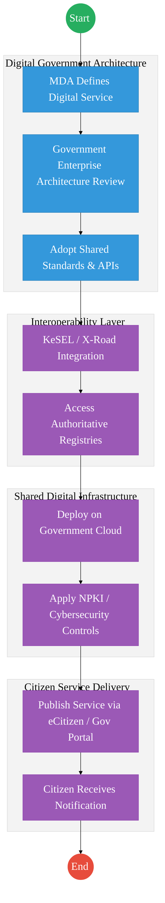

# ICT AND DIGITAL ECONOMY – Service Delivery

## Cover Page
- **Ministry/Department/Agency (MDA):** Ministry of Information, Communications and the Digital Economy
- **Department:** State Department for ICT and the Digital Economy
- **Process Name:** Digital Government Infrastructure and ICT Policy Coordination
- **Document Version:** 2.1
- **Date:** 2026-03-04
- **Classification:** Official
- **Strategic Category:** Priority MDA
- **Service Model:** G2G
- **Life-Cycle Group:** Cradle to Death (5. Social Protection & Justice)

---

## Service Mandate
**Official Website:** [www.ict.go.ke](https://www.ict.go.ke)

The State Department for ICT and Digital Economy is mandated to facilitate the development of the ICT sector and the digital economy to drive Kenya’s socio-economic transformation. Its core focus is on the Digital Superhighway to enhance government service delivery, create jobs, and foster innovation.

**Key Functions:**
- **Policy Formulation:** Developing policies, legal, and institutional frameworks for the ICT sector and the digital economy.
- **Digital Infrastructure:** Overseeing the expansion of the National Optic Fibre Backbone Infrastructure (NOFBI) and universal broadband access.
- **Digital Government Services:** Coordinating the digitization and automation of all government services through platforms like e-Citizen.
- **Digital Economy Promotion:** Supporting e-commerce, digital entrepreneurship, and the growth of the Business Process Outsourcing (BPO) sector.
- **ICT Standards & Governance:** Setting and enforcing ICT standards across the public service to ensure secure and integrated systems.
- **Digital Literacy & Skills:** Promoting digital talent development and literacy programs (e.g., Jitume and Ajira Digital).
- **Cybersecurity:** Developing frameworks to secure Kenya’s digital space and protect critical information infrastructure.
- **Innovation & Research:** Fostering an environment for ICT innovation and the adoption of emerging technologies like AI and Blockchain.

---

## Executive Summary
The State Department for ICT and the Digital Economy is the national policy authority responsible for the development, coordination, and governance of Kenya’s digital transformation agenda.

It provides strategic leadership for the development of digital public infrastructure, ICT policy frameworks, digital economy growth, and government technology standards.

The department coordinates multiple agencies including the ICT Authority, Communications Authority of Kenya, and Konza Technopolis Development Authority to ensure that government services are delivered through secure, interoperable, and citizen-centric digital platforms.

Under the Kenya Digital Economy Blueprint, the department is responsible for enabling digital government services, national connectivity infrastructure, innovation ecosystems, digital skills development, and cybersecurity frameworks.

The transition to a Digital Shared Services Architecture Platform (DSAP) and whole-of-government interoperability platforms (such as KeSEL / X-Road) will allow ministries, departments, and agencies (MDAs) to exchange data securely and provide seamless digital services to citizens and businesses.

---

## 1. AS-IS Process Flowchart (BPMN 2.0)
*Current State visualization of ICT governance and digital service implementation.*

```mermaid
%%{init: { 'theme': 'base', 'themeVariables': { 'fontSize': '24px', 'fontFamily': 'Inter, system-ui, sans-serif', 'primaryColor': '#ffffff', 'edgeLabelBackground':'#ffffff', 'tertiaryColor': '#f3f3f3', 'mainBkg': '#ffffff', 'nodeBorder': '#333333' } } }%%
graph TD
    Start((Start)) --> Need["Government Identifies Need for Digital Service"]
    
    subgraph Policy["Policy & Strategy Development"]
        direction TB
        Need --> PolicyDraft["Draft ICT Policy / Strategy"]
        PolicyDraft --> Stakeholder["Stakeholder Consultation"]
        Stakeholder --> Approval["Cabinet / Ministry Approval"]
    end
    
    subgraph Implementation["Project Implementation"]
        direction TB
        Approval --> ICTA["Submit Project to ICT Authority"]
        ICTA --> Review["Technical Review & Standards Check"]
        Review --> Procure["Procurement of ICT System"]
        Procure --> Build["System Development / Vendor Implementation"]
    end
    
    subgraph Deployment["Deployment & Operations"]
        direction TB
        Build --> Deploy["Deploy System to MDA"]
        Deploy --> Train["Train Government Officers"]
        Train --> Operate["Operate System (Standalone)"]
    end
    
    Operate --> End((End))

    classDef start fill:#27ae60,stroke:#27ae60,color:#fff,font-size:24px,font-size:24px;;
    classDef endNode fill:#e74c3c,stroke:#e74c3c,color:#fff,font-size:24px,font-size:24px;;
    classDef userTask fill:#3498db,stroke:#2980b9,color:#fff,font-size:24px,font-size:24px;;
    classDef gateway fill:#f1c40f,stroke:#f39c12,color:#333,font-size:24px,font-size:24px;;
    
    class Start start;
    class End endNode;
    class Need,PolicyDraft,Stakeholder,Approval,ICTA,Review,Procure,Build,Deploy,Train,Operate userTask;
```

---

## Process Overview
### Process Name
Digital Government Policy Coordination and ICT Infrastructure Enablement

### Service Category
- G2G (Government to Government)
- G2C (Government to Citizen – indirect through digital platforms)

### Scope
- **In Scope:** National ICT policy development; Digital government architecture and standards; Coordination of ICT projects across MDAs; Development of digital public infrastructure; Cybersecurity governance and digital trust frameworks.
- **Out of Scope:** Sector-specific service delivery (handled by respective MDAs).

### Triggers
- Government need for digital transformation or ICT-enabled service delivery.

### End States
- **Successful:** ICT policy approved; Digital platform or infrastructure deployed; Government service digitized and operational.

### Policy Context
- Constitution of Kenya (2010); Kenya Digital Economy Blueprint; Data Protection Act (2019); National ICT Policy; Kenya National Cybersecurity Strategy.

---

## Detailed Process (AS-IS)

| Step | Role | Action | Tool/System | Notes |
|---|---|---|---|---|
| 1 | MDA | Identifies need for digital service or ICT project | Internal | |
| 2 | State Department ICT | Develops ICT policy, strategy, or framework | Policy Documents | |
| 3 | ICT Authority | Reviews proposed ICT project for standards compliance | GEA / ICT Standards | |
| 4 | MDA / Vendor | Procures and develops ICT system | Vendor Systems | |
| 5 | MDA | Deploys and operates ICT system | Standalone Systems | |

---

## Pain Points & Opportunities
### Pain Points
- **Fragmented Systems:** Many MDAs develop standalone systems that do not integrate with other government platforms.
- **Duplication of Infrastructure:** Multiple agencies build similar systems without shared platforms.
- **Limited Interoperability:** Data exchange between MDAs is often manual or ad-hoc.
- **Inconsistent Standards:** Some ICT implementations bypass government enterprise architecture frameworks.

### Opportunities
- **Whole-of-Government Interoperability:** Adoption of KeSEL / X-Road architecture for secure data exchange.
- **Shared Digital Infrastructure:** Government cloud, national data centers, and shared digital platforms.
- **Digital Identity Integration:** Use of Maisha Namba / National Digital ID across government services.
- **Digital Trust Frameworks:** Use of National PKI and verifiable credentials for digital services.

---

## 2. TO-BE Process Flowchart (BPMN 2.0)
*Future State visualization (Kenya DSAP Architecture – Whole of Government Digital Platform).*

---

## Future State Process (TO-BE)
### Narrative
**TO-BE Process: Integrated Digital Government Service Delivery**

The State Department for ICT and the Digital Economy will transition government ICT implementation to a platform-based digital government architecture.

**Design Principles:**
- **Whole-of-Government Architecture:** All ICT projects must comply with Government Enterprise Architecture (GEA) standards before implementation.
- **Shared Infrastructure:** Digital services are deployed on government cloud and shared platforms, reducing duplication across MDAs.
- **Secure Data Exchange:** Government systems exchange data through KeSEL / X-Road, ensuring interoperability between authoritative registries.
- **Digital Trust:** All transactions use National PKI, digital signatures, and secure identity verification.
- **Citizen-Centric Service Delivery:** Services are published through eCitizen or government digital portals, enabling citizens to access services digitally without visiting physical offices.

### Optimized Steps (Digital)

| Step | Actor | Action | System |
|---|---|---|---|
| 1 | MDA | Designs digital service aligned with GEA | Digital Architecture Framework |
| 2 | ICT Authority | Validates architecture and integration requirements | GEA Compliance Portal |
| 3 | System | Integrates with authoritative registries via X-Road | KeSEL Bridge |
| 4 | Government Cloud | Hosts the digital service platform | Gov Cloud Infrastructure |
| 5 | Citizen | Accesses service digitally via portal or mobile device | eCitizen Platform |

---

## References
- Kenya Digital Economy Blueprint
- National ICT Policy
- Data Protection Act (2019)
- Government Enterprise Architecture (GEA) Framework
- ICT Authority Standards and Guidelines

---

### Validation Survey
Please provide your feedback here: [https://ee.kobotoolbox.org/x/4Ls7SlCG](https://ee.kobotoolbox.org/x/4Ls7SlCG)

