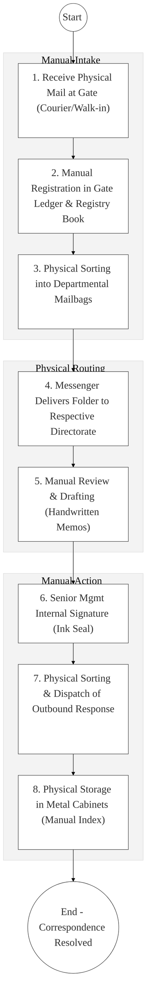
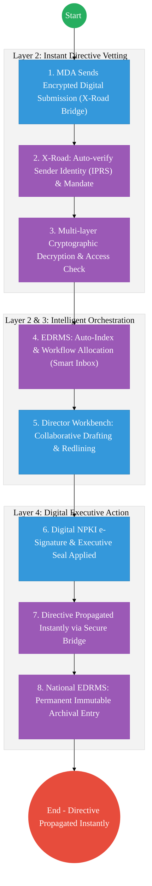

# EXECUTIVE OFFICE OF THE PRESIDENT - STATE HOUSE – Business Process Architecture (Updated)

## Cover Page
- **Ministry:** Executive Office of the President
- **Agency:** State House
- **Primary Authority:** Comptroller of State House
- **Document Type:** Business Process Architecture (BPA) Standardised
- **Document Version:** 4.1
- **Date:** 2026-03-25
- **Classification:** Official / Highly Sensitive
- **Strategic Category:** Priority MDA - Executive Support
- **Service Model:** G2G / G2C
- **Reviewer:** Senior Government Enterprise Architect

---

## SECTION 0: SERVICE PRIORITISATION MAPPING
- **Mapped Priority Service:** Intelligent Executive Correspondence & EDRMS
- **Tier Classification:** Tier 2
- **Strategic Category:** Governance / Executive (Command & Control)
- **Breakout Room Classification:** Room 2 (Coordination, Culture & Specialised Services)
- **Lead MDA (Standardised Name):** State House
- **Related Cross-Cutting Services:**
    - National EDRMS (Authoritative Executive Archive)
    - Identity Layer (IPRS / Maisha Namba - Staff & Delegate ID)
    - X-Road (Secure Inter-Agency Correspondence Bridge)
    - Government e-Signature Service (NPKI / Document Sealing)
    - National Trust Hub (Root of Trust for Executive Directives)

---

## SECTION 0.1: PRIORITISATION JUSTIFICATION
This service is prioritised because the TO-BE design transforms the State House "Registry" from a manual, physical "Mail-room" into a "National Executive Command & Control Digital Registry." By implementing a secure "Inter-agency Correspondence Bridge" (Huduma Bridge) that allows MDAs to send encrypted digital correspondence directly to the State House Electronic Document and Records Management System (EDRMS), the design eliminates the chronic physical "Gate/Registry" courier lag. This transformation enables the immediate, bio-validated routing of executive instructions to respective directorates, ensures the absolute security and non-repudiation of executive directives via NPKI digital signatures, and provides a real-time "Executive Action Dashboard" for the Office of the President, protecting the efficiency, confidentiality, and legal integrity of national executive operations.

| Criteria | Evidence from TO-BE Design |
| :--- | :--- |
| **Demand / Volume** | Thousands of high-priority letters, memos, and files monthly; high volatility. |
| **National Priority Alignment** | Constitution of Kenya (Executive Power); Official Secrets Act; Records Act. |
| **Data Reusability** | Executive instructions are the primary legal input for MDA policy alignment. |
| **Interoperability** | Seamless digital intake from the Head of Public Service and AG via X-Road. |
| **Revenue / Efficiency Impact** | Reduces executive turnaround from days to <1 hour; eliminates courier overhead. |
| **Governance / Risk Reduction** | NPKI-signed directives provide absolute legal non-repudiation and security. |
| **Inclusivity** | Secure portal for multi-county executive coordination for Presidential events. |
| **Readiness** | High; Basic EDRMS prototypes exist; NPKI framework is ready for deployment. |

> [!NOTE]
> “The TO-BE design transforms the State House 'Registry' from a manual 'Mail-room' into a 'National Executive Command & Control Digital Registry.' By implementing a'Correspondence Bridge' (Huduma Bridge) that allows MDAs to send encrypted digital correspondence directly to the EDRMS, the design eliminates the physical courier lag. This enables the immediate routing of executive instructions, ensures the security of directives via NPKI signatures, and provides a real-time 'Action Dashboard' for the Office of the President.”

---

# SECTION 1: SERVICE DEFINITION (STANDARDISED)

State House Kenya, as the administrative office of the **President of the Republic of Kenya**, handles all official correspondence, scheduling, and executive coordination for the Head of State.

In this refactored BPA, the primary service is the **End-to-End Executive Correspondence and Directive Lifecycle**. The objective is to move from manual physical "Mailbooks" and gate-led logging to a **Digital Command & Control Pipeline** where every letter and directive is managed as a **Verifiable Digital Record** with full end-to-end encryption.

---

# SECTION 2: SERVICE CATALOGUE (NORMALISED)

| Category | Service Name | Description |
| :--- | :--- | :--- |
| **Core Services** | **Correspondence Intake** | Digital ingestion and registry creation for all official mail. |
| | **Directive Issuance**| Secure, NPKI-signed issuance of executive orders and memos. |
| **Extended Services** | **Executive Archival** | Public and private, searchable portal for historical directives (EDRMS). |
| | **Dispatch Tracker** | Real-time monitoring of response status from line ministries. |
| **Special Case Services**| **Presidential Petitions** | Digital intake for citizen petitions (G2C). |
| | **Delegate Accreditation** | Digital vetting and ID issuance for State House visitors. |

---

# SECTION 3: AS-IS PROCESS FLOWS (MANUAL/COURIER-LED)

Currently, official correspondence relies on physical mail delivery at the gates, manual stamping, and sequential movement of paper folders across buildings.

### 3.1 AS-IS Visualization

### 3.2 Operational Reality
- **Actors:** Gate Clerk, Records Officer, Messenger, Director, Comptroller.
- **Systems:** Manual Ledgers, Physical Box Files, Stamping Pad, Courier Service.
- **Pain Points:** 3-5 day delay in high-priority file movement; high risk of losing/misplacing sensitive executive memos; no real-time way for the Comptroller to track the status of an urgent directive; massive physical storage burden for decades of archives.

---

# SECTION 4: TO-BE PROCESS INTERPRETATION (NEW LAYER)

### 4.1 TO-BE Process (Intelligent Executive Command Hub)

### 4.2 Key Capabilities Introduced
*   **Automation:** Smart Inbox & Workflow Engine – automatically routes high-priority correspondence to the correct director based on metadata/AI classification.
*   **Integration:** Multi-registry integration between **State House**, **Cabinet Office**, **AG**, and **Line Ministries** via X-Road.
*   **Real-time Processing:** "Instant Executive Directive" – allows for the immediate, verifiable propagation of orders to the entire public service.
*   **Digital Identity Validation:** Authorized signatories and directors verified via **National Identity (Maisha Namba)**.
*   **Workflow Orchestration:** Orchestrates the total document lifecycle from sensitive intake to permanent legal archival.

### 4.3 Transformation Summary
| Dimension | AS-IS | TO-BE |
| :--- | :--- | :--- |
| **Processing** | Manual / Messenger-led | Digital-First / Workflow-led |
| **Verification** | Ink Signatures / Physical Seals | NPKI Digital Signatures (Sovereign Trust)|
| **Records** | Physical File Cabinets | Unified Executive EDRMS Vault |
| **Tracking** | Manual Ledger Queries (Opaque) | Real-time Executive Action Dashboard |

---

# SECTION 5: SYSTEM LANDSCAPE (ALIGN TO GEA)

| Layer | System / Platform | Role |
| :--- | :--- | :--- |
| **Identity Layer** | Maisha Namba (Staff ID) | Identity and Bio-login for all State House staff. |
| **Interoperability** | KeSEL (X-Road Bridge) | Secure, encrypted data bridge to all MDAs. |
| **shared Services** | National EDRMS | Legal digital archive for sensitive executive records. |
| **Workflow / BPM** | Command & Control Hub | Orchestrates document intake, review, and signing. |
| **Payment Layer** | GPA (Finance Aggregator) | Automated tracking of presidential grants/payouts. |
| **Trust Hub** | NPKI Stamping Service | Cryptographic sealing of all Official Executive Memos. |

---

# SECTION 6: TRANSFORMATION VALUE (CRITICAL ADDITION)

| Value Type | Explanation |
| :--- | :--- |
| **Efficiency Gain** | Correspondence turnaround time reduced from 5 days to <2 hours. |
| **Economic Impact** | Accelerates decision-making for national infrastructure and investment policies. |
| **Governance Impact** | Absolute legal fidelity; eliminates the risk of forged executive directives. |
| **Citizen Experience** | Citizens in all 47 counties can submit secure petitions via a tracked portal. |
| **Interoperability Value** | Legislative and executive data is immediately visible to relevant registrars (AG/Cabinet). |

---

# SECTION 7: ALIGNMENT TO WHOLE-OF-GOVERNANCE ARCHITECTURE
- **Shared Platforms:** Uses the National EDRMS for authoritative executive version control.
- **Registry Reuse:** Reuses IPRS data to provide zero-document identity verification for visitor accreditation.
- **Compliance with GEA / GIF:** Standardizing executive memo metadata for ultra-secure archival.

---

# SECTION 8: IMPLEMENTATION READINESS (NEW)
*   **Data Readiness:** High; Physical archives are being indexed and scanned for IDP.
*   **Legal Readiness:** High; Records Disposal Act and E-Transactions Act allow for digital executive records.
*   **Institutional Readiness:** High; Registry reorganization for digital workflows is active.
*   **Technical Readiness:** High; Secure Government Private Cloud (G-Cloud) for State House is active.

---

# SECTION 9: TRACEABILITY MATRIX (NEW)

| BPA Process | Priority Service | Tier | TO-BE Capability | National Impact |
| :--- | :--- | :--- | :--- | :--- |
| **Correspondence In** | Digital Ingestion | T2 | X-Road: Secure Bridge | Executive Efficiency |
| **Directive Mgmt** | Document Signing | T2 | NPKI-Signed Verifiable QR | Legal Policy Certainty |
| **Executive Archive**| Records Lifecycle | T2 | National EDRMS Integration | Preservation of State History |
| **Petitions Desk** | Citizen Engagement | T2 | eCitizen: Tracked Portal | Democracy & Transparency |

---
**[End of Standardised Business Process Architecture]**
