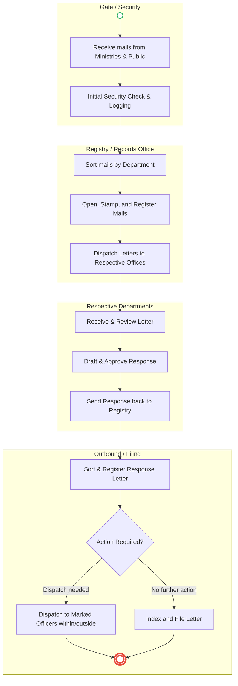
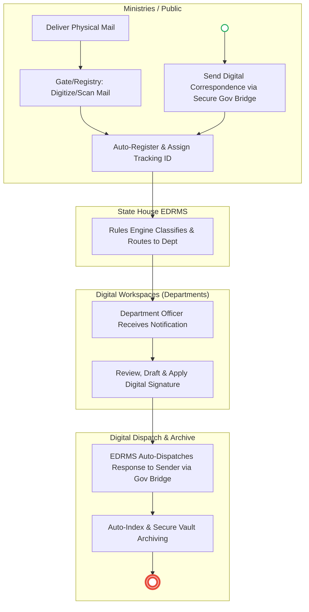

# STATE HOUSE – Service Delivery

## Cover Page
- **Ministry/Department/Agency (MDA):** Executive Office of the President - State House
- **Department:** Records Management / Registry
- **Process Name:** Official Correspondence and Mail Management
- **Document Version:** 1.1
- **Date:** 2026-03-18
- **Classification:** Official
- **Strategic Category:** Priority MDA
- **Life-Cycle Group:** Government Administration
- **Breakout Room:** Executive Services
- **Facilitator:** Auto-generated

---

## Service Mandate
State House Kenya serves as the official residence and administrative office of the President of the Republic of Kenya. Its primary mandate is to provide the necessary support to the President in the execution of their constitutional duties as the Head of State, Head of Government, and Commander-in-Chief of the Kenya Defence Forces.

**Official Website:** [https://www.statehouse.go.ke](https://www.statehouse.go.ke)

**Key Functions:**
- **Executive Support:** Facilitating the President's daily operations, including scheduling, correspondence, and administrative management.
- **Policy Coordination:** Assisting in the formulation and implementation of national policies and government agendas.
- **State Ceremonies:** Organizing and hosting official state functions, including the reception of foreign dignitaries and national holiday celebrations.
- **Communication:** Managing the President's public relations, press releases, and official communications to the nation.
- **Advisory Services:** Providing the President with strategic advice on national and international matters through specialized directorates.
- **Inter-Governmental Relations:** Facilitating coordination between the Executive and other arms of government and County Governments.

---

## Executive Summary
The State House serves as the executive office of the President, interacting daily with numerous ministries, departments, and external entities. A critical operational process is the receipt, sorting, dispatch, and tracking of official correspondence (mail and letters). Currently, this process is highly manual, relying on physical mail handling at the gates, physical stamping, manual ledgers for registration, and physical dispatch to respective offices. This leads to delays, misplaced correspondence, and a lack of real-time traceability. The proposed digital architecture envisions an Electronic Document and Records Management System (EDRMS) integrated with a secure inter-agency correspondence bridge to digitize inbound mail at the source, automate routing, and enable seamless tracking of responses.

---

### 1.1 AS-IS Process Flow (BPMN 2.0)

---

## Process Overview
### Process Name
Official Correspondence and Mail Management

### Service Category
- G2G (Government to Government)
- G2C (Government to Citizen)

### Scope
- **In Scope:** Receipt of physical mail at the gate, sorting, registry logging, internal dispatch, response formulation, outbound dispatch, and physical filing/indexing.
- **Out of Scope:** Execution of the actual executive directives contained within the letters (varies by department).

### Triggers
- **Event-based:** Arrival of physical letters or parcels from ministries, agencies, or the public at the State House gates.

### End States
- **Successful Dispatch:** Letter is responded to and dispatched to the appropriate internal or external officer.
- **Successful Archival:** Letter is completely processed, indexed, and securely filed in the registry.

### Policy Context
- Records Disposal Act; Official Secrets Act; Public Service Commission (PSC) records management guidelines.

---

## Detailed Process (AS-IS)

| Step | Role | Action | Tool/System | Notes |
| :--- | :--- | :--- | :--- | :--- |
| 1 | Gate Clerk | Receives mails from ministries and registers them initially at the gate. | Manual Ledger | Initial point of entry and physical security screening. |
| 2 | Records Officer | Sorts the received mails according to their respective target departments. | Manual Sorting | High volume sorting can lead to delays. |
| 3 | Records Officer | Opens, stamps, and registers the mail into the official registry ledgers based on the department. | Manual Ledgers / Stamps | Time-consuming data entry and prone to manual errors. |
| 4 | Records Officer | Dispatches the physical letters to the respective offices/departments within State House. | Physical Dispatch Books | Hard to track exactly when an officer receives the letter. |
| 5 | Department Officer | Reviews the letter, drafts a response, obtains approvals, and returns the response to the Registry. | Physical Files / Word Processors | Turnaround time is not systematically tracked. |
| 6 | Registry Clerk / Support | Receives the response, sorts, registers, and dispatches it to marked officers (within or outside). Other finalized letters are indexed and filed. | Manual Ledgers / Filing Cabinets | Physical storage requires extensive space and retrieval is slow. |

---

## Pain Points & Opportunities
### Pain Points
- **Manual Movement:** The physical movement of paper causes significant bottlenecks and delays in executive decision-making.
- **Loss and Damage:** High risk of losing, misplacing, or damaging sensitive official documents during transit between departments.
- **Lack of Traceability:** Manual ledgers make it extremely difficult to track the real-time status of a letter or enforce Service Level Agreements (SLAs) for responses.
- **Storage Constraints:** Physical indexing and filing require extensive physical space and make historical retrieval cumbersome.

### Opportunities
- **Digital Registration (EDRMS):** Implementing a centralized Electronic Document and Records Management System (EDRMS) to digitize, index, and route all correspondence instantly.
- **Interoperability (Gov Bridge):** Integrating with a secure Government Service Bus to allow Ministries to send encrypted electronic correspondence directly to the EDRMS, bypassing physical mail delivery entirely.
- **Automated Workflows:** Using rules engines to automatically route digitized mail to the correct department and track response turnaround times.
- **Digital Signatures:** Enabling executive officers to review and digitally sign responses securely from anywhere, speeding up dispatch.

---

### 1.2 TO-BE Process (BPMN 2.0 - Unified Digital Architecture)

## Future State Process (TO-BE)
### Narrative
**TO-BE Process: Intelligent & Secure Correspondence Management**

**Design Principles:**
- **Digital-First Entry:** The process shifts away from physical paper. External ministries will submit correspondence electronically via a secure **Government Interoperability Bridge**. For unavoidable physical mail, scanning and digitization occur immediately at the gate/registry, converting it into a secure digital asset.
- **Automated Routing & Traceability:** The **Electronic Document and Records Management System (EDRMS)** automatically assigns a unique tracking ID to every piece of mail. Using intelligent rules, the system routes the document to the correct departmental dashboard and alerts the respective officers. Turnaround times are automatically tracked to enforce SLAs.
- **Secure Dispatch & Archival:** Responses are drafted within the system, authorized using **NPKI Digital Signatures**, and instantly dispatched back to the sender electronically. All records, including the original mail and the response, are automatically indexed and stored in a secure digital vault, ensuring zero loss and immediate retrieval capabilities.

### Optimized Steps (Digital)

| Step | Actor | Action | Tool / System |
| :--- | :--- | :--- | :--- |
| 1 | Ministry/Citizen | Submits correspondence digitally or delivers physical mail which is instantly scanned at entry. | Secure Gov Bridge / Digital Scanner |
| 2 | System | Automatically registers the document, assigns a tracking ID, and extracts metadata. | EDRMS |
| 3 | System | Routes the digitized document to the appropriate department based on predefined rules. | EDRMS Workflow Engine |
| 4 | Department Officer | Receives an alert, reviews the document, and drafts a digital response. | Digital Workspace / EDRMS |
| 5 | Authorized Officer | Approves the response by applying a secure digital signature. | NPKI Service |
| 6 | System | Automatically dispatches the response electronically and archives the entire thread in a secure vault. | Gov Bridge / Secure Vault |

---

## References
- Records Disposal Act
- Public Service Commission (PSC) Records Management Guidelines
- Official Secrets Act

---

### Validation Survey
Please provide your feedback here: [https://ee.kobotoolbox.org/x/4Ls7SlCG](https://ee.kobotoolbox.org/x/4Ls7SlCG)
