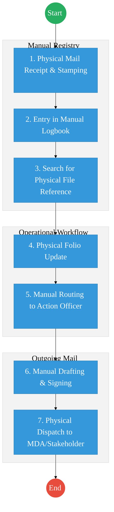
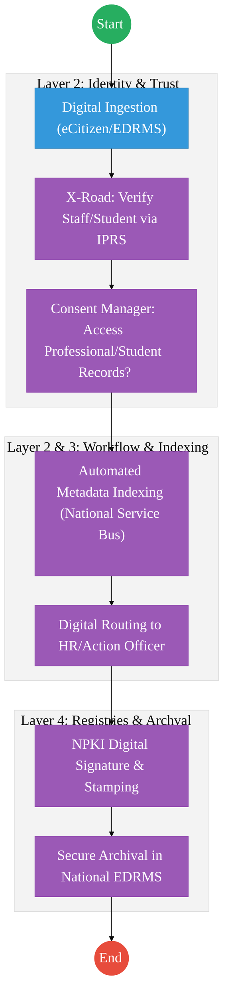

# PART 1: EXECUTIVE SUMMARY

The refined records management process for the State Department for TVET aligns with the **National ICT Policy (2019)**, **Government ICT Standards**, and **Electronic Records Management Standards**. This transformation shifts the department from a manual-heavy registry to a **digitally-indexed, workflow-driven environment**. 

Key objectives include:
- **Registry Modernization:** Reducing manual logging and stamping through digital ingestion and automated file tracking.
- **Legal Alignment:** Ensuring strict compliance with **KNADS (Kenya National Archives and Documentation Service)** protocols for record appraisal and disposal.
- **Operational Efficiency:** Integrating the **E-paper directive** to minimize physical document handling while maintaining a secure audit trail for all records, including **HR Personal Files**.
- **DPI Integration:** Linking with **IPRS** for identity verification and establishing a hybrid rollout for the **Electronic Document and Records Management System (EDRMS)**.

---

# PART 2: AS-IS PROCESS (CURRENT REALITY)

The current state of TVET records management is characterized by high manual intervention, leading to delays in file retrieval and mail dispatch.

---

# PART 3: TO-BE PROCESS (DPI-ENABLED)

The TO-BE state transforms the registry into a digitally-indexed, workflow-driven environment.

---

# PART 4: UPDATED RECORDS MODEL

The TVET records ecosystem is expanded to include specialized registries with standardized metadata:

### 2.1 HR Personal Files (Mandatory Registry)
All staff records must be maintained within the EDRMS with the following structure:
- **Unique Identifier:** Personal Number (e.g., P/No. 12345678).
- **Core Metadata:** Full Name, National ID (IPRS Verified), Designation, Grade, Date of First Appointment, Academic Qualifications.
- **File Structure:** Appointment Letter, Personal Details Form, Academic Certificates, Promotion Letters, Disciplinary Records (if any).

### 2.2 Institutional & Curriculum Records
- **TVET Provider Files:** Registration status, accreditation reports, and quality audits.
- **Curriculum & Assessment:** CDACC (Curriculum Development, Assessment and Certification Council) records, trade test results, and assessment frameworks.

---

# PART 3: ARCHITECTURE ALIGNMENT (KENYA HUDUMA BRIDGE)

The TVET Records and Institutional Management Service is engineered to operate across the four layers of the **Kenya DSAP Architecture**:

### Layer 1: Access Channels
- **Officer Workbench (EDRMS):** The primary interface for Registry Officers, HR, and Action Officers to manage digital files and workflows.
- **eCitizen / TVET Portal:** A unified window for institutions to submit accreditation data and for students to access certificates.
- **Huduma Centers:** Physical points for the intake and scanning (IDP) of manual certificates and institution registration documents.

### Layer 2: Core Platform
- **Workflow Engine (BPMN 2.0):** Orchestrates the record lifecycle (Ingestion → Indexing → Routing → Active Use → Appraisal → Disposal).
- **Trust Hub:**
  - **Consent Manager:** Consulted before sharing a student's academic history or an employee's HR file with other MDAs via X-Road.
  - **Identity Federation:** Real-time verification of student/staff identity via **Maisha Namba (IPRS)**.
  - **NPKI:** Digitally signing **HR Appointment Letters**, **Certificates/Diplomas**, and **Official Mails** to ensure non-repudiation.
- **Shared Services:**
  - **Intelligent Document Processing (IDP):** Digitizing millions of historical TVET student records and HR files into the National EDRMS.
  - **Document Generator:** Automated creation of verifiable accreditation certificates and academic transcripts with secure QR codes.
  - **Notifications:** SMS/Email alerts for dispatch tracking and upcoming appraisal deadlines.

### Layer 3: Interoperability (Huduma Bridge)
- **KeSEL (X-Road):** Secure data exchange between TVET, **KNQA (Qualifications Registry)**, **BRS (Institutional registration)**, and **PSC (HR data)**.
- **Central Service Catalogue:** Cataloguing TVET-related APIs for national educational verification.

### Layer 4: Authoritative Registries & Payments
- **Registries:**
  - **National EDRMS:** The definitive legal digital archive for all signed records, historical files, and curriculum artifacts.
  - **TVET Institutional Registry:** The sector-specific authoritative source for accredited TVET providers and programs.
  - **IPRS / Maisha Namba:** Foundational person registry for student and staff identification.
- **Payments:** **Government Payment Aggregator (GPA)** for processing accreditation fees, trade test charges, and student-related revenue.

---

# PART 4: COMPLIANCE & GOVERNANCE

### 4.1 KNADS & Legal Compliance
- **Disposal Authority:** No record (physical or digital) shall be destroyed without written approval from **KNADS** (Public Archives Act Cap. 19).
- **Metadata Schemas:** Adherence to government-wide schemas for interoperability during inter-agency file transfers.
- **Audit Trails:** Mandatory non-repudiation logs tracking every interaction with sensitive records (especially HR and Assessment files).

### 4.2 Capacity Building & Change Management
- **EDRMS Training:** Systematic upskilling of registry staff and action officers on digital filing and security.
- **Records Management Skills:** Training on the Data Protection Act 2019 and modern archival standards.
- **Executive Literacy:** Upskilling leadership on navigating digital registries for faster decision-making.

---

# PART 5: CHANGE LOG

| Area | Original Issue | Change Made | Impact |
|---|---|---|---|
| **Standards** | General reference to law. | Included **National ICT Policy (2019)** and **Electronic Records Standards**. | Alignment with modern government ICT frameworks. |
| **HR Records** | Not explicitly modeled. | Added **HR Personal Files** with **Personal Number** as unique ID. | Centralized and secure staff records management. |
| **Workflow** | Focus on receipt only. | Added **Dispatch of Mails to MDAs/Stakeholders**. | Complete end-to-end communication tracking. |
| **Manual Work** | High reliance on stamps. | Introduced **Digital Indexing & File Tracking**. | Reduced processing time and loss of physical files. |
| **Compliance** | Minimal detail on disposal. | Included **KNADS Approval** and **Audit Trail** requirements. | Legal protection and accountability in record disposal. |

---

## References
- National ICT Policy (2019)
- Public Archives and Documentation Service Act (Cap. 19)
- Data Protection Act 2019
- Government ICT Standards (ISO 15489 Alignment)

---

### Validation Survey
Please provide your feedback here: [https://ee.kobotoolbox.org/x/4Ls7SlCG](https://ee.kobotoolbox.org/x/4Ls7SlCG)

