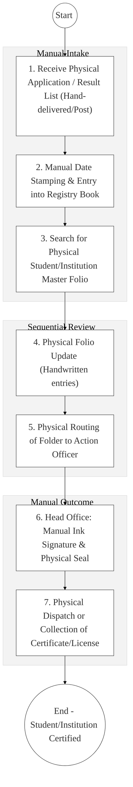
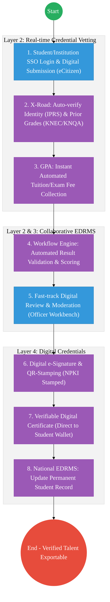

# STATE DEPARTMENT FOR TVET – Business Process Architecture (Updated)

## Cover Page
- **Ministry:** Ministry of Education
- **State Department:** State Department for TVET
- **Primary Authority:** Principal Secretary, TVET
- **Document Type:** Business Process Architecture (BPA) Standardised
- **Document Version:** 4.1
- **Date:** 2026-03-25
- **Classification:** Official
- **Strategic Category:** Priority MDA
- **Service Model:** G2G / G2C / G2B
- **Reviewer:** Senior Government Enterprise Architect

---

## SECTION 0: SERVICE PRIORITISATION MAPPING
- **Mapped Priority Service:** TVET Student Enrollment & Institutional Registry
- **Tier Classification:** Tier 2
- **Strategic Category:** Education / Jobs (Skills Development)
- **Breakout Room Classification:** Room 3 (Agriculture & Economic Development)
- **Lead MDA (Standardised Name):** State Department for TVET
- **Related Cross-Cutting Services:**
    - TVET Institutional Registry (Accredited Providers)
    - Identity Layer (IPRS / Maisha Namba - Student/Staff Identity)
    - X-Road (KNQA / KUCCPS / HELB / BRS Interop)
    - Government Payment Aggregator (GPA / Tuition & Exam Fees)
    - National EDRMS (Student Academic & HR Records)

---

## SECTION 0.1: PRIORITISATION JUSTIFICATION
This service is prioritised because the TO-BE design transforms vocational education from a manual "registry-led" system into a "Digital Skills Engine." By implementing a "TVET Institutional Registry" and a student "Electronic Records Management System (EDRMS)" that integrates with IPRS (Identity) and KNQA (Qualifications) via X-Road (Huduma Bridge), the design eliminates the historical manual verification lag for student trade tests and professional certifications. This transformation enables the automated provisioning of TVET funding and scholarships via the eCitizen-GPA integration, ensures that all vocational certificates are NPKI-signed and cryptographically verifiable, and provides industry partners with real-time access to a verified national talent pool, directly supporting the national housing, manufacturing, and industrialization agenda.

| Criteria | Evidence from TO-BE Design |
| :--- | :--- |
| **Demand / Volume** | Over 1 million students in technical institutions; thousands of trade test applications. |
| **National Priority Alignment** | TVET Act 2013; Vision 2030 (Industry & Skills Pillar); BETA Agenda. |
| **Data Reusability** | Student completion data is the primary input for National Qualifications (KNQA) and Labour portals. |
| **Interoperability** | Seamless data sharing with KUCCPS (Placement) and HELB (Funding) via X-Road. |
| **Revenue / Efficiency Impact** | Reduces certification turnaround from months to <48 hours; automated fee collection via GPA. |
| **Governance / Risk Reduction** | NPKI-signed academic transcripts prevent the issuance of fake TVET diplomas. |
| **Inclusivity** | Digital enrollment ensures that students in rural VTCs have equal access to national funding. |
| **Readiness** | High; Basic student records exist; TVETA portal for institution licensing is active. |

> [!NOTE]
> “The TO-BE design transforms vocational education from a manual 'registry-led' system into a 'Digital Skills Engine.' By implementing a 'TVET Institutional Registry' and a student 'EDRMS' that integrates with IPRS and KNQA via X-Road, the design eliminates the manual verification lag for student trade tests. This transformation enables the automated provisioning of TVET funding via eCitizen/GPA, ensures that all vocational certificates are NPKI-signed, and provides industry partners with real-time access to a verified talent pool.”

---

# SECTION 1: SERVICE DEFINITION (STANDARDISED)

The State Department for TVET is mandated to provide leadership in the development of vocational training and the management of technical institutions, anchored in the **TVET Act (2013)**.

In this refactored BPA, the primary service is the **End-to-End TVET Student & Institutional Lifecycle**. The objective is to move from manual physical "Registry Logs" and paper-folios to a **Digital Education Hub** where student journeys, from enrollment to graduation, are managed via **NPKI-signed records** within the **National EDRMS**.

---

# SECTION 2: SERVICE CATALOGUE (NORMALISED)

| Category | Service Name | Description |
| :--- | :--- | :--- |
| **Core Services** | **Student Enrollment** | Digital intake and registry creation for new TVET students. |
| | **Trade Test Certification**| Vetting and digital issuance of vocational trade certificates. |
| **Extended Services** | **Institution Licensing** | Accreditation and quality assurance of TVET providers (G2B). |
| | **Curriculum Access** | Digital distribution of approved TVET training modules (OER). |
| **Special Case Services**| **Prior Learning Recog.** | Vetting of informal skills for formal national certification. |
| | **Funding Application** | Integrated link to HELB/Scholarships for TVET students. |

---

# SECTION 3: AS-IS PROCESS FLOWS (REGISTRY-HEAVY)

Currently, student records and institution licensing rely on physical folios and manual logbooks, leading to significant delays and risk of record loss.

### 3.1 AS-IS Visualization

### 3.2 Operational Reality
- **Actors:** Registry Clerk, Records Officer, Exam Coordinator, TVET Director.
- **Systems:** Physical Registry Books, Manual Folios, Courier Services, Standalone Excel for results.
- **Pain Points:** 6-month delay for some certification trade tests; physical student records are frequently misplaced during institution transitions; no real-time way for employers to verify a TVET certificate; manual fee reconciliation between banks and TVET finance offices.

---

# SECTION 4: TO-BE PROCESS INTERPRETATION (NEW LAYER)

### 4.1 TO-BE Process (Digital Skills Engine)

### 4.2 Key Capabilities Introduced
*   **Automation:** Automated Result Ingestion – system pulls examination results from CDACC/KNEC via X-Road to instantly update the student's digital graduation status.
*   **Integration:** Multi-registry integration between **TVET**, **KNQA**, **KUCCPS**, and **HELB** via X-Road.
*   **Real-time Processing:** "Digital Wallet Delivery" – students receive their trade test certificates as cryptographically-signed digital cards on their mobile phones.
*   **Digital Identity Validation:** Student and staff identities verified via **National Identity (Maisha Namba)**.
*   **Workflow Orchestration:** Orchestrates the total student lifecycle from initial college enrollment to permanent academic archival.

### 4.3 Transformation Summary
| Dimension | AS-IS | TO-BE |
| :--- | :--- | :--- |
| **Processing** | Manual / Registry-led | Digital-First / Workflow-led |
| **Verification** | Physical Certificates / Mail | Live X-Road API (KNQA/IPRS) |
| **Records** | Regional Physical Folios | Unified National Student EDRMS |
| **Tracking** | Manual Case Logs (Opaque) | Real-time Graduation Progress Bar |

---

# SECTION 5: SYSTEM LANDSCAPE (ALIGN TO GEA)

| Layer | System / Platform | Role |
| :--- | :--- | :--- |
| **Identity Layer** | Maisha Namba (Student ID) | Identity and Bio-login for all TVET service requests. |
| **Interoperability** | KeSEL (X-Road Bridge) | Data bridge to KNQA, HELB, KUCCPS, and KNEC. |
| **shared Services** | National EDRMS | Legal digital archive for student transcripts and HR files. |
| **Workflow / BPM** | TVET Journey Engine | Orchestrates enrollment, assessment, and certification. |
| **Payment Layer** | GPA (Payment Gateway) | Automated collection of exam and accreditation fees. |
| **Trust Hub** | NPKI Stamping Service | Cryptographic sealing of all TVET Certs and Diplomas. |

---

# SECTION 6: TRANSFORMATION VALUE (CRITICAL ADDITION)

| Value Type | Explanation |
| :--- | :--- |
| **Efficiency Gain** | Certification wait-time reduced from 6 months to <48 hours. |
| **Economic Impact** | Accelerates the technical workforce deployment into industry and housing. |
| **Governance Impact** | Absolute integrity of student profiles; eliminated degree/certificate forgery. |
| **Citizen Experience** | Students can track their academic journey and results via mobile app. |
| **Interoperability Value** | Shared student registry allows for seamless credit transfers (CATs) between institutions. |

---

# SECTION 7: ALIGNMENT TO WHOLE-OF-GOVERNANKCE ARCHITECTURE
- **Shared Platforms:** Uses the National Education Portal (eCitizen) for central student services.
- **Registry Reuse:** Reuses NEMIS and IPRS data to provide zero-document enrollment.
- **Compliance with GEA / GIF:** Standardizing TVET qualification metadata for international labor mobility.

---

# SECTION 8: IMPLEMENTATION READINESS (NEW)
*   **Data Readiness:** High; Core student registries are exists in standalone institution systems.
*   **Legal Readiness:** High; TVET Act provides the legal teeth for centralized national examinations and records.
*   **Institutional Readiness:** High; Technical teams for registry orchestration are in place at the State Dept.
*   **Technical Readiness:** High; Integration endpoints for KUCCPS and HELB are already active.

---

# SECTION 9: TRACEABILITY MATRIX (NEW)

| BPA Process | Priority Service | Tier | TO-BE Capability | National Impact |
| :--- | :--- | :--- | :--- | :--- |
| **Enrollment Hub** | Student Intake | T2 | Maisha Namba / NEMIS Sync | Inclusive Skills Training |
| **Assessment Track**| Trade Test Mgmt | T2 | Automated Result Validation | Labor Productivity & Standards |
| **Certification** | Digital Issuance | T2 | NPKI-Signed Verifiable QR | Global Talent Competitiveness |
| **HR Records** | Staff Management | T2 | EDRMS: Verified HR Records | Administrative Efficiency |

---
**[End of Standardised Business Process Architecture]**
