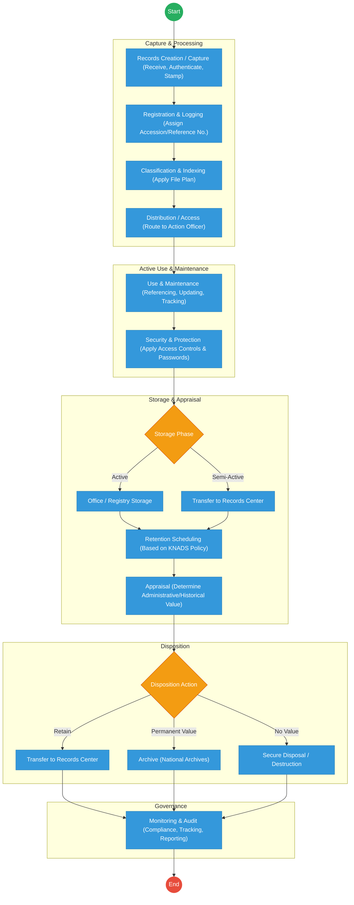

# STATE DEPARTMENT FOR TVET – Records Management Processes

## Cover Page
- **Ministry/Department/Agency (MDA):** State Department for TVET
- **Process Name:** Records Management Processes
- **Document Version:** 2.0
- **Date:** 2026-03-17
- **Classification:** Official

---

## Executive Summary
The State Department for TVET manages its records following a strict lifecycle approach: **Creation → Use → Maintenance → Storage → Archival → Disposal**. This process ensures compliance with legal requirements including the Kenya National Archives and Documentation Service (KNADS) Cap. 19, the Data Protection Act 2019, Public Service Commission guidelines, and ICT Authority standards. The process governs both physical and digital records, managing their journey from initial capture to permanent preservation or secure destruction.

---

## 1. AS-IS Process Flowchart (BPMN 2.0)
*Current State visualization of the Records Management Lifecycle.*

---

## 2. Detailed Process Steps (AS-IS)

### 2.1 Records Creation / Capture
This is the starting point. It involves creating records (letters, emails, reports, forms) or capturing incoming records from external sources into a manual registry system.
- **Key Actions:** Receive records, confirm authenticity, date stamp (for ownership), register in incoming/outward mail registers, assign reference/accession numbers, and submit to HOD for marking.

### 2.2 Records Classification & Indexing
Organizing records systematically for easy retrieval.
- **Key Actions:** Apply subject-based file classification schemes. Index records using keywords, dates, departments, or numerical/alphanumerical classifications. Group related records into files.

### 2.3 Records Distribution & Access
Making records available to the right users while maintaining tracking.
- **Key Actions:** Mark mails to action officers, file to subject files, log in the file movement register, and route to relevant officers. 
- **Controls:** Apply authorization levels and confidentiality classifications (public, restricted, confidential).

### 2.4 Records Use & Maintenance
Captures how records are actively used in daily operations.
- **Key Actions:** Referencing records for decision-making, updating files, and maintaining physical file integrity (preventing loss or tampering).

### 2.5 Records Security & Protection
Ensuring records are safe and compliant with the Data Protection Act 2019.
- **Key Actions:** Physical security (lockable cabinets, restricted registry access), digital security (passwords, encryption, access logs), and disaster preparedness (cloud storage backups for floods/fire).

### 2.6 Records Storage (Active & Semi-Active)
- **Active Records:** Kept in offices/registries for frequent use.
- **Semi-Active Records:** Transferred to records centers. Requires organized storage systems with environmental controls (temperature, humidity).

### 2.7 Records Retention Scheduling & Appraisal
Determining the lifespan and value of records according to KNADS Cap. 19.
- **Retention Scheduling:** Defining the retention period and final action (archive or destroy).
- **Appraisal:** Evaluating records for Administrative, Legal, Financial, or Historical value to determine if they go to the National Archives or are destroyed.

### 2.8 Records Transfer, Archival, or Disposal
- **Transfer:** Moving records to a records center (semi-active) or National Archives (permanent).
- **Archival Preservation:** Long-term physical and digital preservation, including digitization and controlled public access.
- **Disposal/Destruction:** Secure elimination (shredding paper, secure deletion of digital records) requiring formal disposal authorization and certificates.

### 2.9 Records Monitoring & Audit
Ensuring compliance and efficiency.
- **Key Actions:** Conducting records audits and inspections, tracking file movement, identifying gaps, and ensuring adherence to Government policies.

---

## 3. Legal & Policy Compliance Matrix
All records management processes strictly align with:
1. Public Archives and Documentation Service Act (Cap. 19)
2. Data Protection Act 2019
3. Public Service Commission (PSC) Guidelines
4. ICT Authority (ICTA) Standards
5. GoK Policies and Guidelines

---

## 4. Digitization & Automation Opportunities (TO-BE Context)
While the current process is well-structured legally, it relies heavily on manual file movement registers and physical stamping. Implementing an **Electronic Document and Records Management System (EDRMS)** across the State Department for TVET will:
- Replace physical file movement registers with digital tracking and automated workflows.
- Enable automatic metadata extraction and indexing upon document ingestion.
- Enforce strict, system-level Role-Based Access Control (RBAC) in compliance with the Data Protection Act.
- Automate retention schedules, prompting registry staff when files are due for archival or secure digital destruction.

---

## Feedback
We value your input on this blueprint. Please take a moment to provide your feedback using the link below:

[Provide Feedback](https://ee.kobotoolbox.org/x/4Ls7SlCG)
