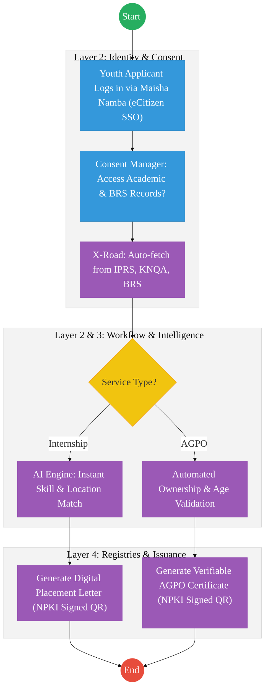

# STATE DEPARTMENT FOR YOUTH AFFAIRS – Service Delivery

## Cover Page
- **Ministry/Department/Agency (MDA):** Ministry of Public Service, Gender and Affirmative Action
- **Department:** State Department for Youth Affairs
- **Process Name:** Youth Internship Placement & AGPO Registration
- **Document Version:** 2.1
- **Date:** 2026-02-24
- **Classification:** Official
- **Strategic Category:** Priority MDA
- **Service Model:** G2C
- **Life-Cycle Group:** Cradle to Death (4. Employment & Business)

---

## Service Mandate
The State Department for Youth Affairs and Creative Economy is responsible for the development and empowerment of the youth and the promotion of the creative industry in Kenya. Its mandate is anchored in Article 55 of the Constitution of Kenya 2010 and focuses on harnessing youth talent in arts, film, music, and other creative sectors to drive economic growth.

**Official Website:** [https://www.moyasa.go.ke](https://www.moyasa.go.ke)

**Key Functions:**
- **Youth Empowerment:** Developing and implementing policies that promote youth participation in national development and economic activities.
- **Creative Economy Development:** Promoting talents in the arts, film, and music sectors to drive economic growth.
- **Talent Development:** Identifying, nurturing, and developing youth talents for national and global competitiveness.
- **Mainstreaming Youth Affairs:** Ensuring that youth concerns are integrated into all sectors of national development.
- **Stakeholder Collaboration:** Overseeing and collaborating with various stakeholders engaged in youth promotion.

---

## Executive Summary
The State Department for Youth Affairs is responsible for the economic empowerment of Kenyan youth through initiatives like the Public Service Internship Programme (PSIP) and the Access to Government Procurement Opportunities (AGPO) registration for youth-owned enterprises. Currently, these processes rely on manual uploads of academic documents and business certificates. The transition to the Kenya DSAP Architecture aims to automate eligibility verification via IPRS and BRS, enabling instant internship matching and AGPO certification.

---

## 1. AS-IS Process Flowchart (BPMN 2.0)
*Current State visualization (Youth Internship & AGPO Registration based on Deep Dive).*

    subgraph Initiative["Initiative Development"]
        Start --> Mob["1. Resource Mobilization & Budgeting"]
        Mob --> Approve["2. Formal Internal Approval Workflow"]
        Approve --> Launch["3. Initiative Launch & Communication"]
    end

    subgraph Participation["Youth Engagement"]
        Launch --> Access["4. Access eCitizen / Portal"]
        Access --> Form["5. Complete Form & Upload Documents"]
        Form --> Vetting["6. Vetting, Verification & Decision Documentation"]
        Vetting --> Impact["7. Implementation & Continuous Monitoring"]
    end
    
    subgraph Outcomes["Evaluation & Feedback"]
        Impact --> Report["8. Reporting and Participant Data Capture"]
        Report --> Feed["9. Feedback Incorporation for Future Initiatives"]
        Feed --> End((End))
    end

    classDef start fill:#27ae60,stroke:#27ae60,color:#fff,font-size:24px,font-size:24px;;
    classDef endNode fill:#e74c3c,stroke:#e74c3c,color:#fff,font-size:24px,font-size:24px;;
    classDef userTask fill:#3498db,stroke:#2980b9,color:#fff,font-size:24px,font-size:24px;;
    classDef serviceTask fill:#9b59b6,stroke:#8e44ad,color:#fff,font-size:24px,font-size:24px;;
    
    class Start start;
    class End endNode;
    class Mob,Approve,Launch,Access,Form,Vetting,Impact,Report,Feed userTask;

---

## Process Overview
### Process Name
Youth Internship Placement, AGPO Registration, and Film Production Licensing

### Service Category
- G2C (Government to Citizen) / G2B (Youth-owned MSMEs)

### Scope
- **In Scope:** Internship applications, skill matching, AGPO certification for youth, and film licensing.
- **Out of Scope:** Disbursement of enterprise funds (handled by MSME department).

### Triggers
- A youth applying for an internship or a youth-owned business seeking AGPO certification.

### End States
- **Successful:** Internship placement letter issued; AGPO Certificate generated.

### Policy Context
- The Public Service Commission Internship Policy; The Public Procurement and Asset Disposal Act (AGPO Provisions).

---

## Detailed Process (AS-IS)

| Step | Role | Action | Tool/System | Notes |
| :--- | :--- | :--- | :--- | :--- |
| **1** | Planning Unit | **Resource Mobilization:** Budgeting and identification of implementation partners. | IFMIS / Manual | Starting point for any initiative. |
| **2** | Youth Officer | **Intake & Vetting:** Manually reviews the academic documents and IDs to ensure age compliance. | Manual Review | High duplication of effort. |
| **3** | M&E Officer | **Implementation Monitoring:** Collecting data on youth participation during program rollout. | Field Reports | Ensuring targets are met. |
| **4** | Project Lead | **Reporting & Data Capture:** Managing the participant registry and capturing feedback for future planning. | Manual / Excel | **Critical Data Gap:** No central participant database. |

> [!IMPORTANT]
> **Process Accuracy Update:** Stakeholders identified that previous process maps omitted the critical **Budgeting** and **Approval** stages. The AS-IS has been updated to reflect these internal governance milestones.

---

## Pain Points & Opportunities
### Pain Points
- **Document Fatigue:** Youth have to upload the same ID and certificates for every application.
- **Inefficient Matching:** Manual matching of 50,000+ interns to 1,000+ slots is slow and error-prone.
- **Vetting Delays:** AGPO certification takes weeks due to manual business ownership verification.

### Opportunities
- **Once-Only Data Pull:** Fetching ID from **IPRS**, Academic data from **KNEC/KNQA**, and Business data from **BRS** via **X-Road**.
- **AI-Powered Matching:** An automated engine that matches interns to hosts based on GPS location and skill sets.
- **Real-Time AGPO Certification:** Instantly issuing AGPO certificates once the system confirms the directors are 18-35 via IPRS.

---

# PART 3: ARCHITECTURE ALIGNMENT (KENYA HUDUMA BRIDGE)

The Youth Empowerment and AGPO Registration Service is engineered to operate across the four layers of the **Kenya DSAP Architecture**:

### Layer 1: Access Channels
- **eCitizen / Youth Portal:** A single-window access for youth to apply for internships, AGPO certification, and skill programs.
- **Mobile App:** For field reports on program impact and real-time youth engagement.
- **Officer Workbench (PSIP Interface):** For Youth Officers and PSC to manage internship matching and AGPO vetting.

### Layer 2: Core Platform
- **Workflow Engine (BPMN 2.0):** Orchestrates the empowerment lifecycle (Mobilization → Application → AI-Matching/Vetting → Issuance → Monitoring).
- **Trust Hub:**
  - **Consent Manager:** Mandatory youth consent before querying academic records or business ownership data via X-Road.
  - **Identity Federation:** Real-time verification of youth identity and age via **Maisha Namba (IPRS)**.
  - **NPKI:** Digitally signing **Internship Placement Letters**, **AGPO Certificates**, and **Film Licenses** to ensure legal non-repudiation.
- **Shared Services:**
  - **AI Matching Engine:** Automated skill and location-based matching for internship placements.
  - **Intelligent Document Processing (IDP):** Digitizing historical participant records and physical AGPO files into the National EDRMS.
  - **Document Generator:** Automated creation of verifiable certificates and letters with secure QR codes.
  - **Notifications:** Automated SMS/Email alerts for application status, placement notifications, and AGPO renewal triggers.

### Layer 3: Interoperability (Huduma Bridge)
- **KeSEL (X-Road):** Secure data exchange between the Youth Portal and **BRS (Business)**, **KNQA (Qualifications)**, **PSC (Policy)**, and **NRB/IPRS (Identity)**.
- **Central Service Catalogue:** Cataloguing youth-related APIs (e.g., Youth Persona, Skill Profiles) to promote inter-MDA program alignment.

### Layer 4: Authoritative Registries & Payments
- **Registries:**
  - **National Youth Participant Registry:** The sector-specific authoritative registry for tracking youth involvement in all government programs.
  - **National EDRMS:** The definitive legal digital archive for all signed empowerment records and historical policy documents.
  - **IPRS / Maisha Namba:** Foundational person registry for youth identification.
- **Payments:** **Government Payment Aggregator (GPA)** for processing internship stipends, film licensing fees, and AGPO-related financial transactions.

## 2. TO-BE Process Flowchart (DPI-Enabled)
*Proposed State visualization leveraging the Kenya Huduma Bridge.*

## Future State Process (TO-BE)
### Narrative
**TO-BE Process: Automated Youth Empowerment**

**Design Principles:**
- **Zero Document Uploads:** Academic credentials and business ownership details are fetched directly from authoritative registries via the **Huduma Bridge**.
- **Instant AGPO:** If the system confirms (via BRS and IPRS) that a business is 100% youth-owned, the AGPO certificate is issued instantly.
- **Smart Internships:** The **Workflow Engine** uses AI to place interns in agencies nearest to their residence (verified via GPS/Maisha Namba), reducing transport costs for the youth.

### Optimized Steps (Digital)

| Step | Actor | Action | Tool / System |
| :--- | :--- | :--- | :--- |
| 1 | Youth Applicant | Logs into eCitizen using Maisha Namba. All personal and education details are already pre-populated. | eCitizen / SSO |
| 2 | System | For AGPO, the system pings BRS via X-Road to verify the company's "Youth-Owned" status. | KeSEL / X-Road |
| 3 | System | AI matching engine assigns the intern to a government agency based on the applicant's degree and the agency's needs. | Workflow Engine |
| 4 | System | Generates a digital verifiable certificate/letter with a secure QR code for instant authentication. | Output Generator |

---

## References
- https://www.youth.go.ke
- Public Service Commission Internship Policy
- Desk Review

---

### Validation Survey
Please provide your feedback here: [https://ee.kobotoolbox.org/x/4Ls7SlCG](https://ee.kobotoolbox.org/x/4Ls7SlCG)

