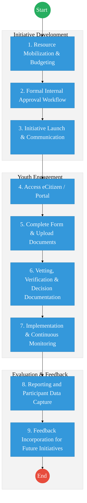
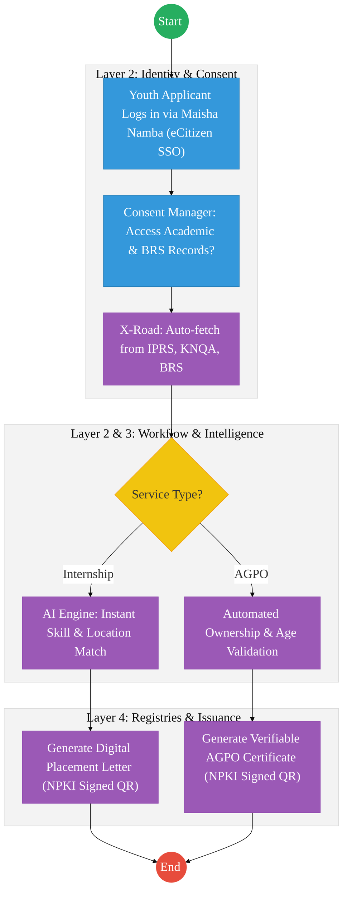

# Youth Affairs – Business Process Architecture (Updated)

## Cover Page
- **Ministry:** Ministry of Youth Affairs, Creative Economy and Sports
- **State Department:** State Department for Youth Affairs
- **Primary Authority:** Youth Development Directorate
- **Document Type:** Business Process Architecture (BPA) Standardised
- **Document Version:** 4.1
- **Date:** 2026-03-25
- **Classification:** Official
- **Strategic Category:** Priority MDA
- **Service Model:** G2C / G2B
- **Reviewer:** Senior Government Enterprise Architect

---

## SECTION 0: SERVICE PRIORITISATION MAPPING
- **Mapped Priority Service:** Youth Internship Placement, AGPO Registration, and Talent Development
- **Tier Classification:** Tier 2
- **Strategic Category:** Social / Economy (Youth Empowerment)
- **Breakout Room Classification:** Room 2 (Coordination, Culture & Specialised Services)
- **Lead MDA (Standardised Name):** Youth Affairs
- **Related Cross-Cutting Services:**
    - National Youth Participant Registry (Unified)
    - Identity Layer (IPRS / Maisha Namba)
    - Payment Gateway (GPA / Stipends)
    - Business Registration Service (BRS / AGPO Interop)
    - National Qualifications Database (KNQA Interop)

---

## SECTION 0.1: PRIORITISATION JUSTIFICATION
This service is prioritised because the TO-BE design transformation eliminates the "Document Fatigue" historicially faced by Kenyan youth. By transitioning from manual, paper-intensive uploads to a "Zero-Document" digital track where academic credentials (KNQA) and business ownership (BRS) are fetched instantly via X-Road, the design ensures merit-based and rapid empowerment. The integration of an AI Matching Engine ensures that internship placements and AGPO certifications are handled with 100% transparency and speed, directly impacting national youth employment targets.

| Criteria | Evidence from TO-BE Design |
| :--- | :--- |
| **Demand / Volume** | Over 500,000 internship applications annually; tens of thousands of AGPO seeker businesses. |
| **National Priority Alignment** | Talanta Hela Initiative; Bottom-Up Economic Transformation Agenda (BETA). |
| **Data Reusability** | Youth skill profiles feed into the national labor market information system. |
| **Interoperability** | Continuous sync with IPRS (Age), BRS (Ownership), and KNQA (Skills) via Huduma Bridge. |
| **Revenue / Efficiency Impact** | Automated AGPO issuance reduces processing time from weeks to seconds; GPA stipends integration. |
| **Governance / Risk Reduction** | Real-time IPRS checks prevent non-youth from accessing age-restricted services like PSIP. |
| **Inclusivity** | Mobile-first access ensures youth in all 47 counties can apply for national opportunities. |
| **Readiness** | High; Core portal is existing; API links to major registries are already established. |

> [!NOTE]
> “The TO-BE design eliminates the 'Document fatigue' for Kenyan youth by fetching academic and identity data directly from KNQA and IPRS via X-Road. By integrating AI-powered matching for internships and instant AGPO certification for youth-led MSMEs, the design ensures merit-based, lightning-fast empowerment while reducing the manual verification burden on government officers.”

---

# SECTION 1: SERVICE DEFINITION (STANDARDISED)

The State Department for Youth Affairs is responsible for the development and empowerment of the youth and the promotion of the creative industry in Kenya. Its mandate is anchored in **Article 55 of the Constitution of Kenya 2010**.

In this standardized BPA, the focus is on the **Youth Internship Placement, AGPO Registration, and Talent Development** ecosystem. The objective is to harness the "Maisha Namba" identity to create a lifetime "Youth Persona" that tracks and facilitates empowerment milestones from school to formal employment.

---

# SECTION 2: SERVICE CATALOGUE (NORMALISED)

| Category | Service Name | Description |
| :--- | :--- | :--- |
| **Core Services** | **Youth Internship Placement (PSIP)** | Automated matching and placement of graduates into government agencies. |
| | **Youth-AGPO Registration** | Special registration for 100% youth-owned businesses for procurement access. |
| **Extended Services** | **Film Production Licensing** | Regulatory oversight and licensing of youth-led creative film projects. |
| | **Skills Recognition & Awards** | Formal validation of talent and vocational skills in the creative sector. |
| **Special Case Services**| **Internship Stipend Management** | Automated monthly disbursement of stipends via Digital Wallets (GPA). |
| | **Talent Identification Permits** | Licensing of specialized youth talent development camps and academies. |

---

# SECTION 3: AS-IS PROCESS FLOWS (MANUAL/FRAGMENTED)

The current state relies on manual uploads of academic documents and physical business certificates, leading to vetting delays and data fragmentation.

### 3.1 AS-IS Visualization

### 3.2 Operational Reality
- **Actors:** Youth Applicant, Youth Officer, M&E Officer, Project Lead.
- **Systems:** eCitizen (Basic), IFMIS (Partial Finance), Standalone Excel logs.
- **Pain Points:** Document fatigue (repeated uploads); 2-week vetting delay for AGPO; manual matching of 50,000+ interns is error-prone; lack of a central, real-time participant database for longitudinal tracking.

---

# SECTION 4: TO-BE PROCESS INTERPRETATION (NEW LAYER)

### 4.1 TO-BE Process (DPI-Enabled)

### 4.2 Key Capabilities Introduced
*   **Automation:** AI-powered skill matching engine for seamless internship placements.
*   **Integration:** Hub-and-spoke integration with the KNQA (Academic Database) and BRS (Business) via X-Road.
*   **Real-time Processing:** "Instant AGPO" – immediate issuance once 100% youth ownership is verified digitally.
*   **Digital Identity Validation:** Applicant age and eligibility verified via **Maisha Namba** identity federation.
*   **Workflow Orchestration:** Coordinated cycle from program mobilization to participant impact reporting.

### 4.3 Transformation Summary
| Dimension | AS-IS | TO-BE |
| :--- | :--- | :--- |
| **Processing** | Manual / High-upload | Automated / Zero-upload |
| **Verification** | Physical Certificates | API-based (KNQA/BRS/IPRS) |
| **Records** | Scattered Excel Logs | National Youth Participant Registry |
| **Tracking** | Post-initiative reports | Real-time Engagement Analytics |

---

# SECTION 5: SYSTEM LANDSCAPE (ALIGN TO GEA)

| Layer | System / Platform | Role |
| :--- | :--- | :--- |
| **Identity Layer** | Maisha Namba (IPRS) | Identity and age verification for 18-35 applicants. |
| **Interoperability** | KeSEL (X-Road) | Data bridge to KNQA (Qualifications) and BRS. |
| **shared Services** | National EDRMS | Legal digital archive for placement letters and AGPO. |
| **Workflow / BPM** | Empowerment Engine | Orchestrates internships and talent tracking. |
| **Payment Layer** | GPA (Finance Aggregator) | Direct-to-Wallet stipend disbursements. |
| **Trust Hub** | Consent Manager | Youth control over shared academic and business data. |

---

# SECTION 6: TRANSFORMATION VALUE (CRITICAL ADDITION)

| Value Type | Explanation |
| :--- | :--- |
| **Efficiency Gain** | AGPO processing time reduced from weeks to seconds; zero-upload experience. |
| **Economic Impact** | Accelerates youth participation in public procurement (KES billion sector). |
| **Governance Impact** | Prevents "Fronting" in AGPO via real-time IPRS-linked ownership checks. |
| **Citizen Experience** | Effortless mobile application for PSIP; location-based internship matching. |
| **Interoperability Value** | Cross-registry talent tracking for national employment planning. |

---

# SECTION 7: ALIGNMENT TO WHOLE-OF-GOVERNMENT ARCHITECTURE
- **Shared Platforms:** Uses eCitizen for portal access and GPA for stipend/fee processing.
- **Registry Reuse:** Reuses KNQA records for academic verification, avoiding student credential forgery.
- **Compliance with GEA / GIF:** Standardizing youth-profile meta-data for inclusion in the National Data Exchange.

---

# SECTION 8: IMPLEMENTATION READINESS (NEW)
*   **Data Readiness:** High; Core youth portal exists and is populated.
*   **Legal Readiness:** High; PPADA Act supports AGPO preference schemes for youth.
*   **Institutional Readiness:** High; State Department has established desks for AGPO and ICT.
*   **Technical Readiness:** High; Integration with BRS and KNQA via X-Road is technologically feasible today.

---

# SECTION 9: TRACEABILITY MATRIX (NEW)

| BPA Process | Priority Service | Tier | TO-BE Capability | National Impact |
| :--- | :--- | :--- | :--- | :--- |
| **Skill Matching** | Internship (PSIP) | T2 | AI Match Engine | Youth Employment & Skills |
| **Ownership Check** | AGPO Registration | T2 | X-Road: BRS Link | Economic Inclusion & Integrity |
| **Licensing** | Creative Economy | T2 | Digital QR Permitting | Growth of Film/Art Sector |
| **Outcome Tracking**| Monitoring | T2 | Unified Youth Registry | Evidence-based Policy Design |

---
**[End of Standardised Business Process Architecture]**
