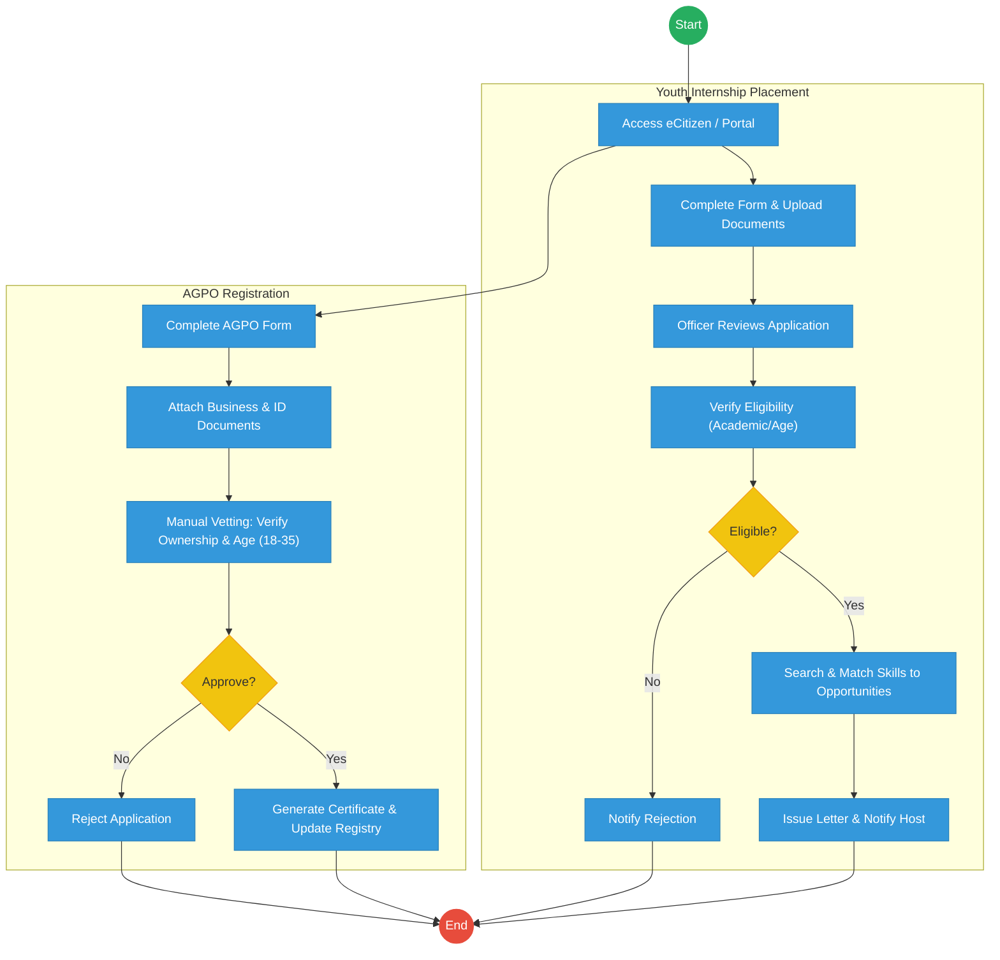
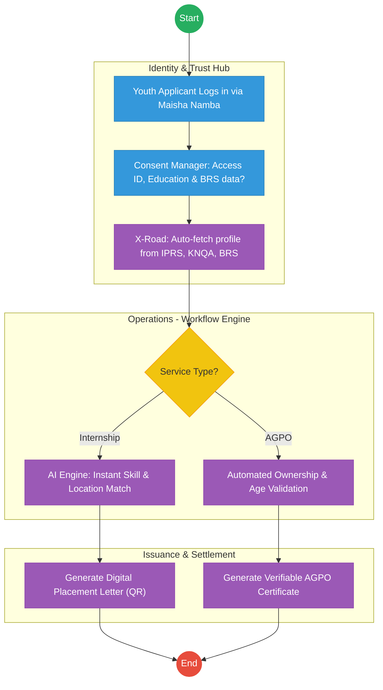

# STATE DEPARTMENT FOR YOUTH AFFAIRS – Service Delivery

## Cover Page
- **Ministry/Department/Agency (MDA):** Ministry of Public Service, Gender and Affirmative Action
- **Department:** State Department for Youth Affairs
- **Process Name:** Youth Internship Placement & AGPO Registration
- **Document Version:** 2.1
- **Date:** 2026-02-24
- **Classification:** Official

---

## Executive Summary
The State Department for Youth Affairs is responsible for the economic empowerment of Kenyan youth through initiatives like the Public Service Internship Programme (PSIP) and the Access to Government Procurement Opportunities (AGPO) registration for youth-owned enterprises. Currently, these processes rely on manual uploads of academic documents and business certificates. The transition to the Kenya DSAP Architecture aims to automate eligibility verification via IPRS and BRS, enabling instant internship matching and AGPO certification.

---

## 1. AS-IS Process Flowchart (BPMN 2.0)
*Current State visualization (Youth Internship & AGPO Registration based on Deep Dive).*

---

## Process Overview
### Process Name
Youth Internship Placement, AGPO Registration, and Film Production Licensing

### Service Category
- G2C (Government to Citizen) / G2B (Youth-owned MSMEs)

### Scope
- **In Scope:** Internship applications, skill matching, AGPO certification for youth, and film licensing.
- **Out of Scope:** Disbursement of enterprise funds (handled by MSME department).

### Triggers
- A youth applying for an internship or a youth-owned business seeking AGPO certification.

### End States
- **Successful:** Internship placement letter issued; AGPO Certificate generated.

### Policy Context
- The Public Service Commission Internship Policy; The Public Procurement and Asset Disposal Act (AGPO Provisions).

---

## Detailed Process (AS-IS)
| Step | Role | Action | Tool/System | Notes |
|---|---|---|---|---|
| 1 | Applicant | Logs into eCitizen and fills forms for Internship or AGPO. | eCitizen / Portal | |
| 2 | Applicant | Uploads PDF copies of National ID, Academic Certificates, and BRS Business Registrations. | Manual Upload | |
| 3 | Youth Officer | Manually reviews the documents to ensure the applicant is between 18-35 years old. | Manual | High duplication of effort. |
| 4 | Programme Officer | For internships, manually matches the applicant's course of study with available slots in government agencies. | Excel / Manual | |
| 5 | AGPO Officer | Verifies business ownership details against BRS certificates before approving the AGPO status. | Manual | |

---

## Pain Points & Opportunities
### Pain Points
- **Document Fatigue:** Youth have to upload the same ID and certificates for every application.
- **Inefficient Matching:** Manual matching of 50,000+ interns to 1,000+ slots is slow and error-prone.
- **Vetting Delays:** AGPO certification takes weeks due to manual business ownership verification.

### Opportunities
- **Once-Only Data Pull:** Fetching ID from **IPRS**, Academic data from **KNEC/KNQA**, and Business data from **BRS** via **X-Road**.
- **AI-Powered Matching:** An automated engine that matches interns to hosts based on GPS location and skill sets.
- **Real-Time AGPO Certification:** Instantly issuing AGPO certificates once the system confirms the directors are 18-35 via IPRS.

---

## 2. TO-BE Process Flowchart (BPMN 2.0)
*Future State visualization (Kenya DSAP Architecture - Huduma Bridge).*

## Future State Process (TO-BE)
### Narrative
**TO-BE Process: Automated Youth Empowerment**

**Design Principles:**
- **Zero Document Uploads:** Academic credentials and business ownership details are fetched directly from authoritative registries via the **Huduma Bridge**.
- **Instant AGPO:** If the system confirms (via BRS and IPRS) that a business is 100% youth-owned, the AGPO certificate is issued instantly.
- **Smart Internships:** The **Workflow Engine** uses AI to place interns in agencies nearest to their residence (verified via GPS/Maisha Namba), reducing transport costs for the youth.

### Optimized Steps (Digital)
| Step | Actor | Action | System |
|---|---|---|---|
| 1 | Youth Applicant | Logs into eCitizen using Maisha Namba. All personal and education details are already pre-populated. | eCitizen / SSO |
| 2 | System | For AGPO, the system pings BRS via X-Road to verify the company's "Youth-Owned" status. | KeSEL / X-Road |
| 3 | System | AI matching engine assigns the intern to a government agency based on the applicant's degree and the agency's needs. | Workflow Engine |
| 4 | System | Generates a digital verifiable certificate/letter with a secure QR code for instant authentication. | Output Generator |

---

## References
- Public Service Commission Internship Policy.
- Huduma Bridge DSAP Architecture.