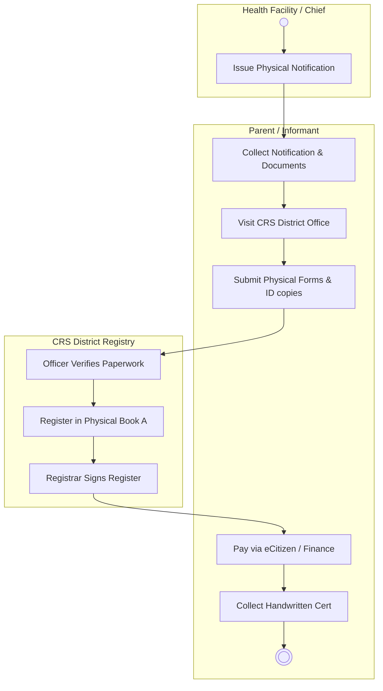
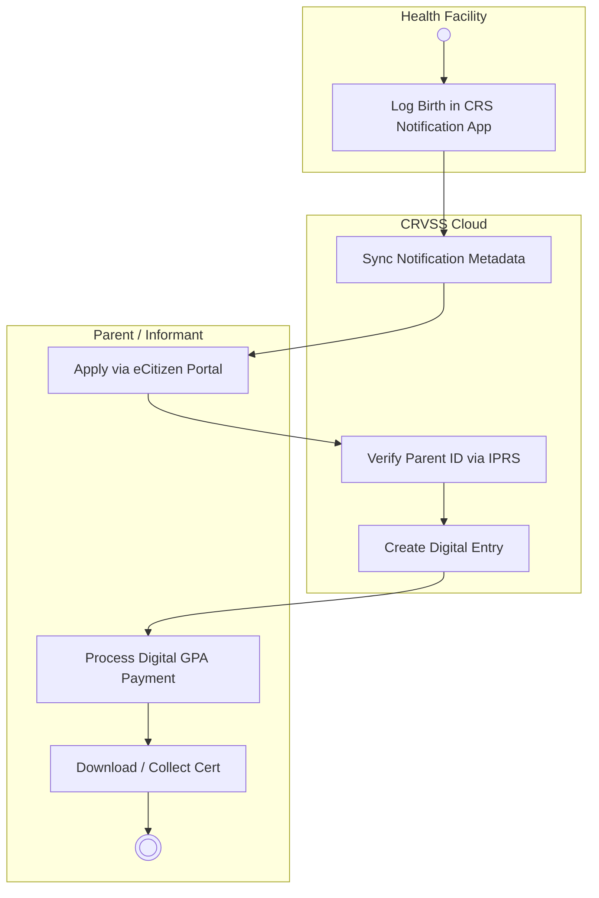
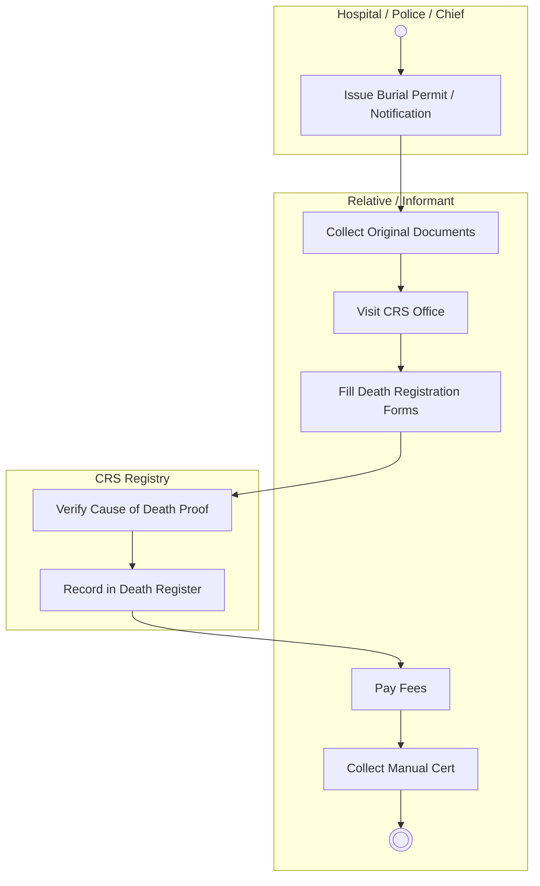
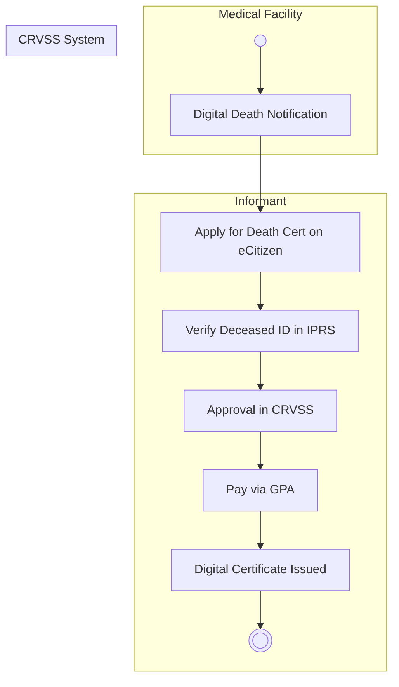
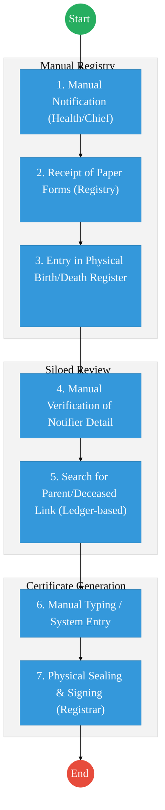
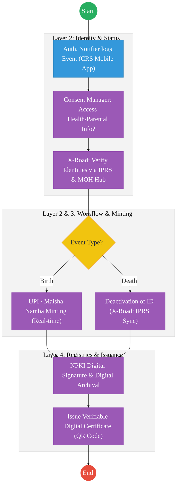

# CIVIL REGISTRATION SERVICES (CRS) – Service Delivery Refactored

## Cover Page
- **Ministry:** Ministry of Interior and National Administration
- **State Department:** State Department for Immigration and Citizen Services
- **Department:** Department of Civil Registration Services (CRS)
- **Document Type:** Business Process Document (Refactored)
- **Document Version:** 3.0 (Government Ready)
- **Date:** 2026-03-24
- **Classification:** Official / Sensitive
- **Strategic Category:** Priority MDA - National Registry
- **Life-Cycle Group:** Cradle to Grave
- **Reviewer:** Lead Government Business Analyst

---

## SECTION 1: CORRECTED SERVICE DEFINITION

The Department of Civil Registration Services (CRS) is mandated by the **Births and Deaths Registration Act (Cap. 149)** and the **Legitimacy Act (Cap. 145)** to provide compulsory and immediate registration of vital life events.

This document formally separates the workflows for Birth and Death registration to reflect distinct legal requirements, evidentiary standards, and system modules within the **Civil Registration and Vital Statistics System (CRVSS)**.

### Expanded Scope of Services
The scope is refactored to include critical but previously omitted services:
1.  **Birth Registration:** Current (under 6 months) and Late (after 6 months).
2.  **Death Registration:** Current (under 6 months) and Late (after 6 months).
3.  **Re-registration:** Legal amendments via Adoption, Recognition, and Legitimacy-bound amendments.
4.  **Foreign Event Registration:** Births and Deaths of Kenyans occurring outside national borders.
5.  **Assumption of Death:** Registration of deaths based on High Court orders for missing persons.

---

## SECTION 2: SERVICE CATALOGUE (COMPLETE)

| Category | Service Name | Target Population |
| :--- | :--- | :--- |
| **Core Services** | Birth Registration (Current) | Children born in Kenya (0-6 months) |
|  | Death Registration (Current) | Deaths occurring in Kenya (0-6 months) |
|  | Issuance of Certificates | All registered citizens/informants |
| **Extended Services** | Late Birth Registration | Persons over 6 months of age |
|  | Late Death Registration | Deaths reported after 6 months |
| :--- | :--- | :--- |
| **Special Case Services** | Re-registration (Adoption) | Children legally adopted |
|  | Re-registration (Legitimization) | Children of parents who marry after birth |
|  | Re-registration (Recognition) | Children where paternity is legally acknowledged |
|  | Assumption of Death | Missing persons (Court ordered) |

---

## SECTION 3: AS-IS PROCESS FLOWS (CORRECTED)

Unlike previous versions, these flows distinguish between the manual "Legacy" track and the "CRVSS-enabled" digital track currently in operation.

### 1. Birth Registration – Manual (Paper-Based)
*Used in remote areas or where network/system downtime occurs.*

**Step-by-Step Structure:**
1. **Notification:** Informant receives a physical notification from the health facility or chief.
2. **Submission:** Informant physically travels to the CRS District Office with original notification and parents' IDs.
3. **Verification:** Registration Officer manually checks ID validity and cross-references physical records.
4. **Registration:** Details are handwritten into the Physical Birth Register (Register A) and assigned an Entry Number.
5. **Approval:** The Registrar reviews and manually signs the register entry.
6. **Payment:** Revenue is collected via manual receipting or semi-automated finance modules.
7. **Issuance:** A handwritten or typed physical certificate is produced and issued.

*   **Actors:** Informant/Parent, Health Worker/Chief, Registration Officer, Registrar.
*   **Systems:** Manual Registers, Finance Module (Partial).
*   **Pain Points:** High travel costs for citizens, risk of data entry errors, slow retrieval for verification, and storage/security risks for physical books.

### 2. Birth Registration – CRVSS-Enabled (Digital Track)
*The primary digital workflow integrated with eCitizen.*

**Step-by-Step Structure:**
1. **Digital Notification:** Authorized notifier logs the event via the **CRS Notification App** at source.
2. **Synchronization:** Data flows to the central CRVSS database instantly.
3. **Application:** Parent logs into the **eCitizen** portal to submit a certificate request.
4. **Verification:** CRVSS automatically pings **IPRS** to validate the parental identities and Maisha Namba.
5. **Approval:** The Registrar approves the record digitally within the CRVSS workflow engine.
6. **Payment:** Fees are settled via the **Government Payment Aggregator (GPA)** on eCitizen.
7. **Certification:** A digital certificate record is created, available for download or high-security printing.

*   **Actors:** Health Worker, Parent, CRS Registrar, System Interface.
*   **Systems:** CRVSS, CRS Notification App, eCitizen, IPRS, GPA.
*   **Pain Points:** Dependent on internet connectivity in facilities, requires citizen digital literacy, and potential IPRS downtime delays.

### 3. Death Registration – Manual

**Step-by-Step Structure:**
1. **Notification:** Family obtains a burial permit/manual notification from a hospital or chief.
2. **Registry Visit:** Family presents physical IDs and proof of death at the CRS Registry.
3. **Manual Entry:** Officer records details in the physical Death Register.
4. **Approval:** Registrar validates and signs the entry manually.
5. **Certification:** Manual death certificate is issued.

*   **Actors:** Family Informant, Hospital Staff/Chief, Registration Officer, Registrar.
*   **Systems:** Manual Registers.
*   **Pain Points:** High risk of identity theft/fraud where IPRS verification is missing, physical record deterioration, and delayed vital statistics reporting.

### 4. Death Registration – CRVSS-Enabled

**Step-by-Step Structure:**
1. **Digital Notification:** Death is logged by an authorized clinical officer or pathologist via the **CRS Notification App**.
2. **Application:** Relatives apply for the certificate via the **eCitizen** death registry module.
3. **Verification:** System automatically executes a deceased ID lookup against **IPRS** to lock the identity.
4. **Approval:** Workflow is routed to the Registrar in **CRVSS** for digital approval.
5. **Certificate:** Secure certificate with verified entry number is issued digitally.

*   **Actors:** Hospital Pathologist, Family Informant, CRS Registrar.
*   **Systems:** CRVSS, CRS Notification App, eCitizen, IPRS, GPA.
*   **Pain Points:** Complexity in verifying community-based deaths digitally without immediate Chief intervention.

---

## SECTION 4: MISSING PROCESS FLOWS (NEW)

### Late Registration (Birth/Death)
*   **Trigger:** Application made after 6 months of event occurrence.
*   **Process:** Requires interview of the applicant by the District Coordinator, submission of secondary evidence (Clinic card, School records, Baptismal certificate), and vetting of witnesses.
*   **Approval:** Requires higher-level approval in CRVSS by the District Registrar or County Coordinator.

### Re-registration (Adoption/Legitimization/Recognition)
*   **Trigger:** Court Order (Adoption) or Statutory Declaration (Legitimization).
*   **Process:** The original entry in CRVSS is marked as "Cancelled - Re-registered." A new Entry Number is assigned in the special register.
*   **Output:** A new certificate is issued reflecting the updated parental/legal status while maintaining the original UPI link.

### Foreign Registrations
*   **Process:** Informant presents certified copies of foreign birth/death certificates and proof of Kenyan citizenship to CRS Headquarters. Events are registered in the **Foreign Registry module** of CRVSS.

### Assumption of Death
*   **Requirement:** Declaratory judgment from the High Court (typically after 7 years of disappearance).
*   **Process:** CRS registers the entry based on the court decree as a "Special Entry" to allow the estate to be processed.

---

## SECTION 5: SYSTEM LANDSCAPE (AS-IS REALITY)

The CRS technical architecture is NOT "future state" only; it is an active ecosystem managed by the department:

1.  **CRVSS (Core System):** The central database for all vital events. It manages the lifecycle from notification to certification.
2.  **CRS Notification App:** A mobile/web interface used by **Authorized Notifiers** (Nurses, Clinical Officers, and Chiefs) to capture events at source.
3.  **eCitizen Front-end:** The citizen-facing portal for applications, status tracking, and payments.
4.  **IPRS Integration:** Mandatory real-time link used by CRVSS to verify identities of informants and the deceased/parents.
5.  **GPA (Government Payment Aggregator):** The unified engine for all revenue collection.

---

## SECTION 6: CORRECTED PAIN POINTS

1.  **Historical Backlog:** Approximately **10 million** birth and death records exist only in physical paper registers across the country, invisible to real-time verification.
2.  **Registry Congestion:** Centralized registries (Kabarnet Gardens) and regional vaults are at maximum physical capacity, increasing the risk of record deterioration.
3.  **Double Entry Risks:** Where manual notifications are used, there is a delay between the physical paper and the system entry, leading to potential data inconsistency.
4.  **Identity Vulnerabilities:** Fraudulent registration of deaths to claim insurance is a risk where IPRS verification is bypassed in manual workflows.

---

## 2. AS-IS Process Flowchart (BPMN 2.0)
*Current State visualization highlighting the manual bottlenecks in vital event registration.*

---

## 3. TO-BE Process Flowchart (DPI-ENABLED)
*Proposed State visualization leveraging the Kenya Huduma Bridge and CRVSS ecosystem.*

---

# SECTION 7: ARCHITECTURE ALIGNMENT (KENYA HUDUMA BRIDGE)

The Civil Registration and Vital Statistics Service is engineered to operate across the four layers of the **Kenya DSAP Architecture**:

### Layer 1: Access Channels
- **eCitizen / Civil Portal:** The primary window for citizens to apply for birth, death, and marriage certificates.
- **CRS Notification App:** A specialized mobile/web interface for **Authorized Notifiers** (Nurses, Chiefs, and Clinicians) to log events at source.
- **Officer Workbench (CRVSS):** The internal interface for Registration Officers and Registrars to manage validation, and approval workflows.
- **Huduma Centers:** Physical points for the intake and scanning (IDP) of manual notifications and late registration evidence.

### Layer 2: Core Platform
- **Workflow Engine (BPMN 2.0):** Orchestrates the vital event lifecycle (Notification → Application → IPRS Verification → Approval → Minting → Issuance).
- **Trust Hub:**
  - **Consent Manager:** Mandatory citizen consent before querying parental or deceased identity records from IPRS via X-Road.
  - **Identity Federation:** Real-time identity validation and **Maisha Namba (UPI)** minting via **IPRS**.
  - **NPKI:** Digitally signing **Birth Certificates**, **Death Certificates**, and **Late Registration Permits** to ensure non-repudiation and global recognition.
- **Shared Services:**
  - **Intelligent Document Processing (IDP):** Digitizing the **10 million** historical paper records and manual registers into the National EDRMS.
  - **Document Generator:** Automated creation of verifiable digital certificates with secure QR codes.
  - **Notifications:** Automated SMS/Email alerts for application status and certificate readiness.

### Layer 3: Interoperability (Huduma Bridge)
- **KeSEL (X-Road):** Secure, decentralized data exchange between CRS, **MOH (Health Notifications)**, **NPS (Police Reports)**, and **IPRS (Personal Data)**.
- **Central Service Catalogue:** Cataloguing vital event APIs (e.g., Birth Verification, Death Notification) for national and international use.

### Layer 4: Authoritative Registries & Payments
- **Registries:**
  - **National CRVSS Registry:** The sector-specific authoritative registry for all vital life events (Birth, Death, Marriage).
  - **National EDRMS:** The definitive legal digital archive for all signed vital certificates and digitized historical registers.
  - **IPRS / Maisha Namba:** The foundational person registry for individual identity linkage.
- **Payments:** **Government Payment Aggregator (GPA)** for processing registration fees, cert issuance charges, and search fees.

---

## SECTION 8: DIGITIZATION STRATEGY (10M RECORDS)

To address the 10 million record backlog, a phased approach is mandated:
1.  **Phase 1: Metadata Indexing:** Scanning registers and capturing key indices (Name, Year, Entry No) to allow for digital searching.
2.  **Phase 2: On-Demand Full Digitization:** Full transcription of records when a citizen applies for a digital copy of a legacy manual certificate.
3.  **Phase 3: Back-File Conversion:** Systematic high-speed scanning and OCR processing of all remaining registers, starting from the most recent (last 10 years).
4.  **Cut-off Strategy:** As of a designated date, all manual registers are retired, and only CRVSS-generated entries are recognized as legal proof of status.

---

## SECTION 9: CHANGE LOG

| Area | Before (Incorrect/Old) | After (Corrected) | Reason |
| :--- | :--- | :--- | :--- |
| **Process Structure** | Merged Birth & Death | **Separated into two distinct tracks** | Legal and operational distinctness (Cap 149). |
| **System Trigger** | Afya App (MOH) | **CRS Notification App** | Ensures CRS maintains ownership and data integrity. |
| **Service Scope** | Basic Registration only | **Added Late, Foreign, Re-reg, Assumption** | Reflects the full statutory mandate of CRS. |
| **Flow Modeling** | Single mixed flow | **Dual (Manual vs CRVSS-enabled)** | Accurately describes the current hybrid reality. |
| **Identity Flow** | Generic Maisha Namba | **UPI/Maisha Namba via IPRS Link** | Technical accuracy of identity minting. |
| **Pain Points** | Generic "Slow services" | **10M Record Backlog & Registry Capacity** | Specific, measurable institutional challenges. |

---
**[End of Document]**
