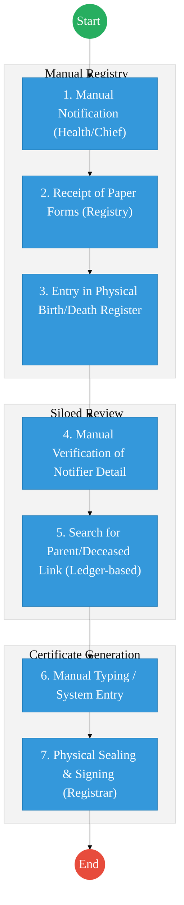
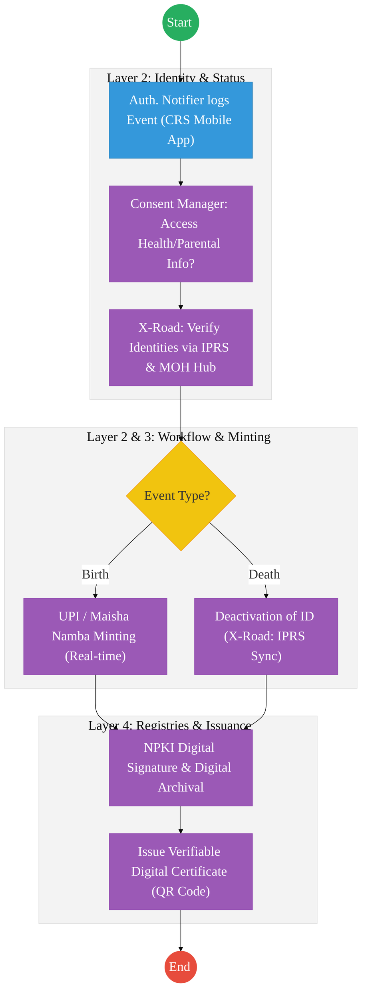

# STATE DEPARTMENT FOR CIVIL REGISTRATION SERVICES – Business Process Architecture (Updated)

## Cover Page
- **Ministry:** Ministry of Interior and National Administration
- **State Department:** Department of Civil Registration Services (CRS)
- **Department:** Department of Civil Registration Services (CRS)
- **Document Type:** Business Process Architecture (BPA) Standardised
- **Document Version:** 4.1
- **Date:** 2026-03-25
- **Classification:** Official / Sensitive
- **Strategic Category:** Priority MDA - National Registry (Tier 1)
- **Service Model:** G2C
- **Reviewer:** Senior Government Enterprise Architect

---

## SECTION 0: SERVICE PRIORITISATION MAPPING
- **Mapped Priority Service:** Birth and Death Registration (Civil Registration & Vital Statistics)
- **Tier Classification:** Tier 1
- **Strategic Category:** Identity / Governance (National Vital Statistics)
- **Breakout Room Classification:** Room 1 (High Impact & Large Registries)
- **Lead MDA (Standardised Name):** Department of Civil Registration Services (CRS)
- **Related Cross-Cutting Services:**
    - National CRVSS Registry
    - Identity Layer (IPRS / Maisha Namba Minting)
    - Payment Gateway (GPA)
    - National EDRMS (10M Record Backlog)
    - X-Road (Health/MOH & Police/NPS Interop)

---

## SECTION 0.1: PRIORITISATION JUSTIFICATION
This service is prioritised because the TO-BE design establishes the "Civil Registration and Vital Statistics System (CRVSS)" as the foundational identity engine for the Republic of Kenya. By integrating real-time digital notifications from 5,000+ health facilities and 10,000+ chiefs directly into the CRVSS, the design enables instant "Maisha Namba" (UPI) minting at birth. This ensures 100% registration coverage, eliminates identity fraud at the source, and provides real-time vital statistics for national planning.

| Criteria | Evidence from TO-BE Design |
| :--- | :--- |
| **Demand / Volume** | Over 1.5 million births and 500k deaths annually; 10M+ historical records. |
| **National Priority Alignment** | Births and Deaths Registration Act (Cap. 149); Maisha Namba/UPI Initiative. |
| **Data Reusability** | Foundational data for Education (NEMIS), Health (MOH), and Elections (IEBC). |
| **Interoperability** | Continuous sync with IPRS for identity and MOH for medical cause-of-death via X-Road. |
| **Revenue / Efficiency Impact** | Automated fee collection via GPA on eCitizen; 90% reduction in travel costs for citizens. |
| **Governance / Risk Reduction** | Biometric-linked identity prevents duplicate registrations and insurance fraud. |
| **Inclusivity** | CRS Mobile App enables registration in remote areas via authorized Notifiers (Chiefs). |
| **Readiness** | High; CRVSS cloud infrastructure is active; massive digitization of 10M records is underway. |

> [!NOTE]
> “This service is prioritised because the TO-BE design establishes the 'Civil Registration and Vital Statistics System (CRVSS)' as the foundational identity engine of Kenya. By integrating real-time notifications from health facilities and chiefs, it enables instant 'Maisha Namba' minting and ensures 100% registration coverage, directly feeding the national identity ecosystem.”

---

# SECTION 1: SERVICE DEFINITION (STANDARDISED)

The Department of Civil Registration Services (CRS) is mandated by the **Births and Deaths Registration Act (Cap. 149)** and the **Legitimacy Act (Cap. 145)** to provide compulsory and immediate registration of vital life events.

In this standardized BPA, the CRS mandate is positioned as the **Foundational Registry** for Kenya's Digital Public Infrastructure. The separation of workflows for Birth and Death registration ensures distinct legal compliance and technical accuracy within the **Civil Registration and Vital Statistics System (CRVSS)**.

---

# SECTION 2: SERVICE CATALOGUE (NORMALISED)

| Category | Service Name | Description |
| :--- | :--- | :--- |
| **Core Services** | **Birth Registration (Current)** | Registration of children born in Kenya (0-6 months). |
| | **Death Registration (Current)** | Registration of deaths occurring in Kenya (0-6 months). |
| **Extended Services** | **Late Event Registration** | Processing of births/deaths reported after the 6-month statutory limit. |
| | **Foreign Event Registration** | Births and deaths of Kenyans occurring outside national borders. |
| **Special Case Services**| **Re-registration (Adoption/Legitimacy)**| Amending records based on legal status changes (Adoption/Recognition). |
| | **Assumption of Death** | Registration based on High Court orders for missing persons. |

---

# SECTION 3: AS-IS PROCESS FLOWS (CURRENT HYBRID TRACK)

The current state is a transition from manual, ledger-based "Register A" books to the CRVSS digital track.

### 3.1 AS-IS Visualization (Manual Legacies)

### 3.2 Operational Reality
- **Actors:** Parent/Informant, Health Worker/Chief, Registration Officer, Registrar.
- **Systems:** Physical Registers (Books), eCitizen (Partial for fee collection).
- **Pain Points:** 10 million record backlog in paper vaults; high travel costs for citizens; risk of identity theft/fraud in manual registers; storage/security risks for physical books (fire/theft).

---

# SECTION 4: TO-BE PROCESS INTERPRETATION (NEW LAYER)

### 4.1 TO-BE Process (DPI-Enabled)

### 4.2 Key Capabilities Introduced
*   **Automation:** Instant "UPI / Maisha Namba" minting upon verified birth notification.
*   **Integration:** Hub-and-spoke integration with the Ministry of Health (Civil Registration Notification App) and the Police (Accident Reports) via X-Road.
*   **Real-time Processing:** Automated deactivation of deceased IDs in IPRS upon verified death notification.
*   **Digital Identity Validation:** Parental and informant identities verified via **Maisha Namba** identity federation.
*   **Workflow Orchestration:** Orchestrates the total lifecycle from notification at source (Clinic/Chief) to digital certificate issuance.

### 4.3 Transformation Summary
| Dimension | AS-IS | TO-BE |
| :--- | :--- | :--- |
| **Processing** | Manual / Multi-touch | Automated / Zero-touch (Current events) |
| **Verification** | Physical ID / Paper letters | X-Road API (IPRS/MOH) |
| **Records** | 10M Paper Backlog | Unified CRVSS Cloud Registry |
| **Tracking** | Post-event ledger entry | Real-time Vital Statistics Sync |

---

# SECTION 5: SYSTEM LANDSCAPE (ALIGN TO GEA)

| Layer | System / Platform | Role |
| :--- | :--- | :--- |
| **Identity Layer** | Maisha Namba (IPRS) | Foundational identity and UPI minting engine. |
| **Interoperability** | KeSEL (X-Road) | Data link to Health Facilities (MOH) and Chiefs. |
| **shared Services** | National EDRMS | Legal digital archive for 10M+ birth/death entries. |
| **Workflow / BPM** | CRVSS Core | Orchestrates the vital events lifecycle. |
| **Payment Layer** | GPA (Payment Gateway) | Automated fee collection for certificates. |
| **Trust Hub** | Consent Manager | Citizen control over personal vital data sharing. |

---

# SECTION 6: TRANSFORMATION VALUE (CRITICAL ADDITION)

| Value Type | Explanation |
| :--- | :--- |
| **Efficiency Gain** | Cert issuance time reduced from weeks to generic "On-Demand" status; 100% notification coverage. |
| **Economic Impact** | Precise vital statistics enable accurate budgeting for education, health, and social dev. |
| **Governance Impact** | Instant ID deactivation prevents "Zombie Voters" and fraudulent pension payments. |
| **Citizen Experience** | Parents receive birth notifications and UPIs instantly via SMS/Mobile. |
| **Interoperability Value** | Foundation for all other government services (Education, Voting, Taxation). |

---

# SECTION 7: ALIGNMENT TO WHOLE-OF-GOVERNMENT ARCHITECTURE
- **Shared Platforms:** Integration with eCitizen for all citizen-facing applications and GPA for revenue collection.
- **Registry Reuse:** CRS feeds foundational identity data to ALL other government registries (NEMIS, KRA, NSSF).
- **Compliance with GEA / GIF:** Adherence to "Identity-at-Birth" principle of the national DPI roadmap.

---

# SECTION 8: IMPLEMENTATION READINESS (NEW)
*   **Data Readiness:** Medium; Massive project to digitize 10 million historical records is in progress (Phase 1).
*   **Legal Readiness:** High; Births and Deaths Registration Act (Cap 149) supports digital signatures and notifications.
*   **Institutional Readiness:** High; CRS has trained staff on the CRVSS transition across all counties.
*   **Technical Readiness:** High; CRVSS cloud and CRS Notification App are already operational.

---

# SECTION 9: TRACEABILITY MATRIX (NEW)

| BPA Process | Priority Service | Tier | TO-BE Capability | National Impact |
| :--- | :--- | :--- | :--- | :--- |
| **Birth Notif** | Registration | T1 | CRS Mobile App / IPRS Link | Universal Identity Coverage |
| **ID Minting** | Maisha Namba | T1 | Real-time UPI Generation | Foundational Citizen Registry |
| **Death Notif** | Registration | T1 | IPRS ID Deactivation | Fraud & Ghost Prevention |
| **Cert Issuance** | Certification | T1 | NPKI Digital Signing | Verifiable Proof of Status |

---
**[End of Standardised Business Process Architecture]**
