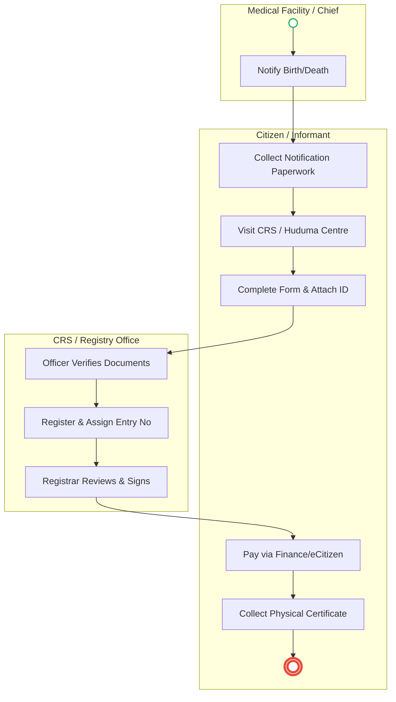
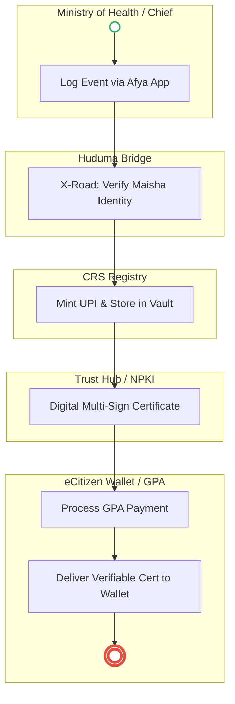

# CIVIL REGISTRATION SERVICES (CRS) – Service Delivery

## Cover Page
- **Ministry/Department/Agency (MDA):** Ministry of Interior and National Administration
- **Department:** Department of Civil Registration Services (CRS)
- **Process Name:** Birth and Death Registration
- **Document Version:** 2.1
- **Date:** 2026-02-24
- **Classification:** Official
- **Strategic Category:** Priority MDA
- **Service Model:** G2C
- **Life-Cycle Group:** Cradle to Death (1. The Cradle)

---

## Executive Summary
Civil Registration Services (CRS) is the authoritative custodian of vital life events in Kenya, including births and deaths. These events form the bedrock of a citizen's legal identity (Maisha Namba). The current process relies on semi-digital systems (CRVS) and manual paper notifications from hospitals and administrative chiefs. The transition to the Kenya DSAP Architecture aims to establish real-time, event-driven registration triggered at the point of occurrence.

---

### 1.1 AS-IS Process Flow (BPMN 2.0)

---

## Process Overview
### Process Name
Vital Event Registration (Births and Deaths) and Certificate Issuance

### Service Category
- G2C (Government to Citizen)

### Scope
- **In Scope:** Timely and late registration of births and deaths; issuance of birth certificates, death certificates, and burial permits.
- **Out of Scope:** Issuance of National ID cards (handled by NRB).

### Triggers
- Occurrence of a birth or death at a facility or within the community.

### End States
- **Successful:** Vital event registered; Digital record created; Physical/Digital certificate issued.

### Policy Context
- Births and Deaths Registration Act; The Constitution of Kenya; Data Protection Act 2019.

---

## Detailed Process (AS-IS)

| Step | Role | Action | Tool/System | Notes |
|---|---|---|---|---|
| 1 | Informant/Chief | Reports the event at a CRS office or via the eCitizen portal. | Manual/Digital | |
| 2 | Registration Officer | Verifies the supporting documents (ID of parents, notification from hospital). | Manual | |
| 3 | Registration Officer | Manually enters the data into the CRVS system and assigns a serial entry number. | CRVS System | |
| 4 | Registrar | Approves the entry and signs the physical register or digital record. | Physical Register | |
| 5 | Clerk | Processes the payment and triggers the printing of the certificate. | Manual/eCitizen | |

---

## Pain Points & Opportunities
### Pain Points
- **Manual Backlogs:** Physical registers in district offices lead to delays in searching and retrieving records.
- **Identity Fraud:** Difficulty in verifying the identity of parents or informants against IPRS in real-time.
- **Late Registration:** Complexities in "Late Registration" (after 6 months) discourage citizens from formalizing vital events.

### Opportunities
- **Event-Driven Architecture:** Automatic registration triggered when a birth is logged in the MOH **Afya App**.
- **Unified Identity (Maisha Namba):** Instant generation of a Unique Personal Identifier (UPI) upon birth registration.
- **Digital Certificates:** Issuing cryptographically signed digital certificates directly to the citizen's mobile wallet.

---

### 1.2 TO-BE Process (BPMN 2.0 - POC v2 Aligned)

## Future State Process (TO-BE)
### Narrative
**TO-BE Process: Seamless Vital Event Registration**

**Design Principles:**
- **Zero-Touch Registration:** When a child is born in an accredited hospital, the **MOH system** pushes the record to **CRS** via the **Huduma Bridge**. The registration happens in the background without the parents needing to apply.
- **Instant Identity:** The system automatically pings **IPRS** to verify the parents' identities and then mints a **Maisha Namba (UPI)** for the child instantly.
- **Digital First:** Paper certificates are replaced by **Verifiable Digital Credentials** issued to the parents' eCitizen wallets, which can be presented at schools or for passport applications without needing a physical copy.

### Optimized Steps (Digital)

| Step | Actor | Action | System |
|---|---|---|---|
| 1 | Health Worker | Records the birth/death in the facility EMR. | MOH Afya App |
| 2 | System | Automatically verifies the parents' IDs against Maisha Namba via X-Road. | IPRS / KeSEL |
| 3 | CRS Registry | Receives validated packet, mints UPI (Maisha Namba) and stores in Vault. | CRS / Workflow Engine |
| 4 | Trust Hub | **NPKI Signing:** Cryptographically signs the record for non-repudiation. | NPKI Service |
| 5 | Finance | **Payment:** GPA processes fees and performs revenue split (National/County). | GPA |
| 6 | Citizen | **Issuance:** Verifiable digital certificate delivered to Passport/Mobile Wallet. | Digital Wallet |

---

## References
- https://www.immigration.go.ke
- Births and Deaths Registration Act
- Desk Review
