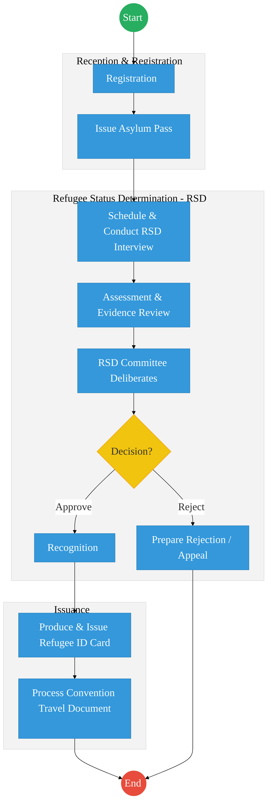
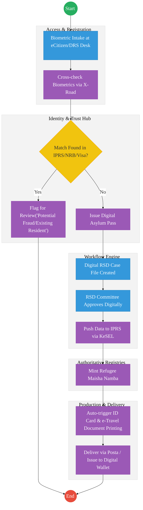

# DEPARTMENT OF REFUGEE SERVICES – Service Delivery

## Cover Page
- **Ministry/Department/Agency (MDA):** Ministry of Interior and National Administration
- **Department:** Department of Refugee Services (DRS)
- **Process Name:** Refugee Status Determination and Documentation
- **Document Version:** 2.1
- **Date:** 2026-02-24
- **Classification:** Official
- **Strategic Category:** Priority MDA
- **Service Model:** G2C
- **Life-Cycle Group:** Cradle to Death (3. Identity & Travel)

---

## Executive Summary
The Department of Refugee Services (DRS) is mandated to manage refugee affairs in Kenya, including registration, Refugee Status Determination (RSD), and the issuance of identification and travel documents. Currently, the process is heavily manual, involving multiple physical interviews and siloed databases (like UNHCR proGres). The transition to the Kenya DSAP Architecture aims to integrate refugee data seamlessly with the national identity ecosystem (IPRS/Maisha Namba) to provide secure, verifiable digital credentials.

---

## 1. AS-IS Process Flowchart (BPMN 2.0)
*Current State visualization (End-to-End Refugee Services based on Deep Dive).*

---

## Process Overview
### Process Name
End-to-End Refugee Status Determination and Documentation

### Service Category
- G2C (Government to Citizen/Refugee)

### Scope
- **In Scope:** Asylum seeker registration, RSD interviews, Committee decisions, and issuance of Refugee ID Cards and Convention Travel Documents (CTDs).
- **Out of Scope:** Camp management logistics (food/shelter).

### Triggers
- Arrival of an asylum seeker at a reception center or urban registration desk.

### End States
- **Successful:** Issuance of Refugee ID Card and integration into the national population database.
- **Unsuccessful:** Rejection of claim (leading to appeal or deportation).

### Policy Context
- The Refugees Act, 2021; 1951 Refugee Convention; Data Protection Act 2019.

---

## Detailed Process (AS-IS)
| Step | Role | Action | Tool/System | Notes |
|---|---|---|---|---|
| 1 | Registration Officer | Receives asylum seeker, verifies entry documents, and captures photos/fingerprints to issue an Asylum Pass. | Refugee System / UNHCR proGres | Dual entry often required. |
| 2 | Eligibility Officer | Conducts the RSD interview, records testimony, and reviews evidence. | Manual/Digital | |
| 3 | RSD Committee | Deliberates on the case applying the 1951 Criteria. | Committee Minutes | |
| 4 | Processing Unit | If recognized, the refugee applies for an ID Card. Old records are retrieved and prints verified. | Manual/Standalone System | |
| 5 | Processing Unit | If requested, processes Convention Travel Documents, requiring manual status verification. | Production System | |

---

## Pain Points & Opportunities
### Pain Points
- **Siloed Databases:** Disconnect between DRS systems, UNHCR proGres, and the national IPRS/NRB.
- **Manual Verification:** RSD Committee relies on paper files and manual testimony transcription.
- **Documentation Delays:** Producing physical Refugee ID Cards and Travel Documents takes months due to lack of integration with central printing facilities.

### Opportunities
- **National Identity Integration:** Minting a specific "Maisha Namba" for recognized refugees to allow them access to eCitizen services (like KRA PIN, SHA, NSSF).
- **Automated Workflows:** Using a central Workflow Engine to route files from Registration to the RSD Committee digitally.
- **Digital Credentials:** Issuing verifiable digital IDs alongside physical cards.

---

## 2. TO-BE Process Flowchart (BPMN 2.0)
*Future State visualization (Kenya DSAP Architecture - Huduma Bridge).*

## Future State Process (TO-BE)
### Narrative
**TO-BE Process: Integrated Refugee Identity Management**

**Design Principles:**
- **Single Source of Truth:** Integrating refugee biometrics tightly with the national **IPRS** via **KeSEL (X-Road)**. This prevents identity fraud (e.g., citizens registering as refugees, or vice versa).
- **Digital Workflows:** The entire RSD process is managed by a central **Workflow Engine**, eliminating lost physical files.
- **Financial & Social Inclusion:** By minting a standardized **Maisha Namba** upon recognition, refugees can immediately access integrated eCitizen services, pay via the **Government Payment Aggregator (GPA)**, and enroll in the Social Health Authority (SHA).

### Optimized Steps (Digital)
| Step | Actor | Action | System |
|---|---|---|---|
| 1 | Registration Officer | Captures biometrics via integrated kits. System instantly queries IPRS and Immigration databases via X-Road to ensure the individual is not already registered. | eCitizen / X-Road |
| 2 | System | Auto-generates a Digital Asylum Pass with a QR code verifiable by law enforcement. | Output Generator |
| 3 | RSD Committee | Reviews the digitized evidence file and records the decision directly in the system. | Workflow Engine  |
| 4 | System | Upon approval, the system pushes the data to IPRS to mint a Refugee Maisha Namba. | IPRS / KeSEL |
| 5 | Production Unit | ID Cards and Travel Documents are queued for printing at the centralized government facility and dispatched via Posta. | Production / Logistics |

---

## References
- https://www.refugees.go.ke
- Refugees Act 2021
- Desk Review
