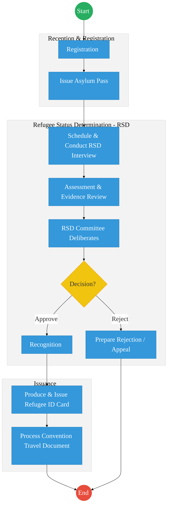
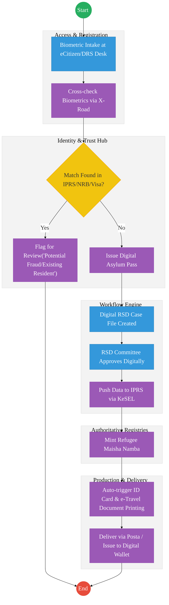

# DEPARTMENT OF REFUGEE SERVICES – Business Process Architecture (Updated)

## Cover Page
- **Ministry:** Ministry of Interior and National Administration
- **State Department:** Department of Refugee Services
- **Primary Authority:** Commissioner for Refugee Affairs
- **Document Type:** Business Process Architecture (BPA) Standardised
- **Document Version:** 4.1
- **Date:** 2026-03-25
- **Classification:** Official / Sensitive
- **Strategic Category:** Priority MDA
- **Service Model:** G2C
- **Reviewer:** Senior Government Enterprise Architect

---

## SECTION 0: SERVICE PRIORITISATION MAPPING
- **Mapped Priority Service:** Refugee Status Determination and Documentation
- **Tier Classification:** Tier 2
- **Strategic Category:** Identity / Security (Refugee Lifecycle)
- **Breakout Room Classification:** Room 1 (High Impact & Large Registries)
- **Lead MDA (Standardised Name):** Department of Refugee Services
- **Related Cross-Cutting Services:**
    - National Population Register (IPRS Integration)
    - Identity Layer (Maisha Namba Minting)
    - Payment Gateway (GPA)
    - National EDRMS (Case Management)
    - X-Road (UNHCR / Immigration Interop)

---

## SECTION 0.1: PRIORITISATION JUSTIFICATION
This service is prioritised because the TO-BE design eliminates the historical disconnect between Refugee registries and the National Identity ecosystem. By transitioning from siloed, manual "Asylum Passes" to a digital-first model where recognized refugees are minted a standardized "Maisha Namba" (UPI) via X-Road integration with IPRS, the design ensures national security and prevents identity fraud. This transformation enables refugees to access essential services (Healthcare, Banking, eCitizen) while providing the Government with real-time, verifiable data on the refugee population.

| Criteria | Evidence from TO-BE Design |
| :--- | :--- |
| **Demand / Volume** | Over 600,000 refugees in Kenya; constant flow of new asylum seekers requiring status determination. |
| **National Priority Alignment** | Refugees Act (2021); National Security & Identity Pillars; Shirika Plan for Integration. |
| **Data Reusability** | Refugee identity data is consumed by Health (SHA), Education (NEMIS), and Security agencies. |
| **Interoperability** | Real-time biometric cross-checks with NRB and Immigration via Huduma Bridge (X-Road). |
| **Revenue / Efficiency Impact** | Automated processing of Convention Travel Documents (CTDs) via GPA; 50% reduction in RSD lag. |
| **Governance / Risk Reduction** | Biometric-verified "Maisha Namba" for refugees prevents citizens from double-registering for aid. |
| **Inclusivity** | Digital ID issuance ensures refugees can access mobile money and formal employment legally. |
| **Readiness** | Medium-High; Biometric systems exist; API-led integration with IPRS is in pilot phase. |

> [!NOTE]
> “The TO-BE design eliminates the disconnect between refugee systems and the national identity ecosystem. By minting a standardized 'Maisha Namba' for recognized refugees via X-Road integration with IPRS, the design ensures secure identification, prevents identity fraud, and enables refugees to access essential services like healthcare (SHA) and financial inclusion via eCitizen.”

---

# SECTION 1: SERVICE DEFINITION (STANDARDISED)

The Department of Refugee Services (DRS) is mandated by the **Refugees Act 2021** to provide and coordinate protection and assistance to refugees and asylum seekers in Kenya.

In this refactored BPA, the focus is the **End-to-End Refugee Status Determination and Documentation** lifecycle. The goal is to move from manual, siloed "testimony-based" files to a **Digital Case Management** environment tightly integrated with the national identity and security infrastructure.

---

# SECTION 2: SERVICE CATALOGUE (NORMALISED)

| Category | Service Name | Description |
| :--- | :--- | :--- |
| **Core Services** | **Asylum Registration & Intake** | Initial biometric capture and issuance of digital Asylum Seeker Passes. |
| | **Refugee Status Determination (RSD)** | Technical evaluation of claims and issuance of Recognition Decisions. |
| **Extended Services** | **Refugee ID Issuance (Maisha Card)** | Minting of the refugee Maisha Namba and physical ID production. |
| | **Convention Travel Document (CTD)** | Processing of international travel documents for recognized refugees. |
| **Special Case Services**| **Voluntary Repatriation Processing** | Coordinated deregistration and assistance for refugees returning home. |
| | **Case Re-opening & Appeals** | Administrative review of rejected asylum claims. |

---

# SECTION 3: AS-IS PROCESS FLOWS (MANUAL/UNHCR-SILOED)

The current process is heavily manual, involving multiple physical interviews and siloed databases (like UNHCR proGres) that do not talk to the national IPRS.

### 3.1 AS-IS Visualization

### 3.2 Operational Reality
- **Actors:** Registration Officer, Eligibility Officer, RSD Committee, Processing Unit, UNHCR Reps.
- **Systems:** UNHCR proGres (Siloed), Standalone ID systems, Manual Case files.
- **Pain Points:** Disconnect between DRS and national NRB/IPRS systems; 6-month delay in ID production; reliance on paper-based testimony transcription; no real-time fraud checks against existing national ID records.

---

# SECTION 4: TO-BE PROCESS INTERPRETATION (NEW LAYER)

### 4.1 TO-BE Process (DPI-Enabled)

### 4.2 Key Capabilities Introduced
*   **Automation:** Real-time biometric cross-checks against the national identity system to prevent refugee/citizen identity duplication.
*   **Integration:** Hub-and-spoke integration with the UNHCR proGres system and the National Bureau (NRB) via X-Road.
*   **Real-time Processing:** Automated generation of digital Asylum Seeker Passes with verifiable QR codes.
*   **Digital Identity Validation:** Recognized refugees assigned a "Refugee Maisha Namba" (UPI) for access to SHA, KRA, and Banking.
*   **Workflow Orchestration:** End-to-end digital case management for RSD Committee technical deliberation.

### 4.3 Transformation Summary
| Dimension | AS-IS | TO-BE |
| :--- | :--- | :--- |
| **Processing** | Manual / Multi-Interview | Digital / Workflow-driven |
| **Verification** | UNHCR proGres (Silo) | X-Road API (IPRS/NRB) |
| **Records** | Physical Paper Files | National EDRMS Case Files |
| **Tracking** | Manual status checking | eCitizen Real-time Dashboard |

---

# SECTION 5: SYSTEM LANDSCAPE (ALIGN TO GEA)

| Layer | System / Platform | Role |
| :--- | :--- | :--- |
| **Identity Layer** | Maisha Namba (IPRS) | Unified identity and UPI minting for refugees. |
| **Interoperability** | KeSEL (X-Road) | Secure data link to Immigration and NRB. |
| **shared Services** | National EDRMS | Legal digital archive for RSD testimony and decisions. |
| **Workflow / BPM** | CaseTrack Engine | Orchestrates the RSD and appeal lifecycle. |
| **Payment Layer** | GPA (Payment Gateway) | Automated fee collection for CTD travel documents. |
| **Trust Hub** | Consent Manager | Refugee control over data sharing in the "Shirika" plan. |

---

# SECTION 6: TRANSFORMATION VALUE (CRITICAL ADDITION)

| Value Type | Explanation |
| :--- | :--- |
| **Efficiency Gain** | RSD turnaround time reduced by 50%; eliminated redundant biometric captures. |
| **Economic Impact** | Recognized refugees with Maisha Nambas can legally pay taxes and access bank loans. |
| **Governance Impact** | Prevents identity fraud/double-registry by citizens seeking refugee aid. |
| **Citizen Experience** | Effortless CTD application via eCitizen; mobile notification of RSD decisions. |
| **Interoperability Value** | Immediate data sync for social services (Healthcare/Education) for recognized refugees. |

---

# SECTION 7: ALIGNMENT TO WHOLE-OF-GOVERNMENT ARCHITECTURE
- **Shared Platforms:** Uses eCitizen for secure login and GPA for Convention Travel Document issuance.
- **Registry Reuse:** Reuses IPRS infrastructure to avoid creating a massive, disconnected refugee biometric silo.
- **Compliance with GEA / GIF:** Standardizing refugee data exchange to match national identity protocols.

---

# SECTION 8: IMPLEMENTATION READINESS (NEW)
*   **Data Readiness:** Medium; Requires migration of proGres legacy data into the national CRVSS/IPRS structure.
*   **Legal Readiness:** High; Refugees Act (2021) explicitly supports digital identity and integration.
*   **Institutional Readiness:** Medium; Requires training for RSD committees on the digital case adjudication platform.
*   **Technical Readiness:** High; Biometric enrollment hardware is existing and ready for API integration.

---

# SECTION 9: TRACEABILITY MATRIX (NEW)

| BPA Process | Priority Service | Tier | TO-BE Capability | National Impact |
| :--- | :--- | :--- | :--- | :--- |
| **Biometric Intake** | Intake & Registration| T2 | X-Road: IPRS/NRB Check | Identity Integrity & Security |
| **Status Review** | RSD Adjudication | T2 | Digital Case Adjudication| Transparent Refugee Protection |
| **ID Issuance** | Maisha Card Issuance| T2 | Maisha Namba Minting | Social & Financial Inclusion |
| **Travel Control** | CTD Issuance | T2 | NPKI Digital Signing | Safe & Secure Travel Documents |

---
**[End of Standardised Business Process Architecture]**
