# Source: Priority_MDAs_Justification_Matrix.md

# Priority MDAs – Justification Matrix

This document presents the prioritised list of Ministries, Departments, and Agencies (MDAs) for intervention based on the approved prioritisation model. The model assessed:

- Institutional capacity gaps (DMI and weakest pillar scores)
- Citizen/public impact and service reach
- Records volumes and transaction intensity
- Feasibility of intervention based on readiness and mandate

---

# 1. Proposed Top Priority MDAs

---

# A. LARGE MDAs (High Records Volume / High Transaction Intensity) – 8

| # | MDA | Tier | DMI | Weakest Pillar(s) | Citizen Impact | Record Volumes | Service Complexity | Model Application | Primary Intervention Focus |
|---|-----|------|-----|------------------|----------------|----------------|--------------------|------------------|---------------------------|
| 1 | [Agriculture & Food Authority (AFA)](./Agriculture_and_Food_Authority___Service_Delivery.md) + KIAMIS | T2 | ~2.4 | RMI / DMI | Very High | Farmer profiles >7.1M; permits, inspections, traceability | Very High | High transaction intensity; national registries; scalable integrations | Farmer registries, licensing, inspections, traceability |
| 2 | [Kenya National Qualifications Authority (KNQA)](./Kenya_National_Qualifications_Authority___Service_Delivery.md) | T2 | ~2.2 | RMI / ESMI | Very High | Qualification applications; validation reports | High | Cross-MDA dependency; regulatory mandate | Qualifications registry, validation workflows |
| 3 | [Ministry of Health (MoH)](./Ministry_of_Health___Service_Delivery.md) | T1 | ~2.6 | DMI / RMI / ESMI | Extremely High | 55M+ patient profiles; 300M+ encounters annually | Very High | Highest transaction intensity; national shared services | Shared Health Record; patient identity; interoperability |
| 4 | [Immigration & Citizen Services](./STATE_DEPARTMENT_FOR_IMMIGRATION_AND_CITIZEN_SERVICES___Passport_Application.md) | T2 | ~1.40 | RMI | Very High | >10 million records | High | High citizen reach; bounded registries | Identity registries; records governance |
| 5 | [Office of the Head of Public Service](./PUBLIC_SERVICE_COMMISION_PSC____Service_Delivery.md) | T2 | 2.33 | RMI / GCI | High | 15.7M HR records | High | Records-heavy HR mandate | HR records modernisation |
| 6 | [Kenya Broadcasting Corporation](./Kenya_Broadcasting_Corporation___Service_Delivery.md) | T2 | ~2.33 | RMI | High | 33.6M archives | Medium | Public archives; less urgent | Archival digitisation |
| 7 | [State Department of Correctional Services](./STATE_DEPARTMENT_FOR_CORRECTIONAL_SERVICES___Service_Delivery.md) | T2 | 1.83 | RMI | High | 10–20M inmate records | High | Custodial records digitisation | Inmate records modernisation |
| 8 | [National Environment Management Authority](./National_Environment_Management_Authority___Service_Delivery.md) | T2 | ~2.09 | RMI / ESMI | High | 2.5M records | High | Permitting bottlenecks | Permit and compliance records |

---

# B. MEDIUM MDAs (Moderate Records Volume / Moderate–High Transactions) – 5

| # | MDA | Tier | DMI | Weakest Pillar | Citizen Impact | Record Volumes | Complexity | Model Application | Intervention Focus |
|---|-----|------|-----|----------------|----------------|----------------|------------|------------------|-------------------|
| 9 | [State Department for Special Programmes](./State_Department_for_Special_Programmes___Service_Delivery.md) | T2 | ~1.40 | RMI | Very High | 100K–1M | High | Beneficiary-heavy registries | Beneficiary registry modernisation |
| 10 | [State Department for Culture, Arts and Heritage](./Culture_and_Heritage___Service_Delivery.md) | T2 | 1.91 | RMI | Medium-High | <10K | Medium | Records leadership role | Records standards |
| 11 | [State Department for Children Services](./State_Department_for_Children_Services___Service_Delivery.md) | T2 | ~1.59 | RMI / ESMI | High | 100K–1M | High | Child protection workflows | Secure case records |
| 12 | [Office of the Chief of Staff](./Office_of_the_Chief_of_Staff___Service_Delivery.md) | T1 | 1.91 | GCI / RMI | System-wide | 10K–100K | High | Executive change anchor | Whole-of-Government standards |
| 13 | [National Government Coordination](./National_Government_Coordination___Service_Delivery.md) | T2 | ~1.46 | RMI | Medium-High | 10K–100K | High | Coordination workflows | Inter-MDA records |

---

# C. SMALL MDAs (Low Records Volume / Targeted Transactions) – 5

| # | MDA | Tier | DMI | Weakest Pillar | Citizen Impact | Record Volumes | Complexity | Model Application | Intervention Focus |
|---|-----|------|-----|----------------|----------------|----------------|------------|------------------|-------------------|
| 14 | [Government Spokesperson](./Government_Spokesperson___Service_Delivery.md) | T2 | ~1.68 | RMI | Medium | 10K–100K | Medium | Public archives | Digital archives |
| 15 | [Athi Water Works Development Agency](./Athi_Water_Works_Development_Agency___Service_Delivery.md) | T2 | ~2.52 | RMI | High | <10K | High | Infrastructure constrained by records | Contract & infrastructure records |
| 16 | [Department for Sports](./Sports_and_the_Arts___Service_Delivery.md) | T2 | ~1.25 | RMI | Medium | 1.3M | Medium | Grants and events | Registry modernisation |
| 17 | [Department of Refugee Services](./_REFUGEE_SERVICES___Service_Delivery.md) | T2 | ~1.47 | RMI / ESMI | High | <10K | High | Sensitive case files | Case digitisation |
| 18 | [State Department for MSMEs](./Micro_Small_and_Medium_Enterprise_Development___Service_Delivery.md) | T2 | ~1.43 | RMI | High | <10K | Medium | Business support records | Business registry modernisation |

---

# 2. Proposed Next Priority MDAs – 5

| # | MDA | Tier | DMI | Weakest Pillar | Citizen Impact | Record Volumes | Complexity | Model Summary | Intervention Focus |
|---|-----|------|-----|----------------|----------------|----------------|------------|--------------|-------------------|
| 19 | [Cabinet Affairs](./CABINET_OFFICE___Service_Delivery.md) | T2 | ~1.30 | RMI / ESMI | Medium | 10K–100K | High | Executive records | Cabinet memoranda |
| 20 | [Assets Recovery Agency](./Assets_Recovery_Agency___Service_Delivery.md) | T2 | ~2.27 | RMI | Medium | 10K–100K | High | Governance critical | Evidence records |
| 21 | [Youth Affairs & Creative Economy](./Youth_Affairs___Service_Delivery.md) | T2 | ~1.76 | RMI | High | 10K–100K | Medium | Programme registries | Programme records |
| 22 | [State Department for Energy](./Energy___Service_Delivery.md) | T2 | ~2.04 | ESMI / GCI | High | <10K | High | Economic impact | Licensing digitisation |
| 23 | [Science, Research & Innovation](./National_Commission_For_Science_Technology_and_Innovation___Service_Delivery.md) | T2 | ~1.60 | RMI / GCI | Medium | 10K–100K | High | Knowledge records | Knowledge repositories |

---

# 3. Prioritisation Model Summary

The prioritisation model applied three core criteria:

---

## A. Need (Capacity Gap)

Measured using:

- Digital Maturity Index (DMI)
- Weakest pillars:
  - Records Management Index (RMI)
  - Enterprise Systems Maturity Index (ESMI)
  - Governance & Compliance Index (GCI)

Priority given to:

- Foundational–Basic maturity MDAs
- Records-constrained institutions

---

## B. Impact (Citizen / Public Value)

Measured using:

- Record volumes
- Population coverage
- Sensitivity of records
- Frequency of transactions

---

## C. Feasibility (Implementation Readiness)

Measured using:

- Existing ICT systems
- Leadership readiness
- Defined registries
- Governance structures

---

# 4. Strategic Objective

The prioritised MDAs represent the highest value intervention opportunities to:

- Improve citizen service delivery
- Strengthen national registries
- Enable interoperability
- Improve accountability
- Enable digital government transformation

---

# END OF DOCUMENT

---

# Source: Agriculture_and_Food_Authority___Service_Delivery.md

# Agriculture and Food Authority (AFA) – Service Delivery

## Cover Page
- **Ministry/Department/Agency (MDA):** Agriculture and Food Authority
- **Process Name:** Farmer Registration & Licensing
- **Document Version:** 2.1
- **Date:** 2026-02-24
- **Classification:** Official

---

## Executive Summary
The Agriculture and Food Authority (AFA) regulates, develops, and promotes scheduled crops (coffee, tea, nuts, etc.). The current manual and fragmented licensing processes lead to delays in export permits, trading licenses, and farmer registration. The transition to the Kenya DSAP Architecture aims to establish KIAMIS as the single source of truth for farmers, while integrating with BRS, KRA, and Kentrade to automate compliance and licensing.

---

## 1. AS-IS Process Flowchart (BPMN 2.0)
*Current State visualization (End-to-End AFA Services based on Deep Dive).*

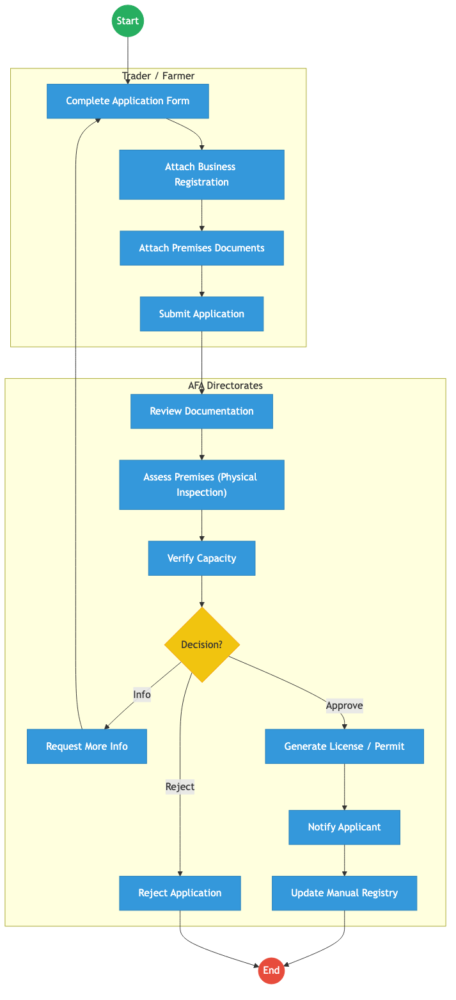

---

## Process Overview
### Process Name
End-to-End Farmer Registration, Export Permits, and Trading Licenses

### Service Category
- G2B (Government to Business) / G2C (Government to Citizen)

### Scope
- **In Scope:** Farmer profiling (KIAMIS), issuing trading licenses, and approving export/import permits.
- **Out of Scope:** Customs clearance at the port (handled by KRA/Kentrade).

### Triggers
- A trader applying for a license or a farmer registering to supply scheduled crops.

### End States
- **Successful:** Verifiable Digital Trading License or Export Permit issued.

### Policy Context
- Agriculture and Food Authority Act; Crops Act.

---

## Detailed Process (AS-IS)

| Step | Role | Action | Tool/System | Notes |
|---|---|---|---|---|
| 1 | Applicant | Fills application forms for licenses or permits and attaches paper copies of BRS certificates and land documents. | Paper/Portal | High manual effort. |
| 2 | AFA Clerk | Receives and logs the application, assigning a manual reference number. | Manual Registry | |
| 3 | AFA Inspector | Travels to physically assess the applicant's premises and verify operational capacity. | Manual | Major bottleneck. |
| 4 | AFA Committee | Reviews the inspection report and documentation to make a decision (Approve/Reject/Info). | Committee | |
| 5 | AFA Admin | If approved, manually generates the license/permit and notifies the applicant. | AFA IMIS | |

---

## Pain Points & Opportunities
### Pain Points
- **Manual Verification:** Officers manually verify BRS and KRA documents, leading to fraud risks.
- **Inspection Delays:** Physical premise inspections cause massive backlogs.
- **Siloed Registries:** KIAMIS (farmers), AFA IMIS (licenses), and Kentrade (exports) are not fully integrated.

### Opportunities
- **Automated Validation:** Use KeSEL (X-Road) to validate BRS (ownership) and KRA (tax compliance) instantly.
- **Risk-Based Inspections:** Auto-approve renewals for low-risk applicants without physical visits.
- **Integrated Payments:** Shift all cess and license fees to the Government Payment Aggregator (GPA).

---

## 2. TO-BE Process Flowchart (BPMN 2.0)
*Future State visualization (Kenya DSAP Architecture - Huduma Bridge).*

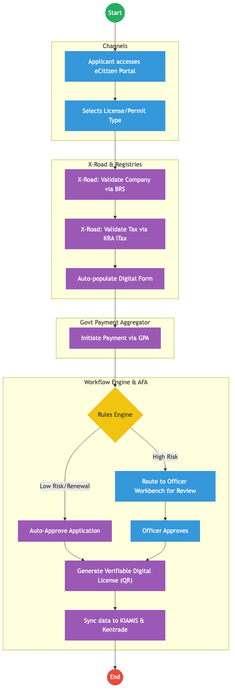

## Future State Process (TO-BE)
### Narrative
**TO-BE Process: Automated Licensing via Huduma Bridge**

**Design Principles:**
- **Once-Only Principle:** BRS and KRA data is fetched automatically via APIs; applicants no longer upload paper certificates.
- **Cashless & Transparent:** All payments are unified under the GPA, ensuring immediate reconciliation and split-billing where necessary.
- **Automated Orchestration:** The Camunda workflow engine applies risk profiles to auto-approve standard renewals, reserving manual inspections only for high-risk or first-time applicants.

### Optimized Steps (Digital)

| Step | Actor | Action | System |
|---|---|---|---|
| 1 | Applicant | Logs into eCitizen and selects the required AFA service (e.g., Export Permit). | eCitizen Portal |
| 2 | System | Fetches business details from BRS and tax status from KRA instantly via X-Road. | KeSEL / X-Road |
| 3 | Applicant | Pays the required cess or license fee through unified mobile money or card options. | GPA |
| 4 | System | Rules Engine assesses risk. If low risk (e.g., renewal), it auto-approves. If high risk, routes to an inspector. | Workflow Engine |
| 5 | System | Generates a QR-coded digital license and pushes the approval status directly to the Kentrade Single Window System. | Output Generator |

---

## References
- https://afa.go.ke
- Agriculture and Food Authority Act
- Desk Review

---

# Source: Assets_Recovery_Agency___Service_Delivery.md

# ASSETS RECOVERY AGENCY (ARA) – Service Delivery

## Cover Page
- **Ministry/Department/Agency (MDA):** Office of the Attorney General
- **Authority:** Assets Recovery Agency (ARA)
- **Process Name:** Asset Identification, Preservation, and Forfeiture
- **Document Version:** 2.1
- **Date:** 2026-02-24
- **Classification:** Official

---

## Executive Summary
The Assets Recovery Agency (ARA) is mandated to identify, trace, freeze, and recover proceeds of crime. Currently, the evidence management process is heavily reliant on physical files and manual tracking across different registries (Lands, NTSA, BRS). The transition to the Kenya DSAP Architecture aims to establish a central "Case and Evidence Registry" integrated with national foundational registries via X-Road to enable real-time asset tracing.

---

## 1. AS-IS Process Flowchart (BPMN 2.0)
*Current State visualization (Asset Tracing and Recovery).*

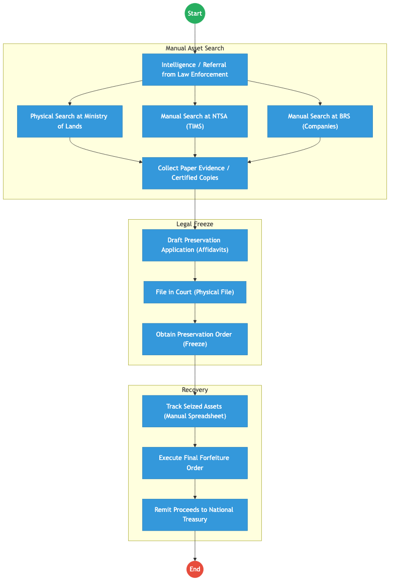

---

## Process Overview
### Process Name
Asset Identification, Tracing, and Forfeiture Lifecycle

### Service Category
- G2G (Government to Government - Judiciary/MDAs)

### Scope
- **In Scope:** Tracing of suspect assets, obtaining court orders, managing seized assets, and final forfeiture to the state.
- **Out of Scope:** The actual investigation of the predicate crime (handled by DCI/EACC).

### Triggers
- A formal referral from an investigative agency or a suspicious transaction report (STR).

### End States
- **Successful:** Proceeds of crime recovered and remitted to the state.

### Policy Context
- Proceeds of Crime and Anti-Money Laundering Act (POCAMLA); Data Protection Act 2019.

---

## Detailed Process (AS-IS)

| Step | Role | Action | Tool/System | Notes |
|---|---|---|---|---|
| 1 | Investigator | Receives a lead and sends physical requests to NTSA, Lands, and BRS to find assets owned by a suspect. | Physical Letters | Slow and prone to leakage. |
| 2 | MDA Clerk | Searches their local database and provides certified paper copies of ownership documents. | Manual | |
| 3 | ARA Legal | Prepares court affidavits manually, attaching the paper evidence collected. | Manual/Word | |
| 4 | ARA Officer | Tracks the location and status of seized vehicles/properties in a local Excel sheet. | Excel | |
| 5 | Finance | Remits funds from liquidated assets to the National Treasury via IFMIS. | Manual Entry | |

---

## Pain Points & Opportunities
### Pain Points
- **Tracing Lag:** Assets are often moved or sold before ARA can obtain ownership data from siloed registries.
- **Evidence Integrity:** Physical documents can be lost, stolen, or altered during the long tracing process.
- **Resource Fragmentation:** No unified view of all assets associated with a specific "Maisha Namba" across government.

### Opportunities
- **Instant Asset Discovery:** Using **X-Road** to query Lands (Ardhisasa), NTSA, and BRS simultaneously to see a suspect's full "Wealth Map" in seconds.
- **Digital Evidence Vault:** All ownership records fetched via the **Huduma Bridge** are digitally signed (NPKI), serving as immutable evidence for court.
- **Blockchain for Seized Assets:** Using a private ledger to track every seized asset (serial numbers, GPS locations) from "Freeze" to "Liquidation."

---

## 2. TO-BE Process Flowchart (BPMN 2.0)
*Future State visualization (Kenya DSAP Architecture - Huduma Bridge).*

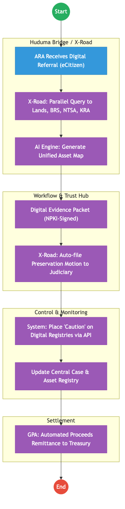

## Future State Process (TO-BE)
### Narrative
**TO-BE Process: Rapid Digital Asset Recovery**

**Design Principles:**
- **Zero-Latency Tracing:** The **Huduma Bridge** enables ARA to see all assets linked to a National ID or PIN across all government databases in real-time.
- **Non-Repudiable Evidence:** Records retrieved via **KeSEL (X-Road)** are authenticated by the issuing agency's **NPKI** server, removing the need for manual certification.
- **Instant Freezing:** Once a court order is issued digitally, the **Workflow Engine** pings the relevant registries (Lands/NTSA) to place an instant digital "Caution" on the assets, preventing their sale.

### Optimized Steps (Digital)

| Step | Actor | Action | System |
|---|---|---|---|
| 1 | ARA Analyst | Inputs a suspect's Maisha Namba into the ARA Investigation Portal. | ARA Portal |
| 2 | System | Instantly pings BRS, NTSA, and Ardhisasa via X-Road to list all assets. | KeSEL / X-Road |
| 3 | System | Compiles a digitally signed evidence packet and routes it to the Judiciary Case Management System. | Huduma Bridge / Judiciary API |
| 4 | System | Upon the Judge's digital signature, the system auto-locks the asset records in the source registries. | Workflow Engine |
| 5 | System | Automatically reconciles the proceeds from forfeited assets and remits them to the National Treasury via the GPA. | GPA / IFMIS |

---

## References
- https://ara.go.ke
- Proceeds of Crime and Anti-Money Laundering Act
- Desk Review

---

# Source: Athi_Water_Works_Development_Agency___Service_Delivery.md

# ATHI WATER WORKS DEVELOPMENT AGENCY (AWWDA) – Service Delivery

## Cover Page
- **Ministry/Department/Agency (MDA):** Ministry of Water, Sanitation and Irrigation
- **Agency:** Athi Water Works Development Agency (AWWDA)
- **Process Name:** Infrastructure Development Lifecycle
- **Document Version:** 2.1
- **Date:** 2026-02-24
- **Classification:** Official

---

## Executive Summary
Athi Water Works Development Agency (AWWDA) is responsible for the planning and development of water and sewerage infrastructure within its area of jurisdiction. The infrastructure lifecycle involves complex feasibility studies, procurement, construction supervision, and final commissioning. The current process is hampered by manual data collection and fragmented tracking of contractors and project milestones. The transition to the Kenya DSAP Architecture aims to provide a unified project management ecosystem integrated with GIS and IFMIS.

---

## 1. AS-IS Process Flowchart (BPMN 2.0)
*Current State visualization (End-to-End Infrastructure Lifecycle based on Deep Dive).*

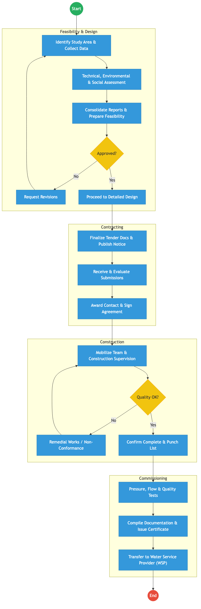

---

## Process Overview
### Process Name
End-to-End Water Infrastructure Development (Study to Handover)

### Service Category
- G2B (Government to Business - Contractors) / G2G (Government to WSP)

### Scope
- **In Scope:** Feasibility studies, procurement of contractors, construction supervision, and commissioning of water/sewerage projects.
- **Out of Scope:** Day-to-day water billing (handled by WSPs like NCWSC).

### Triggers
- Identification of a water need in the Master Plan or a Presidential Directive.

### End States
- **Successful:** Infrastructure commissioned and transferred to a Water Service Provider for operations.

### Policy Context
- The Water Act 2016; Public Procurement and Asset Disposal Act; NEMA Regulations.

---

## Detailed Process (AS-IS)

| Step | Role | Action | Tool/System | Notes |
|---|---|---|---|---|
| 1 | Planning Engineer | Identifies the study area and collects site data for feasibility. | Manual/GIS | |
| 2 | Environmentalist | Conducts Environmental & Social Impact Assessment (ESIA). | Manual | |
| 3 | AWWDA Committee | Reviews the feasibility report and detailed design for approval. | Manual | |
| 4 | Procurement Unit | Manages the tender process from advertisement to contract signing. | IFMIS / Manual | |
| 5 | Resident Engineer | Oversees construction, conducts site inspections, and verifies material quality. | Manual Reports | |
| 6 | Technical Team | Conducts final tests (Pressure/Flow) before issuing a certificate of completion. | Physical Tests | |

---

## Pain Points & Opportunities
### Pain Points
- **Siloed Project Data:** Planning, Procurement, and Construction data are held in different formats and systems.
- **Delayed Payments:** Manual verification of "Interim Payment Certificates" (IPCs) leads to contractor interest claims.
- **Manual Reporting:** Tracking the progress of 50+ sites via paper-based site diaries is inefficient.

### Opportunities
- **Integrated PMS:** A single Project Management System that tracks every milestone from "Feasibility" to "Handover".
- **Digital Site Diaries:** Using a mobile app to capture real-time construction progress and GPS-tagged photos.
- **Blockchain for Contracts:** Using an immutable ledger to track contract amendments and payment certificates.

---

## 2. TO-BE Process Flowchart (BPMN 2.0)
*Future State visualization (Kenya DSAP Architecture - Huduma Bridge).*

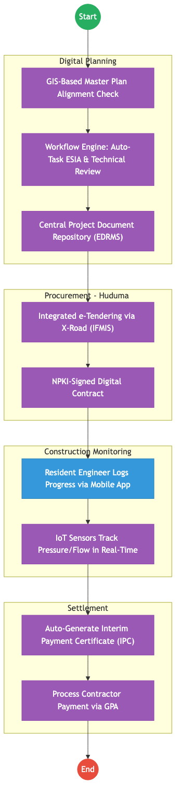

## Future State Process (TO-BE)
### Narrative
**TO-BE Process: Smart Water Infrastructure Management**

**Design Principles:**
- **Evidence-Based Construction:** Using **IoT sensors** and **Mobile GIS** to capture progress. Payments are only triggered when the system verifies the GPS location and quality data.
- **Unified Financial Flow:** Integration with **IFMIS** and the **Govt Payment Aggregator (GPA)** to ensure contractors are paid immediately upon certification, reducing cost overruns.
- **Inter-Agency Transparency:** All environmental approvals (NEMA) and land clearances are handled via **X-Road APIs**, eliminating the "paper chase."

### Optimized Steps (Digital)

| Step | Actor | Action | System |
|---|---|---|---|
| 1 | Planning Team | Checks the proposed project against the GIS-based Water Master Plan. | GIS / Dashboard |
| 2 | System | Routes the feasibility documents to NEMA and Treasury for parallel digital approval. | X-Road / Workflow Engine |
| 3 | Contractor | Submits progress reports via a secure mobile app; IoT sensors verify flow/pressure levels during testing. | IoT / Mobile App |
| 4 | Resident Engineer | Digitally signs the IPC (Interim Payment Certificate) using their NPKI certificate. | Trust Hub / NPKI |
| 5 | System | Automatically reconciles the certificate with the contract value and triggers payment via the GPA. | GPA / IFMIS |

---

## References
- https://awwda.go.ke
- Water Act 2016
- Desk Review

---

# Source: CABINET_OFFICE___Service_Delivery.md

# STATE DEPARTMENT FOR CABINET AFFAIRS – Service Delivery

## Cover Page
- **Ministry/Department/Agency (MDA):** Executive Office of the President
- **Department:** State Department for Cabinet Affairs
- **Process Name:** Cabinet Memorandum Processing & Coordination
- **Document Version:** 2.1
- **Date:** 2026-02-24
- **Classification:** Official

---

## Executive Summary
The State Department for Cabinet Affairs is responsible for the efficient management of the Cabinet's business. This includes the processing of Cabinet Memoranda (CABMEMO), tracking the implementation of Cabinet decisions through the GDMIS, and managing centralized executive resources like the government fleet. The current process is transitioning from a semi-digital state (using EDRMS) to a fully integrated digital workflow.

---

## 1. AS-IS Process Flowchart (BPMN 2.0)
*Current State visualization (Cabinet Memorandum Processing based on Deep Dive).*

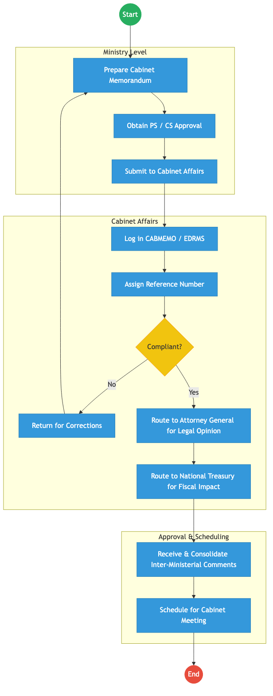

---

## Process Overview
### Process Name
Cabinet Memorandum (CABMEMO) Processing and GDMIS Registration

### Service Category
- G2G (Government to Government)

### Scope
- **In Scope:** Drafting, vetting, inter-ministerial consultation, and final scheduling of Cabinet Memoranda.
- **Out of Scope:** The actual deliberation of the Cabinet (Top Secret).

### Triggers
- A Ministry identifying a policy or legislative matter requiring Cabinet approval.

### End States
- **Successful:** Cabinet Memorandum scheduled for discussion; Recorded in GDMIS for tracking.

### Policy Context
- Cabinet Handbook; The Constitution of Kenya; State Officer's Code of Conduct.

---

## Detailed Process (AS-IS)

| Step | Role | Action | Tool/System | Notes |
|---|---|---|---|---|
| 1 | Ministry | Prepares a Cabinet Memorandum and obtains approval from the Principal Secretary and Cabinet Secretary. | Manual/Word | |
| 2 | Cabinet Affairs Officer | Receives the memorandum, logs it in the CABMEMO system, and assigns a reference. | CABMEMO / EDRMS | |
| 3 | Cabinet Affairs Officer | Checks for compliance with guidelines (e.g., formatting, required attachments). | Manual | |
| 4 | Cabinet Affairs | Routes the memorandum to the AG and Treasury via the system or physical dispatch for mandatory comments. | EDRMS / Physical | |
| 5 | Cabinet Affairs | Consolidates all feedback and prepares the final agenda for the Cabinet. | Manual | |

---

## Pain Points & Opportunities
### Pain Points
- **Sequential Routing:** The "Route to AG then Route to Treasury" flow is slow; if one party delays, the whole policy is stalled.
- **Feedback Loops:** Manual consolidation of inter-ministerial comments is labor-intensive and error-prone.
- **Resource Management:** Fleet management and trip approvals are still largely paper-based (work tickets).

### Opportunities
- **Parallel Processing:** Using the **Huduma Bridge** to route the CABMEMO to AG, Treasury, and other MDAs simultaneously for comments.
- **Immutable Audit Trail:** Using **NPKI**  to digitally sign all Cabinet Memoranda, ensuring they cannot be altered.
- **Integrated Fleet Management:** Automating work tickets and vehicle allocation via a mobile app linked to the **Government Payment Aggregator** for fuel and maintenance.

---

## 2. TO-BE Process Flowchart (BPMN 2.0)
*Future State visualization (Kenya DSAP Architecture - Huduma Bridge).*

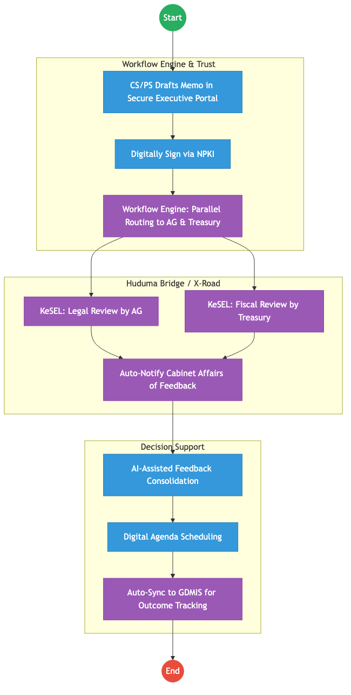

## Future State Process (TO-BE)
### Narrative
**TO-BE Process: Secure Digital Cabinet Workflows**

**Design Principles:**
- **Non-Repudiation:** All memoranda are digitally signed using **NPKI** certificates issued to Cabinet Secretaries, ensuring absolute security and legal validity.
- **Agility:** The **Workflow Engine** enables parallel consultation. Instead of a serial "passing of the baton," all required reviewers provide feedback simultaneously.
- **Transparency:** Once a decision is reached, the result is auto-synced to the **GDMIS** (Government Delivery Management Information System) via **X-Road**, enabling immediate tracking of implementation by the Head of Public Service.

### Optimized Steps (Digital)

| Step | Actor | Action | System |
|---|---|---|---|
| 1 | CS / PS | Drafts and reviews the memorandum within the secure Executive Portal. | Executive Portal |
| 2 | Cabinet Secretary | Digitally signs the final version using their National PKI (NPKI) certificate. | Trust Hub / NPKI |
| 3 | System | Routes the signed memo via X-Road to the AG and Treasury for concurrent 48-hour review. | Workflow Engine / X-Road |
| 4 | Cabinet Affairs | Uses AI tools to summarize and consolidate inter-ministerial feedback for the final Cabinet brief. | Analytics Engine |
| 5 | System | Automatically creates tracking milestones in the GDMIS based on the approved Cabinet Minute. | GDMIS / KeSEL |

---

## References
- https://cabinetoffice.go.ke
- Cabinet Handbook
- Desk Review

---

# Source: Culture_and_Heritage___Service_Delivery.md

# STATE DEPARTMENT FOR CULTURE, ARTS AND HERITAGE – Service Delivery

## Cover Page
- **Ministry/Department/Agency (MDA):** Ministry of Youth Affairs, Creative Economy and Sports
- **Department:** State Department for Culture, Arts and Heritage
- **Process Name:** Ushanga Kenya (Beadwork Value Chain)
- **Document Version:** 2.1
- **Date:** 2026-02-24
- **Classification:** Official

---

## Executive Summary
The State Department for Culture, Arts and Heritage oversees the Ushanga Kenya initiative, which empowers pastoralist women through the beadwork value chain. The current process involves manual product aggregation, physical quality inspections, and traditional market placement (exhibitions/retail). The transition to the Kenya DSAP Architecture aims to digitize the inventory, provide verifiable product traceability, and automate payments to cooperatives via the government payment aggregator.

---

## 1. AS-IS Process Flowchart (BPMN 2.0)
*Current State visualization (End-to-End Ushanga Kenya based on Deep Dive).*

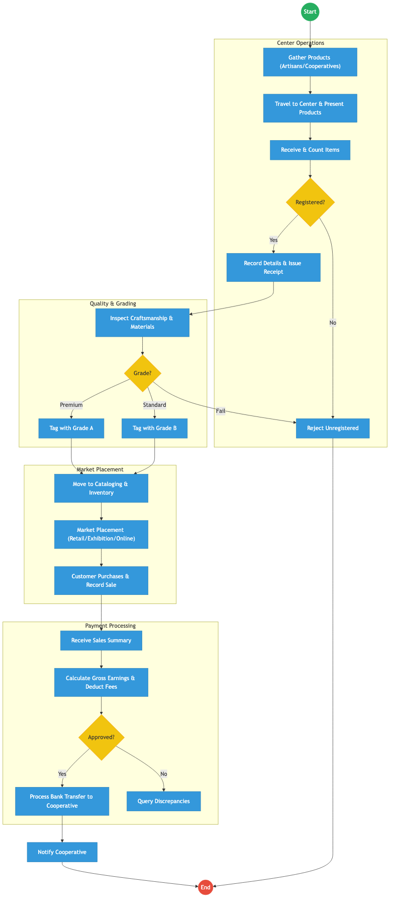

---

## Process Overview
### Process Name
End-to-End Ushanga Kenya Value Chain (Aggregation to Payment)

### Service Category
- G2B (Government to Business / Cooperative)

### Scope
- **In Scope:** Cooperative registration check, quality grading, inventory logging, sales recording, and final payment processing.
- **Out of Scope:** The creative design process of the artisans.

### Triggers
- Submission of finished beadwork products by a registered cooperative.

### End States
- **Successful:** Products sold; Payment transferred to cooperative; Digital sales record updated.

### Policy Context
- The Culture Policy; Ushanga Kenya Guidelines; Public Finance Management Act.

---

## Detailed Process (AS-IS)

| Step | Role | Action | Tool/System | Notes |
|---|---|---|---|---|
| 1 | Artisans | Cooperatives gather beadwork from members and travel to a central aggregation center. | Physical | |
| 2 | Center Officer | Receives products, counts items, and verifies if the cooperative is registered. | Manual Ledger | |
| 3 | Quality Officer | Examines craftsmanship and materials to assign a Grade (A, B, or Fail). | Manual | |
| 4 | Market Officer | Places products in retail shops, exhibitions, or online portals and records sales manually. | Manual/EDRMS | |
| 5 | Finance Officer | Calculates earnings, deducts management fees, and processes batch transfers via bank. | Manual/Excel | Target: Payment within 14 days. |

---

## Pain Points & Opportunities
### Pain Points
- **Lack of Traceability:** Once products are aggregated, it is difficult to trace a specific sale back to a specific artisan.
- **Manual Inventory:** Paper-based logging at centers leads to stock discrepancies and loss.
- **Delayed Payments:** The 14-day payment target is often missed due to manual reconciliation of sales summaries.

### Opportunities
- **Digital Inventory (QR-Based):** Assigning a unique QR code to every item upon grading to allow for instant tracking and automated sales logging.
- **Unified Payment Aggregator:** Using the **GPA** to receive customer payments and auto-split the funds (Artisan share, Cooperative fee, Government fee) instantly.
- **E-Commerce Integration:** Direct API integration between the center's inventory and a national e-commerce portal via **X-Road**.

---

## 2. TO-BE Process Flowchart (BPMN 2.0)
*Future State visualization (Kenya DSAP Architecture - Huduma Bridge).*

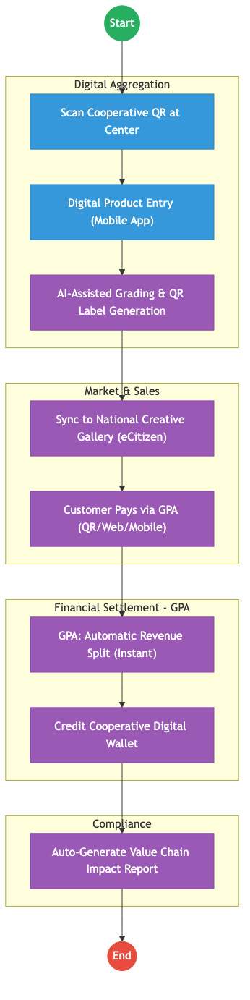

## Future State Process (TO-BE)
### Narrative
**TO-BE Process: Digital Creative Economy (Ushanga)**

**Design Principles:**
- **Product Traceability:** Every beadwork item is assigned a digital identity (QR Code) that links back to the artisan's **Maisha Namba** profile.
- **Real-Time Settlement:** The **Government Payment Aggregator (GPA)** eliminates the 14-day delay. When a customer buys a necklace, the funds are instantly split according to the agreed policy.
- **Global Reach:** By exposing inventory via the **Huduma Bridge APIs**, Ushanga products can be listed on international marketplaces while maintaining a single authoritative source of truth for stock.

### Optimized Steps (Digital)

| Step | Actor | Action | System |
|---|---|---|---|
| 1 | Center Officer | Scans the cooperative's digital ID to start the intake session. | Ushanga App |
| 2 | Quality Officer | Uses an AI-assisted tool to verify grading standards and prints a QR-coded price tag. | Smart Printer / AI |
| 3 | System | Instantly lists the item on the eCitizen Creative Economy portal. | eCitizen / X-Road |
| 4 | Customer | Pays for the item by scanning the QR code at a retail shop or exhibition. | GPA |
| 5 | System | GPA automatically deducts the management fee and transfers the artisan's share to their digital wallet immediately. | GPA / Mobile Money |

---

## References
- https://www.sportsheritage.go.ke
- Culture Policy
- Desk Review

---

# Source: Energy___Service_Delivery.md

# STATE DEPARTMENT FOR ENERGY – Service Delivery

## Cover Page
- **Ministry/Department/Agency (MDA):** Ministry of Energy and Petroleum
- **Department:** State Department for Energy
- **Process Name:** Records Management & Energy Licensing
- **Document Version:** 2.1
- **Date:** 2026-02-24
- **Classification:** Official

---

## Executive Summary
The State Department for Energy is responsible for the regulation and licensing of energy entities and the management of critical sector records. The current records management process is a hybrid of paper and digital, leading to delays in correspondence and licensing approvals. The transition to the Kenya DSAP Architecture aims to establish a fully digital EDRMS integrated with the national service bus to automate licensing and digitize the archival process.

---

## 1. AS-IS Process Flowchart (BPMN 2.0)
*Current State visualization (End-to-End Records Management based on Deep Dive).*

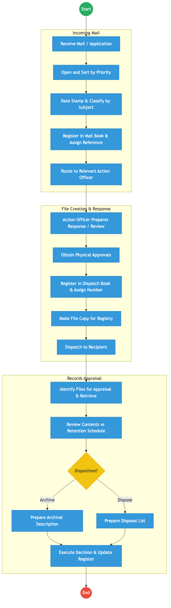

---

## Process Overview
### Process Name
End-to-End Records Management and Energy Sector Licensing

### Service Category
- G2B (Government to Business) / G2G (Government to Government)

### Scope
- **In Scope:** Incoming/outgoing correspondence tracking, file lifecycle management (creation to archival), and processing of energy permits.
- **Out of Scope:** Physical maintenance of energy grids.

### Triggers
- Receipt of official correspondence or a licensing application from an energy entity.

### End States
- **Successful:** Correspondence acted upon; Licensing decision communicated; Records appraised and archived.

### Policy Context
- The Energy Act 2019; Public Archives and Documentation Service Act; Data Protection Act 2019.

---

## Detailed Process (AS-IS)

| Step | Role | Action | Tool/System | Notes |
|---|---|---|---|---|
| 1 | Registry Clerk | Receives mail, sorts it into priority categories (Urgent/Normal/Confidential), and date-stamps it. | Physical Stamp | |
| 2 | Records Officer | Classifies the document by subject and registers it in a manual mail book. | Manual Ledger | |
| 3 | Action Officer | Reviews the file, prepares a response, and routes it physically for multiple levels of approval. | Physical File | |
| 4 | Dispatch Clerk | Assigns a dispatch number, makes a physical copy for the file, and registers it in the dispatch book. | Manual | |
| 5 | Archivist | Periodically appraises files against the retention schedule to determine if they should be archived or disposed. | Manual | |

---

## Pain Points & Opportunities
### Pain Points
- **Lost Correspondence:** Physical files are difficult to track once they leave the registry.
- **Slow Licensing:** Manual routing of license applications through multiple departments leads to massive delays.
- **Storage Constraints:** Physical archives are reaching capacity, and retrieval of old records is slow.

### Opportunities
- **Full EDRMS Implementation:** Digitizing every incoming document at the point of entry and using digital workflows for approvals.
- **Licensing via Huduma Bridge:** Integrating with **BRS** and **KRA** to automate the vetting of energy companies.
- **Digital Archives:** Using OCR and metadata tagging to make the national energy archive instantly searchable.

---

## 2. TO-BE Process Flowchart (BPMN 2.0)
*Future State visualization (Kenya DSAP Architecture - Huduma Bridge).*

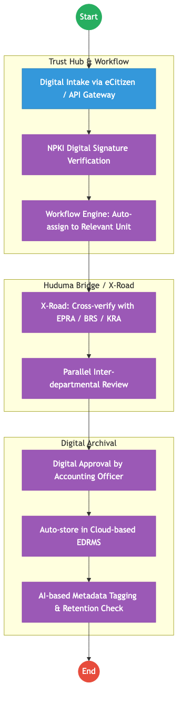

## Future State Process (TO-BE)
### Narrative
**TO-BE Process: Paperless Energy Administration**

**Design Principles:**
- **Digital First:** All incoming documents are scanned and OCR-processed at the registry, or received directly via the **Huduma Bridge APIs**.
- **Automated Retention:** The system automatically tags records with a "Disposition Date" based on the Public Archives Act, removing the need for manual appraisal.
- **Inter-Agency Vetting:** Energy licensing applications are automatically vetted against **BRS** (ownership) and **KRA** (tax) via **X-Road**, reducing approval time from months to days.

### Optimized Steps (Digital)

| Step | Actor | Action | System |
|---|---|---|---|
| 1 | Applicant | Submits an application for an energy permit via the eCitizen business portal. | eCitizen Portal |
| 2 | System | Instantly pings EPRA and BRS to verify the entity's regulatory standing. | KeSEL / X-Road |
| 3 | System | Routes the digitized file to the technical team for concurrent review (parallel workflow). | Workflow Engine |
| 4 | Accounting Officer | Approves the permit using a digital signature (NPKI). | Trust Hub / NPKI |
| 5 | System | Automatically archives the entire application trail in the secure government cloud with AI-generated metadata. | EDRMS / AI |

---

## References
- https://energy.go.ke
- Energy Act 2019
- Desk Review

---

# Source: Government_Spokesperson___Service_Delivery.md

# OFFICE OF THE GOVERNMENT SPOKESPERSON – Service Delivery

## Cover Page
- **Ministry/Department/Agency (MDA):** Executive Office of the President
- **Office:** Office of the Government Spokesperson
- **Process Name:** Public Communication & Information Archiving
- **Document Version:** 2.2
- **Date:** 2026-02-25
- **Classification:** Official

---

## Executive Summary
The Office of the Government Spokesperson manages official government communication, public messaging, and media coordination. Currently, information collection and message clearance are sequential and semi-manual. The transition to the Kenya DSAP Architecture aims to establish a secure, multi-channel dissemination portal with automated AI archiving and blockchain-based verifiable statements.

---

## 1. AS-IS Process Flowchart (BPMN 2.0)
*Current State visualization (Manual Government Communication).*

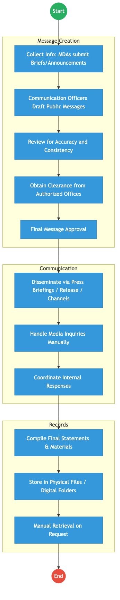

---

## Process Overview
### Process Name
End-to-End Government Communication (Collection to Archiving)

### Service Category
- G2C (Government to Citizen) / G2B (Media)

### Scope
- **In Scope:** Message development, clearance, dissemination, and archiving.
- **Out of Scope:** Political campaigning.

### Triggers
- Government announcements, policies, or events requiring public dissemination.

### End States
- **Successful:** Information communicated; Records archived.

---

## 2. TO-BE Process Flowchart (BPMN 2.0)
*Future State visualization (Kenya DSAP Architecture - Huduma Bridge).*

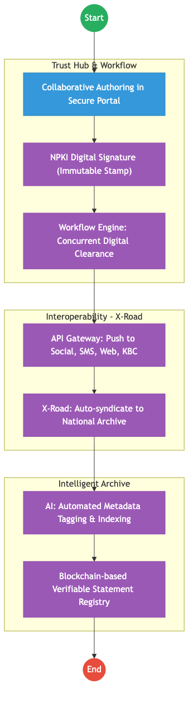

## Future State Process (TO-BE)
### Narrative
The To-Be process uses a **Secure Shared Service Portal** for collaborative drafting. **NPKI** ensures that every statement has an immutable digital stamp, preventing misinformation. **X-Road** enables instant syndication to all official government nodes (eCitizen, KBC, MyGov), while **AI** ensures that every word is instantly archived and searchable for future reference.

---

## References
- https://www.spokesperson.go.ke
- Communications Act
- Desk Review

---

# Source: Kenya_Broadcasting_Corporation___Service_Delivery.md

# KENYA BROADCASTING CORPORATION (KBC) – Service Delivery

## Cover Page
- **Ministry/Department/Agency (MDA):** Ministry of Information, Communications and the Digital Economy
- **Authority:** Kenya Broadcasting Corporation (KBC)
- **Process Name:** Archival Access and Content Licensing
- **Document Version:** 2.1
- **Date:** 2026-02-24
- **Classification:** Official

---

## Executive Summary
The Kenya Broadcasting Corporation (KBC) is the state broadcaster, holding over 33 million archival records (audio, video, and print) dating back to the colonial era. These archives are a national treasure but are currently largely physical or stored on deteriorating analog formats. The transition to the Kenya DSAP Architecture aims to digitize these archives and establish a digital "Content Licensing Portal" integrated with the government payment aggregator for public and commercial access.

---

## 1. AS-IS Process Flowchart (BPMN 2.0)
*Current State visualization (Archival Retrieval and Licensing).*

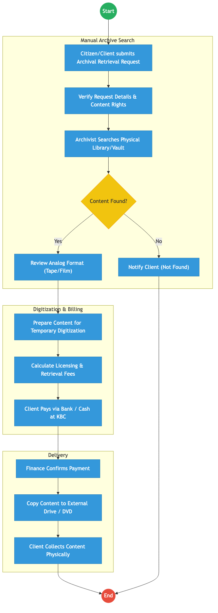

---

## Process Overview
### Process Name
End-to-End Archival Retrieval, Digitization, and Content Licensing

### Service Category
- G2C (Citizens) / G2B (Media Houses/Researchers)

### Scope
- **In Scope:** Search requests for historical footage/audio, copyright verification, fee assessment, and delivery of digital copies.
- **Out of Scope:** Live broadcasting operations.

### Triggers
- A request from a media house, researcher, or citizen for specific historical content.

### End States
- **Successful:** Digital content delivered; Licensing fee collected; Copyright terms accepted.

### Policy Context
- KBC Act; Public Archives and Documentation Service Act; Copyright Act.

---

## Detailed Process (AS-IS)

| Step | Role | Action | Tool/System | Notes |
|---|---|---|---|---|
| 1 | Client | Submits a manual request for a specific historical event or footage. | Paper/Email | |
| 2 | Librarian | Physically searches through thousands of tapes/reels in the KBC vaults. | Index Cards | High risk of missing content. |
| 3 | Archivist | Verifies the copyright status of the content (KBC-owned vs. shared). | Manual Registry | |
| 4 | Finance Officer | Manually calculates the digitization and licensing fee. | Excel | |
| 5 | Client | Pays via bank deposit and brings the slip to the KBC registry for verification. | Manual | Major delay. |

---

## Pain Points & Opportunities
### Pain Points
- **Format Deterioration:** Analog tapes (U-matic, Betacam) are degrading, leading to permanent loss of history.
- **Access Barriers:** Citizens must physically travel to KBC Nairobi to search or collect content.
- **Payment Friction:** Lack of mobile payment options for small archival requests (e.g., student researchers).

### Opportunities
- **National Content Lake:** Digitizing all 33M archives and storing them in a secure government cloud.
- **Public Content Portal:** Allowing citizens to browse low-resolution previews on eCitizen and pay for high-resolution downloads.
- **GPA Integration:** Enabling instant M-Pesa payments for "Clip Licensing" via the **Government Payment Aggregator**.

---

## 2. TO-BE Process Flowchart (BPMN 2.0)
*Future State visualization (Kenya DSAP Architecture - Huduma Bridge).*

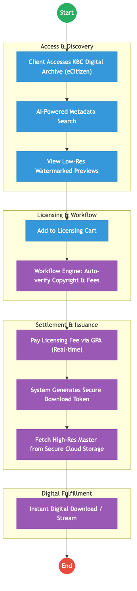

## Future State Process (TO-BE)
### Narrative
**TO-BE Process: Kenya Digital Heritage Portal**

**Design Principles:**
- **Democratized Access:** The entire archive is indexed using **AI-based tagging**, allowing any citizen to find historical clips from their home via eCitizen.
- **Monetization of Assets:** The **Government Payment Aggregator (GPA)** enables KBC to monetize its vast content library seamlessly, with automatic revenue splitting for royalty holders.
- **Security & Provenance:** Every digital download is watermarked and issued with a **Digital Verifiable License (QR)** to ensure legal use and non-repudiation.

### Optimized Steps (Digital)

| Step | Actor | Action | System |
|---|---|---|---|
| 1 | Client | Searches for content on the KBC eCitizen Portal using keywords (e.g., "Madaraka Day 1963"). | eCitizen / AI Search |
| 2 | System | Displays high-resolution previews and automatically calculates the license fee based on the client's profile (Commercial vs. Academic). | Workflow Engine |
| 3 | Client | Authorizes an M-Pesa payment through the GPA. | GPA |
| 4 | System | Upon payment confirmation, the system triggers an "Asset Fetch" from the secure government content lake. | Cloud Storage |
| 5 | System | Generates a time-bound download link and a verifiable digital license for the content. | Output Generator |

---

## References
- https://www.kbc.co.ke
- Kenya Broadcasting Corporation Act
- Desk Review

---

# Source: Kenya_National_Qualifications_Authority___Service_Delivery.md

# KENYA NATIONAL QUALIFICATIONS AUTHORITY (KNQA) – Service Delivery

## Cover Page
- **Ministry/Department/Agency (MDA):** Ministry of Education
- **Authority:** Kenya National Qualifications Authority (KNQA)
- **Process Name:** Qualification Validation and Recognition of Prior Learning (RPL)
- **Document Version:** 2.1
- **Date:** 2026-02-24
- **Classification:** Official

---

## Executive Summary
The Kenya National Qualifications Authority (KNQA) is responsible for coordinating and harmonizing education, training, and assessment in Kenya. Its key mandate is to validate national and foreign qualifications and recognize prior learning (RPL). The current process involves extensive manual verification of academic documents, leading to delays in the issuance of validation letters. The transition to the Kenya DSAP Architecture aims to establish an automated validation registry integrated with KNEC and global qualification databases via X-Road.

---

## 1. AS-IS Process Flowchart (BPMN 2.0)
*Current State visualization (End-to-End Qualification Validation based on Deep Dive).*

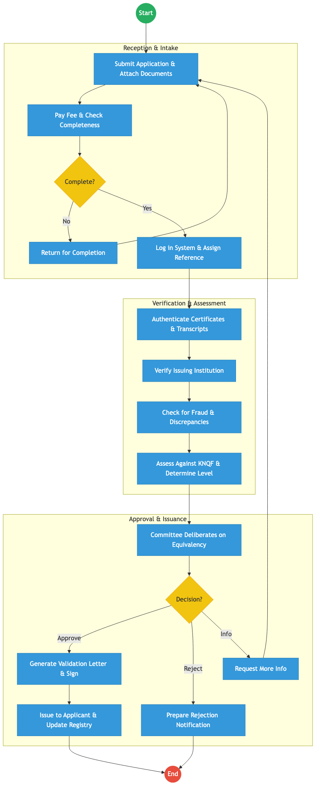

---

## Process Overview
### Process Name
End-to-End Qualification Validation and Recognition of Prior Learning

### Service Category
- G2C (Government to Citizen) / G2B (Employers)

### Scope
- **In Scope:** Validation of local/foreign degrees, diplomas, and artisan certificates; RPL assessments; maintenance of the National Qualifications Validation Registry.
- **Out of Scope:** Issuance of actual degrees (handled by universities).

### Triggers
- An individual applying for qualification validation for employment or further study.

### End States
- **Successful:** Verifiable Validation Letter issued; Qualification added to the National Registry.

### Policy Context
- Kenya National Qualifications Framework (KNQF) Act; The Constitution of Kenya; Data Protection Act 2019.

---

## Detailed Process (AS-IS)

| Step | Role | Action | Tool/System | Notes |
|---|---|---|---|---|
| 1 | Applicant | Submits application form and scans of certificates/transcripts. | Manual/Portal | |
| 2 | KNQA Clerk | Manually checks for completeness and confirms the payment of the fee. | Manual | |
| 3 | Technical Officer | Contacts issuing institutions (KNEC, Universities) to authenticate certificates. | Email/Letter | High latency step. |
| 4 | Technical Officer | Maps the qualification against the KNQF levels. | Manual/Excel | |
| 5 | Committee | Reviews the mapping and approves the equivalency. | Committee Meeting | |
| 6 | KNQA Admin | Manually generates the validation letter and updates the registry. | Standalone Registry | |

---

## Pain Points & Opportunities
### Pain Points
- **Manual Authentication:** Contacting global universities via email takes weeks or months.
- **Duplicate Records:** No real-time link to KNEC or university student portals.
- **Fraud Risk:** Easy to forge paper-based validation letters.

### Opportunities
- **Automated Verification:** Using **KeSEL (X-Road)** to query KNEC and University databases instantly for student records.
- **Verifiable Credentials:** Issuing digital validation letters with a QR code that employers can verify instantly on eCitizen.
- **Blockchain for Qualifications:** Creating an immutable national repository of all academic achievements linked to **Maisha Namba**.

---

## 2. TO-BE Process Flowchart (BPMN 2.0)
*Future State visualization (Kenya DSAP Architecture - Huduma Bridge).*

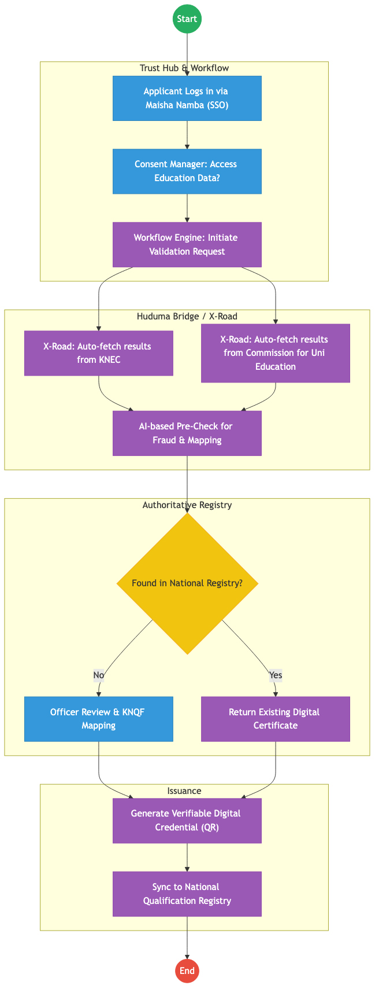

## Future State Process (TO-BE)
### Narrative
**TO-BE Process: Zero-Touch Qualification Validation**

**Design Principles:**
- **Once-Only Principle:** The system pulls academic results directly from the **KNEC** and **CUE** (Commission for University Education) registries via **X-Road**. Applicants no longer need to upload scans of their certificates.
- **Instant Recognition:** Recognized qualifications are cached in the **National Qualification Registry**. If an applicant asks for validation of a degree that KNQA has already mapped, the response is instantaneous.
- **Digital Trust:** All validation letters are issued as **Verifiable Digital Credentials**, eliminating the possibility of forgery and removing the need for employers to call KNQA for verification.

### Optimized Steps (Digital)

| Step | Actor | Action | System |
|---|---|---|---|
| 1 | Applicant | Logs into eCitizen and selects "Qualification Validation." | eCitizen / SSO |
| 2 | System | Fetches the applicant's KNEC/KCSE data and University data via X-Road APIs. | KeSEL / X-Road |
| 3 | System | Automatically matches the data against the KNQF level framework. | AI Rules Engine |
| 4 | Technical Officer | Only reviews "Exceptions" where the mapping is ambiguous or from a new foreign institution. | Officer Workbench |
| 5 | System | Generates a digital validation certificate with a verifiable QR code and pushes it to the citizen's digital wallet. | Output Generator |

---

## References
- https://www.knqa.go.ke
- Kenya National Qualifications Framework (KNQF) Act
- Desk Review

---

# Source: Micro_Small_and_Medium_Enterprise_Development___Service_Delivery.md

# STATE DEPARTMENT FOR MSME DEVELOPMENT – Service Delivery

## Cover Page
- **Ministry/Department/Agency (MDA):** Ministry of Co-operatives and MSMEs
- **Department:** State Department for MSME Development
- **Process Name:** MSME Credit, Fund Management & Apprenticeship
- **Document Version:** 2.1
- **Date:** 2026-02-24
- **Classification:** Official

---

## Executive Summary
The State Department for MSME Development is mandated to support the growth of small businesses through access to affordable credit (Hustler Fund, Uwezo Fund), capacity building, and apprenticeships (NYOTA). While the Hustler Fund is highly digitized, other funds like Uwezo still rely on manual group registrations and physical bank accounts. The transition to the Kenya DSAP Architecture aims to unify all MSME support into a single digital ecosystem integrated with BRS and the national identity system.

---

## 1. AS-IS Process Flowchart (BPMN 2.0)
*Current State visualization (Hustler Fund & Uwezo Fund based on Deep Dive).*

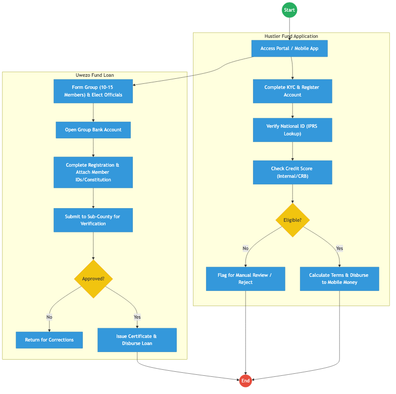

---

## Process Overview
### Process Name
MSME Credit Access (Hustler/Uwezo), Repayment, and NYOTA Apprenticeship

### Service Category
- G2C (Government to Citizen) / G2B (Government to Business)

### Scope
- **In Scope:** Application, KYC verification, credit scoring, disbursement, and tracking of repayments.
- **Out of Scope:** Commercial bank lending outside government-sponsored funds.

### Triggers
- Citizen/MSME applying for credit or an apprenticeship opportunity.

### End States
- **Successful:** Credit disbursed; Apprenticeship matched; Credit history updated.

### Policy Context
- The Micro and Small Enterprises Act; Public Finance Management (Hustler Fund) Regulations.

---

## Detailed Process (AS-IS)

| Step | Role | Action | Tool/System | Notes |
|---|---|---|---|---|
| 1 | Applicant | Accesses the fund portal (USSD/Web) and registers using their National ID. | USSD / Web Portal | |
| 2 | System | Performs KYC by querying IPRS to verify identity and age eligibility. | IPRS API | |
| 3 | System | Checks internal credit history and external CRB scores to determine the loan limit. | Credit Engine | |
| 4 | Applicant | For Uwezo/NYOTA, attaches scanned copies of business registrations or ID documents. | Manual Upload | |
| 5 | Fund Officer | For group loans, verifies group composition and bank details manually at the Sub-County level. | Standalone System | |

---

## Pain Points & Opportunities
### Pain Points
- **Fragmented Portals:** Hustler, Uwezo, and Women Enterprise Fund (WEF) have different entry points and rules.
- **Manual Group Registration:** Opening physical bank accounts and submitting paper constitutions for Uwezo is a significant barrier.
- **Limited Business Data:** Reliance on ID data alone; lack of integration with BRS for business performance metrics.

### Opportunities
- **Unified MSME Portal:** A single "eCitizen for Business" entry point for all government credit and support programs.
- **Digital Group Wallets:** Replacing physical bank accounts for groups with digital wallets integrated into the **Government Payment Aggregator**.
- **Alternative Credit Scoring:** Using BRS data and transaction history from the **GPA** to provide better credit limits.

---

## 2. TO-BE Process Flowchart (BPMN 2.0)
*Future State visualization (Kenya DSAP Architecture - Huduma Bridge).*

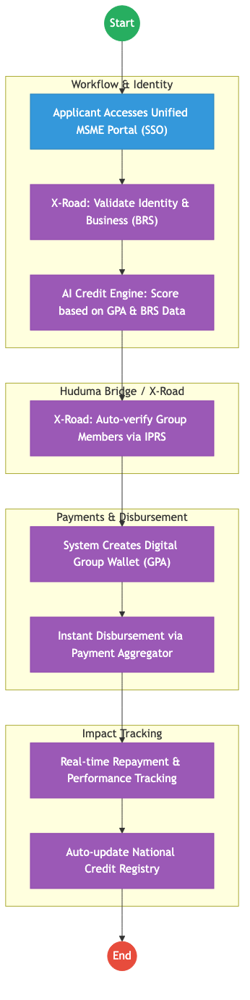

## Future State Process (TO-BE)
### Narrative
**TO-BE Process: Integrated Digital MSME Ecosystem**

**Design Principles:**
- **Unified Entry:** A single-window portal (integrated with eCitizen) for all MSME funds, reducing confusion.
- **Automated Trust:** Using **X-Road** to verify business ownership via **BRS** and group member identities via **IPRS**, removing the need for manual document uploads.
- **Instant Inclusion:** Replacing physical bank accounts with **GPA-linked Digital Wallets**, allowing for instant disbursement and automated split-repayments (e.g., a portion of daily sales goes back to the loan).

### Optimized Steps (Digital)

| Step | Actor | Action | System |
|---|---|---|---|
| 1 | Applicant | Logs in via eCitizen SSO and selects the appropriate MSME fund or support program. | Unified MSME Portal |
| 2 | System | Fetches business history from BRS and tax compliance from KRA via X-Road to assess eligibility. | KeSEL / X-Road |
| 3 | System | For group applications, the system pings the members' phones for digital consent and verifies their "Maisha Namba" status. | Consent Manager |
| 4 | System | Instantly disburses the loan to a digital wallet managed by the Government Payment Aggregator. | GPA / Mobile Money |
| 5 | System | Monitors sales and transactions via the GPA to provide real-time credit score updates and nudge for repayments. | Analytics Engine |

---

## References
- https://www.msme.go.ke
- Micro and Small Enterprises Act
- Desk Review

---

# Source: Ministry_of_Health___Service_Delivery.md

# MINISTRY OF HEALTH – Service Delivery

## Cover Page
- **Ministry/Department/Agency (MDA):** MINISTRY OF HEALTH
- **Process Name:** Health Information Exchange
- **Document Version:** 2.1
- **Date:** 2026-02-24
- **Classification:** Official

---

## Executive Summary
The Ministry of Health plays a foundational role in the citizen lifecycle. Current health systems are highly fragmented, leading to poor patient experiences with multiple hospital-specific IDs and incomplete medical histories. The transition to the Kenya Health Information Exchange (KHIE) Architecture and a Shared Health Record (SHR) aims to unify patient identities and care data across all facilities.

---

## 1. AS-IS Process Flowchart (BPMN 2.0)
*Current State visualization (Fragmented Patient Identity based on Deep Dive).*

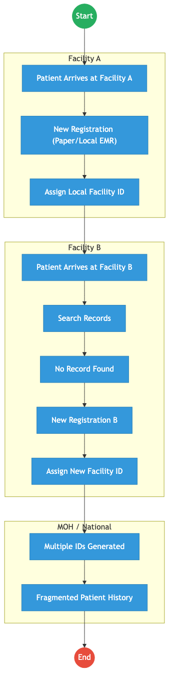

---

## Process Overview
### Process Name
Health Service Delivery & Identity

### Service Category
- G2C (Government to Citizen)

### Scope
- **In Scope:** Patient registration, clinical encounters, and data aggregation across public and private health facilities.
- **Out of Scope:** Core hospital billing logic (managed locally).

### Triggers
- Patient arriving at a health facility for care.

### End States
- **Successful (Current):** Care is provided, but data remains siloed in local facility systems.

### Policy Context
- Digital Health Act 2023; Health Act 2017; Data Protection Act 2019.

---

## Detailed Process (AS-IS)

| Step | Role | Action | Tool/System | Notes |
|---|---|---|---|---|
| 1 | Patient | Arrives at Facility A. | Physical | |
| 2 | Registration Clerk | Creates a new patient file and assigns a local Facility A ID. | Paper/Local EMR | |
| 3 | Patient | Later visits a different facility (Facility B) for care. | Physical | |
| 4 | Registration Clerk | Searches for the patient in Facility B's system, finds no record. | Local EMR | |
| 5 | Registration Clerk | Creates another new patient file and assigns a new Facility B ID. | Paper/Local EMR | |
| 6 | MOH Systems | Patient ends up with multiple disconnected IDs across the health ecosystem, leading to fragmented medical history and duplicate testing. | Siloed Systems | |

---

## Pain Points & Opportunities
### Pain Points
- **Fragmented Identity:** Patients have different IDs at every hospital.
- **Data Silos:** Medical history, lab results, and prescriptions cannot be securely shared between facilities.
- **Incomplete Visibility:** The Ministry cannot view comprehensive public health data in real time.

### Opportunities
- **National KHIE Integration:** Deploying a central health exchange using the DSAP X-Road layer.
- **Unified Identity:** Leveraging Maisha Namba as the primary health identifier.
- **Shared Health Record (SHR):** Centralized clinical repository for continuity of care.

---

## 2. TO-BE Process Flowchart (BPMN 2.0)
*Future State visualization (Kenya Health Information Exchange - KHIE Architecture).*

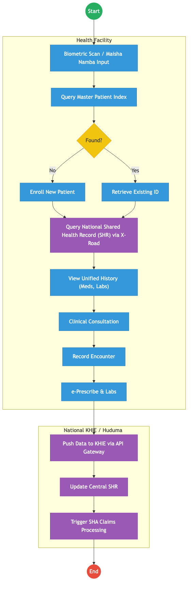

## Future State Process (TO-BE)
### Narrative
**TO-BE Process: Kenya Health Information Exchange (KHIE)**

**Design Principles:**
- **Patient-Centric Identity:** Relying on IPRS/Maisha Namba via the Huduma Bridge to eliminate duplicate profiles.
- **Data Liquidity:** X-Road-based interoperability to allow secure exchange of clinical summaries, lab results, and prescriptions across all accredited facilities.
- **Automated Claims:** Seamless integration with the Social Health Authority (SHA) for real-time claims and coverage checks.

### Optimized Steps (Digital)

| Step | Actor | Action | System |
|---|---|---|---|
| 1 | Health Worker | Inputs Maisha Namba or captures biometrics to identify the patient upon arrival. | Facility EMR |
| 2 | Point of Care System | Queries the central Master Patient Index via X-Road to locate the patient's unified profile. | KHIE MPI / X-Road |
| 3 | Point of Care System | Pulls the patient's Shared Health Record (SHR), giving the clinician instant access to allergies, meds, and recent labs. | KHIE SHR / X-Road |
| 4 | Clinician | Conducts the consultation, records the encounter, and e-prescribes treatments. | Facility EMR |
| 5 | Core System | Pushes the encounter data back to the KHIE to update the SHR immediately. | KHIE API Gateway |
| 6 | Core System | Automatically triggers claims processing to the Social Health Authority (SHA) based on the recorded encounter. | Govt Payment Aggregator / SHA |

---

## References
- https://www.health.go.ke
- Digital Health Act 2023
- Desk Review

---

# Source: National_Commission_For_Science_Technology_and_Innovation___Service_Delivery.md

# NATIONAL COMMISSION FOR SCIENCE, TECHNOLOGY AND INNOVATION (NACOSTI) – Service Delivery

## Cover Page
- **Ministry/Department/Agency (MDA):** Ministry of Education
- **Authority:** National Commission for Science, Technology and Innovation (NACOSTI)
- **Process Name:** Research Licensing and Knowledge Management
- **Document Version:** 2.1
- **Date:** 2026-02-24
- **Classification:** Official

---

## Executive Summary
NACOSTI is the primary agency responsible for regulating and assuring quality in the science, technology, and innovation sector. Its key mandate is to license all research activities in Kenya. The current process involves manual document vetting, physical bank payments, and sequential expert reviews. The transition to the Kenya DSAP Architecture aims to establish an automated research portal integrated with KNQA for researcher verification and the Government Payment Aggregator for instant licensing.

---

## 1. AS-IS Process Flowchart (BPMN 2.0)
*Current State visualization (End-to-End Research Licensing based on Deep Dive).*

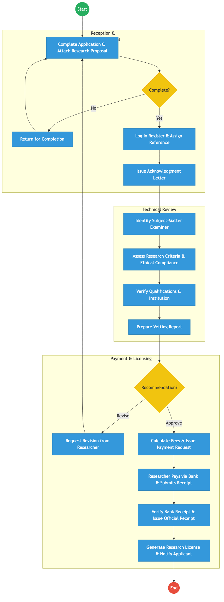

---

## Process Overview
### Process Name
End-to-End Research Application, Vetting, and Licensing

### Service Category
- G2C (Researchers) / G2B (Institutions)

### Scope
- **In Scope:** Application for research permits, ethical clearance vetting, fee processing, and issuance of licenses.
- **Out of Scope:** Actual funding of research projects.

### Triggers
- A researcher (local or foreign) applying for a permit to conduct a study in Kenya.

### End States
- **Successful:** Research License issued; Study metadata logged in the national repository.

### Policy Context
- Science, Technology and Innovation Act 2013; Data Protection Act 2019.

---

## Detailed Process (AS-IS)

| Step | Role | Action | Tool/System | Notes |
|---|---|---|---|---|
| 1 | Researcher | Submits research proposal, ethical clearance, and academic certificates. | Manual/Portal | |
| 2 | NACOSTI Officer | Manually checks if all documents are attached and assigns a physical file reference. | Manual | |
| 3 | Examiner | Reviews the proposal for technical validity and alignment with national priorities. | Manual/Word | |
| 4 | Finance Officer | Issues a payment demand note; waits for the researcher to pay at a bank and upload the slip. | Standalone System | Major delay (2-5 days). |
| 5 | NACOSTI Admin | Manually verifies the bank slip against bank statements before generating the final PDF license. | Manual | |

---

## Pain Points & Opportunities
### Pain Points
- **Payment Latency:** Waiting for manual bank reconciliation stalls the process even after technical approval.
- **Manual Verification:** Confirming researcher credentials (from Universities) is done via email/phone.
- **Fragmented Repositories:** Research findings are not automatically captured in a searchable national knowledge base.

### Opportunities
- **Instant GPA Integration:** Using the **Government Payment Aggregator** for real-time mobile/card payments and instant license generation.
- **Automated Credential Vetting:** Integrating with **KNQA** and **CUE** via **X-Road** to verify academic standing instantly.
- **Digital Research Repository:** Automatically archiving the research abstract into a national knowledge lake once the license is issued.

---

## 2. TO-BE Process Flowchart (BPMN 2.0)
*Future State visualization (Kenya DSAP Architecture - Huduma Bridge).*

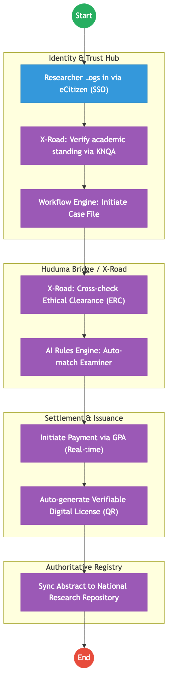

## Future State Process (TO-BE)
### Narrative
**TO-BE Process: Automated Science & Research Vetting**

**Design Principles:**
- **Zero-Touch Licensing:** For standard academic research by recognized students, the system uses **AI Rules** to auto-approve the permit once the fee is paid via **GPA**.
- **Cross-Registry Trust:** Ethical clearance from Institutional Review Boards (IRBs) is pulled via **X-Road APIs**, removing the need for physical letters.
- **Data as a Strategic Asset:** Every license issued automatically populates the national research repository, ensuring the government has visibility into all studies conducted in the country.

### Optimized Steps (Digital)

| Step | Actor | Action | System |
|---|---|---|---|
| 1 | Researcher | Logs into the research portal. Personal and institutional data is pre-populated via IPRS and CUE. | eCitizen / SSO |
| 2 | System | Fetches the researcher's ethical clearance status directly from the Ethics Review Committee (ERC) portal via X-Road. | KeSEL / X-Road |
| 3 | System | Calculates the fee and allows the researcher to pay instantly via M-Pesa or Card. | GPA |
| 4 | System | Upon successful payment, the workflow engine triggers the issuance of a digital verifiable research license. | Output Generator |
| 5 | System | Automatically creates a record in the National Knowledge Repository, tracking the study's start and end dates. | Research Registry |

---

## References
- https://www.nacosti.go.ke
- Science, Technology and Innovation Act 2013
- Desk Review

---

# Source: National_Environment_Management_Authority___Service_Delivery.md

# NATIONAL ENVIRONMENT MANAGEMENT AUTHORITY (NEMA) – Service Delivery

## Cover Page
- **Ministry/Department/Agency (MDA):** Ministry of Environment, Climate Change and Forestry
- **Authority:** National Environment Management Authority (NEMA)
- **Process Name:** Environmental Impact Assessment (EIA) Licensing
- **Document Version:** 2.1
- **Date:** 2026-02-24
- **Classification:** Official

---

## Executive Summary
The National Environment Management Authority (NEMA) is responsible for the supervision and coordination of environmental management across Kenya. A critical service is the issuance of Environmental Impact Assessment (EIA) licenses for all development projects. Current permitting bottlenecks stem from manual document reviews, physical site visits, and sequential inter-agency consultations. The transition to the Kenya DSAP Architecture aims to automate compliance checks via X-Road and establish a digital inspection framework.

---

## 1. AS-IS Process Flowchart (BPMN 2.0)
*Current State visualization (EIA Licensing based on General Mandate).*

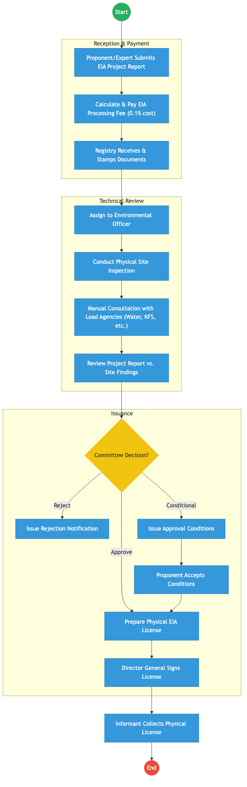

---

## Process Overview
### Process Name
Environmental Impact Assessment (EIA) Licensing and Compliance Monitoring

### Service Category
- G2B (Government to Business - Proponents)

### Scope
- **In Scope:** Review of project reports, site inspections, coordination with lead agencies, and issuance of EIA licenses.
- **Out of Scope:** Environmental auditing (post-license monitoring).

### Triggers
- Submission of a new project report by a developer or an environmental expert.

### End States
- **Successful:** Verifiable EIA License issued; Project registered in national environment map.

### Policy Context
- Environmental Management and Coordination Act (EMCA); The Constitution of Kenya; Data Protection Act 2019.

---

## Detailed Process (AS-IS)

| Step | Role | Action | Tool/System | Notes |
|---|---|---|---|---|
| 1 | Proponent | Submits a hard copy project report through a registered environmental expert. | Physical Paper | |
| 2 | Finance Officer | Calculates fees manually based on project cost and awaits bank confirmation. | Manual/Bank | |
| 3 | NEMA Officer | Travels to the site to verify the proponent's claims. | Physical Visit | Major bottleneck. |
| 4 | Registry | Sends physical copies of the report to Lead Agencies (e.g., KFS, Water) for comments. | Physical Dispatch | Takes 30-60 days. |
| 5 | Director General | Signs the physical license certificate. | Wet Signature | |

---

## Pain Points & Opportunities
### Pain Points
- **Lead Agency Delays:** Waiting for comments from other government departments via physical mail stalls projects for months.
- **Counterfeit Licenses:** Paper-based certificates are easily forged.
- **Manual Site Logs:** No centralized GIS record of all previous inspections for a specific parcel of land.

### Opportunities
- **Digital Lead Agency Consultation:** Using **X-Road** to route project reports to all lead agencies simultaneously for digital comment within 7 days.
- **Mobile GIS Inspections:** Officers use a mobile app to capture site photos and GPS coordinates, instantly syncing with the national environmental database.
- **Verifiable QR Licenses:** Issuing licenses as digital credentials that can be verified instantly by any law enforcement officer or citizen.

---

## 2. TO-BE Process Flowchart (BPMN 2.0)
*Future State visualization (Kenya DSAP Architecture - Huduma Bridge).*

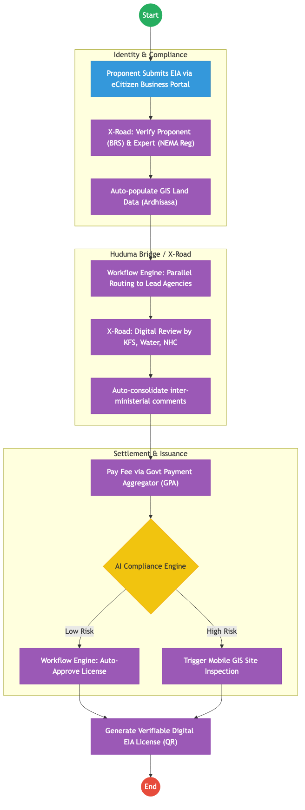

## Future State Process (TO-BE)
### Narrative
**TO-BE Process: Automated Environmental Permitting**

**Design Principles:**
- **Interoperability (Once-Only):** Project land details are fetched from **Ardhisasa (Ministry of Lands)** and business details from **BRS** via **X-Road**, removing redundant data entry.
- **Parallel Consultation:** The "Sequential Paper Trail" is replaced by a "Parallel Digital Review." If a Lead Agency doesn't comment within 14 days, the system auto-escalates or defaults to approval.
- **Risk-Based Vetting:** Small-scale, low-impact projects are auto-approved by the **AI Rules Engine**, freeing up NEMA experts to focus on complex, high-risk industrial developments.

### Optimized Steps (Digital)

| Step | Actor | Action | System |
|---|---|---|---|
| 1 | Proponent | Logs into eCitizen. Business ownership and expert registration are verified instantly. | eCitizen / X-Road |
| 2 | System | Pulls the cadastral map from Ardhisasa to verify project coordinates against protected zones (e.g., riparian land). | KeSEL / X-Road |
| 3 | System | Routes the report to relevant Lead Agencies via the national service bus for concurrent 7-day review. | Workflow Engine |
| 4 | Proponent | Pays the EIA fee through the GPA, which provides an instant digital receipt. | GPA |
| 5 | System | Generates a digital license with a secure QR code and pushes the coordinates to the National Environmental Dashboard. | Output Generator |

---

## References
- https://www.nema.go.ke
- Environmental Management and Coordination Act (EMCA)
- Desk Review

---

# Source: National_Government_Coordination___Service_Delivery.md

# NATIONAL GOVERNMENT COORDINATION – Service Delivery

## Cover Page
- **Ministry/Department/Agency (MDA):** Executive Office of the President
- **Department:** National Government Coordination
- **Process Name:** Inter-Agency Coordination and Information Tasking
- **Document Version:** 2.1
- **Date:** 2026-02-24
- **Classification:** Official

---

## Executive Summary
National Government Coordination is responsible for the seamless alignment of government activities across all MDAs and regions. Its primary function is to manage information tasking, data collection for national priorities, and the escalation of critical issues to the Presidency. Currently, this coordination is highly transactional and relies on manual requests, templates, and follow-ups. The transition to the Kenya DSAP Architecture aims to establish an automated coordination hub that leverages the national service bus for real-time status tracking.

---

## 1. AS-IS Process Flowchart (BPMN 2.0)
*Current State visualization (End-to-End Coordination based on Deep Dive).*

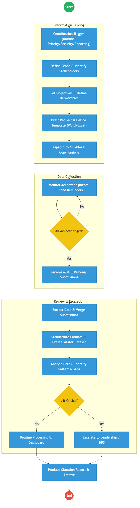

---

## Process Overview
### Process Name
End-to-End Inter-Agency Coordination and Situation Reporting

### Service Category
- G2G (Government to Government)

### Scope
- **In Scope:** Drafting coordination requests, monitoring submissions from MDAs and Regional Commissioners, and preparing consolidated Situation Reports (SitReps).
- **Out of Scope:** The actual operational implementation of projects by the MDAs.

### Triggers
- A Presidential directive, a national emergency, or a periodic reporting cycle (e.g., Budget/MTEF).

### End States
- **Successful:** Situation Report produced; Critical bottlenecks escalated and resolved.

### Policy Context
- Executive Order No. 1 of 2023; The Constitution of Kenya; Public Service Regulations.

---

## Detailed Process (AS-IS)

| Step | Role | Action | Tool/System | Notes |
|---|---|---|---|---|
| 1 | Coordination Officer | Identifies a coordination need (e.g., Drought Response) and defines the deliverables required from MDAs. | Manual | |
| 2 | Coordination Officer | Drafts a formal request letter and attaches an Excel template for data collection. | MS Word / Excel | |
| 3 | Dispatch Clerk | Sends the request to all relevant Principal Secretaries and Regional Commissioners via email/physical dispatch. | Email / Physical | |
| 4 | Coordination Unit | Follows up with MDAs via phone calls and reminders to ensure submissions are made. | Phone/WhatsApp | High friction step. |
| 5 | Analyst | Manually cleans and merges 20+ different Excel files into a single master sheet for analysis. | Excel | High risk of error. |

---

## Pain Points & Opportunities
### Pain Points
- **Template Non-Compliance:** MDAs often modify Excel templates, making automated merging impossible.
- **Reporting Fatigue:** MDAs are constantly asked for similar data by different coordination offices (Coordination, Cabinet, HPS).
- **Static SitReps:** Reports are "snapshots" in time and are often outdated by the time they reach leadership.

### Opportunities
- **Automated Data Pull:** Instead of asking MDAs for data, the coordination hub "pulls" the required fields directly from MDA databases via **X-Road**.
- **Real-Time Dashboards:** Replacing weekly SitReps with a live dashboard that MDAs update as part of their daily operations.
- **Unified Tasking:** A single "National Tasks" engine that ensures Principal Secretaries see all directives in one place.

---

## 2. TO-BE Process Flowchart (BPMN 2.0)
*Future State visualization (Kenya DSAP Architecture - Huduma Bridge).*

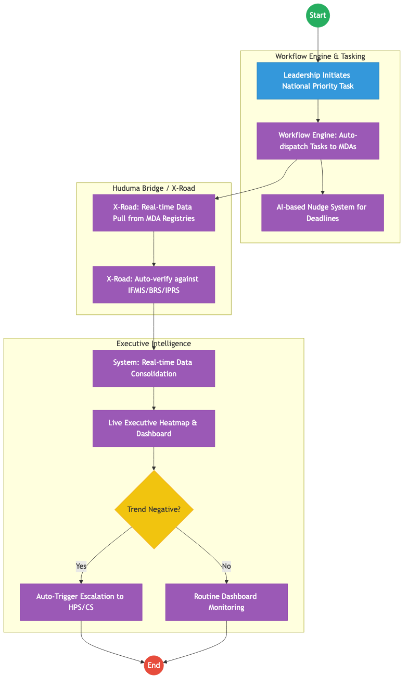

## Future State Process (TO-BE)
### Narrative
**TO-BE Process: Zero-Friction Government Coordination**

**Design Principles:**
- **Data over Documents:** The coordination office shifts from asking for "Reports" to asking for "Data Access." Access is granted via **KeSEL (X-Road)** endpoints.
- **Continuous Monitoring:** Leadership can view the status of a national directive (e.g., Fertilizer distribution) in real-time, as every transaction at the MDA level is broadcast across the government event bus.
- **Proactive Management:** Instead of waiting for a crisis to be reported, the system uses AI to detect "Negative Trends" (e.g., slow absorption of funds in a region) and alerts the coordinators automatically.

### Optimized Steps (Digital)

| Step | Actor | Action | System |
|---|---|---|---|
| 1 | Leadership | Defines a new national priority and sets the target KPIs in the Coordination Portal. | Executive Portal |
| 2 | System | Maps the KPIs to existing data fields in relevant MDA registries (e.g., Health, Agriculture, Lands). | Service Catalogue |
| 3 | System | Pulls data every 24 hours via X-Road to update the national achievement scorecards. | KeSEL / X-Road |
| 4 | System | Automatically notifies Principal Secretaries of any "at-risk" deliverables based on real data, not claims. | Workflow Engine |
| 5 | Coordinator | Focuses on resolving the "at-risk" blocks rather than manually cleaning data. | Executive Dashboard |

---

## References
- https://www.interior.go.ke
- Executive Order No. 1 of 2023
- Desk Review

---

# Source: Office_of_the_Chief_of_Staff___Service_Delivery.md

# OFFICE OF THE CHIEF OF STAFF – Service Delivery

## Cover Page
- **Ministry/Department/Agency (MDA):** Executive Office of the President
- **Office:** Office of the Chief of Staff
- **Process Name:** Whole-of-Government Oversight & Performance Monitoring
- **Document Version:** 2.2
- **Date:** 2026-02-25
- **Classification:** Official

---

## Executive Summary
The Office of the Chief of Staff coordinates whole-of-government performance monitoring and strategic oversight. The current process relies on manual data collection from MDAs, leading to analysis lags. The transition to the Kenya DSAP Architecture aims to establish an automated performance engine that "pulls" data directly from MDA registries via the Huduma Bridge.

---

## 1. AS-IS Process Flowchart (BPMN 2.0)
*Current State visualization (Manual Whole-of-Gov Oversight).*

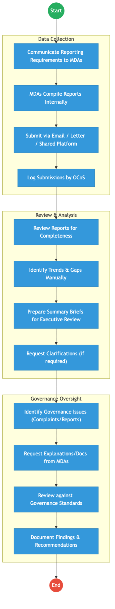

---

## Process Overview
### Process Name
End-to-End Whole-of-Government Oversight (Tasking to Follow-Up)

### Service Category
- G2G (Government to Government)

### Scope
- **In Scope:** Performance data collection, analysis, governance standards oversight, and executive briefing.
- **Out of Scope:** Individual MDA internal HR operations.

### Triggers
- Executive directives or periodic reporting cycles.

### End States
- **Successful:** Governance compliance status assessed; Leadership briefed.

---

## 2. TO-BE Process Flowchart (BPMN 2.0)
*Future State visualization (Kenya DSAP Architecture - Huduma Bridge).*

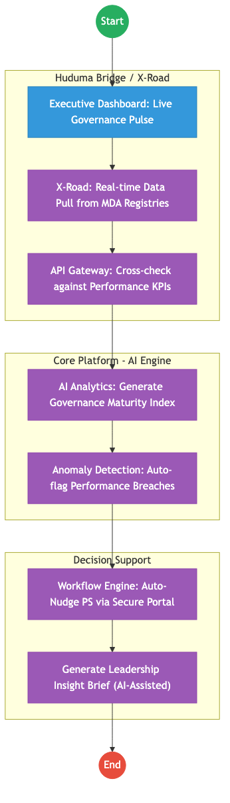

## Future State Process (TO-BE)
### Narrative
The To-Be process eliminates "Reporting Fatigue" by automatically pulling evidence-based performance data from MDA registries via **X-Road**. The **AI Analytics Engine** provides the President and Chief of Staff with a real-time governance heatmap, moving from reactive reporting to proactive intervention.

---

## References
- https://www.president.go.ke
- Executive Order No. 1 of 2023
- Desk Review

---

# Source: PUBLIC_SERVICE_COMMISION_PSC____Service_Delivery.md

# OFFICE OF THE HEAD OF PUBLIC SERVICE – Executive Coordination

## Cover Page
- **Ministry/Department/Agency (MDA):** Executive Office of the President
- **Department:** Office of the Head of Public Service (OHPS)
- **Process Name:** Executive Coordination and Presidential Directives
- **Document Version:** 2.1
- **Date:** 2026-02-24
- **Classification:** Official

---

## Executive Summary
The Office of the Head of Public Service (OHPS) is the apex office for coordinating government-wide policy implementation and tracking the execution of Presidential Directives across all MDAs. The current process is heavily reliant on manual tracking, memo-based communication, and periodic quarterly reports from Principal Secretaries. The transition to the Kenya DSAP Architecture aims to create a real-time, digital "Executive Dashboard" that tracks compliance and performance via the national service bus.

---

## 1. AS-IS Process Flowchart (BPMN 2.0)
*Current State visualization (End-to-End Executive Coordination based on Deep Dive).*

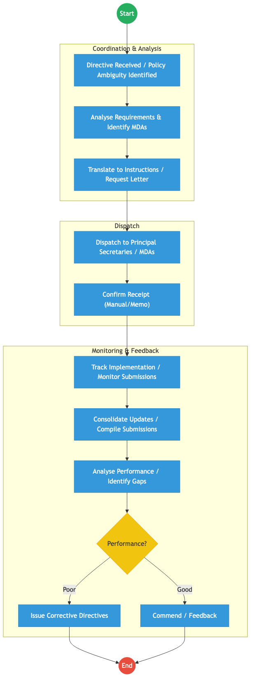

---

## Process Overview
### Process Name
Executive Coordination, Directive Tracking, and Performance Monitoring

### Service Category
- G2G (Government to Government)

### Scope
- **In Scope:** Issuance of instructions to Principal Secretaries, tracking compliance with Presidential Directives, and monitoring government-wide performance.
- **Out of Scope:** Individual MDA internal HR/Admin processes.

### Triggers
- Issuance of a Presidential Directive or identification of a cross-cutting policy ambiguity.

### End States
- **Successful:** Directive implemented across MDAs; Performance targets met; Policy clarified.

### Policy Context
- The Constitution of Kenya; Executive Order No. 1 of 2023; Public Service Commission Act.

---

## Detailed Process (AS-IS)

| Step | Role | Action | Tool/System | Notes |
|---|---|---|---|---|
| 1 | Head of Public Service | Receives a Presidential Directive and translates it into specific instructions for relevant Ministries. | Memo/Letter | |
| 2 | Senior Coordinators | Identify the specific MDAs responsible for various deliverables within the directive. | Manual | |
| 3 | OHPS Admin | Dispatches instructions via official correspondence (letters/memos) to Principal Secretaries. | Physical/Email | |
| 4 | Principal Secretaries | MDAs submit quarterly reports on the status of implementation. | Word/Excel Reports | |
| 5 | OHPS Analysis Team | Manually consolidates reports, identifies gaps, and prepares a summary for the Head of Public Service. | Manual | |

---

## Pain Points & Opportunities
### Pain Points
- **Delayed Feedback:** Relying on quarterly paper-based reports means gaps are identified months too late.
- **Manual Consolidation:** High risk of errors and data manipulation when merging reports from 20+ Ministries.
- **Lack of Real-Time Tracking:** No central dashboard to see the current status of "National Priority" projects instantly.

### Opportunities
- **Automated Performance Pull:** Instead of waiting for reports, the OHPS system can "pull" completion data from MDA systems via **X-Road**.
- **Unified Executive Dashboard:** A real-time visualization of all Presidential Directives and their current "RAG" (Red/Amber/Green) status.
- **Digital Directives:** Issuing and tracking instructions through a secure, non-repudiable workflow engine.

---

## 2. TO-BE Process Flowchart (BPMN 2.0)
*Future State visualization (Kenya DSAP Architecture - Huduma Bridge).*

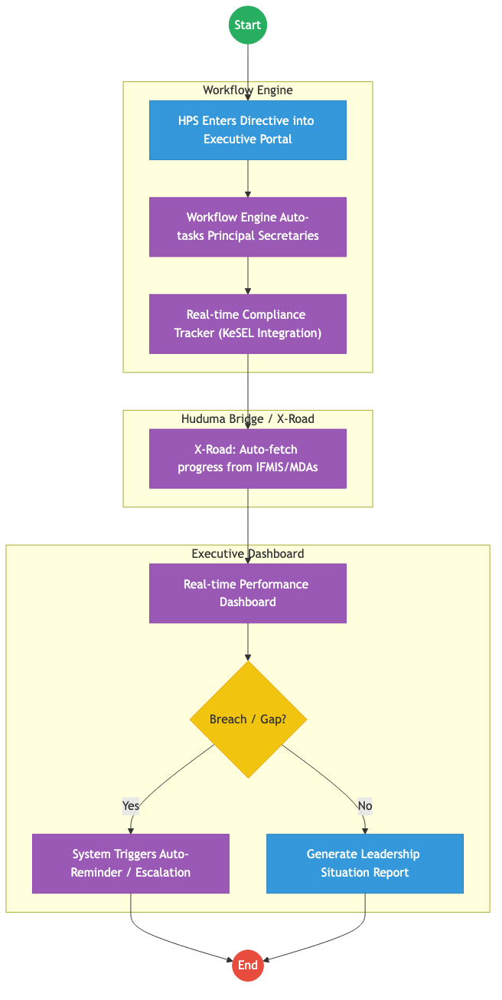

## Future State Process (TO-BE)
### Narrative
**TO-BE Process: Data-Driven Executive Coordination**

**Design Principles:**
- **Automated Compliance:** The **Workflow Engine** replaces memos. Instructions are tracked as "Tasks" with hard deadlines.
- **Evidence-Based Monitoring:** OHPS no longer waits for manual reports. The system pings MDA-specific registries (e.g., IFMIS for spending, KIAMIS for farmer outreach) via **X-Road** to verify progress independently.
- **Proactive Escalation:** The **API Gateway** monitors response times, automatically flagging delays to the Head of Public Service before they become national bottlenecks.

### Optimized Steps (Digital)

| Step | Actor | Action | System |
|---|---|---|---|
| 1 | Head of Public Service | Enters a directive into the Executive Coordination Portal, defining the Lead MDA and key milestones. | Executive Portal |
| 2 | System | Instantly notifies relevant Principal Secretaries and creates a tracking record in the national service bus. | Workflow Engine |
| 3 | System | Periodically fetches implementation data from authoritative registries via X-Road to validate MDA claims. | KeSEL / X-Road |
| 4 | Senior Coordinators | Monitor the "Executive Heatmap" dashboard to identify underperforming sectors. | Executive Dashboard |
| 5 | System | Generates a weekly "Situation Report" for the President, highlighting critical paths and compliance scores. | Analytics Engine |

---

## References
- https://www.headofpublicservice.go.ke
- Executive Order No. 1 of 2023
- Desk Review

---

# Source: STATE_DEPARTMENT_FOR_CORRECTIONAL_SERVICES___Service_Delivery.md

# STATE DEPARTMENT FOR CORRECTIONAL SERVICES – Service Delivery

## Cover Page
- **Ministry/Department/Agency (MDA):** Ministry of Interior and National Administration
- **Department:** State Department for Correctional Services
- **Process Name:** Inmate Case Management and Rehabilitation Tracking
- **Document Version:** 2.1
- **Date:** 2026-02-24
- **Classification:** Official

---

## Executive Summary
The State Department for Correctional Services is responsible for the safe custody and rehabilitation of offenders. Currently, inmate records (10–20 million historical and active files) are predominantly manual and regional, making it difficult to track recidivism or prisoner health and vocational progress across facilities. The transition to the Kenya DSAP Architecture aims to establish a central Inmate Registry integrated with the Judiciary and the national identity ecosystem.

---

## 1. AS-IS Process Flowchart (BPMN 2.0)
*Current State visualization (Inmate Admission & Records based on General Mandate).*

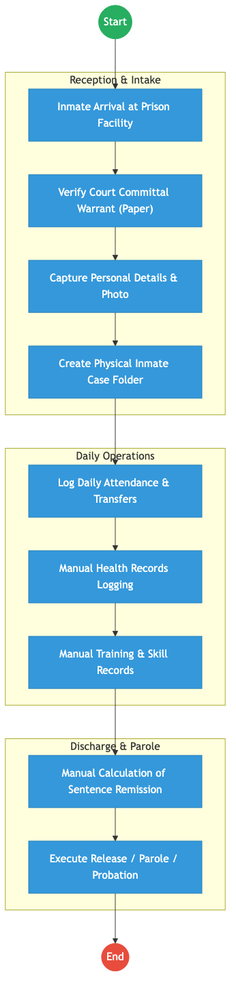

---

## Process Overview
### Process Name
End-to-End Inmate Case Management (Admission to Release)

### Service Category
- G2G (Government to Government - Judiciary/Police)

### Scope
- **In Scope:** Verification of committal warrants, inmate profiling, sentence tracking, and rehabilitation monitoring.
- **Out of Scope:** Physical security infrastructure of prisons.

### Triggers
- Court order committing an individual to a correctional facility.

### End States
- **Successful:** Inmate successfully rehabilitated and released according to law.

### Policy Context
- The Prisons Act; The Constitution of Kenya; Sentencing Guidelines.

---

## Detailed Process (AS-IS)

| Step | Role | Action | Tool/System | Notes |
|---|---|---|---|---|
| 1 | Reception Officer | Verifies the physical committal warrant from the court. | Physical Paper | High risk of errors. |
| 2 | Records Officer | Fills in inmate "booking" details in a physical register. | Manual Ledger | |
| 3 | Prison Admin | Assigns a prison number and creates a physical folder for all subsequent records. | Manual | |
| 4 | Welfare Officer | Tracks rehabilitation and vocational progress via periodic paper reports. | Manual | |
| 5 | Discharge Unit | Calculates release dates manually, accounting for remission and time served. | Manual/Calculator | |

---

## Pain Points & Opportunities
### Pain Points
- **Fragmented Records:** If a prisoner is moved from Nairobi to Shimo La Tewa, their medical and behavioral history often follows weeks later via physical mail.
- **Identity Gaps:** Hard to verify if an individual has previously served time under a different name without central biometrics.
- **Manual Computation:** High risk of errors in calculating sentence expiry dates.

### Opportunities
- **National Inmate Registry:** A central, biometric-linked database accessible to all facilities via **X-Road**.
- **Judiciary Integration:** Real-time digital committal warrants pushed directly from the **Judiciary CMS**.
- **Unified Health/Education:** Linking inmate progress to **MOH (Afya App)** and **KNQA** for vocational certification.

---

## 2. TO-BE Process Flowchart (BPMN 2.0)
*Future State visualization (Kenya DSAP Architecture - Huduma Bridge).*

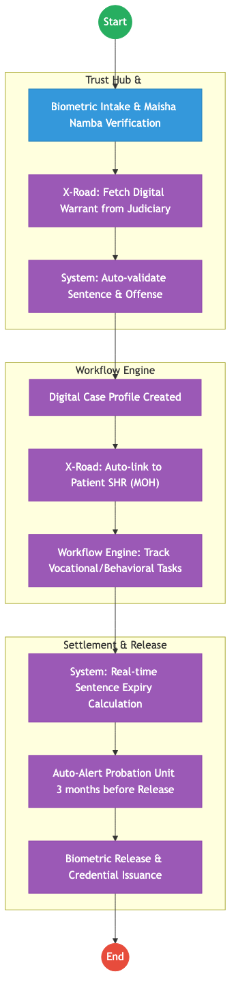

## Future State Process (TO-BE)
### Narrative
**TO-BE Process: Intelligent Correctional Management**

**Design Principles:**
- **Paperless Justice:** The "Committal Warrant" becomes a digital packet signed by a Judge (NPKI) and pushed to Prisons via the **Huduma Bridge**.
- **Continuity of Care:** Inmates' health and education records are not "Prison records" but national records (MOH/KNQA) that follow them after release, reducing recidivism.
- **Algorithmic Sentence Tracking:** The **Workflow Engine** calculates remission and release dates automatically, providing a live countdown for every inmate.

### Optimized Steps (Digital)

| Step | Actor | Action | System |
|---|---|---|---|
| 1 | Admission Officer | Scans the inmate's biometrics. System pulls their legal identity and prior history via X-Road. | eCitizen / Prisons Kit |
| 2 | System | Fetches the digital court order from the Judiciary CMS, verifying the exact sentence and offense. | KeSEL / X-Road |
| 3 | System | Automatically creates a digital profile and pings the MOH to fetch the inmate's medical summary. | Workflow Engine |
| 4 | Welfare Officer | Updates vocational progress using a tablet; certificates earned are pushed to the inmate's **KNQA** account. | Prisons App |
| 5 | System | Triggers an automated notification to the Probation and Aftercare Service when an inmate is within 90 days of release. | Notification Gateway |

---

## References
- https://www.correctional.go.ke
- Prisons Act
- Desk Review

---

# Source: STATE_DEPARTMENT_FOR_IMMIGRATION_AND_CITIZEN_SERVICES___Passport_Application.md

# STATE DEPARTMENT FOR IMMIGRATION AND CITIZEN SERVICES – Passport Application

## Cover Page
- **Ministry/Department/Agency (MDA):** STATE DEPARTMENT FOR IMMIGRATION AND CITIZEN SERVICES
- **Process Name:** Passport Application & Issuance
- **Document Version:** 1.3
- **Date:** 2026-02-19
- **Classification:** Official

---

## Executive Summary
The Directorate of Immigration Services (DIS) is responsible for the issuance of travel documents (passports, visas) to Kenyan citizens and foreign nationals. The passport application process has been digitized via eCitizen but faces significant bottlenecks in biometric capture, processing, and printing.

---

## 1. AS-IS PROCESS: Passport Application and Issuance

### BUSINESS PROCESS OVERVIEW
**Process Name:** Passport Application and Issuance
**Trigger:** Citizen applies for a new passport, renewal, replacement, or change of details

### ACTORS

| Actor                     | Role                     |
|---------------------------|--------------------------|
| Citizen (Applicant)       | Applies for passport     |
| eCitizen System           | Captures application     |
| Immigration Officer       | Verifies and approves    |
| Biometrics Officer        | Captures fingerprints/photo |
| Passport Production Unit  | Prints passport          |

### AS-IS Process Flowchart (BPMN 2.0)
*Current State visualization (End-to-End Passport Services based on Deep Dive).*

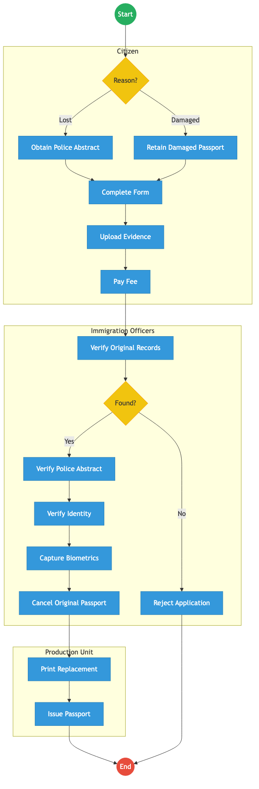

### Process Overview
### Process Name
Passport Application (New / Renewal / Replacement)

### Service Category
- G2C (Government to Citizen)

### Scope
- **In Scope:** Ordinary (A, B, C series), Diplomatic, and Service Passports.
- **Out of Scope:** Visa processing (evisa.go.ke).

### Triggers
- Need for international travel.
- Expiry of current passport.
- New application, renewal, replacement, or change of details.

### End States
- **Successful:** Issuance of e-Passport.

### Policy Context
- Kenya Citizenship and Immigration Act, 2011; ICAO Doc 9303.

### Stakeholders

| Stakeholder          | Role                     | Responsibilities                                                               |
|----------------------|--------------------------|--------------------------------------------------------------------------------|
| Citizen (Applicant)  | Applicant                | Completes online form, pays fee, attends appointment. |
| Immigration Officer  | Enroller                 | Captures biometrics and verifies original documents. |
| Production Staff | Processor | Operates printing machines, quality assurance. |
| Courier Service | Logistics | Delivers passports to regional offices (Mombasa, Kisumu, etc.). |

### Detailed Process (AS-IS)

| Step | Actor                     | Action                                                                                                                                           | Tool / System      | Notes                                                                    |
|------|---------------------------|--------------------------------------------------------------------------------------------------------------------------------------------------|--------------------|--------------------------------------------------------------------------|
| 1    | Citizen (Applicant)       | **Creates / Logs into eCitizen Account:** Logs in using National ID Number and Password.                                                         | eCitizen Portal    |                                                                          |
| 2    | Citizen (Applicant)       | **Select Passport Application Service:** Navigates to Immigration Services → Passport Application. Selects First Time Application, Renewal, or Replacement. | eCitizen Portal    |                                                                          |
| 3    | Citizen (Applicant)       | **Fill Passport Application Form (Form 19):** Inputs Personal Details (Full Name, National ID Number, Date of Birth, Place of Birth, Gender, Occupation) and Parent Details (Father Name, Father ID Number, Mother Name, Mother ID Number, Guardian Name, Guardian ID Number, Phone Number). | eCitizen Portal    |                                                                          |
| 4    | Citizen (Applicant)       | **Upload Supporting Documents:** Uploads National ID Copy, Birth Certificate Copy, Passport Photo, Recommender ID Copy (Mandatory). Optional: Old passport (for renewal). | eCitizen Portal    |                                                                          |
| 5    | eCitizen System           | **Submit Application:** System generates Passport Application Reference Number (e.g., PPT/ECITIZEN/2026/123456).                                   | eCitizen System    |                                                                          |
| 6    | Citizen (Applicant)       | **Pay Passport Fees:** Pays via Mobile Money, Card, or Bank.                                                                                     | eCitizen / Payment Gateway |                                                                          |
| 7    | Citizen (Applicant)       | **Book Biometrics Appointment:** Selects Immigration Office (e.g., Nairobi, Mombasa, Kisumu) and books date.                                       | eCitizen Portal    |                                                                          |
| 8    | Biometrics Officer        | **Biometric Capture:** Citizen visits Immigration Office, biometrics captured (Fingerprints, Photo, Signature).                                    | Biometric Kit      |                                                                          |
| 9    | Immigration Officer       | **Identity Verification:** Verification done against National ID via population register (IPRS lookup).                                          | IPRS System        |                                                                          |
| 10   | Senior Immigration Officer| **Application Approval:** Application is Approved or Rejected.                                                                                   | Internal System    |                                                                          |
| 11   | Passport Production Unit  | **Passport Production:** Passport is printed, containing Passport Number (e.g., A1234567).                                                          | Production System  |                                                                          |
| 12   | Citizen (Applicant)       | **Passport Collection:** Citizen collects passport at the Immigration Office.                                                                    | Collection Desk    |                                                                          |

---

## Pain Points & Opportunities
### Pain Points
- **Booklet Shortage:** Frequent delays due to lack of blank passport booklets.
- **Machine Breakdown:** Few printing machines (mainly in Nairobi), causing national backlog.
- **Appointment Delays:** Slots booked out for months; forced to travel to other towns.
- **Corruption:** "Brokers" promising faster processing or appointment slots.
- **Communication:** Lack of transparency on application status ("Stuck at Printing").

### Opportunities
- **Decentralized Printing:** Install printers in key regional offices (Mombasa, Kisumu).
- **Mobile Enrollment:** Portable biometric kits for diaspora or remote areas.
- **Auto-Approval:** Integrate with IPRS/NRB to auto-approve renewal applications (no new biometrics needed if data hasn't changed).
- **Home Delivery:** Partner with Postal Corporation for secure delivery to home/office.

---

## 2. TO-BE PROCESS: Passport Application and Issuance (Optimized)

### TO-BE Process Flowchart (BPMN 2.0)
*Future State visualization (Kenya DSAP Architecture - Huduma Bridge).*

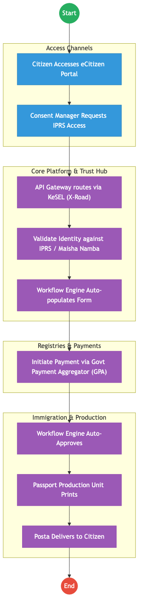

### Future State Process (TO-BE)
### Narrative
The process is **Shared-Service Driven** and **Logistics-Integrated**.
1.  **Biometric Reuse:** The system pulls existing fingerprints from the **NRB (Maisha Namba)** database via **X-Road**. Why capture them again?
2.  **No Appointments:** For renewals and standard applications, physical presence is removed.
3.  **AI Photo Check:** The **eCitizen App** uses AI to ensure the selfie meets ICAO standards before submission.
4.  **Home Delivery:** Passports are delivered securely via **Posta (National Courier)**, tracking the parcel via the App.
5.  **Digital Travel Credential (DTC):** A virtual passport is issued immediately to the phone for use at e-Gates.

### Optimized Steps (Digital)

| Step | Actor | Action | System |
|---|---|---|---|
| 1 | Citizen | Requests passport on eCitizen App. Takes ICAO-compliant selfie. | eCitizen App / AI |
| 2 | WoG Platform | Fetches fingerprints from NRB and validates identity. | X-Road / IPRS |
| 3 | Immigration | Auto-approves application. | Workflow Engine |
| 4 | Factory | Prints booklet. | Production System |
| 5 | Posta | Delivers passport to citizen's doorstep. | Logistics Tracking |

---

## 3. Standard Data Inputs
*Required fields for the WoG Digital Service.*

### A. Passport Application (Renewal/New)

| Field Name | Type | Source | Validation |
|---|---|---|---|
| Citizen ID (Maisha) | String | System Fetch (NRB) | Read-only |
| Passport Type | Enum | User Input | 32/50/66 Pages |
| Current Photo | Image | User Capture (App) | AI ICAO Check |
| Delivery Address | Geo-Loc | User Input | Verified via Google Maps |
| Recommender ID | String | User Input | Optional (if NRB verified) |
| Reason for Travel | Enum | User Input | Tourism / Business / Medical |
| Emergency Contact | String | User Input | Validated vs IPRS |

---

## References
- https://www.immigration.go.ke
- Kenya Citizenship and Immigration Act
- Desk Review

---

# Source: Sports_and_the_Arts___Service_Delivery.md

# STATE DEPARTMENT FOR SPORTS – Service Delivery

## Cover Page
- **Ministry/Department/Agency (MDA):** Ministry of Youth Affairs, Creative Economy and Sports
- **Department:** State Department for Sports
- **Process Name:** Federation Registration, Grants & Facility Management
- **Document Version:** 2.1
- **Date:** 2026-02-24
- **Classification:** Official

---

## Executive Summary
The State Department for Sports is responsible for the regulation of sports federations, management of athlete grants, and the administration of national sports facilities. The current process is transitioning to digital for facility booking but remains manual for federation oversight and grant management. The transition to the Kenya DSAP Architecture aims to unify these services into a single "Sports Portal" integrated with IPRS for athlete verification and the Government Payment Aggregator for facility fees and grant disbursements.

---

## 1. AS-IS Process Flowchart (BPMN 2.0)
*Current State visualization (End-to-End Sports Services based on Deep Dive).*

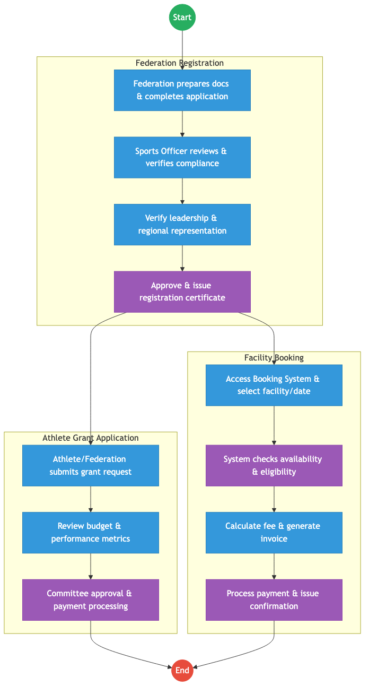

---

## Process Overview
### Process Name
Sports Federation Registration, Grant Disbursement, and Facility Booking

### Service Category
- G2C (Athlete) / G2B (Federation)

### Scope
- **In Scope:** New federation registrations, renewals, talent identification grants, and booking of stadiums/complexes.
- **Out of Scope:** Management of private sports clubs.

### Triggers
- A sports body seeking legal recognition or an athlete applying for training support.

### End States
- **Successful:** Federation registered; Grant disbursed to athlete's wallet; Facility booked.

### Policy Context
- The Sports Act 2013; The Constitution of Kenya; Data Protection Act 2019.

---

## Detailed Process (AS-IS)

| Step | Role | Action | Tool/System | Notes |
|---|---|---|---|---|
| 1 | Federation | Submits application for registration along with constitution and list of officials. | Manual/Portal | |
| 2 | Sports Officer | Verifies the regional representation of the federation as required by the Sports Act. | Manual | |
| 3 | Athlete | Submits a grant application for international competitions or training. | Manual Forms | |
| 4 | Facility Manager | Reviews booking requests and checks for conflicts with national team schedules. | Standalone System | |
| 5 | Finance Officer | Processes facility payments and grant disbursements via bank transfers. | Manual/IFMIS | |

---

## Pain Points & Opportunities
### Pain Points
- **Fragmented Athlete Data:** No central database of all registered athletes, making talent tracking difficult.
- **Grant Transparency:** Manual grant processing leads to delays and lack of visibility for athletes.
- **Double Booking:** Standalone facility systems sometimes conflict with high-level government event schedules.

### Opportunities
- **National Athlete Registry:** Using **Maisha Namba** to track every athlete's career from school (NEMIS) to professional level.
- **Unified Booking Engine:** A central "Stadium App" integrated with the **Government Payment Aggregator** for instant booking and payment.
- **Digital Grant Wallets:** Directly disbursing grants to athletes' digital wallets, bypassing intermediaries.

---

## 2. TO-BE Process Flowchart (BPMN 2.0)
*Future State visualization (Kenya DSAP Architecture - Huduma Bridge).*

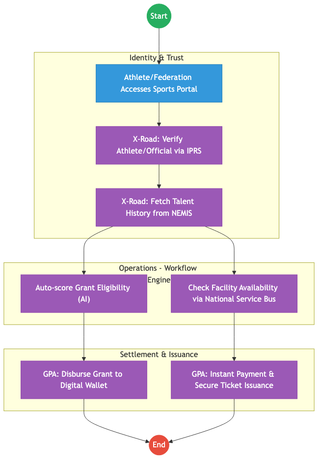

## Future State Process (TO-BE)
### Narrative
**TO-BE Process: Integrated Sports Management Platform**

**Design Principles:**
- **Talent Lifecycle Tracking:** By integrating with **NEMIS** and **IPRS**, the Ministry can track an athlete's progress from primary school competitions to the Olympics.
- **Zero-Touch Booking:** Facility management is fully automated via the **Huduma Bridge**, with real-time availability sync across all national stadiums.
- **Financial Integrity:** All payments (G2C grants and C2G fees) are routed through the **Government Payment Aggregator**, ensuring auditability.

### Optimized Steps (Digital)

| Step | Actor | Action | System |
|---|---|---|---|
| 1 | Athlete | Logs into the Sports Portal using their Maisha Namba for SSO. | Sports Portal |
| 2 | System | Fetches the athlete's competition history and academic status via X-Road (NEMIS/KNQA). | KeSEL / X-Road |
| 3 | Athlete | Selects a training facility and pays the discounted "Elite Athlete" fee. | GPA |
| 4 | System | Instantly issues a digital "Access Ticket" (QR Code) and notifies the facility manager. | Output Generator |
| 5 | System | Automatically triggers the quarterly grant disbursement based on verified performance logs. | GPA / Workflow Engine |

---

## References
- https://www.sportsheritage.go.ke
- Sports Act 2013
- Desk Review

---

# Source: State_Department_for_Children_Services___Service_Delivery.md

# STATE DEPARTMENT FOR CHILDREN SERVICES – Service Delivery

## Cover Page
- **Ministry/Department/Agency (MDA):** Ministry of Labour and Social Protection
- **Department:** State Department for Children Services
- **Process Name:** Child Protection Case Management
- **Document Version:** 2.1
- **Date:** 2026-02-24
- **Classification:** Official

---

## Executive Summary
The State Department for Children Services is responsible for the protection and well-being of children in Kenya. The current case management process is entirely paper-based, leading to delays in interventions, difficulty in tracking child history across regions, and risks of data loss. The transition to the Kenya DSAP Architecture aims to implement a secure, digital Child Protection Information Management System (CPIMS) integrated with the national identity ecosystem.

---

## 1. AS-IS Process Flowchart (BPMN 2.0)
*Current State visualization (End-to-End Child Protection based on Deep Dive).*

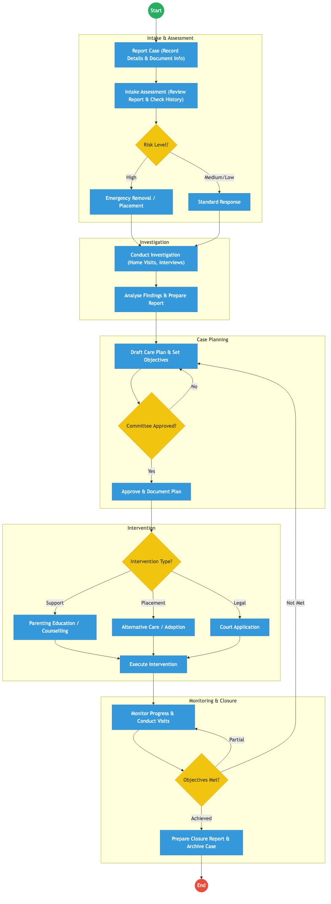

---

## Process Overview
### Process Name
End-to-End Child Protection Case Management (Reporting to Closure)

### Service Category
- G2C (Government to Citizen)

### Scope
- **In Scope:** Case intake, emergency interventions, social investigations, care planning, and court referrals.
- **Out of Scope:** Long-term foster care administration (beyond initial placement).

### Triggers
- A report of a child in need of care and protection (abuse, neglect, abandonment).

### End States
- **Successful:** Child's safety ensured; Case successfully closed or transitioned to long-term care.

### Policy Context
- The Children Act 2022; The Constitution of Kenya 2010; Data Protection Act 2019.

---

## Detailed Process (AS-IS)

| Step | Role | Action | Tool/System | Notes |
|---|---|---|---|---|
| 1 | Children Officer | Records case details from the reporting party and manually assigns a case reference. | Paper Ledger | |
| 2 | Children Officer | Conducts an intake assessment to determine risk level (High/Medium/Low). | Manual | |
| 3 | Children Officer | Conducts site visits, home visits, and interviews with parents and child to gather evidence. | Physical Visits | |
| 4 | Case Committee | Reviews the investigation findings and care plan for approval. | Physical Meeting | |
| 5 | Children Officer | Executes the intervention (e.g., placing child in a Charitable Children's Institution or filing in court). | Manual | |

---

## Pain Points & Opportunities
### Pain Points
- **Siloed Paper Records:** If a child moves from Nairobi to Mombasa, their protection history is lost because the files are physical.
- **Delayed Response:** Manual routing of emergency cases through physical committees takes too long.
- **Data Security:** Sensitive case files are stored in physical cabinets, posing a risk to the child's privacy.

### Opportunities
- **National CPIMS:** A unified digital platform for tracking every child protection case across Kenya.
- **Biometric Identity (Maisha Namba):** Linking every case to a child's UPI to ensure continuity of care regardless of location.
- **Digital Court Integration:** Direct API link to the Judiciary's Case Management System for filing protection orders.

---

## 2. TO-BE Process Flowchart (BPMN 2.0)
*Future State visualization (Kenya DSAP Architecture - Huduma Bridge).*

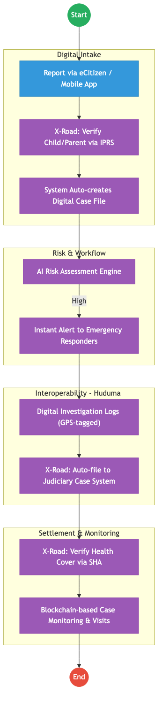

## Future State Process (TO-BE)
### Narrative
**TO-BE Process: Data-Driven Child Protection**

**Design Principles:**
- **Zero-Latency Reporting:** Citizens can report cases via a dedicated app or eCitizen, which instantly creates a digital file.
- **Unified Identity:** Every child is tracked via their **Maisha Namba**, allowing for a complete longitudinal record of their well-being.
- **Cross-Agency Collaboration:** The **Huduma Bridge** enables real-time data sharing between Children Services, the Judiciary (for court orders), and Health (for medical reports), ensuring a holistic response.

### Optimized Steps (Digital)

| Step | Actor | Action | System |
|---|---|---|---|
| 1 | Citizen | Reports a case via the mobile app, providing GPS coordinates for the location of the incident. | CPIMS App |
| 2 | System | Instantly pings IPRS/NRB via X-Road to identify the child and legal guardians. | KeSEL / X-Road |
| 3 | System | AI-based risk engine analyzes the report and triggers an "Emergency Alert" to the nearest available Children Officer. | Workflow Engine |
| 4 | Children Officer | Conducts a digital investigation, uploading GPS-tagged photos and voice-recorded interviews. | CPIMS App |
| 5 | System | Automatically files the necessary legal petitions in the Judiciary CMS via a secure API. | Huduma Bridge / Judiciary API |

---

## References
- https://www.socialprotection.go.ke
- Children Act 2022
- Desk Review

---

# Source: State_Department_for_Special_Programmes___Service_Delivery.md

# STATE DEPARTMENT FOR SPECIAL PROGRAMMES – Service Delivery

## Cover Page
- **Ministry/Department/Agency (MDA):** Ministry of Labour and Social Protection
- **Department:** State Department for Special Programmes
- **Process Name:** Social Protection & Beneficiary Management
- **Document Version:** 2.2
- **Date:** 2026-02-25
- **Classification:** Official

---

## Executive Summary
The State Department for Special Programmes is responsible for social protection interventions targeting vulnerable populations. This includes safety net programmes, emergency relief, and beneficiary support. The current process is heavily manual, leading to identification delays and disbursement risks. The transition to the Kenya DSAP Architecture aims to establish a real-time, biometric-linked social registry.

---

## 1. AS-IS Process Flowchart (BPMN 2.0)
*Current State visualization (Manual Special Programmes Delivery).*

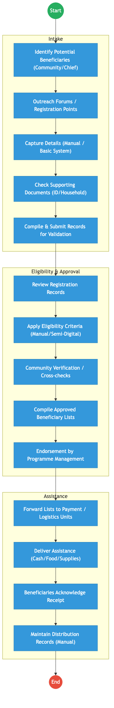

---

## Process Overview
### Process Name
End-to-End Special Programmes Delivery (Registration to Assistance)

### Service Category
- G2C (Government to Citizen)

### Scope
- **In Scope:** Beneficiary identification, registration, validation, approval, and assistance delivery.
- **Out of Scope:** Long-term policy formulation.

### Triggers
- Citizen seeking inclusion or government identification of vulnerable households.

### End States
- **Successful:** Assistance delivered; Records archived.

---

## 2. TO-BE Process Flowchart (BPMN 2.0)
*Future State visualization (Kenya DSAP Architecture - Huduma Bridge).*

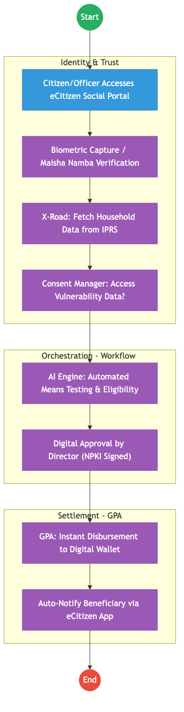

## Future State Process (TO-BE)
### Narrative
The To-Be process leverages **Maisha Namba** for instant identity and household verification. **X-Road** allows for automated means testing against other registries (e.g., NHIF, NSSF). Assistance is delivered instantly via the **Government Payment Aggregator (GPA)**, ensuring zero leakage.

---

## References
- https://www.socialprotection.go.ke
- National Social Protection Policy
- Desk Review

---

# Source: Youth_Affairs___Service_Delivery.md

# STATE DEPARTMENT FOR YOUTH AFFAIRS – Service Delivery

## Cover Page
- **Ministry/Department/Agency (MDA):** Ministry of Public Service, Gender and Affirmative Action
- **Department:** State Department for Youth Affairs
- **Process Name:** Youth Internship Placement & AGPO Registration
- **Document Version:** 2.1
- **Date:** 2026-02-24
- **Classification:** Official

---

## Executive Summary
The State Department for Youth Affairs is responsible for the economic empowerment of Kenyan youth through initiatives like the Public Service Internship Programme (PSIP) and the Access to Government Procurement Opportunities (AGPO) registration for youth-owned enterprises. Currently, these processes rely on manual uploads of academic documents and business certificates. The transition to the Kenya DSAP Architecture aims to automate eligibility verification via IPRS and BRS, enabling instant internship matching and AGPO certification.

---

## 1. AS-IS Process Flowchart (BPMN 2.0)
*Current State visualization (Youth Internship & AGPO Registration based on Deep Dive).*

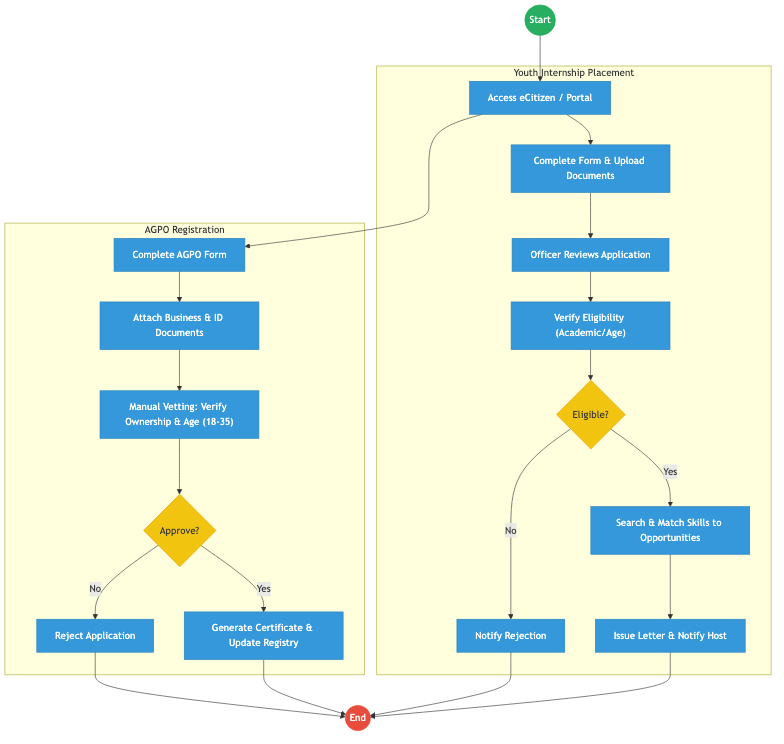

---

## Process Overview
### Process Name
Youth Internship Placement, AGPO Registration, and Film Production Licensing

### Service Category
- G2C (Government to Citizen) / G2B (Youth-owned MSMEs)

### Scope
- **In Scope:** Internship applications, skill matching, AGPO certification for youth, and film licensing.
- **Out of Scope:** Disbursement of enterprise funds (handled by MSME department).

### Triggers
- A youth applying for an internship or a youth-owned business seeking AGPO certification.

### End States
- **Successful:** Internship placement letter issued; AGPO Certificate generated.

### Policy Context
- The Public Service Commission Internship Policy; The Public Procurement and Asset Disposal Act (AGPO Provisions).

---

## Detailed Process (AS-IS)

| Step | Role | Action | Tool/System | Notes |
|---|---|---|---|---|
| 1 | Applicant | Logs into eCitizen and fills forms for Internship or AGPO. | eCitizen / Portal | |
| 2 | Applicant | Uploads PDF copies of National ID, Academic Certificates, and BRS Business Registrations. | Manual Upload | |
| 3 | Youth Officer | Manually reviews the documents to ensure the applicant is between 18-35 years old. | Manual | High duplication of effort. |
| 4 | Programme Officer | For internships, manually matches the applicant's course of study with available slots in government agencies. | Excel / Manual | |
| 5 | AGPO Officer | Verifies business ownership details against BRS certificates before approving the AGPO status. | Manual | |

---

## Pain Points & Opportunities
### Pain Points
- **Document Fatigue:** Youth have to upload the same ID and certificates for every application.
- **Inefficient Matching:** Manual matching of 50,000+ interns to 1,000+ slots is slow and error-prone.
- **Vetting Delays:** AGPO certification takes weeks due to manual business ownership verification.

### Opportunities
- **Once-Only Data Pull:** Fetching ID from **IPRS**, Academic data from **KNEC/KNQA**, and Business data from **BRS** via **X-Road**.
- **AI-Powered Matching:** An automated engine that matches interns to hosts based on GPS location and skill sets.
- **Real-Time AGPO Certification:** Instantly issuing AGPO certificates once the system confirms the directors are 18-35 via IPRS.

---

## 2. TO-BE Process Flowchart (BPMN 2.0)
*Future State visualization (Kenya DSAP Architecture - Huduma Bridge).*

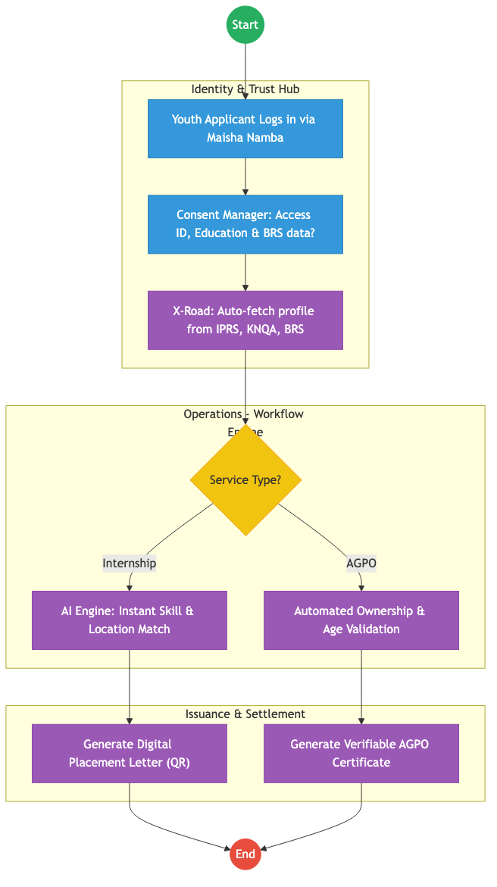

## Future State Process (TO-BE)
### Narrative
**TO-BE Process: Automated Youth Empowerment**

**Design Principles:**
- **Zero Document Uploads:** Academic credentials and business ownership details are fetched directly from authoritative registries via the **Huduma Bridge**.
- **Instant AGPO:** If the system confirms (via BRS and IPRS) that a business is 100% youth-owned, the AGPO certificate is issued instantly.
- **Smart Internships:** The **Workflow Engine** uses AI to place interns in agencies nearest to their residence (verified via GPS/Maisha Namba), reducing transport costs for the youth.

### Optimized Steps (Digital)

| Step | Actor | Action | System |
|---|---|---|---|
| 1 | Youth Applicant | Logs into eCitizen using Maisha Namba. All personal and education details are already pre-populated. | eCitizen / SSO |
| 2 | System | For AGPO, the system pings BRS via X-Road to verify the company's "Youth-Owned" status. | KeSEL / X-Road |
| 3 | System | AI matching engine assigns the intern to a government agency based on the applicant's degree and the agency's needs. | Workflow Engine |
| 4 | System | Generates a digital verifiable certificate/letter with a secure QR code for instant authentication. | Output Generator |

---

## References
- https://www.youth.go.ke
- Public Service Commission Internship Policy
- Desk Review

---

# Source: _CIVIL_REGISTRATION_SERVICES_CRS____Service_Delivery.md

# CIVIL REGISTRATION SERVICES (CRS) – Service Delivery

## Cover Page
- **Ministry/Department/Agency (MDA):** Ministry of Interior and National Administration
- **Department:** Department of Civil Registration Services (CRS)
- **Process Name:** Birth and Death Registration
- **Document Version:** 2.1
- **Date:** 2026-02-24
- **Classification:** Official
- **Strategic Category:** Priority MDA
- **Service Model:** G2C
- **Life-Cycle Group:** Cradle to Death (1. The Cradle)

---

## Executive Summary
Civil Registration Services (CRS) is the authoritative custodian of vital life events in Kenya, including births and deaths. These events form the bedrock of a citizen's legal identity (Maisha Namba). The current process relies on semi-digital systems (CRVS) and manual paper notifications from hospitals and administrative chiefs. The transition to the Kenya DSAP Architecture aims to establish real-time, event-driven registration triggered at the point of occurrence.

---

## 1. AS-IS Process Flow (BPMN 2.0)
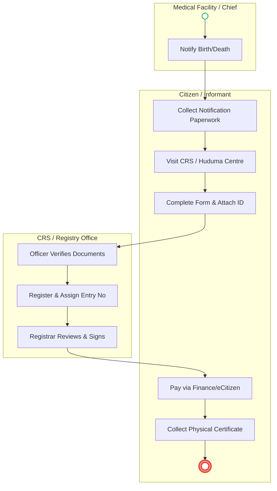
```mermaid
flowchart TD
    subgraph Location["Medical Facility / Chief"]
        Start(( )) --> A1[Notify Birth/Death]
    end

    subgraph Informant["Citizen / Informant"]
        A1 --> B1[Collect Notification Paperwork]
        B1 --> B2[Visit CRS / Huduma Centre]
        B2 --> B3[Complete Form & Attach ID]
        B7[Pay via Finance/eCitizen] --> B8[Collect Physical Certificate]
        B8 --> End((( )))
    end

    subgraph CRS["CRS / Registry Office"]
        B3 --> C1[Officer Verifies Documents]
        C1 --> C2[Register & Assign Entry No]
        C2 --> C3[Registrar Reviews & Signs]
        C3 --> B7
    end

    style Start fill:#fff,stroke:#27ae60,stroke-width:2px
    style End fill:#fff,stroke:#e74c3c,stroke-width:4px
```

---

## Process Overview
### Process Name
Vital Event Registration (Births and Deaths) and Certificate Issuance

### Service Category
- G2C (Government to Citizen)

### Scope
- **In Scope:** Timely and late registration of births and deaths; issuance of birth certificates, death certificates, and burial permits.
- **Out of Scope:** Issuance of National ID cards (handled by NRB).

### Triggers
- Occurrence of a birth or death at a facility or within the community.

### End States
- **Successful:** Vital event registered; Digital record created; Physical/Digital certificate issued.

### Policy Context
- Births and Deaths Registration Act; The Constitution of Kenya; Data Protection Act 2019.

---

## Detailed Process (AS-IS)

| Step | Role | Action | Tool/System | Notes |
|---|---|---|---|---|
| 1 | Informant/Chief | Reports the event at a CRS office or via the eCitizen portal. | Manual/Digital | |
| 2 | Registration Officer | Verifies the supporting documents (ID of parents, notification from hospital). | Manual | |
| 3 | Registration Officer | Manually enters the data into the CRVS system and assigns a serial entry number. | CRVS System | |
| 4 | Registrar | Approves the entry and signs the physical register or digital record. | Physical Register | |
| 5 | Clerk | Processes the payment and triggers the printing of the certificate. | Manual/eCitizen | |

---

## Pain Points & Opportunities
### Pain Points
- **Manual Backlogs:** Physical registers in district offices lead to delays in searching and retrieving records.
- **Identity Fraud:** Difficulty in verifying the identity of parents or informants against IPRS in real-time.
- **Late Registration:** Complexities in "Late Registration" (after 6 months) discourage citizens from formalizing vital events.

### Opportunities
- **Event-Driven Architecture:** Automatic registration triggered when a birth is logged in the MOH **Afya App**.
- **Unified Identity (Maisha Namba):** Instant generation of a Unique Personal Identifier (UPI) upon birth registration.
- **Digital Certificates:** Issuing cryptographically signed digital certificates directly to the citizen's mobile wallet.

---

## 2. TO-BE Process (BPMN 2.0 - POC v2 Aligned)
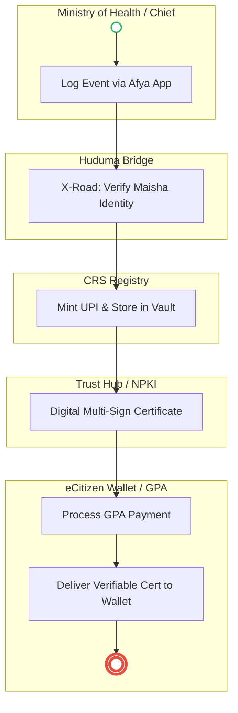
```mermaid
flowchart TD
    subgraph MOH["Ministry of Health / Chief"]
        Start(( )) --> T1[Log Event via Afya App]
    end

    subgraph Bridge["Huduma Bridge"]
        T1 --> T2[X-Road: Verify Maisha Identity]
    end

    subgraph Registry["CRS Registry"]
        T2 --> T3[Mint UPI & Store in Vault]
    end

    subgraph Trust["Trust Hub / NPKI"]
        T3 --> T4[Digital Multi-Sign Certificate]
    end

    subgraph Citizen["eCitizen Wallet / GPA"]
        T4 --> C1[Process GPA Payment]
        C1 --> C2[Deliver Verifiable Cert to Wallet]
        C2 --> End((( )))
    end

    style Start fill:#fff,stroke:#27ae60,stroke-width:2px
    style End fill:#fff,stroke:#e74c3c,stroke-width:4px
```

## Future State Process (TO-BE)
### Narrative
**TO-BE Process: Seamless Vital Event Registration**

**Design Principles:**
- **Zero-Touch Registration:** When a child is born in an accredited hospital, the **MOH system** pushes the record to **CRS** via the **Huduma Bridge**. The registration happens in the background without the parents needing to apply.
- **Instant Identity:** The system automatically pings **IPRS** to verify the parents' identities and then mints a **Maisha Namba (UPI)** for the child instantly.
- **Digital First:** Paper certificates are replaced by **Verifiable Digital Credentials** issued to the parents' eCitizen wallets, which can be presented at schools or for passport applications without needing a physical copy.

### Optimized Steps (Digital)

| Step | Actor | Action | System |
|---|---|---|---|
| 1 | Health Worker | Records the birth/death in the facility EMR. | MOH Afya App |
| 2 | System | Automatically verifies the parents' IDs against Maisha Namba via X-Road. | IPRS / KeSEL |
| 3 | CRS Registry | Receives validated packet, mints UPI (Maisha Namba) and stores in Vault. | CRS / Workflow Engine |
| 4 | Trust Hub | **NPKI Signing:** Cryptographically signs the record for non-repudiation. | NPKI Service |
| 5 | Finance | **Payment:** GPA processes fees and performs revenue split (National/County). | GPA |
| 6 | Citizen | **Issuance:** Verifiable digital certificate delivered to Passport/Mobile Wallet. | Digital Wallet |

---

## References
- https://www.immigration.go.ke
- Births and Deaths Registration Act
- Desk Review

---

# Source: _REFUGEE_SERVICES___Service_Delivery.md

# DEPARTMENT OF REFUGEE SERVICES – Service Delivery

## Cover Page
- **Ministry/Department/Agency (MDA):** Ministry of Interior and National Administration
- **Department:** Department of Refugee Services (DRS)
- **Process Name:** Refugee Status Determination and Documentation
- **Document Version:** 2.1
- **Date:** 2026-02-24
- **Classification:** Official

---

## Executive Summary
The Department of Refugee Services (DRS) is mandated to manage refugee affairs in Kenya, including registration, Refugee Status Determination (RSD), and the issuance of identification and travel documents. Currently, the process is heavily manual, involving multiple physical interviews and siloed databases (like UNHCR proGres). The transition to the Kenya DSAP Architecture aims to integrate refugee data seamlessly with the national identity ecosystem (IPRS/Maisha Namba) to provide secure, verifiable digital credentials.

---

## 1. AS-IS Process Flowchart (BPMN 2.0)
*Current State visualization (End-to-End Refugee Services based on Deep Dive).*

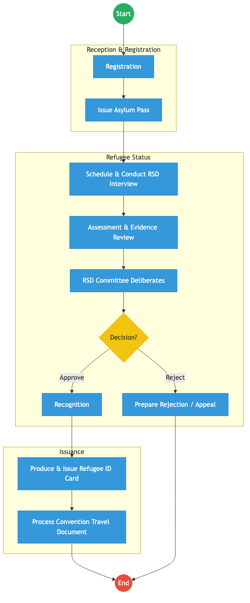

---

## Process Overview
### Process Name
End-to-End Refugee Status Determination and Documentation

### Service Category
- G2C (Government to Citizen/Refugee)

### Scope
- **In Scope:** Asylum seeker registration, RSD interviews, Committee decisions, and issuance of Refugee ID Cards and Convention Travel Documents (CTDs).
- **Out of Scope:** Camp management logistics (food/shelter).

### Triggers
- Arrival of an asylum seeker at a reception center or urban registration desk.

### End States
- **Successful:** Issuance of Refugee ID Card and integration into the national population database.
- **Unsuccessful:** Rejection of claim (leading to appeal or deportation).

### Policy Context
- The Refugees Act, 2021; 1951 Refugee Convention; Data Protection Act 2019.

---

## Detailed Process (AS-IS)

| Step | Role | Action | Tool/System | Notes |
|---|---|---|---|---|
| 1 | Registration Officer | Receives asylum seeker, verifies entry documents, and captures photos/fingerprints to issue an Asylum Pass. | Refugee System / UNHCR proGres | Dual entry often required. |
| 2 | Eligibility Officer | Conducts the RSD interview, records testimony, and reviews evidence. | Manual/Digital | |
| 3 | RSD Committee | Deliberates on the case applying the 1951 Criteria. | Committee Minutes | |
| 4 | Processing Unit | If recognized, the refugee applies for an ID Card. Old records are retrieved and prints verified. | Manual/Standalone System | |
| 5 | Processing Unit | If requested, processes Convention Travel Documents, requiring manual status verification. | Production System | |

---

## Pain Points & Opportunities
### Pain Points
- **Siloed Databases:** Disconnect between DRS systems, UNHCR proGres, and the national IPRS/NRB.
- **Manual Verification:** RSD Committee relies on paper files and manual testimony transcription.
- **Documentation Delays:** Producing physical Refugee ID Cards and Travel Documents takes months due to lack of integration with central printing facilities.

### Opportunities
- **National Identity Integration:** Minting a specific "Maisha Namba" for recognized refugees to allow them access to eCitizen services (like KRA PIN, SHA, NSSF).
- **Automated Workflows:** Using a central Workflow Engine to route files from Registration to the RSD Committee digitally.
- **Digital Credentials:** Issuing verifiable digital IDs alongside physical cards.

---

## 2. TO-BE Process Flowchart (BPMN 2.0)
*Future State visualization (Kenya DSAP Architecture - Huduma Bridge).*

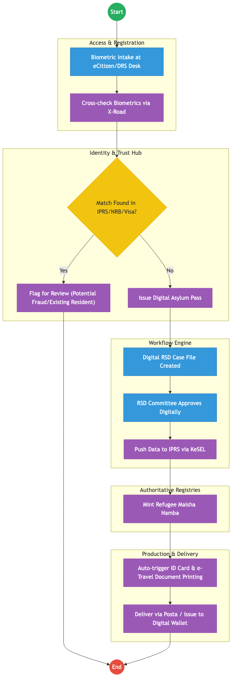

## Future State Process (TO-BE)
### Narrative
**TO-BE Process: Integrated Refugee Identity Management**

**Design Principles:**
- **Single Source of Truth:** Integrating refugee biometrics tightly with the national **IPRS** via **KeSEL (X-Road)**. This prevents identity fraud (e.g., citizens registering as refugees, or vice versa).
- **Digital Workflows:** The entire RSD process is managed by a central **Workflow Engine**, eliminating lost physical files.
- **Financial & Social Inclusion:** By minting a standardized **Maisha Namba** upon recognition, refugees can immediately access integrated eCitizen services, pay via the **Government Payment Aggregator (GPA)**, and enroll in the Social Health Authority (SHA).

### Optimized Steps (Digital)

| Step | Actor | Action | System |
|---|---|---|---|
| 1 | Registration Officer | Captures biometrics via integrated kits. System instantly queries IPRS and Immigration databases via X-Road to ensure the individual is not already registered. | eCitizen / X-Road |
| 2 | System | Auto-generates a Digital Asylum Pass with a QR code verifiable by law enforcement. | Output Generator |
| 3 | RSD Committee | Reviews the digitized evidence file and records the decision directly in the system. | Workflow Engine  |
| 4 | System | Upon approval, the system pushes the data to IPRS to mint a Refugee Maisha Namba. | IPRS / KeSEL |
| 5 | Production Unit | ID Cards and Travel Documents are queued for printing at the centralized government facility and dispatched via Posta. | Production / Logistics |

---

## References
- https://www.refugees.go.ke
- Refugees Act 2021
- Desk Review

---

---

### Validation Survey
Please provide your feedback here: [https://ee.kobotoolbox.org/x/4Ls7SlCG](https://ee.kobotoolbox.org/x/4Ls7SlCG)

