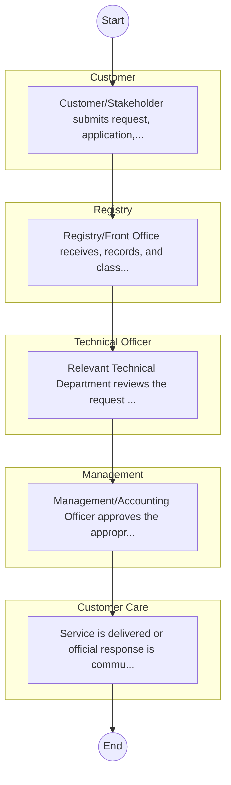
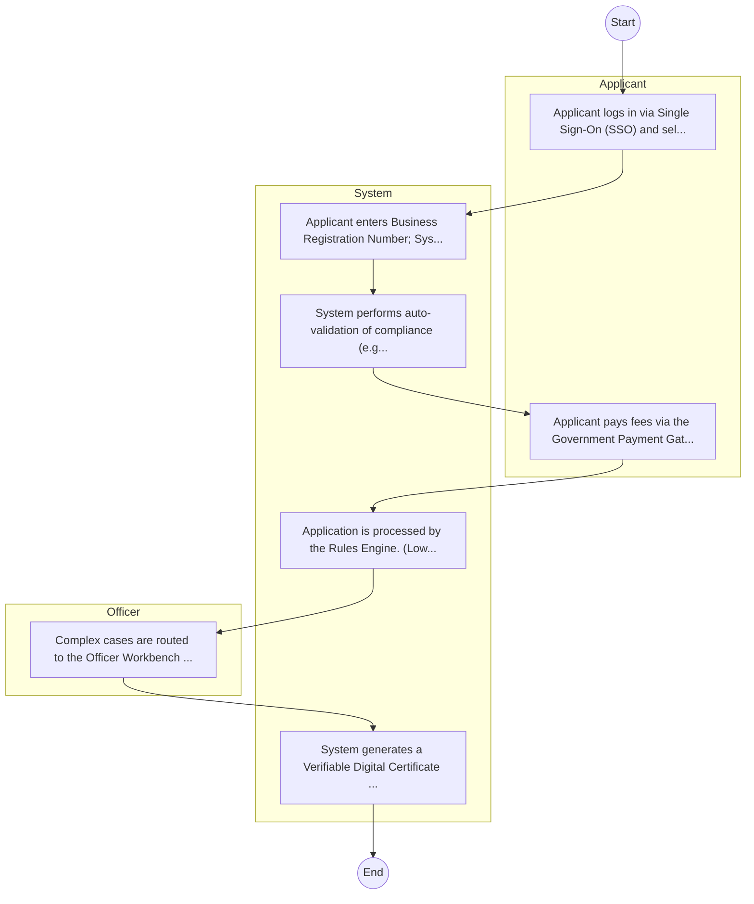

# ASALs and Regional Development – Service Delivery

## Cover Page
- **Ministry/Department/Agency (MDA):** ASALs and Regional Development
- **Process Name:** Service Delivery
- **Document Version:** 1.0
- **Date:** 2026-02-14
- **Classification:** Official

---

## Executive Summary
The Ministry of ASALs and Regional Development (previously known as the Ministry of Devolution and Arid and Semi-Arid Lands - ASALs) is a key government Ministry in Kenya. Established to coordinate the development of policies and programs for the sustainable development of Kenya's Arid and Semi-Arid Lands and regional authorities, it plays a crucial role in fostering economic growth, social inclusion, and environmental sustainability within these regions. The Ministry's work is vital for integrating marginalized areas into the national development agenda and improving livelihoods.

---

## Service Mandate & Legal Basis
### Statutory Mandate
To coordinate the development of laws, policies, and guidelines for the effective management of devolution and the sustainable development of ASALs; to provide capacity building and technical assistance to counties, particularly those in ASAL regions; to facilitate harmonious intergovernmental relations between national and county governments, and among county governments; to promote public participation in policy and decision-making processes affecting ASALs and regional development; to track and monitor program implementation in counties to ensure alignment with national goals; to coordinate stakeholder engagement for integrated development; to oversee the management of public assets and liabilities at the county level; to facilitate the transfer of functions between national and county governments; to establish and promote systems for efficient and effective implementation of devolution and ASAL programs; to coordinate the implementation of targeted policy interventions for ASALs; to promote socio-economic development in ASALs; to undertake community mobilization for development initiatives; to manage food relief and emergency responses; and to implement special programs for the accelerated development of Northern Kenya and other Arid Lands.

### Legal Context
- The Ministry operates under the relevant Executive Orders that establish government Ministries and define their functions (e.g., Executive Order No. 1 of January 2018). Its mandate is to provide leadership in the implementation of devolution and to coordinate the development of ASALs, guided by the Constitution of Kenya 2010, the County Governments Act, and national development strategies such as Vision 2030, particularly those targeting marginalized regions for equitable growth.

---

## 1. AS-IS Process Flowchart (BPMN 2.0)
*Current State visualization.*

---

## Process Overview
### Service Category
- G2C/G2B

### Scope
- **In Scope:** End-to-end processing within ASALs and Regional Development.

### Triggers
- Submission of application/request by Customer.

### End States
- **Successful:** License / Permit / Certificate, Compliance Inspection Report, Official Receipt, Gazette Notice

---

## Stakeholders
| Stakeholder | Role | Responsibilities |
|---|---|---|
| Registry | Process Actor | Performs actions as defined in steps. |
| Management | Process Actor | Performs actions as defined in steps. |
| Customer | Process Actor | Performs actions as defined in steps. |
| Customer Care | Process Actor | Performs actions as defined in steps. |
| Technical Officer | Process Actor | Performs actions as defined in steps. |

---

## Inputs & Outputs
- **Inputs:** Application Form (License/Permit), Compliance Documents (Tax Compliance, CR12), Technical Reports / Site Plans, Proof of Payment
- **Outputs:** License / Permit / Certificate, Compliance Inspection Report, Official Receipt, Gazette Notice

---

## Detailed Process (AS-IS)
| Step | Role | Action | Tool | Notes |
|---|---|---|---|---|
| 1 | Customer | Customer/Stakeholder submits request, application, or inquiry via official channels (Email, Letter, or Portal). | Digital | |
| 2 | Registry | Registry/Front Office receives, records, and classifies the request. | Manual | |
| 3 | Technical Officer | Relevant Technical Department reviews the request against internal policies and regulations. | Manual | |
| 4 | Management | Management/Accounting Officer approves the appropriate action or service delivery. | Manual | |
| 5 | Customer Care | Service is delivered or official response is communicated to the customer. | Manual | |

---

## Pain Points & Opportunities
### Pain Points
- Manual document verification takes time.
- High cost and time for physical inspections.
- Risk of counterfeit licenses/certificates.
- Lack of real-time monitoring of licensees.

### Opportunities
- Integration with IPRS/BRS via Service Bus.
- Adoption of Government Payment Gateway.
- Implementation of Automated Rules Engine.
- Issuance of Digital Verifiable Credentials.

---

## 2. TO-BE Process Flowchart (BPMN 2.0)
*Future State visualization (Optimized).*

## Future State Process (TO-BE)
### Narrative
The To-Be process leverages the Government Service Bus to integrate with BRS (Business Registry) and the Payment Gateway. Manual data entry and document uploads are replaced by real-time API validations, enabling a paperless, cashless, and presence-less service experience.

### Optimized Steps (Digital)
| Step | Actor | Action | System |
|---|---|---|---|
| 1 | Applicant | Applicant logs in via Single Sign-On (SSO) and selects the service. | Citizen Portal / SSO |
| 2 | System | Applicant enters Business Registration Number; System auto-populates details from BRS (Business Registry) via the Service Bus. | Service Bus / Registry API |
| 3 | System | System performs auto-validation of compliance (e.g., KRA Tax Status) via Inter-Agency APIs. | Service Bus / Compliance Engine |
| 4 | Applicant | Applicant pays fees via the Government Payment Gateway; System auto-receipts. | Payment Gateway |
| 5 | System | Application is processed by the Rules Engine. (Low-risk cases are Auto-Approved). | Workflow Engine |
| 6 | Officer | Complex cases are routed to the Officer Workbench for digital review and approval. | Officer Workbench |
| 7 | System | System generates a Verifiable Digital Certificate (QR Code) and notifies the applicant. | Output Generator |

---

## References & Evidence
The information in this document was derived from the following official sources:

- [https://africa2trust.com/](https://africa2trust.com/)
- [https://nyongesasande.com/](https://nyongesasande.com/)
