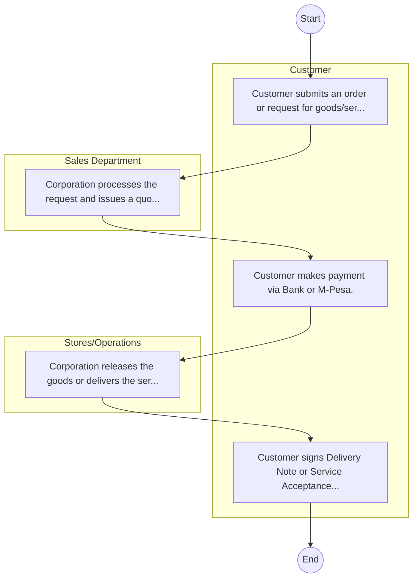
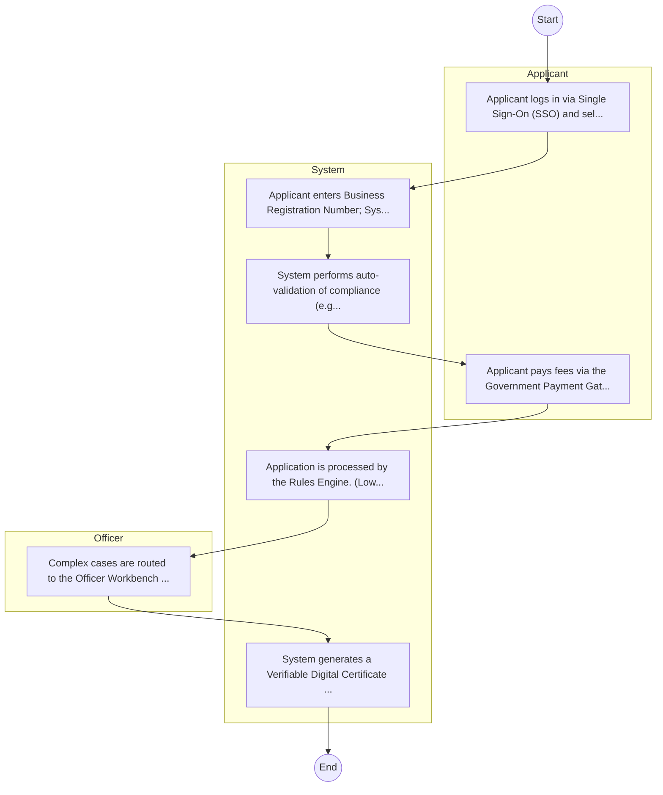

# Ahero Rice Mills – Service Delivery

## Cover Page
- **Ministry/Department/Agency (MDA):** Ahero Rice Mills
- **Process Name:** Service Delivery
- **Document Version:** 1.0
- **Date:** 2026-02-14
- **Classification:** Official

---

## Executive Summary
Ahero Rice Mills is a key rice processing facility in Kenya, operating under a tripartite agreement involving the Kisumu County Government, the National Irrigation Authority (NIA), and a private investor (Upland Crop Company). Its primary mandate is to revitalize rice processing, provide a competitive and profitable market for local rice farmers, particularly those in the Ahero, West Kano, and South West Kano irrigation schemes. The mill aims to significantly boost national rice production, contributing to Kenya's food security goals and socio-economic development in the Western Kenya region through value addition and job creation.

---

## Service Mandate & Legal Basis
### Statutory Mandate
To process rice efficiently, utilizing modern facilities for sorting, grading, and packaging, with a capacity of 2.5 metric tons of rice per hour or approximately 60 tons daily; to offer a competitive and profitable market for small and medium-scale rice growers within Western Kenya's irrigation schemes (Ahero, West Kano, and South West Kano); to significantly increase local rice production, thereby helping to reduce Kenya's national rice deficit and aligning with government strategies such as the Bottom-Up Economic Transformation Agenda (BETA) and the National Rice Development Strategy II (2020–2030) for achieving rice self-sufficiency by 2030; to enhance the value of rice by providing advanced processing capabilities that address issues of selling lower-priced unmilled paddy; to connect local rice farmers with quality inputs and services, fostering the sustainable growth of the regional rice industry; and to create jobs and stimulate economic growth in the surrounding area.

### Legal Context
- Ahero Rice Mills operates under a tripartite agreement involving the Kisumu County Government, the National Irrigation Authority (NIA), and a private investor (Upland Crop Company). Its establishment and functions are aligned with national food security policies and agricultural development strategies, particularly those aimed at achieving rice self-sufficiency and supporting smallholder farmers. NIA's role as a host and partner under the Irrigation Act 2019 provides a regulatory and operational context for the mill's integration within the broader irrigation scheme framework. The initiative is also a component of national economic development agendas like the Bottom-Up Economic Transformation Agenda (BETA).

---

## 1. AS-IS Process Flowchart (BPMN 2.0)
*Current State visualization.*

---

## Process Overview
### Service Category
- G2C/G2B

### Scope
- **In Scope:** End-to-end processing within Ahero Rice Mills.

### Triggers
- Submission of application/request by Customer.

### End States
- **Successful:** License / Permit / Certificate, Compliance Inspection Report, Official Receipt, Gazette Notice

---

## Stakeholders
| Stakeholder | Role | Responsibilities |
|---|---|---|
| Sales Department | Process Actor | Performs actions as defined in steps. |
| Stores/Operations | Process Actor | Performs actions as defined in steps. |
| Customer | Process Actor | Performs actions as defined in steps. |

---

## Inputs & Outputs
- **Inputs:** Application Form (License/Permit), Compliance Documents (Tax Compliance, CR12), Technical Reports / Site Plans, Proof of Payment
- **Outputs:** License / Permit / Certificate, Compliance Inspection Report, Official Receipt, Gazette Notice

---

## Detailed Process (AS-IS)
| Step | Role | Action | Tool | Notes |
|---|---|---|---|---|
| 1 | Customer | Customer submits an order or request for goods/services. | Manual | |
| 2 | Sales Department | Corporation processes the request and issues a quotation/proforma invoice. | Manual | |
| 3 | Customer | Customer makes payment via Bank or M-Pesa. | Manual | |
| 4 | Stores/Operations | Corporation releases the goods or delivers the service. | Manual | |
| 5 | Customer | Customer signs Delivery Note or Service Acceptance Form. | Manual | |

---

## Pain Points & Opportunities
### Pain Points
- Manual document verification takes time.
- High cost and time for physical inspections.
- Risk of counterfeit licenses/certificates.
- Lack of real-time monitoring of licensees.

### Opportunities
- Integration with IPRS/BRS via Service Bus.
- Adoption of Government Payment Gateway.
- Implementation of Automated Rules Engine.
- Issuance of Digital Verifiable Credentials.

---

## 2. TO-BE Process Flowchart (BPMN 2.0)
*Future State visualization (Optimized).*

## Future State Process (TO-BE)
### Narrative
The To-Be process leverages the Government Service Bus to integrate with BRS (Business Registry) and the Payment Gateway. Manual data entry and document uploads are replaced by real-time API validations, enabling a paperless, cashless, and presence-less service experience.

### Optimized Steps (Digital)
| Step | Actor | Action | System |
|---|---|---|---|
| 1 | Applicant | Applicant logs in via Single Sign-On (SSO) and selects the service. | Citizen Portal / SSO |
| 2 | System | Applicant enters Business Registration Number; System auto-populates details from BRS (Business Registry) via the Service Bus. | Service Bus / Registry API |
| 3 | System | System performs auto-validation of compliance (e.g., KRA Tax Status) via Inter-Agency APIs. | Service Bus / Compliance Engine |
| 4 | Applicant | Applicant pays fees via the Government Payment Gateway; System auto-receipts. | Payment Gateway |
| 5 | System | Application is processed by the Rules Engine. (Low-risk cases are Auto-Approved). | Workflow Engine |
| 6 | Officer | Complex cases are routed to the Officer Workbench for digital review and approval. | Officer Workbench |
| 7 | System | System generates a Verifiable Digital Certificate (QR Code) and notifies the applicant. | Output Generator |

---

## References & Evidence
The information in this document was derived from the following official sources:

- [https://mygov.go.ke/](https://mygov.go.ke/)
- [https://kisumu.go.ke/](https://kisumu.go.ke/)
- [https://millingmea.com/](https://millingmea.com/)
- [https://www.irrigationauthority.go.ke/](https://www.irrigationauthority.go.ke/)
