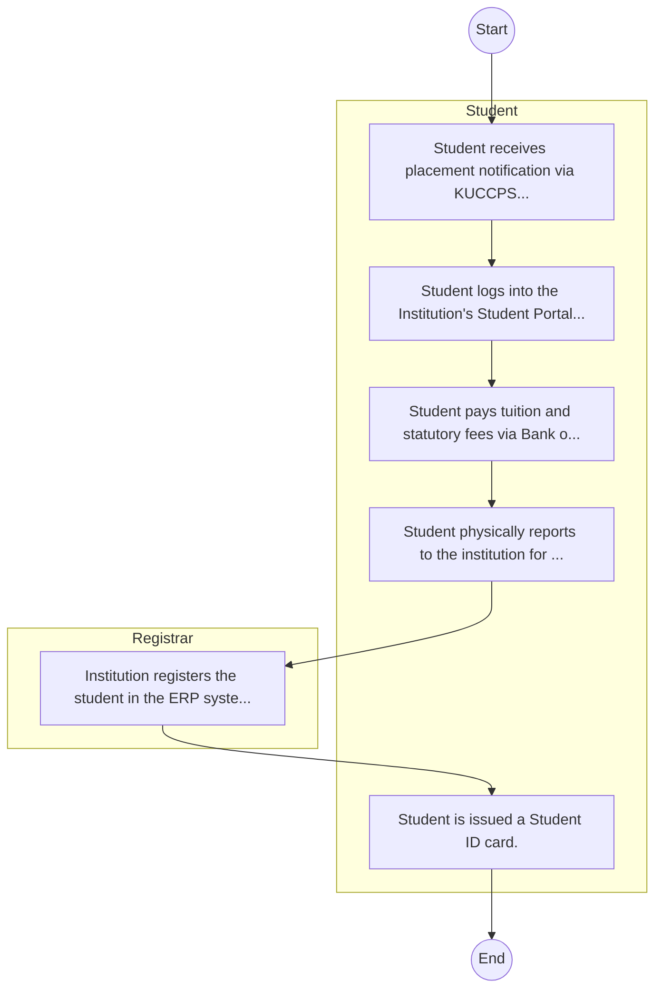
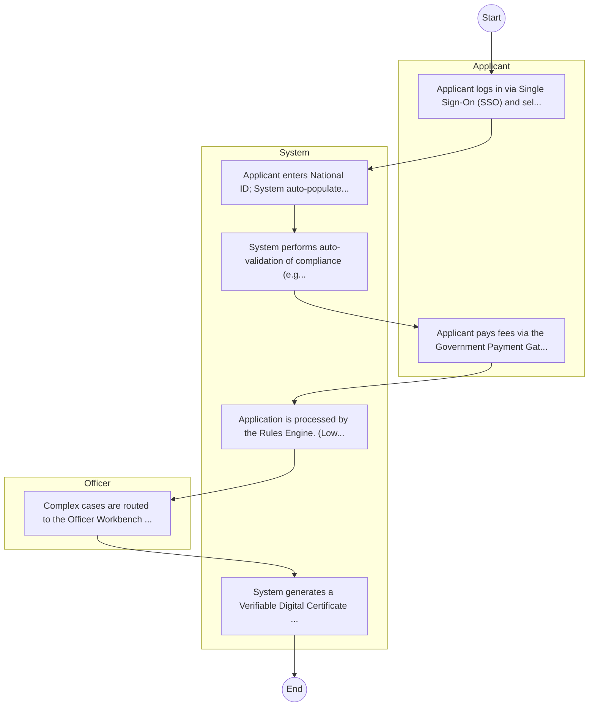

# Alupe University College – Student Admission

## Cover Page
- **Ministry/Department/Agency (MDA):** Alupe University College
- **Process Name:** Student Admission
- **Document Version:** 1.0
- **Date:** 2026-02-14
- **Classification:** Official

---

## Executive Summary
Alupe University, formerly Alupe University College, is a Kenyan institution of higher learning with a comprehensive mandate focused on education, research, and community outreach. It provides high-quality undergraduate, postgraduate, and professional programs across various fields, conducts research that addresses societal challenges and promotes innovation, and actively engages with local communities to foster socio-economic development. Alupe University contributes significantly to national development agendas like Kenya Vision 2030 and the Bottom-Up Economic Transformation Agenda (BETA) by producing skilled human capital and generating knowledge for sustainable growth.

---

## Service Mandate & Legal Basis
### Statutory Mandate
To provide high-quality undergraduate, postgraduate, and professional programs across various fields, including health sciences, science, education, social sciences, and business; to conduct research that addresses societal challenges, promotes innovation, and contributes to sustainable development through the discovery, transmission, preservation, and enhancement of knowledge; to actively engage with local communities to foster socio-economic development through education, outreach programs, and research initiatives; to ensure the continuous improvement of academic programs and uphold high standards of teaching, learning, and research; to enhance skills and knowledge among its students and the broader community through capacity building initiatives; to foster entrepreneurship and innovation among students to stimulate job creation and economic growth; to establish partnerships with national and international institutions, businesses, and organizations to enhance research and academic exchange; to contribute to national and international policy development and advocacy in education, development, and research; to promote sustainability and environmental stewardship through research, education, and community projects focused on environmental conservation; and to develop leadership skills in students, preparing them for effective roles in society and the workforce.

### Legal Context
- Alupe University operates as a public university under relevant Kenyan university acts and higher education regulations, including the Universities Act, No. 42 of 2012. It is governed by its charter and university council. The university aligns its mandates with national development agendas, including Kenya Vision 2030 and the Bottom-Up Economic Transformation Agenda (BETA), focusing on human capital development, research-driven solutions, and community service to address the unique needs of its region and the country.

---

## 1. AS-IS Process Flowchart (BPMN 2.0)
*Current State visualization.*

---

## Process Overview
### Service Category
- G2C (Government to Citizen)

### Scope
- **In Scope:** End-to-end processing within Alupe University College.

### Triggers
- Submission of application/request by Student.

### End States
- **Successful:** Admission Letter, Student ID Card, Academic Transcripts, Degree/Diploma Certificate

---

## Stakeholders
| Stakeholder | Role | Responsibilities |
|---|---|---|
| Registrar | Process Actor | Performs actions as defined in steps. |
| Student | Process Actor | Performs actions as defined in steps. |

---

## Inputs & Outputs
- **Inputs:** KCSE/Academic Result Slips, National ID / Birth Certificate, Student Personal Details Form, Fee Payment Receipts
- **Outputs:** Admission Letter, Student ID Card, Academic Transcripts, Degree/Diploma Certificate

---

## Detailed Process (AS-IS)
| Step | Role | Action | Tool | Notes |
|---|---|---|---|---|
| 1 | Student | Student receives placement notification via KUCCPS or applies directly as Self-Sponsored. | Manual | |
| 2 | Student | Student logs into the Institution's Student Portal to accept admission and download Admission Letter. | Digital | |
| 3 | Student | Student pays tuition and statutory fees via Bank or eCitizen. | Manual | |
| 4 | Student | Student physically reports to the institution for document verification (original slips, certs). | Manual | |
| 5 | Registrar | Institution registers the student in the ERP system. | Manual | |
| 6 | Student | Student is issued a Student ID card. | Manual | |

---

## Pain Points & Opportunities
### Pain Points
- Long queues during admission and registration.
- Manual reconciliation of fee payments.
- Delays in processing exam results and transcripts.
- Fragmented student data across departments.

### Opportunities
- Integration with IPRS/BRS via Service Bus.
- Adoption of Government Payment Gateway.
- Implementation of Automated Rules Engine.
- Issuance of Digital Verifiable Credentials.

---

## 2. TO-BE Process Flowchart (BPMN 2.0)
*Future State visualization (Optimized).*

## Future State Process (TO-BE)
### Narrative
The To-Be process leverages the Government Service Bus to integrate with IPRS (Identity Registry) and the Payment Gateway. Manual data entry and document uploads are replaced by real-time API validations, enabling a paperless, cashless, and presence-less service experience.

### Optimized Steps (Digital)
| Step | Actor | Action | System |
|---|---|---|---|
| 1 | Applicant | Applicant logs in via Single Sign-On (SSO) and selects the service. | Citizen Portal / SSO |
| 2 | System | Applicant enters National ID; System auto-populates details from IPRS (Identity Registry) via the Service Bus. | Service Bus / Registry API |
| 3 | System | System performs auto-validation of compliance (e.g., KRA Tax Status) via Inter-Agency APIs. | Service Bus / Compliance Engine |
| 4 | Applicant | Applicant pays fees via the Government Payment Gateway; System auto-receipts. | Payment Gateway |
| 5 | System | Application is processed by the Rules Engine. (Low-risk cases are Auto-Approved). | Workflow Engine |
| 6 | Officer | Complex cases are routed to the Officer Workbench for digital review and approval. | Officer Workbench |
| 7 | System | System generates a Verifiable Digital Certificate (QR Code) and notifies the applicant. | Output Generator |

---

## References & Evidence
The information in this document was derived from the following official sources:

- [https://www.alupe.ac.ke/](https://www.alupe.ac.ke/)
- [https://saraka.info/](https://saraka.info/)
- [https://parliament.go.ke/](https://parliament.go.ke/)
