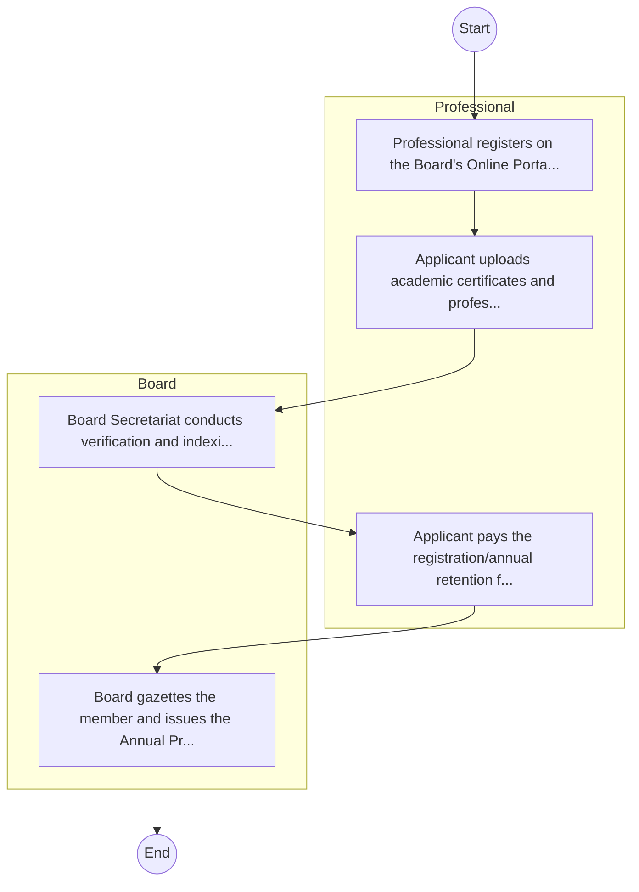
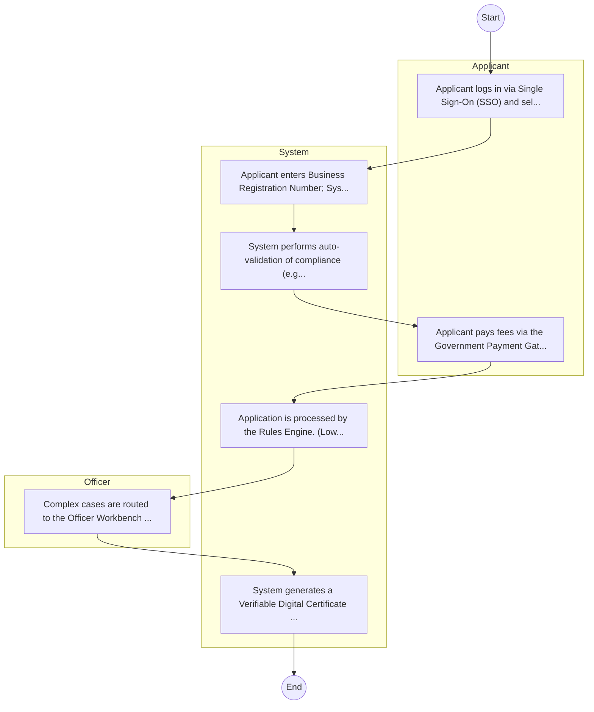

# Animal Technicians Council – Service Delivery

## Cover Page
- **Ministry/Department/Agency (MDA):** Animal Technicians Council
- **Process Name:** Service Delivery
- **Document Version:** 1.0
- **Date:** 2026-02-14
- **Classification:** Official

---

## Executive Summary
Animal health technicians in Kenya operate under the regulatory framework of the Kenya Veterinary Board (KVB), which is established by the Veterinary Surgeons' and Veterinary Para-professionals (VSVP) Act No. 29 of 2011. While there isn't a distinct 'Animal Technicians Council Kenya' as a direct MDA, their professional practice, standards, and registration are governed by KVB. These veterinary para-professionals play a crucial role in supporting veterinary surgeons, implementing national and regional animal health programs, providing essential extension services to farmers, and contributing significantly to livestock development and food security in Kenya.

---

## Service Mandate & Legal Basis
### Statutory Mandate
To provide essential support to veterinary surgeons in clinical, diagnostic, and surgical procedures; to implement national and regional animal health programs, including mass vaccination campaigns, parasite control programs, and disease surveillance; to conduct inspections of livestock, poultry, and game, and report on disease outbreaks; to provide crucial extension services and training to farmers and community members on basic animal husbandry, disease prevention, nutrition, and hygiene; to collect, capture, and evaluate animal health data, and assist in epidemiological and research projects; and to carry out delegated duties related to veterinary public health, such as abattoir and meat inspections, ensuring the safety of animal products for human consumption.

### Legal Context
- The regulation of animal technicians, categorized as veterinary para-professionals, falls under the **Kenya Veterinary Board (KVB)**, which is established by the **Veterinary Surgeons' and Veterinary Para-professionals (VSVP) Act No. 29 of 2011**. This Act provides the comprehensive legal framework that governs the training, registration, licensing, and professional practice of all veterinary professionals, including animal health technicians, in Kenya. Their work aligns with national policies on livestock development, animal health, food safety, and agricultural extension services under the Ministry of Agriculture, Livestock, Fisheries and Cooperatives.

---

## 1. AS-IS Process Flowchart (BPMN 2.0)
*Current State visualization.*

---

## Process Overview
### Service Category
- G2C/G2B

### Scope
- **In Scope:** End-to-end processing within Animal Technicians Council.

### Triggers
- Submission of application/request by Professional.

### End States
- **Successful:** License / Permit / Certificate, Compliance Inspection Report, Official Receipt, Gazette Notice

---

## Stakeholders
| Stakeholder | Role | Responsibilities |
|---|---|---|
| Board | Process Actor | Performs actions as defined in steps. |
| Professional | Process Actor | Performs actions as defined in steps. |

---

## Inputs & Outputs
- **Inputs:** Application Form (License/Permit), Compliance Documents (Tax Compliance, CR12), Technical Reports / Site Plans, Proof of Payment
- **Outputs:** License / Permit / Certificate, Compliance Inspection Report, Official Receipt, Gazette Notice

---

## Detailed Process (AS-IS)
| Step | Role | Action | Tool | Notes |
|---|---|---|---|---|
| 1 | Professional | Professional registers on the Board's Online Portal. | Digital | |
| 2 | Professional | Applicant uploads academic certificates and professional testimonials. | Manual | |
| 3 | Board | Board Secretariat conducts verification and indexing. | Manual | |
| 4 | Professional | Applicant pays the registration/annual retention fee. | Manual | |
| 5 | Board | Board gazettes the member and issues the Annual Practicing Certificate. | Manual | |

---

## Pain Points & Opportunities
### Pain Points
- Manual document verification takes time.
- High cost and time for physical inspections.
- Risk of counterfeit licenses/certificates.
- Lack of real-time monitoring of licensees.

### Opportunities
- Integration with IPRS/BRS via Service Bus.
- Adoption of Government Payment Gateway.
- Implementation of Automated Rules Engine.
- Issuance of Digital Verifiable Credentials.

---

## 2. TO-BE Process Flowchart (BPMN 2.0)
*Future State visualization (Optimized).*

## Future State Process (TO-BE)
### Narrative
The To-Be process leverages the Government Service Bus to integrate with BRS (Business Registry) and the Payment Gateway. Manual data entry and document uploads are replaced by real-time API validations, enabling a paperless, cashless, and presence-less service experience.

### Optimized Steps (Digital)
| Step | Actor | Action | System |
|---|---|---|---|
| 1 | Applicant | Applicant logs in via Single Sign-On (SSO) and selects the service. | Citizen Portal / SSO |
| 2 | System | Applicant enters Business Registration Number; System auto-populates details from BRS (Business Registry) via the Service Bus. | Service Bus / Registry API |
| 3 | System | System performs auto-validation of compliance (e.g., KRA Tax Status) via Inter-Agency APIs. | Service Bus / Compliance Engine |
| 4 | Applicant | Applicant pays fees via the Government Payment Gateway; System auto-receipts. | Payment Gateway |
| 5 | System | Application is processed by the Rules Engine. (Low-risk cases are Auto-Approved). | Workflow Engine |
| 6 | Officer | Complex cases are routed to the Officer Workbench for digital review and approval. | Officer Workbench |
| 7 | System | System generates a Verifiable Digital Certificate (QR Code) and notifies the applicant. | Output Generator |

---

## References & Evidence
The information in this document was derived from the following official sources:

- [https://www.kenyavetboard.or.ke/](https://www.kenyavetboard.or.ke/)
- [https://www.savc.org.za/](https://www.savc.org.za/)
- [https://kilimo.go.ke/](https://kilimo.go.ke/)
