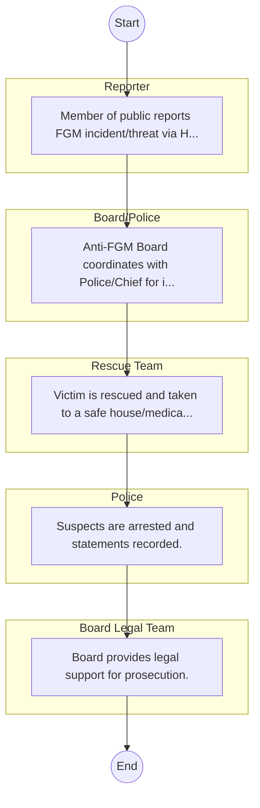
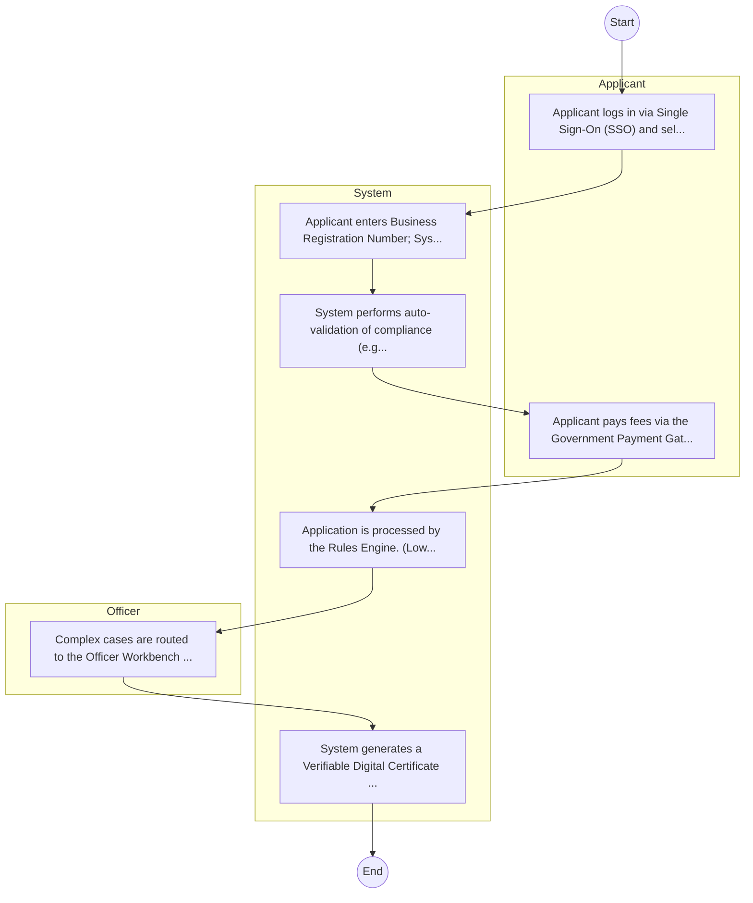

# Anti-Female Genital Mutilation Board – Service Delivery

## Cover Page
- **Ministry/Department/Agency (MDA):** Anti-Female Genital Mutilation Board
- **Process Name:** Service Delivery
- **Document Version:** 1.0
- **Date:** 2026-02-14
- **Classification:** Official

---

## Executive Summary
The Anti-Female Genital Mutilation Board is a semi-autonomous government agency in Kenya, established in December 2013 under the Prohibition of Female Genital Mutilation Act, 2011. Its core mandate is to design, supervise, and coordinate public awareness programs against the practice of Female Genital Mutilation (FGM), advise the Government on FGM matters, and lead national efforts to eradicate FGM. The Board plays a crucial role in upholding the dignity and empowerment of girls and women by ensuring the effective implementation of anti-FGM legislation and promoting alternative rites of passage.

---

## Service Mandate & Legal Basis
### Statutory Mandate
To design, supervise, and coordinate comprehensive public awareness programs against FGM; to advise the Government on all matters relating to FGM and the effective implementation of the Prohibition of FGM Act; to design and formulate policy on the planning, financing, and coordination of all activities related to FGM eradication; to provide technical and other support to institutions, agencies, and other bodies involved in FGM eradication programs; to design specific programs aimed at the eradication of FGM; to facilitate resource mobilization for programs and activities dedicated to eradicating FGM; to raise awareness and actively campaign against FGM across various communities; and to coordinate and lead efforts on behalf of the Kenyan government to ultimately end FGM.

### Legal Context
- Established in December 2013 under the Prohibition of Female Genital Mutilation Act, 2011 (Act No. 32 of 2011), which criminalizes FGM and provides the legal framework for the Board's operations. The Board operates under the Ministry of Public Service, Gender, Senior Citizens Affairs and Special Programs (or the relevant government ministry responsible for gender and social protection) and is central to implementing national legislation and policies aimed at eradicating FGM, protecting the rights of girls and women, and promoting gender equality in Kenya.

---

## 1. AS-IS Process Flowchart (BPMN 2.0)
*Current State visualization.*

---

## Process Overview
### Service Category
- G2B (Government to Business)

### Scope
- **In Scope:** End-to-end processing within Anti-Female Genital Mutilation Board.

### Triggers
- Submission of application/request by Reporter.

### End States
- **Successful:** License / Permit / Certificate, Compliance Inspection Report, Official Receipt, Gazette Notice

---

## Stakeholders
| Stakeholder | Role | Responsibilities |
|---|---|---|
| Reporter | Process Actor | Performs actions as defined in steps. |
| Board/Police | Process Actor | Performs actions as defined in steps. |
| Police | Process Actor | Performs actions as defined in steps. |
| Board Legal Team | Process Actor | Performs actions as defined in steps. |
| Rescue Team | Process Actor | Performs actions as defined in steps. |

---

## Inputs & Outputs
- **Inputs:** Application Form (License/Permit), Compliance Documents (Tax Compliance, CR12), Technical Reports / Site Plans, Proof of Payment
- **Outputs:** License / Permit / Certificate, Compliance Inspection Report, Official Receipt, Gazette Notice

---

## Detailed Process (AS-IS)
| Step | Role | Action | Tool | Notes |
|---|---|---|---|---|
| 1 | Reporter | Member of public reports FGM incident/threat via Hotline/Chief. | Manual | |
| 2 | Board/Police | Anti-FGM Board coordinates with Police/Chief for intervention. | Manual | |
| 3 | Rescue Team | Victim is rescued and taken to a safe house/medical facility. | Manual | |
| 4 | Police | Suspects are arrested and statements recorded. | Manual | |
| 5 | Board Legal Team | Board provides legal support for prosecution. | Manual | |

---

## Pain Points & Opportunities
### Pain Points
- Manual document verification takes time.
- High cost and time for physical inspections.
- Risk of counterfeit licenses/certificates.
- Lack of real-time monitoring of licensees.

### Opportunities
- Integration with IPRS/BRS via Service Bus.
- Adoption of Government Payment Gateway.
- Implementation of Automated Rules Engine.
- Issuance of Digital Verifiable Credentials.

---

## 2. TO-BE Process Flowchart (BPMN 2.0)
*Future State visualization (Optimized).*

## Future State Process (TO-BE)
### Narrative
The To-Be process leverages the Government Service Bus to integrate with BRS (Business Registry) and the Payment Gateway. Manual data entry and document uploads are replaced by real-time API validations, enabling a paperless, cashless, and presence-less service experience.

### Optimized Steps (Digital)
| Step | Actor | Action | System |
|---|---|---|---|
| 1 | Applicant | Applicant logs in via Single Sign-On (SSO) and selects the service. | Citizen Portal / SSO |
| 2 | System | Applicant enters Business Registration Number; System auto-populates details from BRS (Business Registry) via the Service Bus. | Service Bus / Registry API |
| 3 | System | System performs auto-validation of compliance (e.g., KRA Tax Status) via Inter-Agency APIs. | Service Bus / Compliance Engine |
| 4 | Applicant | Applicant pays fees via the Government Payment Gateway; System auto-receipts. | Payment Gateway |
| 5 | System | Application is processed by the Rules Engine. (Low-risk cases are Auto-Approved). | Workflow Engine |
| 6 | Officer | Complex cases are routed to the Officer Workbench for digital review and approval. | Officer Workbench |
| 7 | System | System generates a Verifiable Digital Certificate (QR Code) and notifies the applicant. | Output Generator |

---

## References & Evidence
The information in this document was derived from the following official sources:

- [https://www.antifgmboard.go.ke/](https://www.antifgmboard.go.ke/)
- [https://parliament.go.ke/](https://parliament.go.ke/)
- [https://unicef.org/](https://unicef.org/)
- [https://treasury.go.ke/](https://treasury.go.ke/)
- [https://afro.co.ke/](https://afro.co.ke/)
- [https://fgmcri.org/](https://fgmcri.org/)
- [https://www.gov.uk/](https://www.gov.uk/)
- [https://equalitynow.org/](https://equalitynow.org/)
